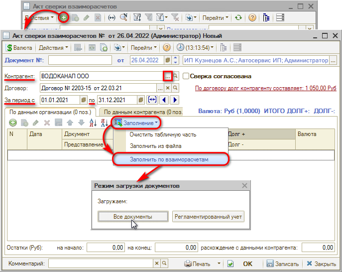
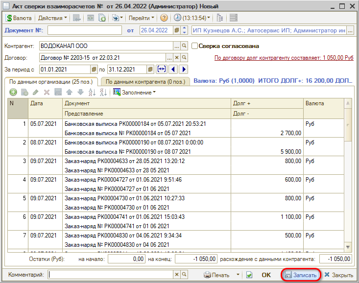
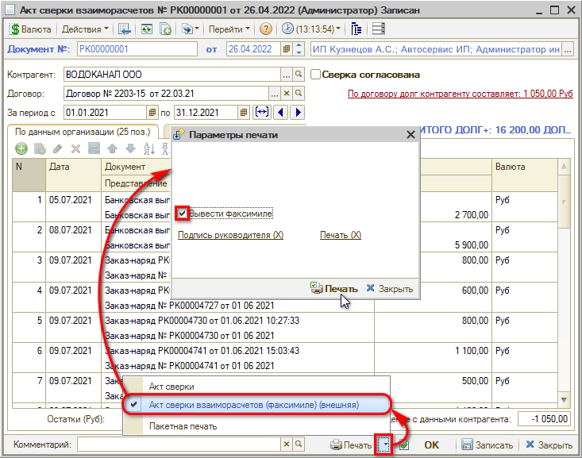
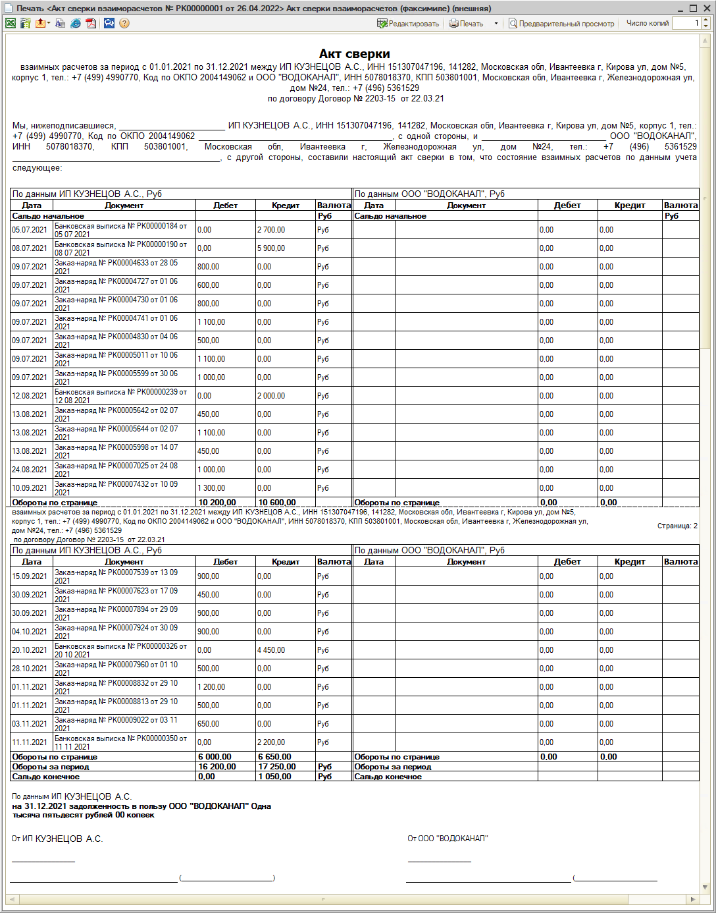

# Акт сверки взаиморасчетов

<table><tr><td><b>Время чтения:</b> 12 мин.</td><td><b>Обновлено:</b> 08.07.2022</td></tr></table>

Источник: https://www.5systems.ru/help/akt-sverki-vzaimoraschetov

## Содержание

1. [Назначение](#назначение)
2. [Создание документа](#создание-документа)
   - [Реквизиты документа Акт сверки](#реквизиты-документа-акт-сверки)
3. [Заполнение документа](#заполнение-документа)
   - [Табличные графы вкладок документа](#табличные-графы-вкладок-документа)
4. [Печать документа](#печать-документа)

## Назначение

Документ **"Акт сверки взаиморасчетов"** предназначен для согласования сумм задолженности по документам взаиморасчетов. В том случае, если возникло расхождение данных о задолженности между контрагентом и вашей организацией, данный документ позволяет осуществить сверку данных.

## Создание документа

Для того чтобы сформировать *Акт сверки взаиморасчетов*, необходимо создать новый документ в соответствующем реестре, расположение в меню программы – *Финансы → Разделы учета → Расчеты с контрагентами → Акт сверки взаиморасчетов[\*](#snoska-1):*

*\*Примечание: В случае если данного пункта меню нет на рабочем столе, можно добавить его вручную – см. статью "[Настройка рабочего стола](https://www.5systems.ru/help/nastroyka-rabochego-stola#nastrrazdelov)".*

Новый элемент создается нажатием на кнопку “Добавить”.

### Реквизиты документа Акт сверки

В создаваемом документе требуется заполнить реквизиты:

- *Контрагент* – необходимо выбрать нужного контрагента.
- *Договор* – договор, по которому производится сверка[\*](#snoska-2). 
  *\*В одном документе "Акт сверки взаиморасчетов" может быть введено несколько строк по различным договорам, оформленным с данным контрагентом. Для этого поле "Договор" должно быть незаполненным.*
- *Период* – следует заполнить период, за который требуется произвести сверку.
- Гиперссылка *"По договору долг контрагента составляет"* отражает текущее состояние расчетов с контрагентом по договору: переход производится на отчет "*Взаиморасчеты с контрагентами"*, сформированный для указанного контрагента.
- Если установлен флажок *"Сверка согласована"*, то процесс урегулирования суммы задолженности за текущий период решен.

## Заполнение документа

Документ содержит две вкладки: *По данным организации* и *По данным контрагента*. Вкладка *По данным организации* может быть заполнена по данным регистра накопления *Взаиморасчеты компании*.

Рекомендуется заполнять акт, используя кнопку автозаполнения: *Заполнение → Заполнить по взаиморасчетам*. При нажатии на кнопку открывается окно выбора режима загрузки – *"Все документы*" или *"Регламентированный учет"* (требуется выбрать в зависимости от учетной политики компании).

После выбора режима загрузки акт заполняется документами.

### Табличные графы вкладок документа

- *Документ* – документ, по которому образовалась задолженность.
- *Представление* – представление документа взаиморасчетов (наименование, номер, дата документа прописью).
- *"Долг +"* – сумма, на которую, согласно документу, следует увеличить долг контрагента (для вкладки *По данным организации*) или организации (для вкладки *По данным контрагента*).
- *"Долг –"* – сумма, на которую, согласно документу, следует уменьшить долг контрагента (для вкладки *По данным организации*) или организации (для вкладки *По данным контрагента*).
- *Валюта* – валюта договора. Заполняется автоматически.

Под табличной частью на каждой из вкладок документа указываются остатки задолженности организации (для вкладки *По данным организации*) или контрагента (для вкладки *По данным контрагента*) на начало и конец заданного периода. Также указывается расхождение остатков задолженности на конец периода по данным организации и контрагента.

Заполненный *Акт сверки* необходимо *Записать*:

Документ *Акт сверки взаиморасчетов* не выполняет никаких движений. Он может быть распечатан и передан контрагенту для согласования.

## Печать документа

Чтобы вывести печатную форму акта сверки, нужно нажать стрелку рядом с кнопкой *Печать* и выбрать *Акт сверки взаиморасчетов (факсимиле)*, в открывшемся окне отметить галочку *“Вывести факсимиле”* и нажать “Печать”:

Открывается печатная форма *Акта сверки взаиморасчетов*:

После согласования данных с контрагентом при необходимости можно произвести корректировку задолженности при помощи документа [*Корректировка долга*](../Корректировка%20остатков%20взаиморасчетов/korrektirovka-ostatkov-vzaimoraschetov.md).

---

**Теги:** взаиморасчеты, акт сверки, документ, печать, контрагенты

