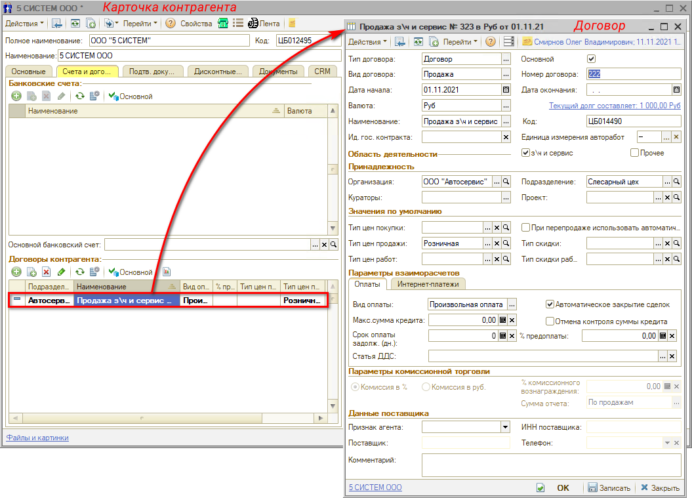
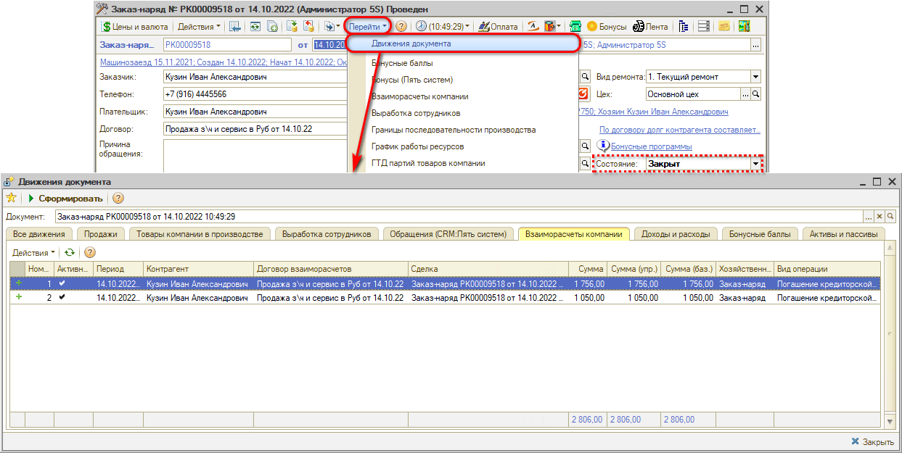
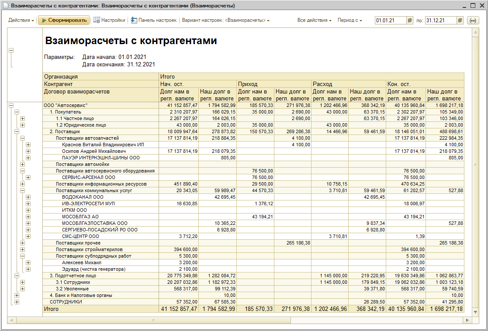
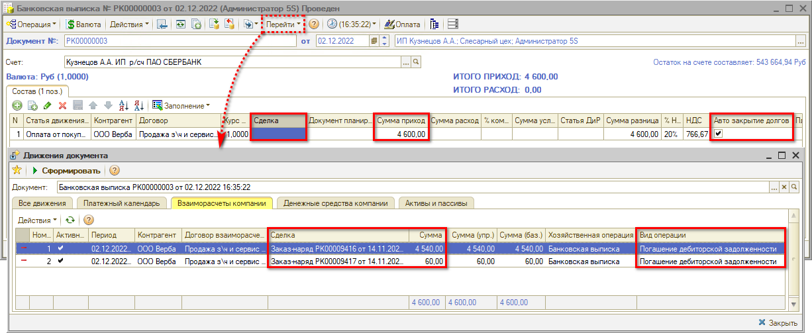
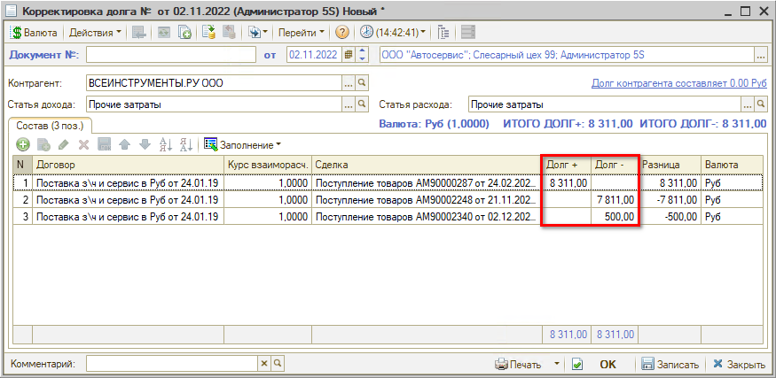

# Взаиморасчеты с контрагентами

<table><tr><td><b>Время чтения:</b> 21 мин.</td><td><b>Обновлено:</b> 05.12.2022</td></tr></table>

Источник: https://www.5systems.ru/help/vzaimoraschety-s-kontragentami

## Содержание

1. [Понятие взаиморасчетов с контрагентами](#понятие-взаиморасчетов-с-контрагентами)
2. [Виды взаиморасчетов](#виды-взаиморасчетов)
   - [Расчеты с клиентами](#расчеты-с-клиентами)
   - [Расчеты с поставщиками и подрядчиками](#расчеты-с-поставщиками-и-подрядчиками)
3. [Договор взаиморасчетов с контрагентом](#договор-взаиморасчетов-с-контрагентом)
4. [Сделка как документ взаиморасчетов](#сделка-как-документ-взаиморасчетов)
5. [Регистр учета “Взаиморасчеты компании”](#регистр-учета-взаиморасчеты-компании)
6. [Отчет “Взаиморасчеты с контрагентами”](#отчет-взаиморасчеты-с-контрагентами)
7. [Автозакрытие сделок и ручная привязка](#автозакрытие-сделок-и-ручная-привязка)
8. [Отчет "Возраст задолженности"](#отчет-возраст-задолженности)
9. [Акт сверки взаиморасчетов](#акт-сверки-взаиморасчетов)
10. [Корректировка остатков взаиморасчетов](#корректировка-остатков-взаиморасчетов)

## Понятие взаиморасчетов с контрагентами

*Взаиморасчеты с контрагентами* – неотъемлемая составляющая ведения учета любого бизнеса. Учет взаиморасчетов ведется в разрезе контрагентов, договоров, сделок.

*Контрагент* – это физическое или юридическое лицо, с которым компанию связывают финансовые отношения. На деле это покупатели, поставщики и подрядчики, а также сотрудники компании.

При взаиморасчетах с контрагентами следует контролировать:

- сроки оплаты;
- наличие, остатки и сроки задолженностей;
- лимиты долгов по договорам;
- распределение оплаты;
- движение денежных средств;
- и др.

Для ведения расчета с контрагентами на каждого из них в системе заводится *[договор взаиморасчетов](#договор-взаиморасчетов-с-контрагентом)*, где фиксируется каждая финансовая деталь. Сотрудничество может быть оформлено на определенный период либо как разовая сделка. По окончании периода производится расчет с контрагентом.

Каждая финансовая операция фиксируется в документах, поэтому важна четкая организация процесса, чтобы расчет был произведен правильно и в установленные сроки. Благодаря этому можно будет в любой момент посмотреть всю необходимую информацию по определенному контрагенту, или же по всем контрагентам сразу.

## Виды взаиморасчетов

Все взаиморасчеты подразделяют на операции с клиентами, подрядчиками, поставщиками и с сотрудниками компании. Они отличаются друг от друга спецификой проведения, порядком документального оформления и учета.

С поставщиком может быть договоренность по покупке товара в кредит, или на каких-либо других условиях. Подрядчики получают оговоренную с ними сумму, бухгалтерия сразу закрывает ведомости, и задолженности в данном случае бывают крайне редко. На клиентов заведены совершенно другие документы, в которых описан приход, а не расход прибыли.

### Расчеты с клиентами

*Расчеты с клиентами* – это прием платежей за оказание услуг, оптовые и розничные покупки, возвраты внесенных авансов и случайных излишков. Взаиморасчеты основаны на заключенных нормативных документах, в которых по каждому клиенту указывается:

- форма и порядок оплаты – наличные/безналичные, аванс, предоплата, кредит;
- сроки платежей;
- полученные авансы/предоплаты;
- задолженности;
- условия доставки;
- и др.

Факт реализации фиксируется в заказах, документах продажи, отчетах. Оплату подтверждают расчетными документами: банковскими выписками, кассовыми чеками или ордерами, платежными требованиями. Отгрузку – актами выполненных работ, счетами-фактурами, накладными. Состояние расчетов с клиентами отслеживается по соответствующим расчетным ведомостям.

### Расчеты с поставщиками и подрядчиками

*Поставщики и подрядчики* – все организации, поставляющие компании какие-либо услуги, товары или прочие материальные ценности.

Учет расчетов ведется по двум видам сделок:

1. Приобретение товаров и материальных ценностей – на основании договоров купли/продажи, обмена.
2. Выполнение работ или услуг – на основании договоров подряда, осуществления работ либо оказания услуг (коммунальные, консалтинговые, банковские услуги, аренда, услуги связи, перевозки, взносы в страховые фонды, ремонтные и строительные работы).

Платежи проводят в виде предоплаты и в полном объеме по факту сделанной работы или отгрузки товара. Проверка по товарным и нетоварным взаиморасчетам выполняется в конце отчетного периода. В это время проверяют факты отгрузки и оплаты, выявляют долги, составляют и подписывают акты сверки. Оптимальный способ расчетов согласовывается между организациями и указывается в договоре.

## Договор взаиморасчетов с контрагентом

*Договор взаиморасчетов* – юридический или виртуальный договор компании с контрагентом, в рамках которого ведется расчет.

Договор взаиморасчетов создается для каждого клиента, поставщика и сотрудника в карточке контрагента на вкладке “Счета и договоры”. Следует понимать, что договору в программе не всегда соответствует реальный договор, подписанный контрагентом и скрепленный печатью.

Договор взаиморасчетов с контрагентом создается программой автоматически при создании Корзины или документа, например, Заказ-наряда, если у контрагента не было договора, либо подтягивает существующий договор. Автосоздание договора регулируется правом *“Автоматическое создание основного договора”* (см. [*Установка прав и настроек*](../../Пользователи%20и%20права/Установка%20прав%20и%20настроек%20пользователя/ustanovka-prav-i-nastroek-polzovatelya.md)).

Для каждого контрагента может быть оформлено несколько договоров – тогда все проведенные операции с контрагентом можно будет разнести по разным договорам, в зависимости от смысла конкретной операции.

Например, контрагент может быть одновременно и клиентом, и поставщиком услуг, – тогда должно быть создано два договора: “Поставка” и “Продажа”. Либо сотрудник компании может быть одновременно клиентом – тогда у него должны быть созданы договора “Зарплата” и “Продажа”.

Также создание еще одного договора может потребоваться, если учет взаиморасчетов с контрагентом ведется в разных валютах.

Если у контрагента несколько договоров, задолженность клиента отражается по каждому договору отдельно. Заводить на каждую операцию с клиентом отдельный договор не рекомендуется, т.к. в этом случае сложно отслеживать общую задолженность клиента.

В договоре взаиморасчетов должны быть заполнены ***основные реквизиты:***

- *Тип договора* – обычно выбирается значение “Договор”.
- *Вид договора –* может принимать значения: “Поставка”, “Продажа”, “С комиссионером”, “С комитентом”, “Прочее”, “Кредит”, “Подотчет”, “Зарплата”.
- *Дата начала* и *Дата окончания* – даты начала и окончания учета по договору.
- *Валюта* – валюта взаиморасчетов по договору. Не может меняться, если по договору проведен хотя бы один документ.
- *Текущий долг составляет* … – ссылка на отчет “Взаиморасчеты с контрагентом”, который служит для анализа финансовых взаимоотношений с контрагентами, а также для получения информации о денежных средствах, выданных под отчет по конкретному контрагенту (см. [*Отчет “Взаиморасчеты с контрагентами”*](#отчет-взаиморасчеты-с-контрагентами)).
- *Организация* и *Подразделение* – организация и подразделение нашей компании, от которых заключен договор с контрагентом.
- *Основной* – договор становится более приоритетным перед остальными договорами контрагента в разрезе подразделения и организации для автоматического выбора.
- *Флаги отражающие область применения договора*: *"З\\ч и сервис"* – по договору разрешено оформление документов по запчастям и автосервису; *"Прочее"* – разрешено оформление внутренних документов.
- *Типы цен* покупки, продажи, работ по данному договору.
- *Тип скидки* по умолчанию для оформления продаж по данному договору.
- *Вид оплаты* – может принимать следующие значения: “Наличный расчет”, “Безналичный расчет”, “Произвольная оплата”.
- *Автоматическое закрытие сделок* – в документах оплаты, создаваемых в рамках данного договора, будет установлен флаг, по которому при проведении документа сначала будут оплачены все незакрытые сделки (подробнее см. [*Автозакрытие сделок и ручная привязка*](#автозакрытие-сделок-и-ручная-привязка)).

Договор используется с целью аналитики взаиморасчетов. В связи с этим некоторые поля документа взаиморасчетов не рекомендуется изменять после проведения документов по этому договору. Существенным является изменение полей: “Подразделение”, “Организация”, “Автоматическое закрытие сделок”. Первые два влияют на формировании отчетов, а третье – на алгоритм проведения взаиморасчетов по данному договору.

## Сделка как документ взаиморасчетов

Как правило, у клиента имеется один договор взаиморасчетов, по которому происходит работа – ремонт автомобилей, продажа запчастей и т.д. В рамках договора контрагента может быть совершено несколько сделок.

*Сделка* – это документ взаиморасчетов – отгрузки, поставки, оплаты, – по которому формируется задолженность клиента перед компанией либо компании перед клиентом. Т.е. документ, на основании которого выставляется счет контрагенту.

В качестве сделки могут выступать документы: Счет на оплату, Заказ-наряд, Реализация товаров, Заявка на ремонт, Заказ покупателя, Банковская выписка и др.

## Регистр учета “Взаиморасчеты компании”

Для учета взаиморасчетов в программе присутствует *учетный регистр “Взаиморасчеты компании”*. Проведение документов, по которым производится расчет, создает движения по регистру.

*Остатки на регистре* – это сумма долга контрагента фирме (положительный остаток) или фирмы контрагенту (отрицательный остаток). Хозяйственные операции, которые увеличивают долг контрагента перед предприятием или уменьшают долг предприятия перед контрагентом увеличивают остатки на регистре и наоборот: хозяйственные операции, приводящие к увеличению долга предприятия перед контрагентом или к уменьшению долга контрагента перед предприятием уменьшают остатки на регистре.

Перейти к просмотру движений по регистру взаиморасчетов можно из документа – например, Заказ-наряда в состоянии “Закрыт” – нажатием кнопки *“Перейти → Взаиморасчеты компании”* или *“Перейти → Движения документа → вкладка “Взаиморасчеты компании”:*

В таблице движений взаиморасчетов заполняются договор взаиморасчетов и сделка: в приведенном примере сделкой является Заказ-наряд.

## Отчет “Взаиморасчеты с контрагентами”

Для анализа состояния взаиморасчетов с контрагентами используется отчет *“Взаиморасчеты с контрагентами”:*

Отчет позволяет увидеть состояние взаиморасчетов в разрезе контрагентов, договоров, сделок. Подробнее см. статью [*Отчет “Взаиморасчеты с контрагентами”*](../Отчет%20Взаиморасчеты%20с%20контрагентами/otchet-vzaimoraschety-s-kontragentami.md).

## Автозакрытие сделок и ручная привязка

При ведении взаиморасчетов с клиентами и поставщиками необходимо контролировать *фактическое закрытие сделок:* отслеживать, что выданные или поступившие денежные средства закрыли необходимый документ поступления/продажи. В противном случае сделки в отчетах могут оставаться незакрытыми, и могут возникнуть ситуации *развернутого сальдо* – когда на одном договоре контрагента в отчетах одновременно числится и задолженность, и переплата.

Закрытие сделок в системе можно регулировать двумя способами – автоматически либо вручную:

1. *Флаг “Автоматическое закрытие сделок”* – это признак в договоре взаиморасчетов и в документах движения денежных средств, который задает алгоритм определения, по каким документам следует учесть оплату. Если признак установлен, то при проведении документа оплаты, например, банковской выписки, программа выполняет поиск незакрытых сделок, и относит оплату на эти сделки по ФИФО (сначала самые старые):  
   
2. В случае ручного контроля сделок система автоматически закрывает только взаимосвязанные сделки, например, когда документ оплаты введен непосредственно на основании продажи. Не связанные с документами продажи оплаты необходимо разносить вручную.

Подробнее см. статью *[Автозакрытие сделок и ручная привязка](../Автозакрытие%20сделок%20и%20ручная%20привязка/avtozakrytie-sdelok-i-ruchnaya-privyazka.md).*

## Отчет "Возраст задолженности"

При помощи *отчета* *“Возраст задолженности”* можно анализировать задолженности, т.е. остатки взаиморасчетов по договорам в рамках указанных периодов, задаваемых в днях:

Отчет имеет гибкие настройки и фильтры. Подробнее см. статью *[Отчет "Возраст задолженности"](../Отчет%20Возраст%20задолженности/otchet-vozrast-zadolzhennosti.md).*

Если во взаиморасчетах с контрагентом обнаружены “перекосы” по учету переплат и долгов, то можно откорректировать остатки по сделкам с помощью документа “Корректировка долга” (см. *[ниже](#корректировка-остатков-взаиморасчетов))*.

## Акт сверки взаиморасчетов

Документ *"Акт сверки взаиморасчетов"* предназначен для согласования сумм задолженности по документам взаиморасчетов с контрагентом:

Подробнее см. статью *[Акт сверки взаиморасчетов](../Акт%20сверки%20взаиморасчетов/akt-sverki-vzaimoraschetov.md).*

## Корректировка остатков взаиморасчетов

При учете взаиморасчетов с контрагентом могут произойти ситуации, когда по некоторым документам числятся переплаты, а по другим – долги, хотя по факту задолженности у контрагента у и компании перед контрагентом нет. Сделать взаимозачет этих долгов и переплат по контрагенту можно с помощью функционала автоматической *Корректировки долга:*

Подробнее см. статью [*Корректировка остатков взаиморасчетов*](../Корректировка%20остатков%20взаиморасчетов/korrektirovka-ostatkov-vzaimoraschetov.md).

---

**Теги:** взаиморасчеты, контрагенты, договоры, сделки, задолженность
