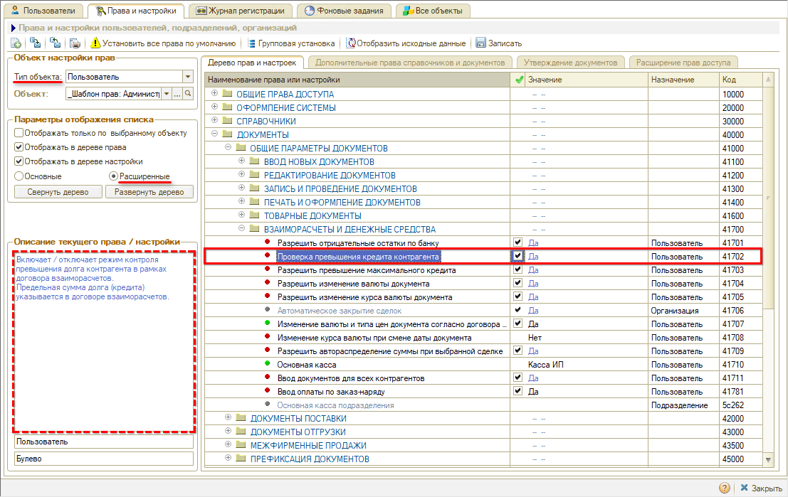
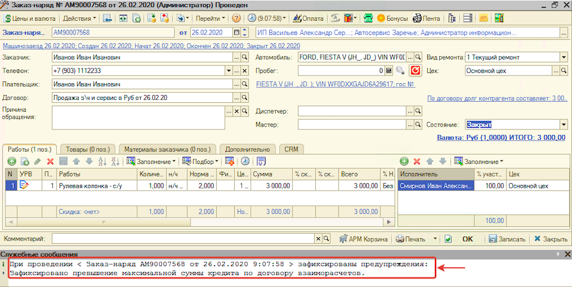
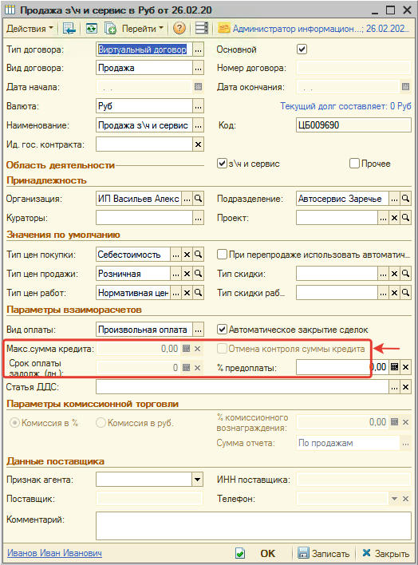
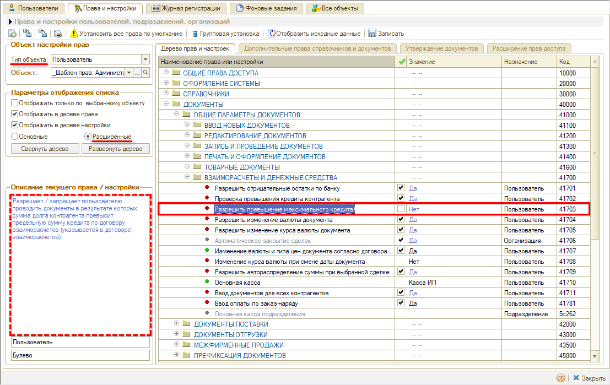
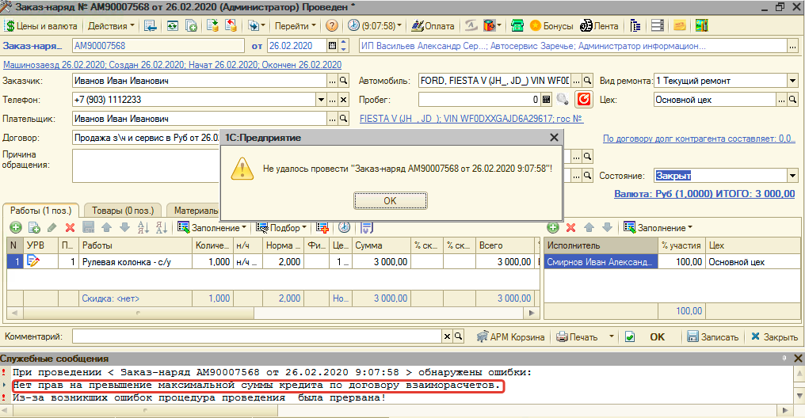
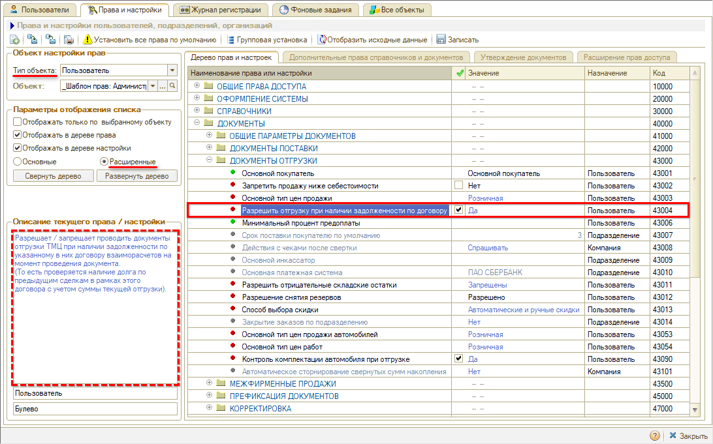
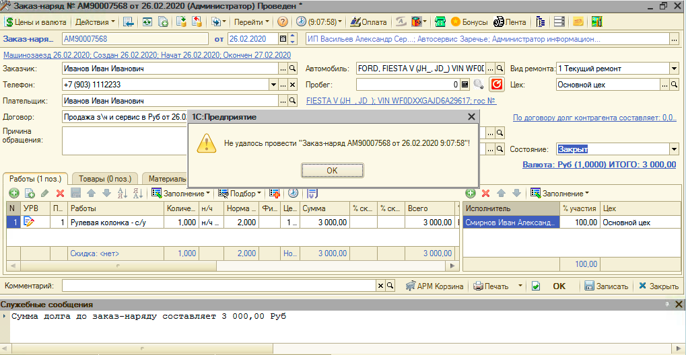
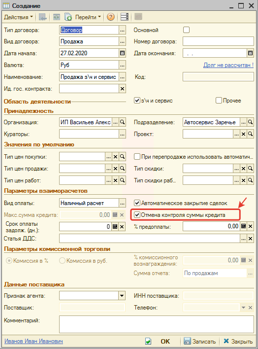

# Запрет отгрузки без оплаты

<table><tr><td><b>Время чтения:</b> 10 мин.</td><td><b>Обновлено:</b> 24.06.2022</td></tr></table>

Источник: https://www.5systems.ru/help/zapret-otgruzki-bez-oplaty

## Содержание

1. [Введение](#введение)
2. [Проверка превышения кредита контрагента](#проверка-превышения-кредита-контрагента)
3. [Разрешить превышение максимального лимита](#разрешить-превышение-максимального-лимита)
4. [Разрешить отгрузку при наличии задолженности по договору](#разрешить-отгрузку-при-наличии-задолженности-по-договору)
5. [Отмена контроля суммы](#отмена-контроля-суммы)

## Введение

В рамках данной статьи рассматриваются права, с помощью которых можно управлять возможностью разрешения/запрета или контроля отгрузки без оплаты от контрагента.

## Проверка превышения кредита контрагента

При настройке права *"Проверка превышения кредита контрагента" = "Да"* включается контроль максимальной суммы кредита по договору с контрагентом. При этом, если сумма долга контрагента превысит допустимую сумму кредита по договору, то отобразится предупреждение:

***Обратите внимание!*** Если включен запрет на проведение документа при превышении максимальной суммы кредита по договору (право *"[Разрешить превышение максимального лимита](#разрешить-превышение-максимального-лимита)")* или запрет на проведение при наличии задолженности по договору (право "[*Разрешить отгрузку при наличии задолженности по договору*](#разрешить-отгрузку-при-наличии-задолженности-по-договору)"), то при проведении вместо предупреждения произойдет ошибка и документ не проведется.

Кроме того, при настройке права *"Проверка превышения кредита контрагента" = "Да"* запрещены для редактирования параметры настройки максимальной суммы кредита в договоре:

## Разрешить превышение максимального лимита

При настройке права *"Разрешить превышение максимального лимита" = "Нет" **в сочетании с** правом "Проверка превышения кредита контрагента" = "Да"* (см. [*Проверка превышения кредита контрагента*](#проверка-превышения-кредита-контрагента)) вместо предупреждения о превышении суммы кредита по договору возникнет ошибка:

***Обратите внимание!*** Если установлена настройка *"Разрешить превышение максимального лимита" = "Нет" **И** "Проверка превышения кредита контрагента" = "Нет",* то запрет на превышение максимальной суммы кредита по договору *не сработает,* так как выключен контроль превышения.

## Разрешить отгрузку при наличии задолженности по договору

При настройке права *"Разрешить отгрузку при наличии задолженности по договору" = "Нет"* устанавливается запрет для пользователя на проведение документов по отгрузке (Реализация товаров, Заказ-наряд), если по договору взаиморасчетов с контрагентом образуется долг:

***Обратите внимание!*** Сумма кредита по договору при этом не учитывается, устанавливается полный запрет на отгрузку без оплаты. Т.е. настройка прав *Разрешить превышение максимального лимита* и *Проверка превышения кредита контрагента* игнорируются.

## Отмена контроля суммы

При настройке права *"Отмена контроля суммы" = "Да"* у всех новых договоров продажи с контрагентами по умолчанию будет установлен параметр "Отмена контроля суммы":

---

**Теги:** взаиморасчеты, запрет отгрузки, кредит контрагента, лимит, задолженность

