# Контроль дебиторской задолженности юр. лиц

<table><tr><td><b>Время чтения:</b> 19 мин.</td><td><b>Обновлено:</b> 24.06.2022</td></tr></table>

Источник: https://www.5systems.ru/help/kontrol-debitorskoy-zadolzhennosti-yur-lic

## Содержание

1. [Введение](#введение)
2. [Формирование отчета](#формирование-отчета)
3. [Работа с отчетом «Остатки дебиторской задолженности»](#работа-с-отчетом-остатки-дебиторской-задолженности)

## Введение

Отчет ***«Остатки дебиторской задолженности»*** – это удобный инструмент *контроля дебиторской задолженности*. Данный отчет предназначен только для работы с юридическими лицами, т.к. основная задолженность идет именно от них.

## Формирование отчета

Расположение отчета: *CRM → Отчеты → Остатки дебиторской задолженности*.

Сначала отчет требуется сформировать.

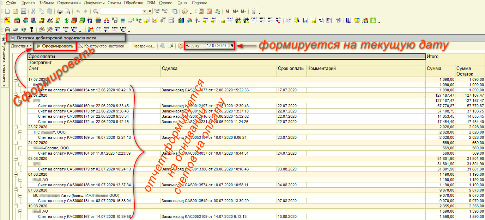

Отчет формируется на текущую дату и группируется по сроку оплаты.

## Работа с отчетом «Остатки дебиторской задолженности»

### Столбцы отчета

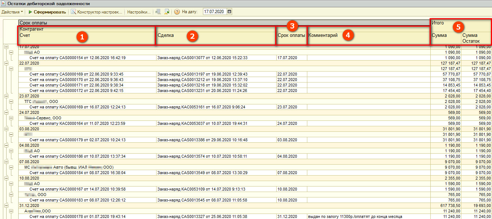

**Отчет "Остатки дебиторской задолженности" содержит следующие столбцы:**

1. *«Контрагент»* и *«Счет»*
2. *«Сделка»*
3. *«Срок оплаты»*
4. *«Комментарий»*
5. *«Итого»*: *«Сумма»* и *«Сумма Остаток»*

### 1. «Контрагент» и «Счет»

Отчет формируется исходя из выставленных счетов на оплату. Счет на оплату – это документ, который выставляется юридическим лицам, когда они приезжают на обслуживание.

### 2. «Сделка»

Сделка – это документ, на основании которого выставлен счет: как правило, счет выставляется на основании заказ-наряда.

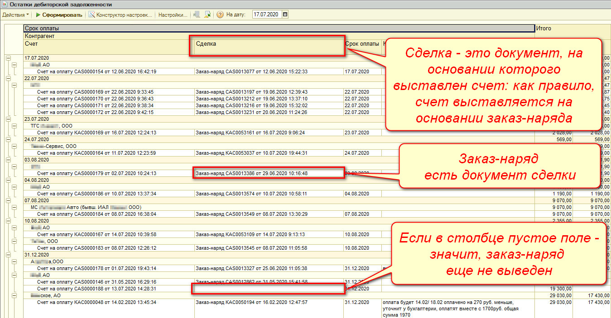

Если в столбце «Сделка» выводится Заказ-наряд, значит, это и есть документ сделки. Если ничего нет, пустое поле – значит, заказ-наряд еще не выведен, счет выводился на основании заявки на ремонт (либо мог быть создан просто так). Чтобы счет ушел из этого отчета, в любом случае необходимо, чтобы выводился заказ-наряд. Когда заказ-наряд будет выведен и закрыт – счет отсюда исчезнет.

### 3. «Срок оплаты»

В счете на оплату есть строка: *«Действителен до:____»*. Это срок действия счета на оплату. Какую дату здесь поставить, та дата и отразится в данном отчете в столбце «Срок оплаты».

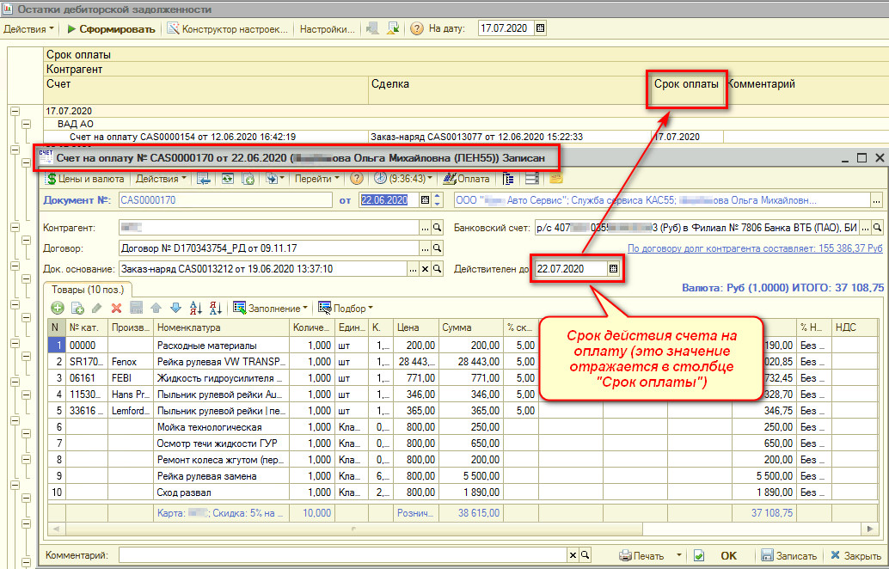

Работает бизнес-процесс следующим образом:

Значение «Действителен до:» высчитывается в зависимости от того, какого числа выставлен счет, и какой срок оплаты задолженности прописан в договоре (например, 5 рабочих дней). Сотрудник, выставляющий счет, высчитывает дату вручную по календарю.

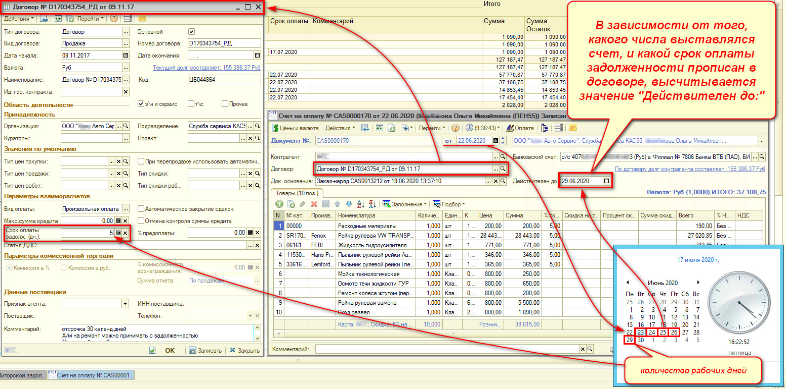

*Пример: счет выставлялся 22.06, в договоре прописан срок оплаты задолженности 5 дней, высчитывается 5 рабочих дней после 22.06, и получается, срок оплаты должен быть 29.06.*

*Примечание: Планируется доработка – автоматизация этого процесса в программе, чтобы максимально уйти от человеческого фактора, т.к. бывает, что сотрудник ставит не ту дату, неправильно посчитав дни. При заполнении срока оплаты в поле «Действителен до:» сразу будет появляться нужная дата.*

Если счет ***предоплатный***, то *с целью сортировки* можно ставить дату 31.12 (последний день года), и тогда все предоплатные счета в отчете будут в конце, на дату 31.12.

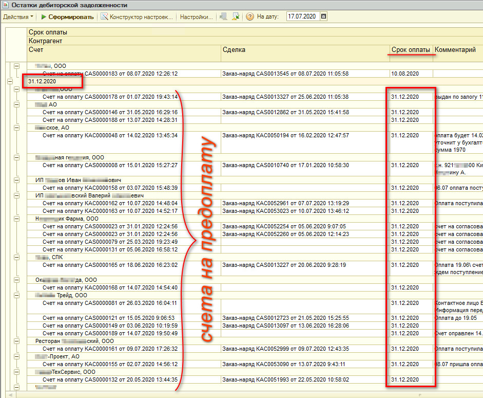

Таким образом, когда записывается документ «Счет на оплату», и в нем установлена дата, он автоматически попадает в данный отчет.

Сотрудник, который отвечает за контроль дебиторской задолженности смотрит, кто должен заплатить на текущую дату.

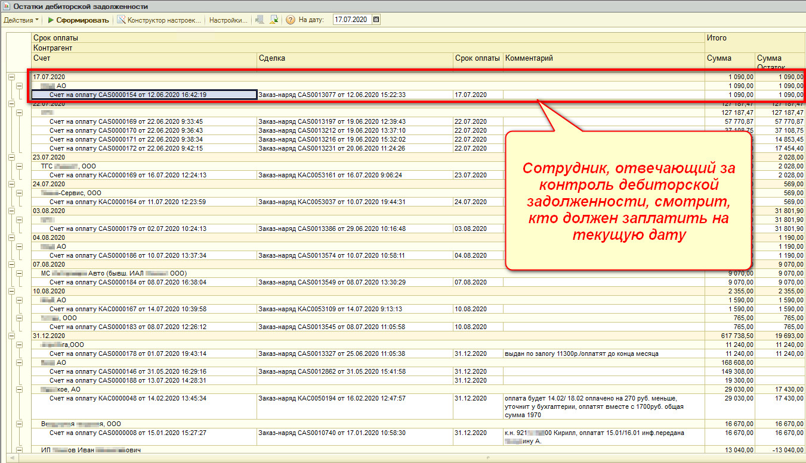

Как только контрагент оплатит счет, этот счет исчезнет из данного отчета.

*Как программа понимает, что счет оплачен:*

Необходимо зайти в банковские выписки: Документы → Движения денежных средств → Банковская выписка.

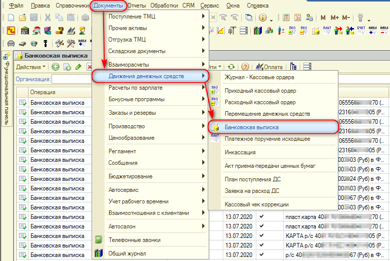

Бухгалтерия разносит банковскую выписку по должнику, автоматом заполняются значения, программа подгружает сделку «номер счета на оплату», и после проведения банковской выписки данный счет из отчета по дебиторской задолженности исчезает (при условии полной оплаты по счету).

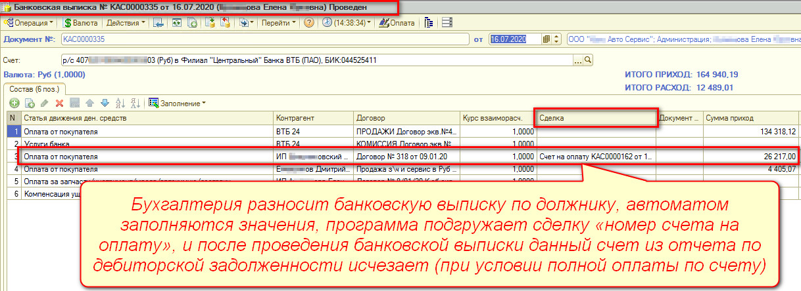

### 4. «Комментарий»

Комментарий – важный, очень информативный момент.

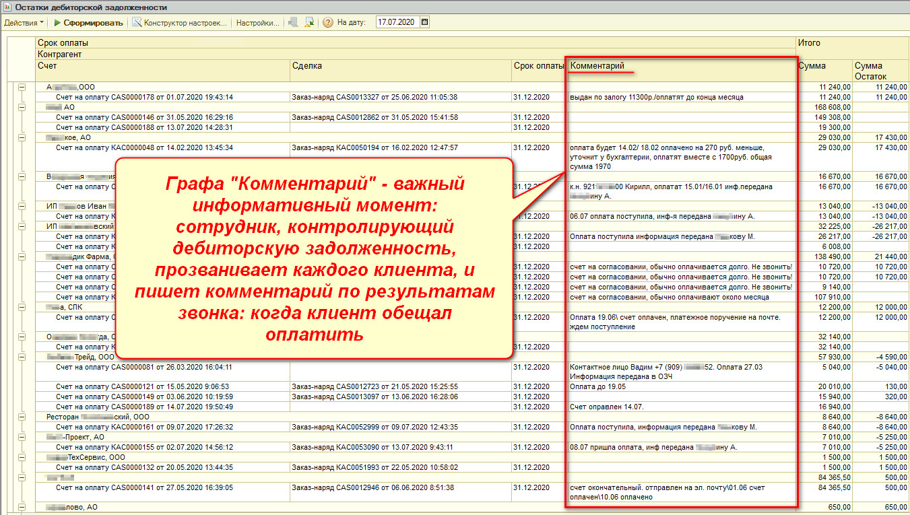

***Рекомендация, как работать с отчетом «Остатки дебиторской задолженности»:***

Сотрудник, который контролирует дебиторскую задолженность, за два дня до оплаты прозванивает контрагентов с напоминаниями, что от них ожидается оплата по счету № …. И в отчете, в графе «Комментарий» отписывается о результатах своего звонка (когда клиент обещал оплатить). Этот комментарий равен комментарию в счете, то есть писать надо в комментарий счета. В счет удобно перейти прямо из отчета: открыть его двойным кликом мыши и записать комментарий.

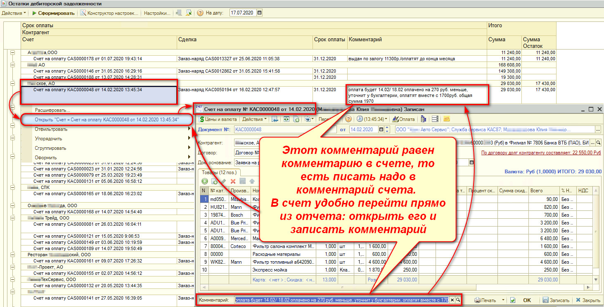

### 5. «Итого»: «Сумма» и «Сумма Остаток»

Если в столбцах «Сумма» и «Сумма Остаток» стоят равные значения, то, когда клиент оплатит эту сумму полностью, тогда счет из отчета исчезнет.

Если счет был оплачен частично, тогда в графе «Сумма» отображается полная сумма по счету, а в графе «Сумма Остаток» отображается долг – сколько клиенту осталось оплатить по этому счету. Таким образом, если клиент оплатил неполную сумму, то значение в столбце «Сумма Остаток» станет меньше. То есть, первый столбец отражает сумму по заказ-наряду, а второй - сумму по оплате.

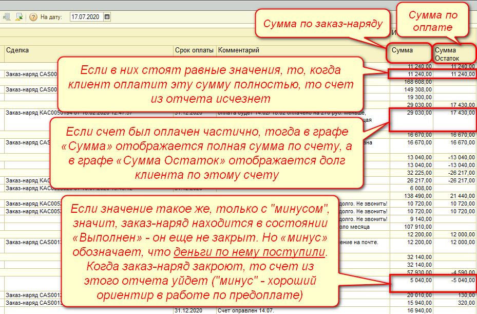

Если значение в столбце «Сумма Остаток» с «плюсом», значит, заказ-наряд проведен и в состоянии «Закрыт».

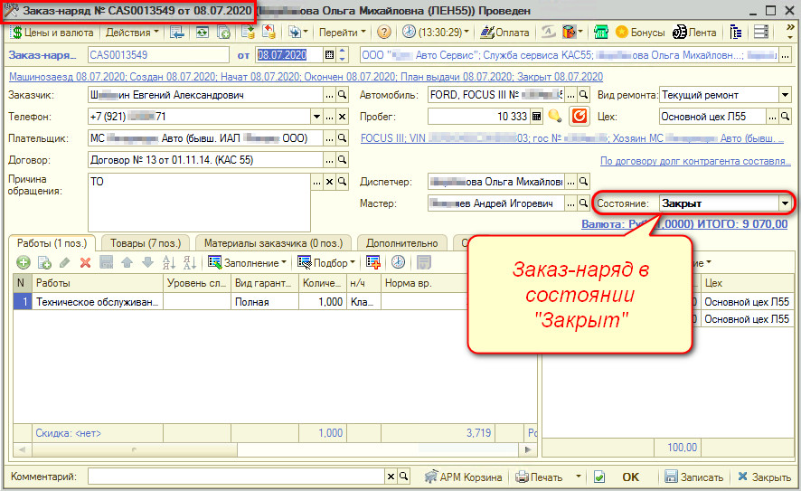

Если значение с «минусом», заказ-наряд находится в состоянии «Выполнен» - он еще не закрыт.

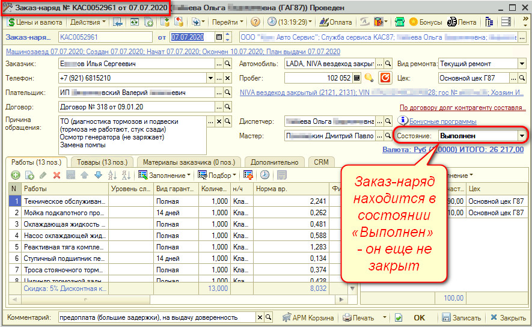

Но «минус» в столбце «Сумма Остаток» означает, что ***деньги по нему поступили***. Если значение такое же, только с «минусом» – значит, когда заказ-наряд закроют, то счет из этого отчета уйдет. «Минус» - удобный ориентир, когда есть работа по предоплате.

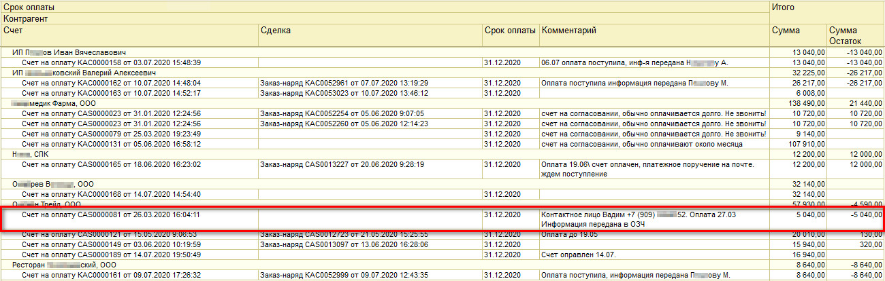

*Например: Выставлялся счет на предоплату (со сроком оплаты 31.12), сделки нет, т.к. счет на предоплату выставляется на основании заявки на ремонт, а не на основании заказ-наряда, - и в отчете видно, что клиент оплатил.*

Таким образом, когда в столбце «Сумма» положительная сумма, а в столбце «Сумма Остаток» отрицательная - это значит, что клиент оплатил счет на предоплату, а закрывающий документ еще не сделан.

---

**Теги:** взаиморасчеты, дебиторская задолженность, отчет, юридические лица, срок оплаты
