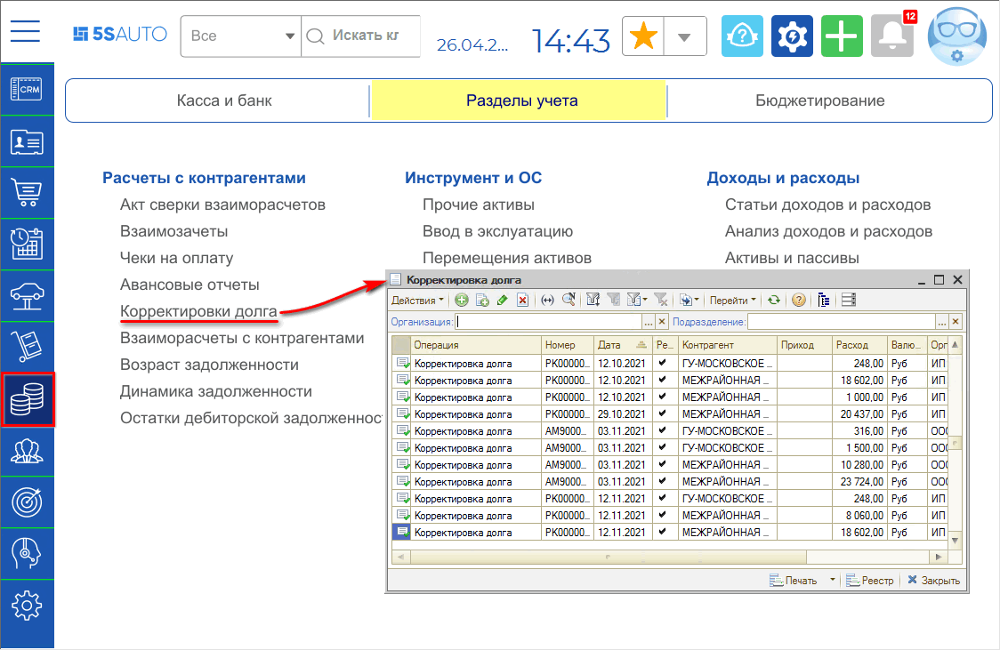
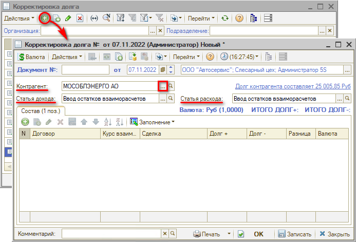
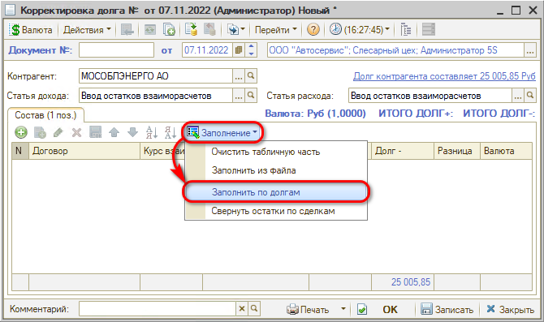
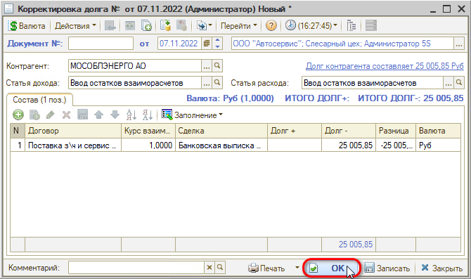
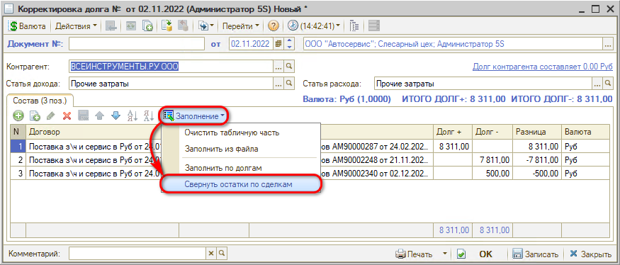
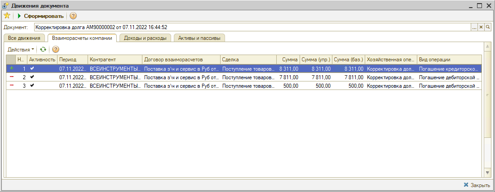

# Корректировка остатков взаиморасчетов

<table><tr><td><b>Время чтения:</b> 10 мин.</td><td><b>Обновлено:</b> 06.12.2022</td></tr></table>

Источник: https://www.5systems.ru/help/korrektirovka-ostatkov-vzaimoraschetov

## Содержание

1. [Введение](#введение)
2. [Документ "Корректировка долга"](#документ-корректировка-долга)
3. [Автозаполнение документа “Корректировка долга”](#автозаполнение-документа-корректировка-долга)
   - [1. Кнопка “Заполнить по долгам”](#1-кнопка-заполнить-по-долгам)
   - [2. Кнопка “Свернуть остатки по сделкам”](#2-кнопка-свернуть-остатки-по-сделкам)
4. [Обработка “Корректировка долга”](#обработка-корректировка-долга)

## Введение

При учете взаиморасчетов с контрагентом могут произойти ситуации, когда по некоторым документам числятся переплаты, а по другим – долги, хотя по факту задолженности у контрагента у и компании перед контрагентом нет.

Например, это может возникнуть в случае [*автоматического закрытия сделок*](../Автозакрытие%20сделок%20и%20ручная%20привязка/avtozakrytie-sdelok-i-ruchnaya-privyazka.md), когда при оплате сначала производится погашение кредиторской задолженности по более ранним документам, а не по конкретным сделкам.

Сделать взаимозачет этих долгов и переплат по контрагенту либо списать долги контрагента можно с помощью функционала автоматической *Корректировки долга.*

## Документ "Корректировка долга"

Для того чтобы сформировать документ “Корректировка долга”, необходимо перейти в реестр документов и создать новый элемент. Реестр расположен в меню программы *Финансы → Разделы учета → Расчеты с контрагентами → Корректировки долга[\*](#snoska):*

*\*Примечание: В случае если данного пункта меню нет на рабочем столе, можно добавить его вручную – см. статью "[Настройка рабочего стола](https://www.5systems.ru/help/nastroyka-rabochego-stola#nastrrazdelov)".*

В создаваемом документе требуется указать *контрагента*, заполнить *статьи дохода и расхода:*

Гиперссылка *“Долг контрагента составляет”* отражает текущее состояние расчетов с контрагентом по договору. Переход производится на отчет [*Взаиморасчеты с контрагентами*](../Взаиморасчеты%20с%20контрагентами/vzaimoraschety-s-kontragentami.md), сформированный для указанного контрагента.

Далее следует заполнить таблицу документами, по которым необходимо произвести корректировку долга. Заполнение можно сделать двумя способами.

## Автозаполнение документа “Корректировка долга”

### 1. Кнопка “Заполнить по долгам”

Кнопка *“Заполнить по долгам”* заполняет документ “Корректировка долга” на основании всех документов контрагента, по которым есть долг контрагента перед компанией или компании перед ним:

Табличные графы документа *Корректировка долга:*

- *“Договор”* – договор, взаиморасчеты по которому подлежат корректировке.
- *“Курс взаиморасч.” –* курс валюты, по которой ведутся взаиморасчеты.
- *“Сделка”* – сделка, взаиморасчеты по которой подлежат корректировке.
- *“Долг +”* – сумма, на которую следует увеличить долг контрагента.
- *“Долг –”* – сумма, на которую следует уменьшить долг контрагента.
- *“Валюта”* – валюта договора. Заполняется автоматически.

После заполнения документ необходимо *Записать с проведением* нажатием на кнопку “ОК”. При этом будут перепроведены все сделки по контрагенту, долг клиента обнуляется.

Документ формирует хозяйственную операцию *Корректировка долга*. Хозяйственная операция начисляет или списывает сумму задолженности контрагента перед компанией или компании перед контрагентом, формируя следующие движения по учетным блокам:

1. *Учет взаиморасчетов:* при корректировке долга в сторону увеличения сумма корректировки приходуется на регистре “Взаиморасчеты компании”, т. е. начисляется сумма задолженности. При уменьшении суммы долга производится списание суммы задолженности.
2. *Учет доходов и расходов:* на регистре “Доходы и расходы” отражается откорректированная разница долга по статье “доход” при корректировке в сторону увеличения.

### 2. Кнопка “Свернуть остатки по сделкам”

Кнопка *“Свернуть остатки по сделкам”* заполняет “Корректировку долга” только на основании тех документов, долги по которым можно взаимозачесть по их сумме с выходом на “0”:

То есть, будет списана только сумма, в размере которой был долг по одной сделке и переплата по другой.

После заполнения документ необходимо *Записать с проведением* нажатием на кнопку “ОК”.

Формируются следующие движения документа:

## Обработка “Корректировка долга”

Документ “Корректировка долга” (см. выше) позволяет взаимозачесть долги и переплаты по одному контрагенту. В случае если требуется списать долги по всем контрагентам, можно воспользоваться специальной внешней обработкой.

Обработка “Корректировка долга” позволяет единовременно списать все долги по всем контрагентам по принципу работы кнопки “Свернуть остатки по сделкам”, т.е. на основании документов, по которым “Долг +” и “Долг -” в сумме равны “0”.

Файл для загрузки обработки: [Обработка Корректировка долга](attachments/obrabotka-korrektirovka-dolga.7z) (.7z, 4 КБ) (следует скачать и распаковать).

*Примечание:* Обработку следует использовать с осторожностью!

---

**Теги:** взаиморасчеты, корректировка долга, остатки, сделки, документ

