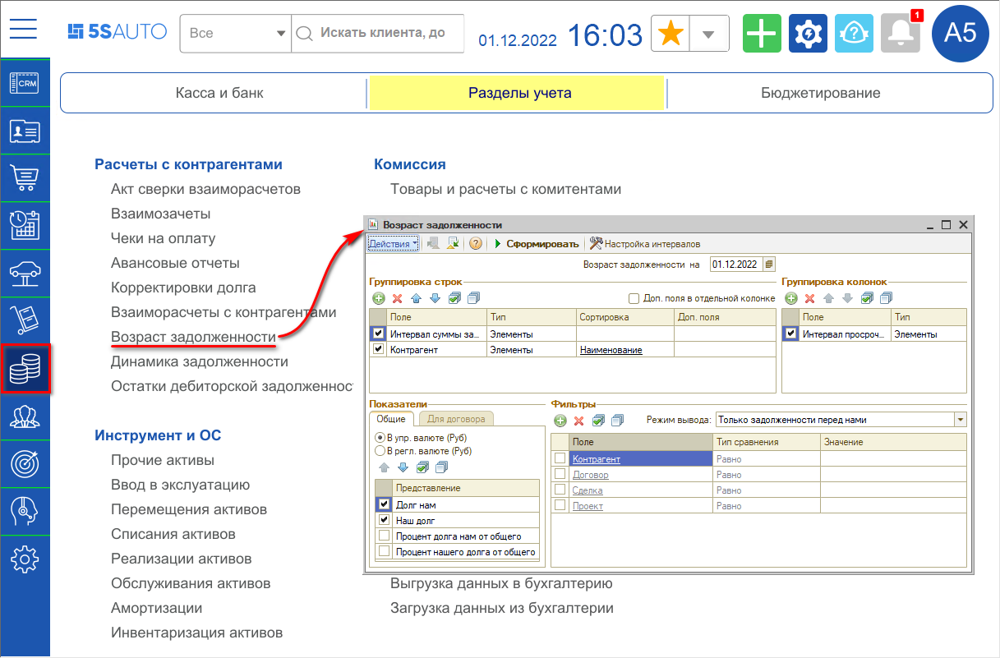
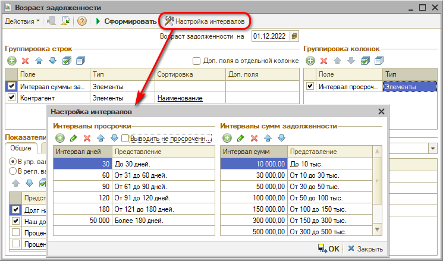
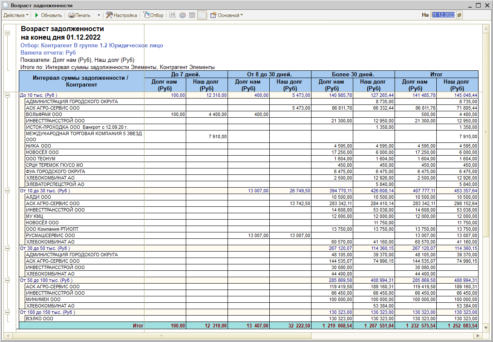
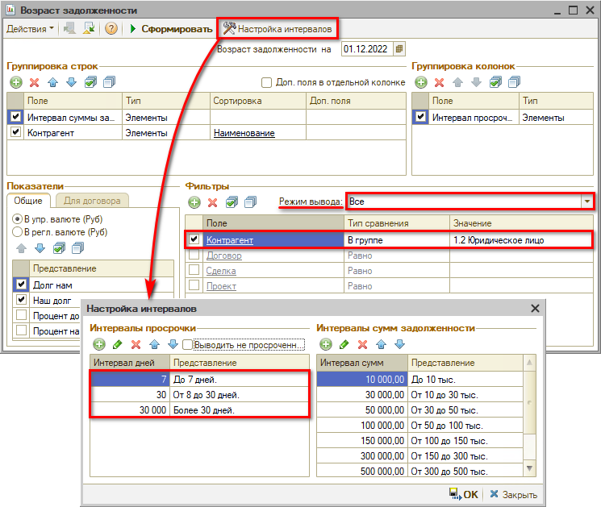

# Отчет “Возраст задолженности”

<table><tr><td><b>Время чтения:</b> 6 мин.</td><td><b>Обновлено:</b> 06.12.2022</td></tr></table>

Источник: https://www.5systems.ru/help/otchet-vozrast-zadolzhennosti

## Содержание

1. [Введение](#введение)
2. [Настройки отчета](#настройки-отчета)
3. [Пример сформированного отчета](#пример-сформированного-отчета)

## Введение

*Отчет “Возраст задолженности”* служит для анализа задолженностей по договорам. Данные выводятся в суммовых и количественных показателях.

При помощи отчета можно анализировать задолженности, т.е. остатки взаиморасчетов по договорам в рамках указанных периодов, задаваемых в днях.

Открыть отчет можно через меню *Финансы → Разделы учета → Расчеты с контрагентами → Возраст задолженности[\*](#snoska):*

*\*Примечание: В случае если данного пункта меню нет на рабочем столе, можно добавить его вручную – см. статью "[Настройка рабочего стола](../../Администрирование%20и%20настройка%20системы/Настройка%20рабочего%20стола/nastroyka-rabochego-stola.md#настройки-разделов-и-пунктов-рабочего-стола)".*

## Настройки отчета

Следует задать *дату,* на которую требуется посмотреть задолженность – автоматически устанавливается текущий день. Можно гибко настраивать группировку строк и колонок, показателей, дополнительных полей и т. д. Некоторые характеристики вынесены в дополнительные поля – можно выбрать, какие из дополнительных полей должны быть включены в отчет. Если флажок *“Доп. поля в отдельной колонке”* включен, дополнительные поля в отчете будут выводиться в отдельной колонке.

В поле *“Режим вывода”* можно выбрать один из следующих режимов:

- Только задолженности перед нами;
- Только наши задолженности;
- Все.

В поле *"Фильтры"* можно установить нужные фильтры и отборы, например выбрать определенную группу контрагентов.

В области *“Группировка строк”* и *“Группировка колонок”* можно задать интервалы суммы задолженности и интервалы просроченных дней, за которые будет рассматриваться просроченная задолженность контрагентов.

По кнопке *“Настройка интервалов”* можно произвести настройку временных интервалов просрочки в днях и интервалов сумм задолженности, за которые будет рассматриваться просроченная задолженность контрагентов:

Поле *“Показатели”* формы настройки отчета содержит флажки:

- *В упр. валюте* – признак формирования отчета в валюте управленческого учета.
- *В регл. валюте* – признак формирования отчета в валюте регламентированного учета.
- *Долг нам* – задолженность контрагентов перед Вашей компанией.
- *Наш долг* – задолженность Вашей компании перед контрагентами.
- *Процент долга нам от общего* – процент от общего долга задолженности контрагентов перед Вашей компанией.
- *Процент нашего долга от общего* – процент от общего долга задолженности Вашей компании перед контрагентами.

## Пример сформированного отчета

На приведенном отчете использован отбор контрагентов, входящих в группу “Юридическое лицо”, в качестве периодов установлены задолженности: “До 7 дней”, “От 8 до 30 дней” и “Более 30 дней”, интервалы сумм задолженности и прочие настройки – стандартные:

Если во взаиморасчетах с контрагентом обнаружены “перекосы” по учету переплат и долгов, то можно откорректировать остатки по сделкам с помощью документа “Корректировка долга” (см. статью [*Корректировка остатков взаиморасчетов*](../Корректировка%20остатков%20взаиморасчетов/korrektirovka-ostatkov-vzaimoraschetov.md)).

---

**Теги:** взаиморасчеты, отчет, возраст задолженности, дебиторская задолженность, просрочка

