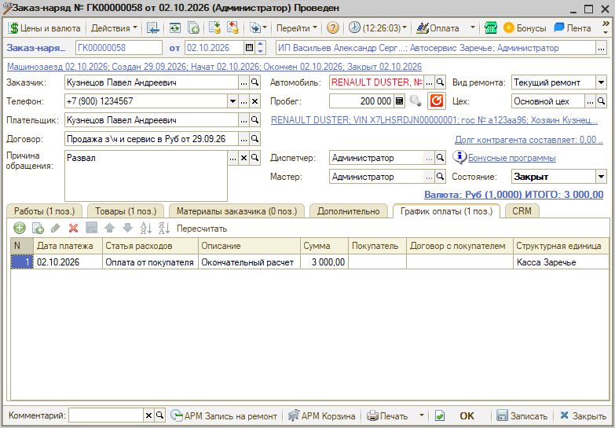
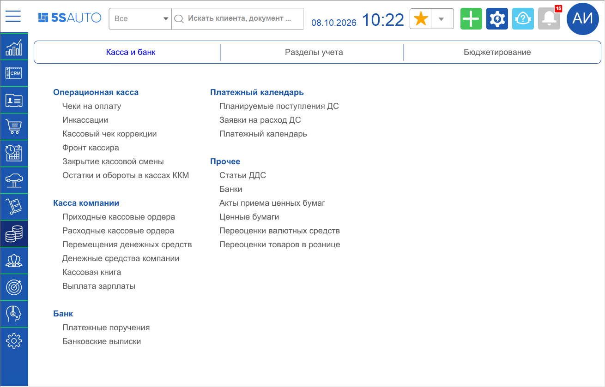
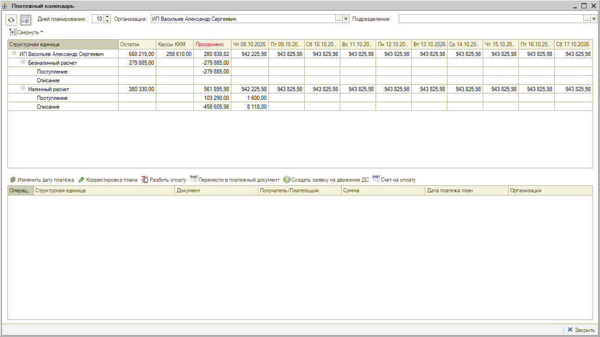
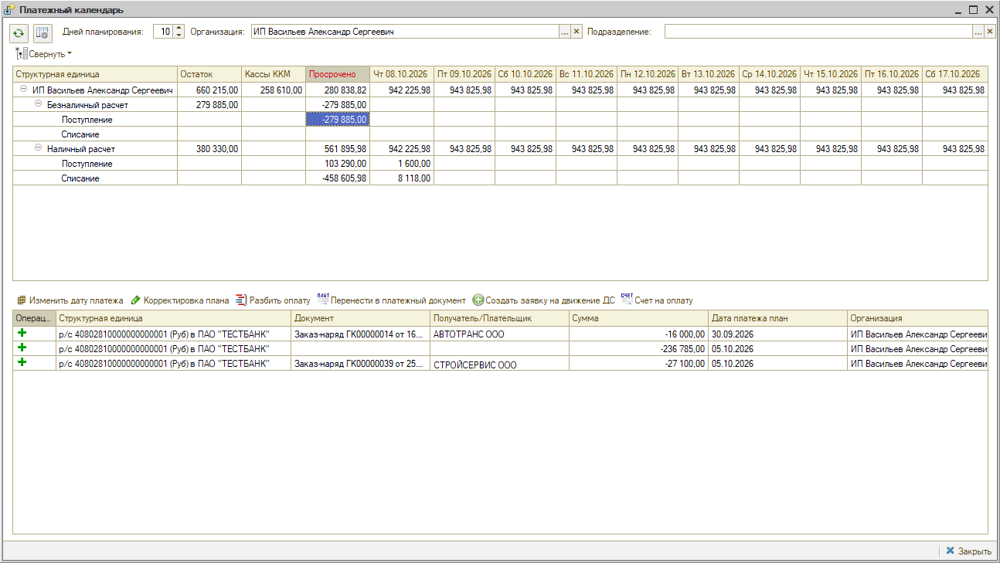
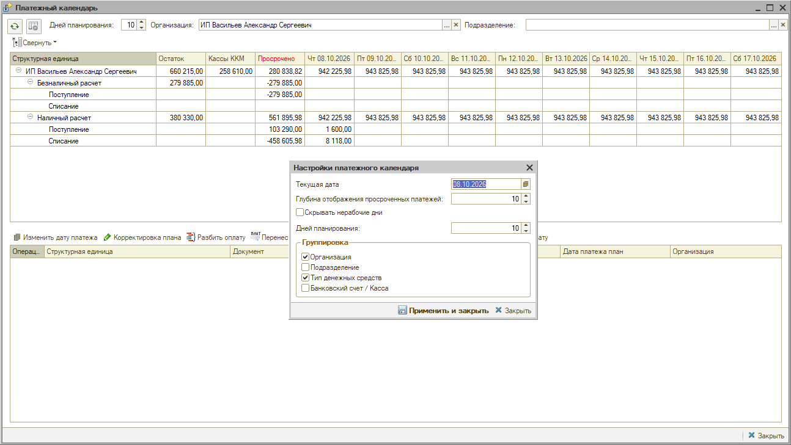

# Платежный календарь

<table><tr><td><b>Время чтения:</b> 12 мин.</td><td><b>Создано:</b> 01.10.2026</td></tr></table>

> *Актуально начиная с версии релиза 5S AUTO **2.8.5**. Функционал дорабатывается.*

> 🛠 Комментарий для черновика: *черновик по описанию разработчика (альфа-версия, состояние выгрузки на 01.10.2026). Формы выгружены в двоичном виде, внешний вид по ним не восстановить — названия кнопок, реквизитов и пути в меню сверить в рабочей базе, скриншоты сделать там же.*

## Содержание

- [Введение](#введение)
- [Включение платежного календаря](#включение-платежного-календаря)
- [Как формируется план](#как-формируется-план)
  - [График оплаты в документах](#график-оплаты-в-документах)
  - [Зарплата](#зарплата)
  - [Уточнение плана последующими документами](#уточнение-плана-последующими-документами)
- [Факт оплаты](#факт-оплаты)
- [Денежные средства в пути](#денежные-средства-в-пути)
  - [Настройка по типам оплат](#настройка-по-типам-оплат)
- [Рабочее место «Платежный календарь»](#рабочее-место-платежный-календарь)
  - [Календарь](#календарь)
  - [Расшифровка и операции](#расшифровка-и-операции)
  - [Настройки и отбор](#настройки-и-отбор)
  - [Восстановление движений](#восстановление-движений)
- [Права доступа](#права-доступа)
- [Ограничения](#ограничения)

## Введение

***Платежный календарь*** – это прогноз движения денежных средств: сколько и когда компания должна заплатить и получить. По нему видно, в какой день может возникнуть *кассовый разрыв* – когда денег не хватит на запланированные платежи.

Раньше такой прогноз строился только вручную – документами *«Заявка на расход ДС»* и *«План поступления ДС»*, которые заводились отдельно от первичных документов. Заказы, отгрузки, поступления и зарплата в планирование не попадали.

Теперь плановые платежи формируют сами первичные документы при проведении: заказы, счета, заказ-наряды, реализации, поступления, начисление зарплаты. Календарь заполняется без ручного ввода, а заявки на расход ДС и планы поступления ДС остаются инструментом уточнения и ручной корректировки. Например, по заказу поставщику плановый платеж попадает в календарь сам – со статьей ДДС из договора и датой оплаты с учетом отсрочки, – создавать на его основании заявку на расход ДС не нужно.

***Основные понятия:***

- ***План*** – ожидаемый платеж: сумма и дата, когда деньги должны прийти или уйти.
- ***Факт*** – фактическое движение денег по кассе или банковскому счету компании.
- ***Денежные средства в пути*** – деньги, полученные от клиента, но еще не зачисленные на счет компании.
- ***Структурная единица*** – касса или банковский счет, где лежат или окажутся деньги.
- ***Статья ДДС*** – статья движения денежных средств, по которой группируются платежи.

> [!NOTE]
> Прежний отчет *«Платежный календарь»* на переходном этапе продолжает работать параллельно с новым платежным календарем. Его планируется убрать из программы в одном из следующих релизов.

## Включение платежного календаря

По умолчанию платежный календарь выключен. Чтобы включить его, укажите ***дату начала платежного календаря.*** Плановые и фактические платежи формируют только документы, дата которых *не раньше* указанной.

> 🛠 Комментарий для черновика: *Где пользователь задает дату начала платежного календаря (константа _5с_ДатаНачалаПлатежногоКалендаря) – путь в меню и название настройки? Сейчас в статье – «укажите дату начала платежного календаря» без пути. (вопрос задан Юре 08.10.2026, ждем ответа)*

Дата сравнивается с датой документа, а не с текущей датой. Поэтому перепроведение старого документа не создает платежи задним числом, а результат проведения не зависит от того, когда и кем документ проведен.

> [!IMPORTANT]
> Указывайте дату начала ***задним числом*** – так, чтобы в календарь попали все еще не закрытые документы: обычно это начало года или квартала. Иначе заказ, оформленный до этой даты, не попадет в календарь никогда, даже после перепроведения, и первые недели прогноз будет занижать обязательства.
>
> После указания даты выполните *групповое перепроведение документов* за период.

## Как формируется план

### График оплаты в документах

В документах появилась вкладка ***«График оплаты»*** – в заказ-наряде, например, это колонки *«Дата платежа»*, *«Статья расходов»*, *«Описание»*, *«Сумма»*, *«Покупатель»*, *«Договор с покупателем»* и *«Структурная единица»*. График есть в документах:

- *«Счет на оплату»*, *«Заказ покупателя»*, *«Заявка на ремонт»*, *«Заявка на хранение шин»*, *«Заказ-наряд»*, *«Реализация товаров»* – плановые поступления;
- *«Счет от поставщика»*, *«Заказ поставщику»*, *«Поступление товаров»* – плановые платежи.

График заполняется автоматически по договору взаиморасчетов – по полям ***«% предоплаты»*** и ***«Срок оплаты задолж. (дн.)»*** в карточке договора (блок *«Параметры взаиморасчетов»*, вкладка *«Оплаты»*):

- строка предоплаты – на дату документа;
- строка остатка – на дату документа плюс отсрочка платежа.

> 🛠 Комментарий для черновика: *От какой даты считается срок оплаты по договору: от даты самого документа (для заказа поставщику – дата заказа)? Пересчитывается ли плановая дата оплаты от даты поступления, когда на основании заказа вводится «Поступление товаров»? Сейчас в статье – «на дату документа плюс отсрочка платежа». (вопрос задан Юре 08.10.2026, ждем ответа)*

График можно отредактировать вручную – при повторной записи документа заполненный график не перезаписывается. На панели вкладки есть кнопка ***«Пересчитать»***.

> 🛠 Комментарий для черновика: *Что делает кнопка «Пересчитать» на вкладке «График оплаты» – заново заполняет график по договору, затирая ручные правки, или пересчитывает суммы? И почему в заказ-наряде колонка называется «Статья расходов», если это плановое поступление? (вопрос задан Юре 08.10.2026, ждем ответа)*

Статья ДДС берется из договора – поле ***«Статья ДДС»*** на той же вкладке. Фактическая оплата берет статью оттуда же, поэтому план и факт всегда оказываются на одной статье.

### Зарплата

В документе *«Начисление зарплаты»* графика оплаты нет – плановые выплаты формируются по табличной части *«Сотрудники»:* сумма к выплате равна сумме начисления с учетом корректировки, контрагент и договор берутся по каждой строке.

### Уточнение плана последующими документами

Когда заказ превращается в отгрузку, план не удваивается: следующий документ снимает план документа-основания и записывает свой, уточненный. Снимается ровно та сумма, которая приходится на это основание, – если заказ отгружается несколькими реализациями, его план гасится по частям.

План снимается только в том же направлении: расходный документ не уменьшает плановое поступление, и наоборот. Документы возврата уменьшают ранее запланированный платеж.

> 🛠 Комментарий для черновика: *По описанию: 9 документов – источники плана (не сторнируют), 10 – уточняющие план (сторнируют план основания и пишут свой), 2 возврата, 7 – факт оплаты. Полного перечня уточняющих документов и возвратов в описании нет.*

## Факт оплаты

Фактические суммы записывают документы движения денежных средств: банковская выписка, кассовые ордера, выплата зарплаты, перемещение денежных средств и корректировка. Остаток к получению или к оплате – это разница между планом и фактом.

План и факт сопоставляются по организации, контрагенту, договору, статье ДДС и периоду. По конкретному документу-сделке они не сопоставляются: оплата может прийти по заказу, когда план уже перешел на реализацию, – остаток при этом все равно рассчитывается верно.

Касса или банковский счет в плане – это предположение, куда придут деньги, а в факте – реальное место зачисления. Поэтому при сопоставлении плана и факта они не учитываются и используются как отдельный разрез: где лежат деньги.

## Денежные средства в пути

При розничной оплате деньги получены от клиента, но на счет компании поступают не сразу – от нескольких часов до нескольких дней. Для прогноза этот разрыв важен, поэтому такие суммы учитываются отдельно как ***денежные средства в пути:***

**1.** Клиент оплатил покупку – сумма попадает в остаток «в пути». 
**2.** Наличные дошли до кассы компании – *приходный кассовый ордер* на основании инкассации закрывает остаток. 
**3.** Эквайер или партнер перечислил деньги на счет – остаток закрывает *банковская выписка.*

При закрытии записывается факт оплаты в платежный календарь.

Попадает ли оплата в «в пути», зависит от типа оплаты:

| Способ оплаты | Попадает в «в пути» | Чем закрывается |
| --- | --- | --- |
| Наличные | Да | Приходный кассовый ордер на основании инкассации |
| Эквайринг | Да | Банковская выписка, с учетом комиссии |
| Лицевой счет партнера | Да | Банковская выписка от партнера |
| Кредит банка или МФО | Да | Банковская выписка от банка |
| СБП | Нет | Деньги зачисляются сразу, факт записывает выписка |
| Клубная карта, талон, за счет заведения | Нет | Денег не будет, чек снимает план |

***Комиссия эквайринга.*** Банк зачисляет сумму за вычетом комиссии. Остаток «в пути» закрывается на полную сумму, а комиссия записывается отдельным расходом со своей статьей ДДС (из настройки по типам оплат, см. ниже).

### Настройка по типам оплат

Для типов оплат задается настройка – по сочетанию *типа оплаты, организации и подразделения:*

- ***структурная единица*** – касса или банковский счет, куда придут деньги;
- ***контрагент и договор плательщика*** – банк-эквайер, партнер или МФО, который перечислит деньги (не покупатель: покупатель указан в чеке);
- ***статья ДДС для комиссии.***

В форме списка настроек есть автозаполнение контрагента и договора по карточке типа оплаты.

> 🛠 Комментарий для черновика: *Где открывается настройка по типам оплат (регистр сведений _5с_ПлатежныйКалендарьНастройки) и как называется в интерфейсе? Сейчас в статье – «для типов оплат задается настройка» без пути. (вопрос задан Юре 08.10.2026, ждем ответа)*

## Рабочее место «Платежный календарь»

Для просмотра и корректировки календаря используется обработка ***«Платежный календарь»***. Она открывается через меню интерфейса: *Финансы → Касса и банк → Платежный календарь → Платежный календарь*. В этой же группе – списки документов *«Планируемые поступления ДС»* и *«Заявки на расход ДС»*.

Также обработку можно открыть через верхнее меню: *CRM → Все операции → Обработки → Платежный календарь*.

В шапке окна задаются ***«Дней планирования»***, ***«Организация»*** и ***«Подразделение»*** – по организации и подразделению отбираются данные календаря. Ниже две таблицы: сверху – календарь, снизу – расшифровка выбранной ячейки по документам. Над расшифровкой – кнопки операций.

### Календарь

Колонки календаря:

| Колонка | Содержание |
| --- | --- |
| Структурная единица | Строки календаря: организация, подразделение, вид расчетов, касса или банковский счет, поступление и списание |
| Остаток | Текущий остаток денежных средств |
| Кассы ККМ | Денежные средства в пути: получены от клиентов, на счет не поступили |
| Просрочено | Расхождения плана и факта за последние дни – глубина задается в настройках |
| Дни | Прогноз по дням нарастающим итогом: остаток плюс плановые поступления минус плановые платежи. Количество дней задается в настройках |

День, в котором значение уходит в минус, показывает, когда денег не хватит на запланированные платежи, – это и есть прогноз ***кассового разрыва.***

Строки группируются по организации, подразделению, типу денежных средств (*«Наличный расчет»* или *«Безналичный расчет»*), кассе или банковскому счету и направлению – *«Поступление»* или *«Списание»*. Ненужные группировки отключаются в настройках календаря. Кнопка ***«Свернуть»*** над таблицей сворачивает строки.

Если включена настройка *«Скрывать нерабочие дни»*, суббота и воскресенье из календаря убираются, а платежи, приходящиеся на них, ***переносятся на понедельник.***

### Расшифровка и операции

Чтобы посмотреть, из чего сложилась сумма, выделите ячейку календаря – в нижней таблице появятся плановые платежи: структурная единица, документ, получатель или плательщик, сумма, плановая дата платежа и организация. Значок в первой колонке показывает направление: зеленый плюс – поступление, красный минус – списание.

> 🛠 Комментарий для черновика: *В расшифровке есть строки без документа (например, с получателем «Розничные магазины» или вообще без получателя) – откуда они берутся? И как читать знак сумм в колонке «Просрочено»: для просроченных поступлений суммы отрицательные. (вопрос задан Юре 08.10.2026, ждем ответа)*

Для строки расшифровки доступны операции:

| Операция | Что делает |
| --- | --- |
| Изменить дату платежа | Переносит платеж на другую дату – меняется только дата |
| Корректировка плана | Позволяет изменить все реквизиты планового платежа |
| Разбить оплату | То же, что корректировка плана, но из одной строки можно сделать несколько |
| Перенести в платежный документ | Фиксирует факт оплаты: создает банковскую выписку или кассовый ордер либо добавляет строку в существующую выписку |
| Создать заявку на движение ДС | Создает заявку на расход ДС или план поступления ДС по текущей строке и открывает документ |
| Счет на оплату | Создает счет на оплату или счет от поставщика и открывает его. Проведенный счет меняет календарь, непроведенный можно просто распечатать |

Корректировка плана и заявка на движение ДС различаются тем, что остается в программе: корректировка изменяет сам плановый платеж, а заявка создает отдельный документ, который виден в журнале и может быть согласован в обычном порядке.

### Настройки и отбор

Окно ***«Настройки платежного календаря»*** открывается кнопкой настроек в шапке обработки:

| Настройка | Что задает |
| --- | --- |
| Текущая дата | С какого дня строится календарь – первая дневная колонка |
| Глубина отображения просроченных платежей | За сколько дней назад показывать просроченные платежи – более старые не выводятся |
| Скрывать нерабочие дни | Убирает субботу и воскресенье и переносит их платежи на понедельник |
| Дней планирования | Горизонт прогноза – количество дневных колонок календаря (это же поле есть в шапке обработки) |
| Группировка: *«Организация»*, *«Подразделение»*, *«Тип денежных средств»*, *«Банковский счет / Касса»* | Какие разрезы разворачивать в строках календаря |

Настройки применяются кнопкой ***«Применить и закрыть»***. Отбор по организации и подразделению задается в шапке обработки.

> 🛠 Комментарий для черновика: *Что задает «Текущая дата»: только день, с которого строятся колонки календаря, или от нее считаются также «Остаток» и «Просрочено»? Сейчас в статье – «с какого дня строится календарь» (по скриншотам). (вопрос задан Юре 08.10.2026, ждем ответа)*

### Восстановление движений

В обработке есть пересчет за период: документы заново заполняют график оплаты и формируют плановые платежи. Он нужен, если плановые платежи разошлись с первичными документами – например, после массового изменения документов задним числом.

> 🛠 Комментарий для черновика: *Откуда запускается восстановление движений и кому оно доступно? Сейчас в статье – «в обработке есть пересчет за период» без пути. (вопрос задан Юре 08.10.2026, ждем ответа)*

## Права доступа

Права на работу с платежным календарем выдаются в настройках прав пользователя. Сотруднику, который ведет платежный календарь, не нужны права на редактирование первичных документов (заказ-нарядов и других): операции календаря выполняются независимо от прав на сам документ.

> 🛠 Комментарий для черновика: *Как называются права на работу с платежным календарем (план видов характеристик «Права и настройки»)? Сейчас в статье – «выдаются в настройках прав пользователя». (вопрос задан Юре 08.10.2026, ждем ответа)*

## Ограничения

Функционал дорабатывается. На данный момент:

- перетаскивать платежи между днями нельзя – дата переносится операцией *«Изменить дату платежа»;*
- нерабочими днями считаются только суббота и воскресенье, выбрать график работы нельзя;
- разрезы по статьям ДДС и проектам в рабочем месте пока не используются;
- разделить денежные средства в пути по банкам-эквайерам нельзя: инкассация сводит всю выручку по картам на один договор.

> 🛠 Комментарий для черновика: *Техническая информация из описания разработчика (для справки, на сайт не выводится):*
> - *Объекты: регистр накопления _5с_ПлатежныйКалендарь (обороты, план и факт, 28 регистраторов); регистр накопления _5с_ДенежныеСредстваВПути (остатки, 4 регистратора); регистр сведений _5с_ПлатежныйКалендарьНастройки; определяемый тип _5с_СделкаПлатежногоКалендаря (16 типов документов – собственный, а не ПВХ ТипыСделок, чтобы не затрагивать взаиморасчеты); константа _5с_ДатаНачалаПлатежногоКалендаря; общий модуль _5с_Документы (автозаполнение графика оплаты, заполнение заявок по основанию); обработка _5с_ПлатежныйКалендарь; табличная часть _5с_ГрафикОплаты.*
> - *Старый регистр ПлатежныйКалендарь и его отчет уберут отдельным релизом после сверки обоих контуров.*
> - *Начисление зарплаты: сумма к выплате = Сумма + Корректировка, знак – по реквизиту НачислениеУдержание.*
> - *Закрытие «в пути» подбирает остаток партиями: сначала по дате расчетного документа, затем в порядке поступления.*
> - *Поведение зависит от элемента справочника «Типы оплат», а не от перечисления (СБП, лицевые счета партнеров и клубные карты в перечислении неразличимы); автозаполнение настройки – из реквизита «Карточка» справочника «Типы оплат».*
> - *Календарь – дерево значений, дневные колонки строятся динамически.*
> - *Настройка ГрафикРаботы зарезервирована под произвольный график.*
> - *Решение по разрезам «Статья ДДС» и «Проект» – по итогам альфа-тестирования.*

---

**Теги:** платежный календарь, денежные средства, ДДС, кассовый разрыв, график оплаты, план поступлений, план платежей, денежные средства в пути, эквайринг, заявка на расход ДС
