

# Настройка скидок

<table><tr><td><b>Время чтения:</b> 11 мин.</td><td><b>Обновлено:</b> 16.05.2025</td></tr></table>

Источник: https://www.5systems.ru/help/nastroyka-skidok

## Содержание

1. [Основные права, влияющие на применение цен и скидок](#основные-права-влияющие-на-применение-цен-и-скидок)
2. [Настройка типов скидки](#настройка-типов-скидки)
3. [Настройка скидок на строку](#настройка-скидок-на-строку)
4. [Ручная установка скидки на строку в документе](#ручная-установка-скидки-на-строку-в-документе)
5. [Настройка и применение скидок на документ](#настройка-и-применение-скидок-на-документ)
6. [Создание автоматической скидки](#создание-автоматической-скидки)
7. [Настройка и применение скидок контрагентам](#настройка-и-применение-скидок-контрагентам)

## Основные права, влияющие на применение цен и скидок

| Код | Право / Настройка | Комментарий |
| --- | --- | --- |
| 41604 | **Редактирование цен и сумм в номенклатурных таблицах** | "Да" – разрешает пользователю изменять цены вручную прямо в документе продажи, например в Заказ-наряде. "Нет" – пользователь сможет использовать только цены, установленные документами "Назначение цен". |
| 42006 | **Основной тип цен закупки** | Данная настройка пользователя определяет значение по умолчанию для заполнения поля "Тип цен" при создании новых документов поступления ТМЦ. Обычно устанавливается "закупочная". |
| 43003 | **Основной тип цен продажи** | Данная настройка пользователя определяет значение по умолчанию для заполнения поля "Тип цен" при создании новых документов реализации ТМЦ. Обычно устанавливается "розничная". |
| 43002 | **Запретить продажу ниже себестоимости** | При установке в значение "Да" не позволит пользователю продать товар дешевле себестоимости даже в условиях наложения скидок. |
| 41605 | **Изменять валюту в соответствии с категорией цен** | Включает / отключает режим автоматической смены валюты документа при изменении типа цен (валюта документа устанавливается в соответствии с валютой типа цен). По умолчанию установлено значение "Да". |
| 41707 | **Изменение валюты и типа цен документа согласно договора взаиморасчетов** | Включает режим автоматического изменения валюты и типа цен документов при изменении договора взаиморасчетов. По умолчанию установлено значение "Нет". |
| 43013 | **Способ выбора скидки** | Право на способ выбора скидок в документах: **1.** Назначение всех скидок запрещено; **2.** Выбор скидок запрещен, скидки устанавливаются автоматически; **3.** Возможен выбор только ручных скидок; **4.** Выбор ручных скидок разрешен, в противном случае скидки устанавливаются автоматически; **5.** Возможен выбор ручных скидок и назначение производной скидки по отдельным товарным позициям. |

## Настройка типов скидки

Для настройки типов скидки:

- Переходим в справочник *"Типы скидок и наценок" (Администрирование → Компания → Ценообразование → Типы скидок и наценок):*

- Создаем новый тип скидки, указываем ***Наименование скидки***.

  Пример: "Скидка 20%", "Скидка в пятницу", "На зимнюю резину" и т.п.

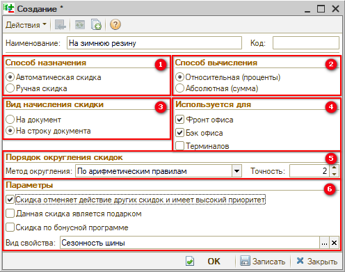

Заполняем параметры:

1. Указываем ***способ назначения*** *"Автоматическая скидка"*. Автоматическая скидка означает, что в документах (например в Заказ-наряде) скидка будет устанавливаться автоматически при создании.
2. Указываем ***способ вычисления*** – относительная (в процентах) или абсолютная (сумма в рублях).
3. Указываем ***вид начисления скидки*** *"На строку документа"*, так как настраиваем тип скидки на строку.
4. Указываем ***места использования*** *"Фронт офис"* и *"Бэк офис"*.
5. ***Метод округления*** обычно используется "По арифметическим правилам".

   Точность: "-1" = до десятков рублей; "-2" = до сотен рублей; 0 = до рублей; 1 = до десятых долей и так далее. Рекомендуем значение "2".

   *Точность установки цен может существенно влиять на цену недорогих товаров или на работу кассы.*
6. Устанавливаем ***дополнительные параметры***, например, что *скидка отменяет действие других скидок и имеет более высокий приоритет,* выбираем *вид свойства* при необходимости и др.

- Сохраняем изменения.

## Настройка скидок на строку

[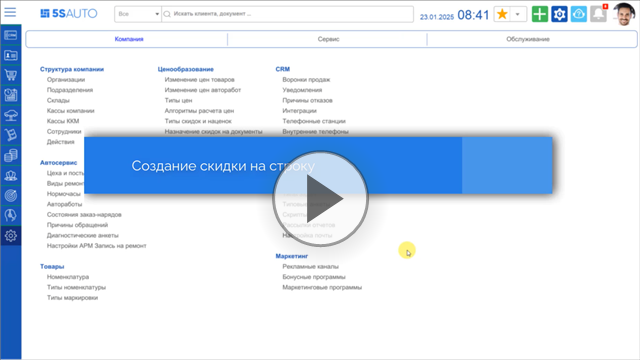](https://edu.5systems.ru/video/Skidki/Sozdanie_skidki_na_stroku.mp4)

Для настройки скидок на строку рекомендуется сначала добавить новый [*тип скидки*](#настройка-типов-скидки).

После добавления типа скидки необходимо настроить способ использования скидки. Для этого:

- Переходим в реестр документов "Назначение товарных скидок" *(Администрирование → Компания → Ценообразование → Назначение скидок на строки):*

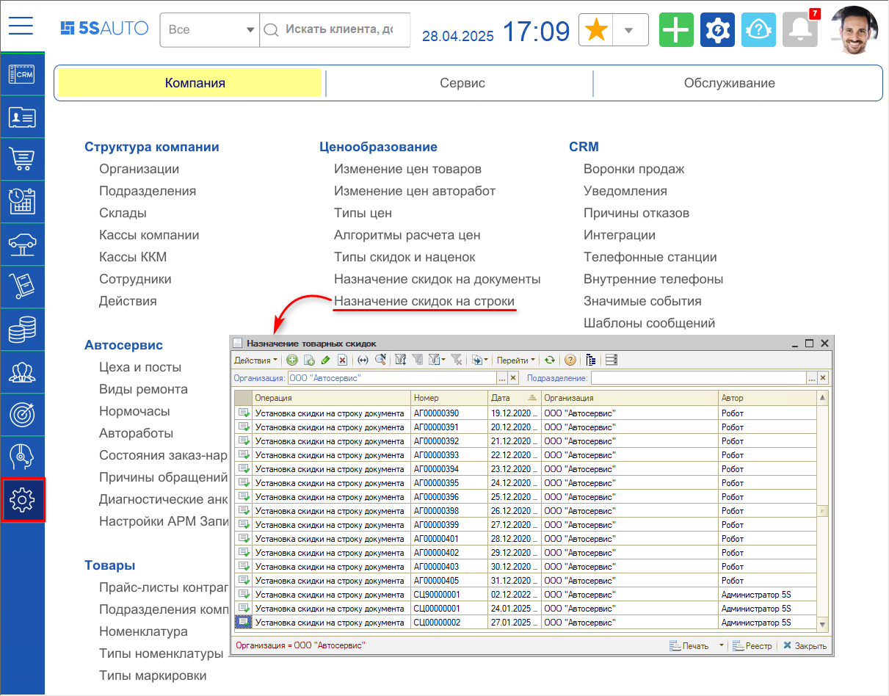

- Создаем новый документ "Установка скидки на строку документа" или правим существующий:

  1. Устанавливаем ***дату***, с которой скидки начинают действие.
  2. Нажимаем кнопку *"Добавить"* командной панели у табличной части и начинаем заполнение:

     1) В столбце *"Скидка"* выбираем ***тип скидки***, созданный ранее, или создаем новый тип скидки и выбираем его.

     2) Вручную устанавливаем галочки для области действия скидок: ***"Скидка на товары"*** или ***"Скидка на работы"***.

     3) Устанавливаем ***значение скидки***.

     4) Устанавливаем ***тип номенклатуры*** или номенклатуру/работу, на которую будет распространяться скидка, либо группу товаров/работ.

     5) Заполняем оставшиеся значения согласно маркетинговой стратегии.

- Сохраняем изменения.

Пример заполненного документа "Установка скидки на строку документа":

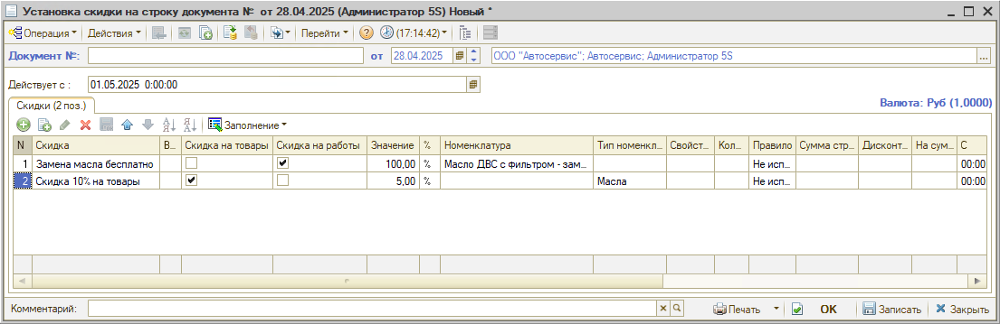

## Ручная установка скидки на строку в документе

[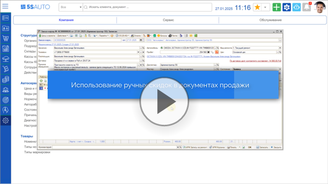](https://edu.5systems.ru/video/Skidki/Ispolzovanie_ruchnyh_skidok_v_documente.mp4)

Для установки ручной скидки на товар в продажном документе, например, Заказ-наряде, необходимо чтобы отображался столбец "Скидка на товар" в таблице на вкладке "Товары". Вывести данный столбец можно через форму настройки списка:

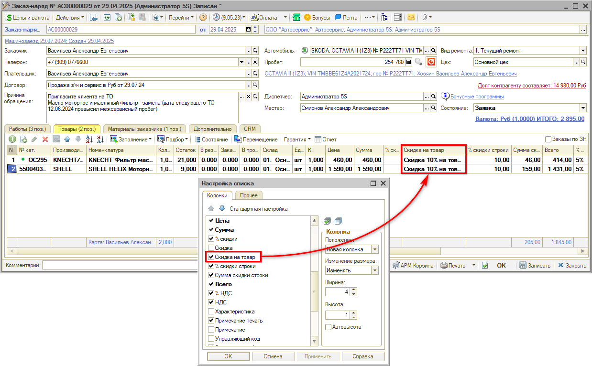

Затем следует выбрать для товара скидку с ручным способом назначения:

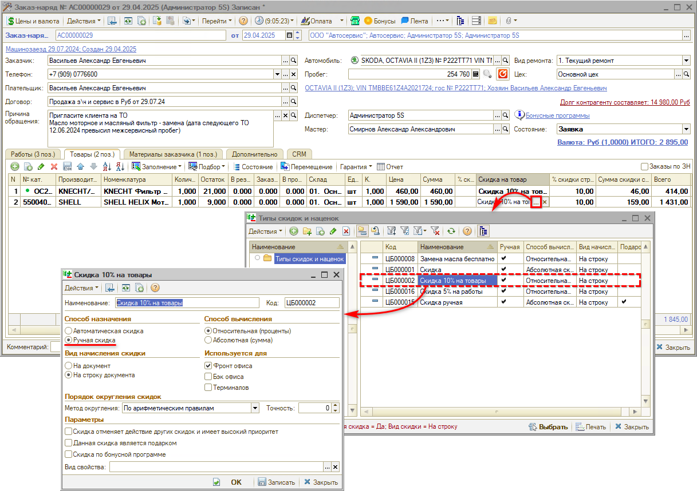

При выборе типа скидки устанавливаются отборы по виду скидки "На строку документа" и способу назначения "Ручная скидка".

## Настройка и применение скидок на документ

[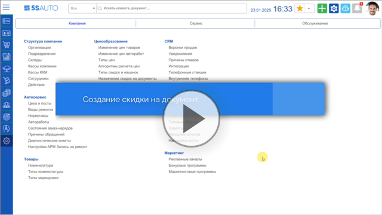](https://edu.5systems.ru/video/Skidki/Sozdanie_skidki_na_dokument.mp4)

Настройка скидки на документ заключается в следующем:

- Создание типа скидки с ***видом начисления*** *"На документ"* в справочнике "Типы скидок и наценок" *(Администрирование → Компания → Ценообразование → Типы скидок и наценок):*

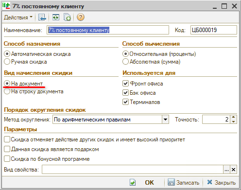

- Установка значения скидки на документ через документ ***"Назначение общих скидок"*** *(Администрирование → Компания → Ценообразование → Назначение скидок на документы),* где необходимо:

  1. выбрать ***тип скидки***, созданный на шаге 1,
  2. определить ***назначение скидки***: скидка на товары и / или на работы,
  3. установить ***значение (%) скидки***, который будет устанавливаться на документ.

Пример установки скидки на документ:

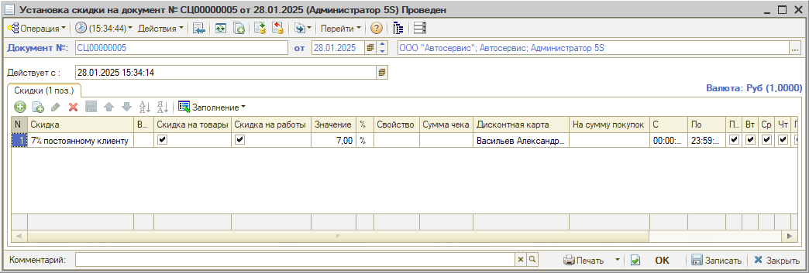

Если у типа скидки в справочнике "Типы скидок и наценок" указано значение "Вид начисления скидки" = "Автоматическая скидка" (как в примере выше), то скидка на документ, реализующий товары (Реализация товаров, Заказ-наряд), применяется автоматически:

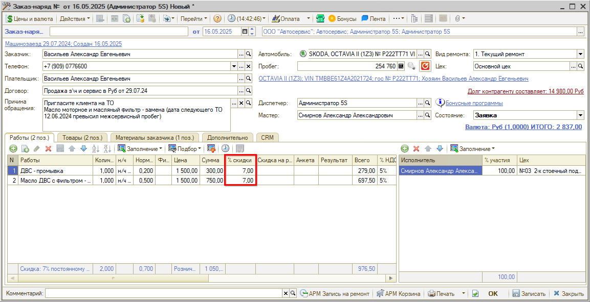

В заказ-нарядах скидка также будет отображаться на вкладке "Дополнительно":

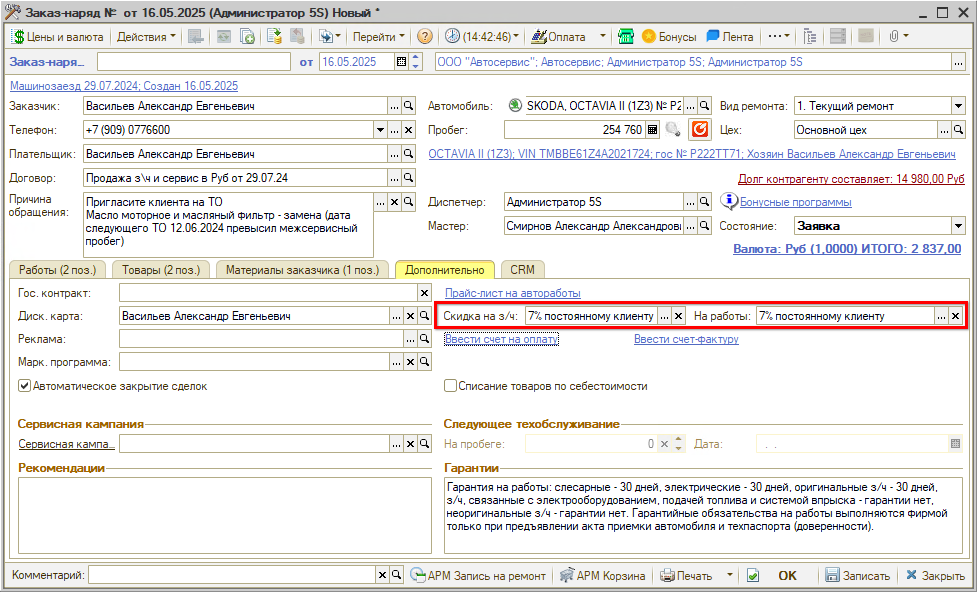

Для применения типа скидки с ручным способом назначения:

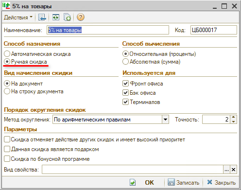

данный тип скидки необходимо выбрать в документе вручную. Пример 1. В заказ-наряде:

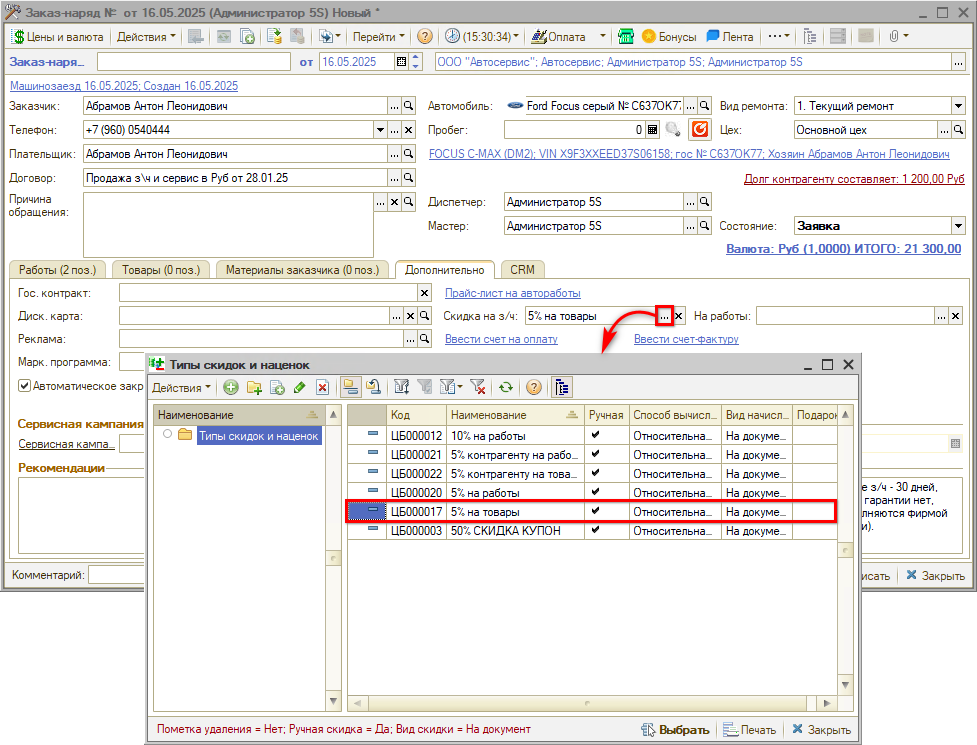

Пример 2. В Реализации товаров:

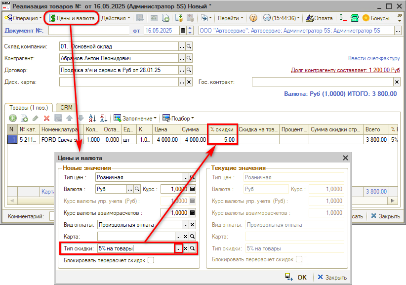

При выборе типа скидки устанавливаются отборы по виду начисления "На документ" и способу назначения "Ручная скидка".

Также см. видео в разделе "[Ручная установка скидки на строку в документе](#ручная-установка-скидки-на-строку-в-документе)" (с 0:45).

## Создание автоматической скидки

## Настройка и применение скидок контрагентам

[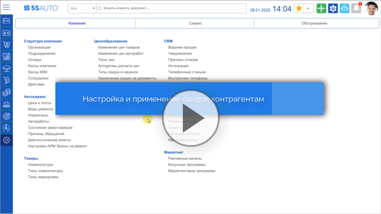](https://edu.5systems.ru/video/Skidki/Nastroyka_i_primenenie_skidok_kontragentam.mp4)

Для настройки скидок контрагентам предварительно должны быть созданы:

- *типы скидок* вида начисления "На документ" и способа назначения "Ручная скидка".
- документ *"Установка скидки на документ"*, который установит значения для созданных типов скидки. Чтобы создать / изменить документ "Установка скидки на документ" необходимо перейти в справочник "Назначение общих скидок":

Чтобы установить скидку контрагенту:

- Зайдите в карточку [контрагента](../../Работа%20с%20клиентами/Контрагенты%20и%20контакты/kontragenty-i-kontakty.md).
- Перейти в раздел "Счета и договоры" и откройте нужный договор;
- Установите типы скидок для товаров в поле "Тип скидки", для работ в поле "Тип скидки работ":

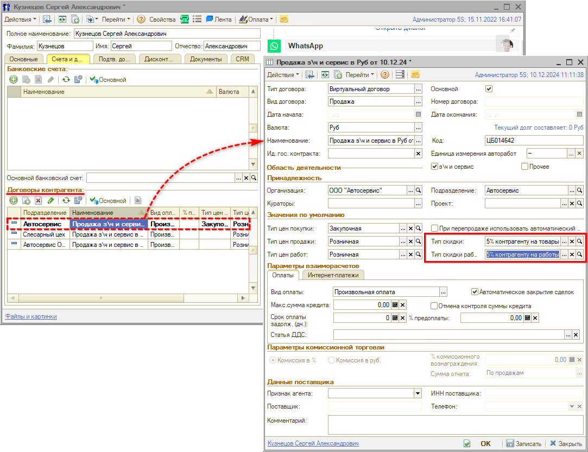

При выборе типа скидки устанавливаются отборы по виду скидки "На документ" и способу назначения "Ручная скидка".

Также см. вебинар Альфа-Авто: [*Подходы к ценообразованию и скидкам на запасные части.*](https://rutube.ru/video/faf6b55665c58db25409b5f99d8a43a0/?r=wd)

---

**Теги:** скидки, типы скидок и наценок, скидка на строку, скидка на документ, автоматическая скидка, ручная скидка, назначение общих скидок, назначение товарных скидок, скидки контрагентам, права на скидки

