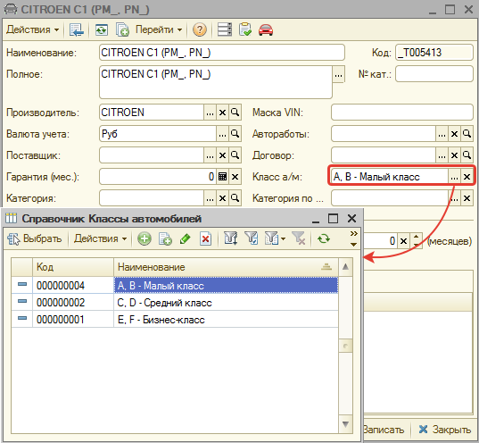
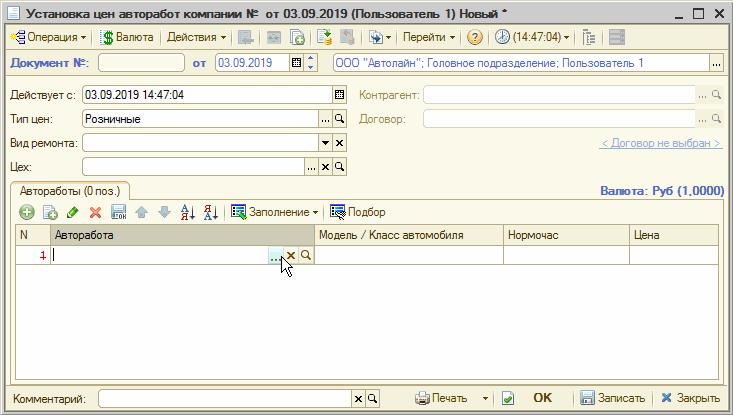
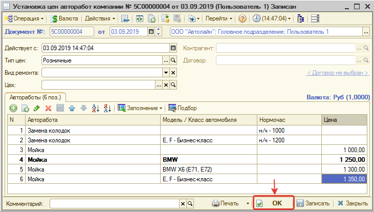

# Настройка ценообразования для работ

<table><tr><td><b>Время чтения:</b> 4 мин.</td><td><b>Обновлено:</b> 21.06.2022</td></tr></table>

Источник: https://www.5systems.ru/help/nastroyka-cenoobrazovaniya-dlya-rabot

## Содержание

1. [Пример настройки ценообразования работ с учетом класса автомобиля](#пример-настройки-ценообразования-работ-с-учетом-класса-автомобиля)
   - [Предварительная настройка справочников](#предварительная-настройка-справочников)
   - [Настройка ценообразования](#настройка-ценообразования)

В типовом решении Альфа-Авто для описания ценообразования работ используются следующие объекты (выдержка из методического пособия *Работа с типовой конфигурацией 1С-Рарус: Альфа-Авто. Редакция 5*):

- Справочник «Модели автомобилей»;
- Справочник «Нормочасы»;
- Документ «Изменение цен авторабот»;
- Регистр сведений «Цены авторабот»;

**Нормочас** – это время, которое определено производителем автомобиля или предприятием для выполнения какой-либо операции. В типовом решении справочник «Нормочасы» содержит информацию о стоимости одного часа работ, выполняемых при ремонте автомобиля. Как правило, стоимость нормочаса зависит от нескольких параметров:

- Модель автомобиля;
- Работа или группа работ (механические работы, кузовные работы и т. д.);
- Вид ремонта (гарантийный ремонт, техническое обслуживание, и т.д.);
- Контрагент и договор взаиморасчетов;
- Цех ремонта.

В рамках доработок в программе появилась возможность задания ценообразования работ с учетом класса автомобиля. Теперь можно на автомобили разного класса задавать разную стоимость работ.

Для задания цены на работы с учетом класса внесены изменения в типовое решение:

- Добавлен справочник "Классы автомобилей";
- Добавлен реквизит "Класс а/м" в справочник "Модели автомобилей";
- Добавлена возможность выбора установки цены на модель или класс автомобиля в документе "Изменение цен авторабот";

Для определения стоимости работы или стоимости нормочаса работы действует следующий приоритет:

- Установлена цена на конкретную модель автомобиля.
- Установлена цена на класс автомобиля.
- Установлена цена на группу моделей.
- Установлена цена на любой автомобиль (не заполнен параметр "Модель/класс").

## Пример настройки ценообразования работ с учетом класса автомобиля

### Предварительная настройка справочников

Для задания ценообразования авторабот с учетом класса необходимо определить классы автомобилей и распределить модели автомобилей по классам. Для этого предусмотрен новый реквизит "Класс а/м" в справочнике "Модели автомобилей", который является ссылкой на справочник "Классы автомобилей":

### Настройка ценообразования

Для задания цены на работы с учетом класса автомобиля создадим новый документ "Изменение цен авторабот" (*Администрирование → Компания → Ценообразование → Изменение цен авторабот* или в типовом меню: *Документы → Ценообразование → Изменение цен авторабот*).

В документе "Изменение цен авторабот" добавим автоработы:

После задания цен на автоработы запишем изменения и проведем документ, нажав кнопку "ОК":

Теперь стоимость работы "Замена колодок" будет определятся в зависимости класса автомобиля, для которого проценивается работа. Стоимость работы "Мойка" будет определятся в зависимости от класса и модели автомобиля: для автомобилей группы моделей BMW, автомобилей бизнес-класса, автомобилей модели BMW X6 установлены различные цены, а для всех остальных автомобилей установлена единая стандартная цена на работу.

---

**Теги:** ценообразование, автоработы, изменение цен авторабот, нормочас, классы автомобилей, модели автомобилей, класс а/м, стоимость работ

