

# Настройка ценообразования для товаров

<table><tr><td><b>Время чтения:</b> 21 мин.</td><td><b>Обновлено:</b> 13.05.2026</td></tr></table>

Источник: https://www.5systems.ru/help/nastroyka-cenoobrazovaniya-dlya-tovarov

## Содержание

1. [Введение](#введение)
2. [Задание способа ценообразования в номенклатуре](#задание-способа-ценообразования-в-номенклатуре)
3. [Настройка правил автоматического ценообразования](#настройка-правил-автоматического-ценообразования)
   - [Алгоритм настройки правил автоматического ценообразования](#алгоритм-настройки-правил-автоматического-ценообразования)
     - [Создание формул расчета цен](#создание-формул-расчета-цен)
     - [Создание формулы градиента цен по шаблону](#создание-формулы-градиента-цен-по-шаблону)
     - [Добавление алгоритма расчета цен](#добавление-алгоритма-расчета-цен)
4. [Установка цен продажи с помощью документа "Изменение цен" вручную](#установка-цен-продажи-с-помощью-документа-изменение-цен-вручную)
   - [Установка цен продажи на складские остатки](#установка-цен-продажи-на-складские-остатки)
5. [Автоматическая установка цен продажи при поступлении товара на склад](#автоматическая-установка-цен-продажи-при-поступлении-товара-на-склад)
   - [Настройка формирования документа "Изменение цен"](#настройка-формирования-документа-изменение-цен)
6. [Порядок приоритетов в логике расчета цены продажи товара](#порядок-приоритетов-в-логике-расчета-цены-продажи-товара)
   - [Этап 1. Приоритет поиска документа наценки](#этап-1-приоритет-поиска-документа-наценки)
   - [Этап 2. Приоритет поиска наценки в документе установки наценки](#этап-2-приоритет-поиска-наценки-в-документе-установки-наценки)
7. [Видео по теме](#видео-по-теме)

## Введение

Все цены в Системе формируются с помощью документа **"Изменение цен"**. Документы "Изменение цен" могут создаваться как вручную, так и автоматически, при поступлении товара на склад.

В документе "Изменение цен" можно:

- указать цены номенклатуры вручную;
- рассчитать цены с учетом процента наценки, установленного в документе;
- вычислить цены исходя из способа ценообразования, указанного в карточке номенклатуры;
- изменить способ ценообразования для любой строки документа (цена будет автоматически пересчитана по указанным правилам).

## Задание способа ценообразования в номенклатуре

В номенклатуре предусмотрены реквизиты: *способ ценообразования* и *процент наценки*, — которые могут использоваться в документе "Изменение цен" для гибкого расчета цен продажи.

**Чтобы установить способ ценообразования для номенклатуры необходимо:**

- Перейти в справочник ["Номенклатура"](../../Склад%20и%20запчасти/Номенклатура/nomenklatura.md) *(Автосервис → Приемка → Справочники → Номенклатура).*
- Выбрать группу номенклатуры или номенклатурную позицию и перейти в ее карточку, нажав кнопку "Изменить" в меню справочника или контекстном меню.
- В карточке номенклатуры выбрать соответствующее значение для поля "Способ ценообразования". Существуют следующие способы ценообразования:

  1. *Процент наценки из номенклатуры* — предопределяет, что для расчета цены продажи будет использоваться процент наценки, указанный в поле "% наценки".
  2. *Ручная установка цен* — предопределяет, что цена продажи редактируется пользователем вручную.
  3. *Алгоритм расчета цен* — предопределяет, что для расчета цен продажи будут использоваться преднастроенные правила автоматического ценообразования. Правила ценообразования можно настроить на определенные типы номенклатуры, производителей, прайс-листы, а также с их помощью можно установить разный процент наценки в зависимости от себестоимости товара (например, на дешевые товары делать наценку больше, а на дорогие меньше).

- Провести изменения, нажав кнопку "ОК".

***Если не указать способ ценообразования для номенклатуры, то считается, что выбран способ "Процент наценки из номенклатуры".***

***Важно:*** Процент наценки из номенклатуры в обработке "Поиск цен" не учитывается. То есть это работает только в документе "Установки цен".

Если планируется использовать способ ценообразования "Алгоритм расчета цен", то для начала необходимо *настроить правила автоматического ценообразования (см. [далее](#настройка-правил-автоматического-ценообразования))*.

## Настройка правил автоматического ценообразования

Настройка правил автоматического ценообразования заключается в установке наценок, которые нужно будет применять для входной цены или себестоимости товара. Эти наценки создаются с помощью документа "Изменение цен" с видом хозяйственной операции "Установка наценок для поставщика". Наценка в документе задается *процентом наценки / формулой расчета* с учетом способа округления. В некоторых случаях, вместо *процента наценки / формулы расчета* с учетом способа округления наценка может быть задана преднастроенным алгоритмом расчета цен.

### Алгоритм настройки правил автоматического ценообразования

**Шаг 1. "Базовая" настройка ценообразования без указания поставщика** — обязательный шаг.

- Перейдите в список документов "Изменение цен" *(Администрирование → Компания → Ценообразование → Изменение цен товаров).*
- Создайте новый документ нажатием на кнопку  "Добавить". По умолчанию должен быть установлен вид хозяйственной операции "Установка наценок для поставщика":

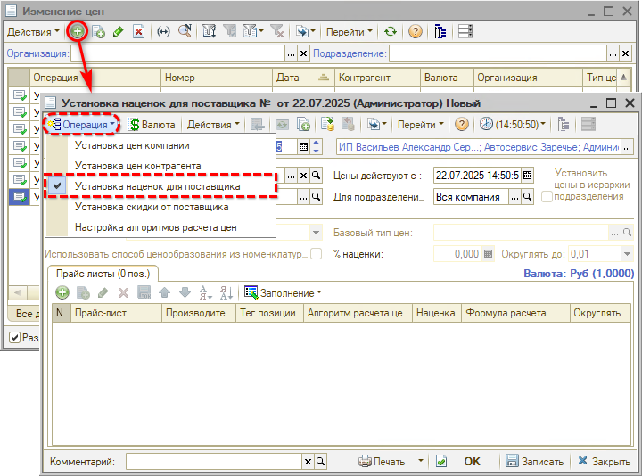

- Выберите ***тип цен*** в соответствующем поле.
- В поле ***Цены действуют с*** установите дату, с которой будут применяться новые цены.
- Выберите ***подразделение***, для которого будет применяться наценка.
- Далее установите ***наценку*** на уровне заданных выше параметров. Для этого:

  1. Нажмите кнопку "Добавить" командного меню табличной части "Прайс-листы".
  2. ***Обязательно настройте "базовую" наценку*** (без указания прайс-листа, производителя и типа номенклатуры).

     Как задать формулу расчета цены вместо процента наценки см. ниже [*Создание формул расчета цен*](#создание-формул-расчета-цен).

     Как задать преднастроенный алгоритм с формулой расчета см. [*Добавление алгоритма расчета цен*](#добавление-алгоритма-расчета-цен).

     "Базовая" наценка нужна для того, чтобы для любого случая были заданы правила.
  3. При необходимости, добавьте строки с уточнением производителя и/или тега позиции (типа номенклатуры) для уточнения наценки:

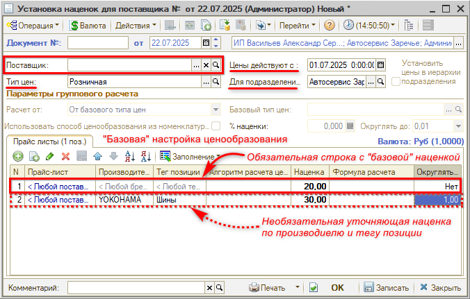

- После того, как все настройки будут заданы, нажмите на кнопку "ОК" для записи документа.

**Шаг 2. Настройка ценообразования по конкретному поставщику** — необязательный шаг.

- Перейдите в список документов "Изменение цен" *(Администрирование → Компания → Ценообразование → Изменение цен товаров).*
- Создайте новый документ нажатием на кнопку  "Добавить". По умолчанию должен быть установлен вид хозяйственной операции "Установка наценок для поставщика":

- Выберите ***поставщика*** в соответствующем поле.
- Выберите ***тип цен*** в соответствующем поле.
- В поле ***Цены действуют с*** установите дату, с которой будут применяться новые цены.
- Выберите ***подразделение***, для которого будет применяться наценка.
- Далее установите ***наценку*** на уровне заданных выше параметров. Для этого:

  1. Нажмите кнопку "Добавить" командного меню табличной части "Прайс-листы".
  2. ***Настройте наценку для поставщика:***

     Как задать формулу расчета цены вместо процента наценки см. далее [*Создание формул расчета цен*](#создание-формул-расчета-цен).

     Как задать преднастроенный алгоритм с формулой расчета см. [*Добавление алгоритма расчета цен*](#добавление-алгоритма-расчета-цен).

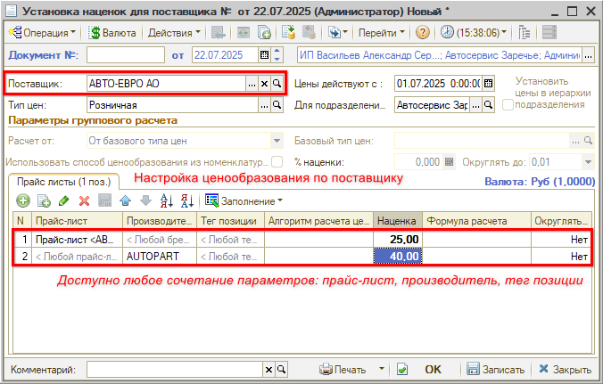

- После того, как все настройки будут заданы, нажмите на кнопку "ОК" документа.

***Обратите внимание!*** Проведение документа "Установка наценок" отменяет все ранее действовавшие наценки по поставщику, типу цен, подразделению.

Также см. видео в разделе ниже:

- [Применение алгоритма наценки для поставщика](#3-применение-алгоритма-наценки-для-поставщика);
- [Детализация применения алгоритма наценки](#4-детализация-применения-алгоритма-наценки).

#### Создание формул расчета цен

Для создания формулы расчета цены можно использовать преднастроенные шаблоны и вносить правки туда или создать свой градиент наценок с помощью "Мастера". Для начала рассмотрим использование шаблонов.

В Системе предусмотрено несколько шаблонов создания формулы:

- *Простая наценка* — простой пример задания формулы наценки, где можно изменить тип Цены (варианты представлены в описании формы редактирования выражения) и саму наценку.
- *Простая наценка + доставка* — аналогичен первому варианту, только к цене с наценкой можно добавить еще сумму доставки.
- *Градиент наценок* — пример задания формулы с учетом порога цены. Чтобы изменить выражение для данного шаблона необходимо учитывать алгоритм расчета наценки с учетом градиента (описание см. ниже [*Создание формулы градиента цен по шаблону*](#создание-формулы-градиента-цен-по-шаблону)).
- *Градиент наценок, но не дешевле, чем в базе* — аналогичен третьему варианту, только добавлена проверка на то, что цена в базе не должна быть ниже рассчитанной по формуле.

Чтобы использовать шаблон для задания формулы выполните следующие действия в окне "Форма редактирования выражения":

- Перейдите в меню "Заполнить по шаблону".
- Выберите соответствующий пример заполнения.
- Внесите правки в пример выражения и нажмите на кнопку "ОК".

Для автоматического задания градиентных наценок предусмотрен специальный мастер ввода, который позволяет простым образом задать пороги цен и применяемые наценки. Чтобы воспользоваться данным мастером выполните следующие действия в окне "Форма редактирования выражения":

- Перейдите в меню *"Заполнить по шаблону → Создать свой градиент наценок"*:

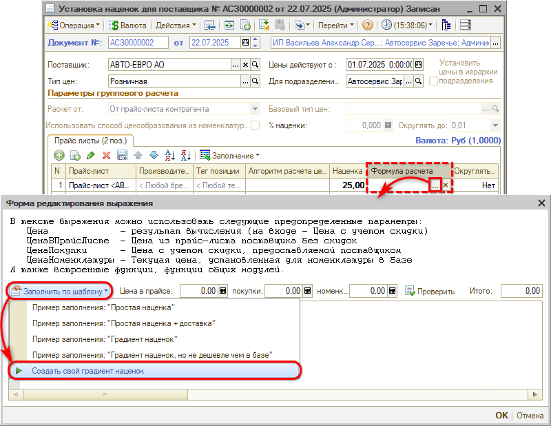

- Следуйте шагам мастера ввода:

  **1 шаг.** Введите порог цены, для которого будете задавать наценку, например, 500 и нажмите кнопку "ОК":

  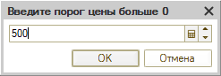

  **2 шаг.** Введите наценку для порога, заданного на предыдущем шаге (цены от 0 до 500), например, 50% и нажмите кнопку "ОК":

  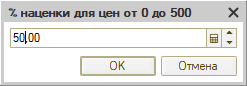

  **3 шаг.** Введите следующий порог цен, например, 5000 и нажмите кнопку "ОК".

  **4 шаг.** Введите наценку для порога, заданного на предыдущем шаге (цены от 500 до 5000), например, 30% и нажмите кнопку "ОК".

  Повторите шаги 3-4, если необходимо задать больше порогов цен.

  Для завершения ввода порогов после 4 шага нажмите "Отмена".

  **5 шаг.** Введите наценку на цену свыше последнего введенного порога, например, 20% и нажмите кнопку "ОК".

- В шаблон автоматически добавится конструкция, которая позволяет контролировать, что расчетная цена не должна стать меньше, чем сейчас установлена в базе. При необходимости нужно раскомментировать эти строки, удалив символы "//" в начале строки:

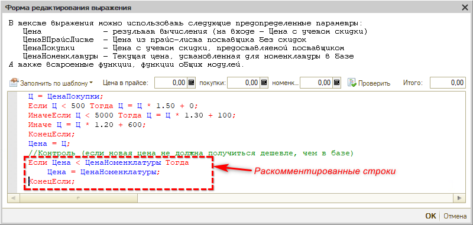

- Нажмите кнопку "ОК".

#### Создание формулы градиента цен по шаблону

Пример формулы по градиенту выглядит следующим образом:

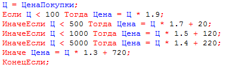

Формула по градиенту задается путем раскладывания цены закупки на слагаемые согласно порогам цен. После чего каждое слагаемое умножается на заданную для порога наценку и получается цена продажи:

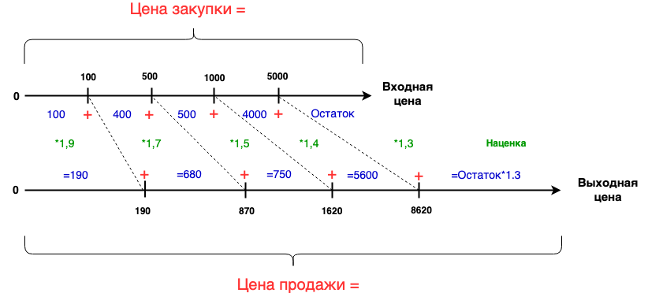

Также см. видео в разделе ниже: [Создание алгоритма наценки по формуле с градиентом](#2-создание-алгоритма-наценки-по-формуле-с-градиентом).

#### Добавление алгоритма расчета цен

Если есть несколько разных поставщиков, для которых необходимо настроить одинаковые правила ценообразования и в дальнейшем изменять их синхронно, то можно создать алгоритм расчета. Для этого:

- Перейдите в документ "Изменение цен".
- Нажмите кнопку "Добавить" в меню документа.
- Выберите хозяйственную операцию "Настройка алгоритма расчета цен".
- В открывшемся окне в поле "Цены действуют с" установите дату, с которой начнет действовать алгоритм расчета цен.
- Нажмите на кнопку "Добавить" табличной части "Алгоритмы":

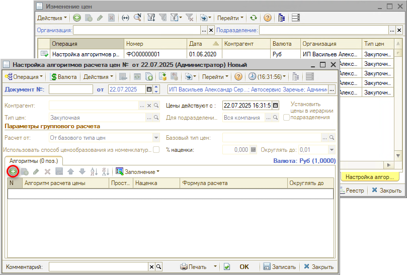

- В добавленной строке в колонке "Алгоритм расчета цен" перейдите к окну выбора алгоритма и нажмите в нем кнопку "Добавить":

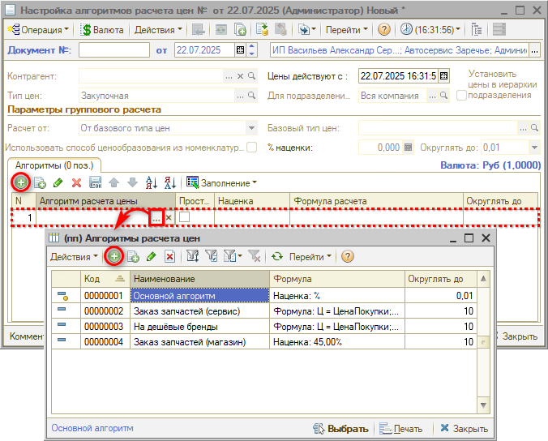

- Введите наименование алгоритма, комментарий при необходимости, и нажмите на кнопку "Выбрать":

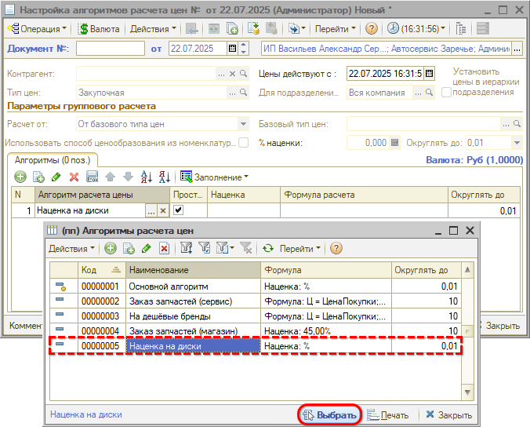

- Установите наценку или формулу расчета в соответствующих колонках. Флаг в колонке "Простая наценка" укажет, что будет использоваться: наценка или формула расчета.
- Нажмите на кнопку "ОК".

Также см. *видео* в разделе ниже: [Создание простого алгоритма наценки](#1-создание-простого-алгоритма-наценки).

Теперь можно применить этот алгоритм при настройке ценообразования по поставщику. Для этого:

- Откройте документ "Изменение цен".
- В подвале установите галочку "Разделять документы по виду операции".
- Перейдите к операции "Установка наценок для поставщика".
- Откройте ранее созданный документ и добавьте или измените строку с указанием алгоритма расчета цен:

  1. Перейдите к колонке "Алгоритм расчета цен";
  2. Перейдите к выбору значения;
  3. Выберите созданный ранее алгоритм и нажмите кнопку "Выбрать":

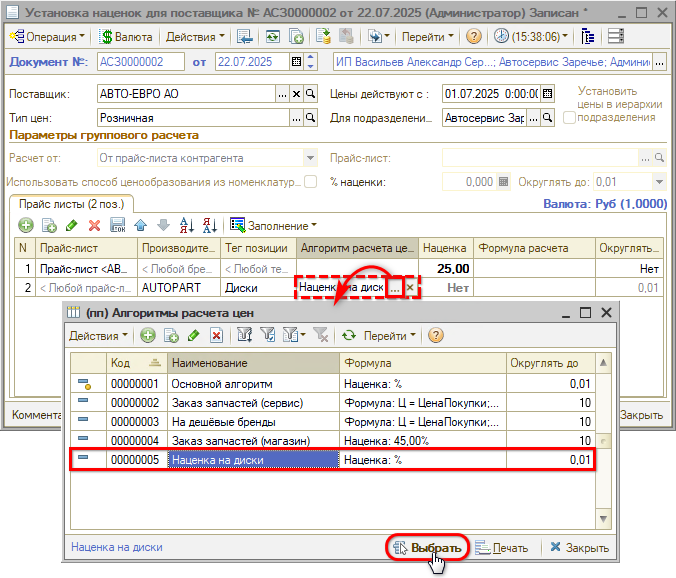

Также см. видео в разделе ниже: [Применение алгоритма наценки для поставщика](#3-применение-алгоритма-наценки-для-поставщика).

## Установка цен продажи с помощью документа "Изменение цен" вручную

Изменение цены фиксируется с помощью документа «Изменение цен». Установка цен производится для подразделения, позволяя устанавливать разные цены на одни и те же запчасти для разных подразделений. В случае, если для всех подразделений действует одна цена, выбирается корневое подразделение.

Расчет новой цены можно производить по следующим параметрам:

- От базового типа цен;
- От документа основания. В этом случае документ «Изменение цен» вводится на основании документа поступления товаров (ввода остатков, авансового отчета);
- От цен поставщика;
- *От себестоимости товаров на складе*;
- От прайс-листа контрагента;
- От цен другого подразделения.

Процент наценки может быть задан для всех товаров (реквизит «% наценки»):

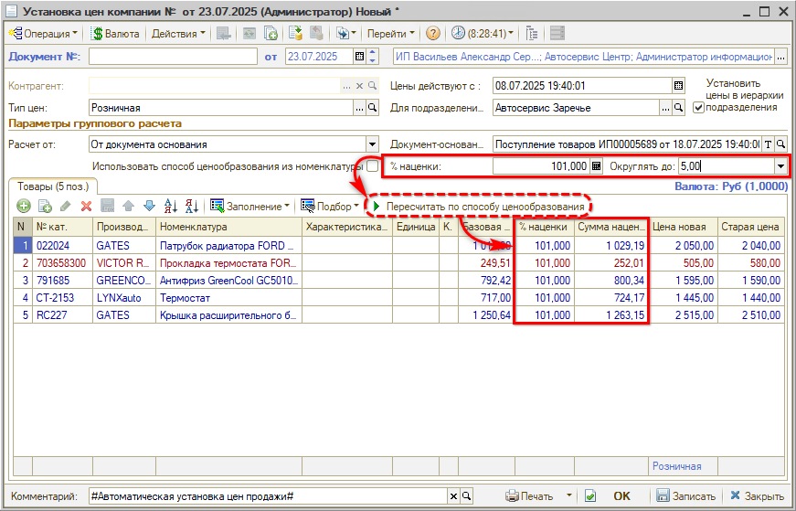

После установки новой цены с учетом процента наценки, цена может быть изменена вручную в табличной части документа.

Цветовой индикатор строк в документе сообщает о динамике изменения цены:

- *Синий* – новая цена на товар больше старой цены. Старая цена отображается в одноименной колонке документа;
- *Красный* – новая цена на товар меньше старой цены. Проведение документа в этом случае не будет заблокировано, изменение цены возможно как в большую, так и в меньшую сторону;
- *Черный* – новая цена равна старой.

Расчет цен можно также взять из настроек номенклатуры, установив галочку "Использовать способ ценообразования из номенклатуры". При этом в расчет подтянутся те способы ценообразования и проценты наценки, что заданы в соответствующих карточках номенклатуры:

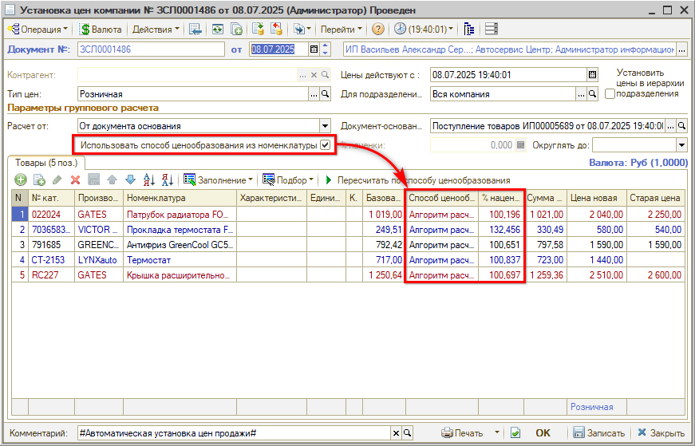

При желании можно изменить способ ценообразования или подкорректировать цену вручную. При изменении способа ценообразования вручную цена продажи пересчитывается автоматически.

### Установка цен продажи на складские остатки

Расчет новой цены *"От себестоимости товаров на складе"* используется для переоценки складских остатков.

В форме "Установка цен компании" требуется выбрать следующие параметры:

- *Расчет от:* "От себестоимости в регл. валюте"
- Выбрать *Склад*.

Должна стоять галочка *"Использовать способ ценообразования из номенклатуры"* – проверить.

Затем нужно произвести заполнение табличной части товарами, выбрав в выпадающем меню вариант *"Заполнить складскими остатками"*.

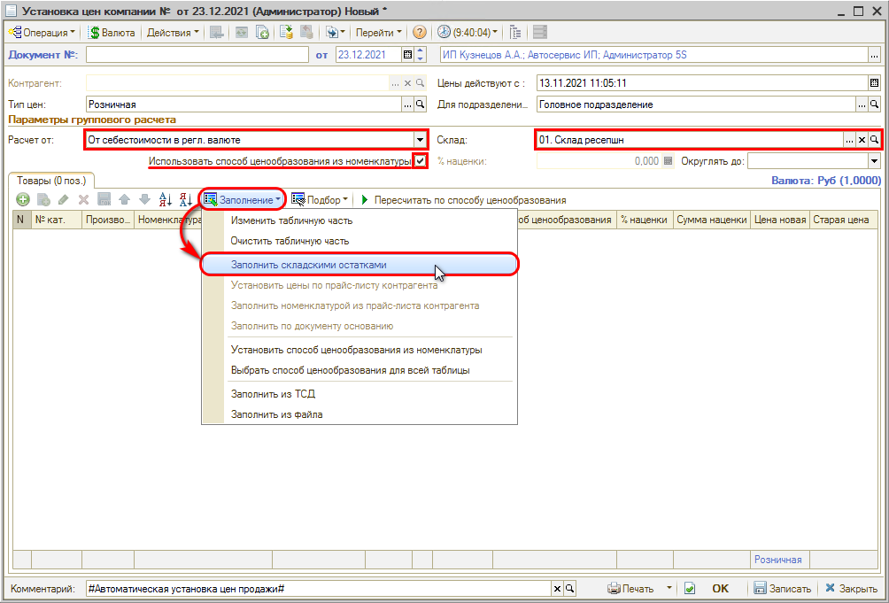

После заполнения требуется проверить способ ценообразования. По умолчанию должен стоять способ *"Алгоритм расчета цен"* (если на отдельные позиции не установлены другие способы ценообразования с более высоким приоритетом).

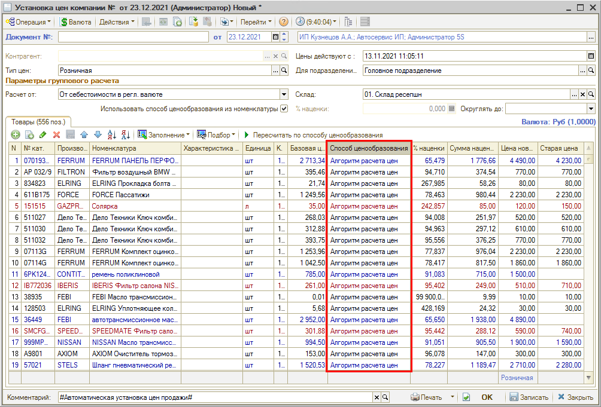

## Автоматическая установка цен продажи при поступлении товара на склад

В Системе предусмотрена возможность автоматического формирования цен на основе настроек номенклатуры, т.е. при поступлении товара на склад автоматически сформируется подчиненный документ "Изменение цен" с установленным параметром "Использовать способ ценообразования из номенклатуры".

Чтобы такая возможность появилась необходимо произвести следующие настройки:

- Перейти в справочник "Подразделения компании" (*Администрирование → Компания → Структура компании → Подразделения* или через типовое меню: *Справочники → Структура компании → Подразделения компании*).
- Открыть карточку подразделения.
- Перейти на вкладку "Цена продажи", где:

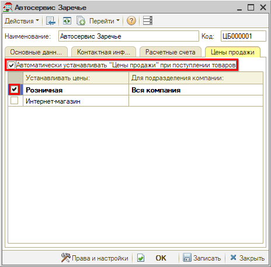

  1. Установить флажок *"Автоматически устанавливать Цены продажи при поступлении товаров"*.
  2. Установить параметры для формирования документа "Изменение цен", выбрав тип цены и подразделения.

*Если не указывать подразделение, то цены будут устанавливаться для текущего подразделения.*

После произведенной настройки в документах: *Авансовый отчет*, *Ввод остатков товаров*, *Поступление товаров* — флаг *"Автоматически установить цены продажи"* будет устанавливаться автоматически:

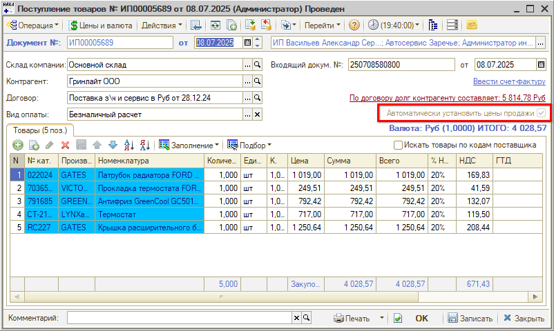

При проведении документа с опцией "Автоматически установить цены продажи" будет автоматически создан подчиненный документ "Изменение цен", который будет заполнен номенклатурой, полученной в свободный остаток на складе (не зарезервированной по заказам покупателей).

Также см. видео в разделе ниже: [Автоматическая установка цены продажи](#5-автоматическая-установка-цены-продажи).

### Настройка формирования документа "Изменение цен"

В случае, если необходимо, чтобы документ "Изменение цен" формировался всегда, независимо от того, был ли Заказ покупателя, – следует включить [настройку *"Изменять розничную цену при поступлении товаров под заказ покупателя"*](https://5systems.ru/help/ustanovka-prav-i-nastroek-polzovatelya).

Настройка определяет логику работу автоматической системы ценообразования в случае поступления товаров на склад, которые встали в резерв под заказ покупателя. Если установлена "истина", то будет всегда создаваться документ "Изменение цен". Если установлено "ложь" (рекомендовано), то нет:

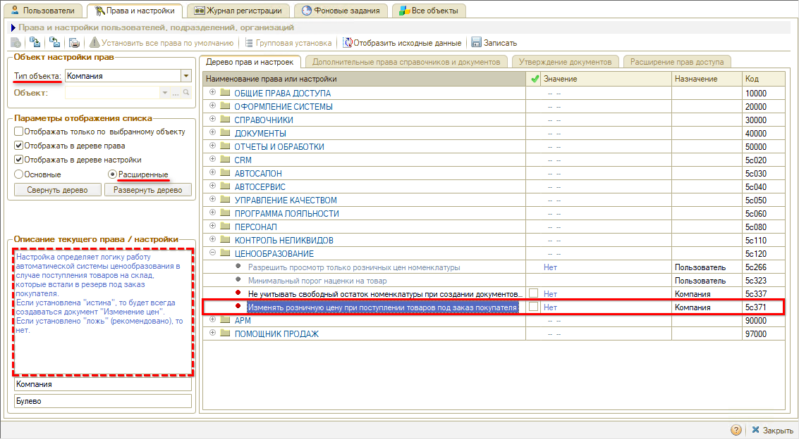

## Порядок приоритетов в логике расчета цены продажи товара

Расчет цены продажи товара можно разделить на 2 этапа.

### Этап 1. Приоритет поиска документа наценки

- **Подразделение.**

  Первым идет поиск подразделения, по которому будут производиться расчеты. Если нет документа установки наценки, привязанного к подразделению запроса, то ищем такое подразделение по иерархии вверх.

- **Поставщик**

  Является уточняющим фактором. После поиска подразделения идет поиск поставщика запроса в документах установки наценки. В случае отсутствия таких документов используется документ без указания поставщика.

*Например*, если есть основной документ наценки без указания поставщика и документ с поставщиком "Росско", то при проценке или поступлении товара от "Росско", наценка будет браться из документа установки наценки с поставщиком "Росско".

Если есть два документа установки наценки с "Росско", то будет действовать тот документ, у которого "Цены действуют с" позже.

Ценообразование в случае заказа покупателя можно уточнить в зависимости от Прайс-листа. Для этого в документе установки наценки необходимо указать поставщика и добавить строки с указанием конкретного прайс-листа этого поставщика.

В случае, когда детали закупаются на склад не под заказ клиента, при поступлении товаров будет использоваться только строки наценки без указанного прайс-листа в табличной части.

### Этап 2. Приоритет поиска наценки в документе установки наценки

Далее в наценках, установленных для подразделения и поставщика (если есть), ищем наценку, которую надо применить к позиции по следующему приоритету:

- *Производитель* (или признак оригинал) и *Тег позиции* (или Тип номенклатуры).

  Идет сравнение по производителю (или признак оригинал) и Тегу позиции (или Тип номенклатуры), т.е. строки в которых заполнен и Производитель и Тег.

- *Тег позиции* (или Тип номенклатуры)

  Если нет строки с Производителем и Тегом, то идет поиск строк с заполненным тегом или типом номенклатуры.

- *Производитель* (или признак оригинал)

  Если нет строк с тегом, то идет поиск строки с указанным производителем.

- *Базовая наценка*

  Если не была найдена наценка для конкретного случая, используется базовая наценка из документа установки наценки.

## Видео по теме

### 1. Создание простого алгоритма наценки

### 2. Создание алгоритма наценки по формуле с градиентом

[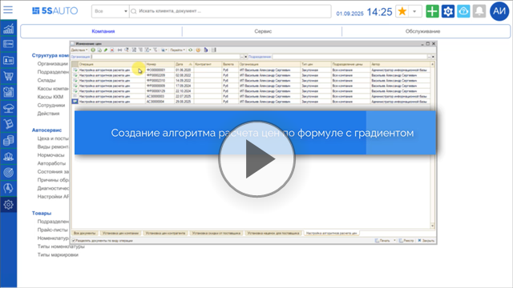](https://edu.5systems.ru/video/Algoritmy_nacenok/Algoritm_nacenki_po_formule.mp4)

### 3. Применение алгоритма наценки для поставщика

[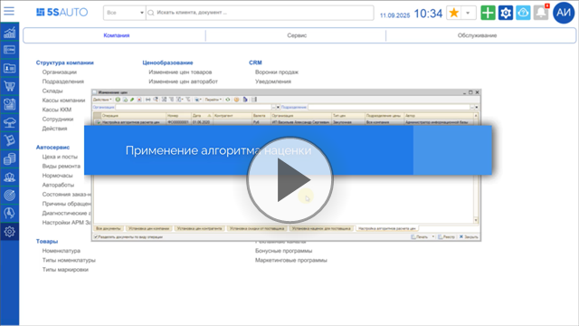](https://edu.5systems.ru/video/Algoritmy_nacenok/Primenenie_algoritma_nacenki_dlya_postavshchika.mp4)

### 4. Детализация применения алгоритма наценки

Применение алгоритма наценки по прайс-листу, производителю, типу номенклатуры

[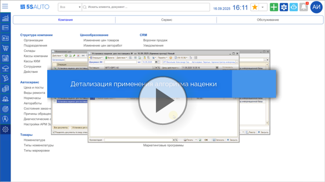](https://edu.5systems.ru/video/Algoritmy_nacenok/Detalizaciya_primeneniya_algoritma_nacenki.mp4)

### 5. Автоматическая установка цены продажи

[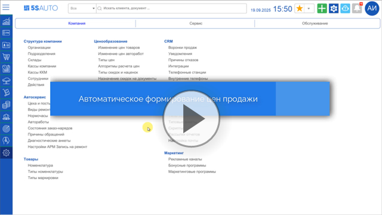](https://edu.5systems.ru/video/Algoritmy_nacenok/Autoustanovka_nacenok.mp4)

---

**Теги:** ценообразование, изменение цен, установка наценок для поставщика, алгоритм расчета цен, формула расчета цены, градиент наценок, способ ценообразования, процент наценки, цена продажи, переоценка складских остатков, приоритет наценки

