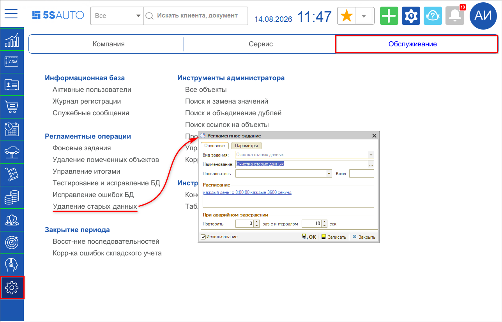
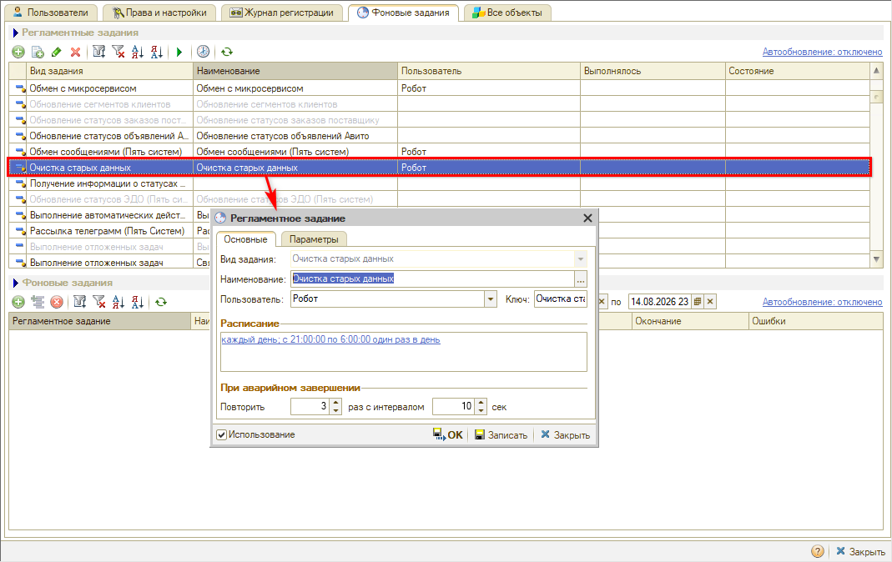
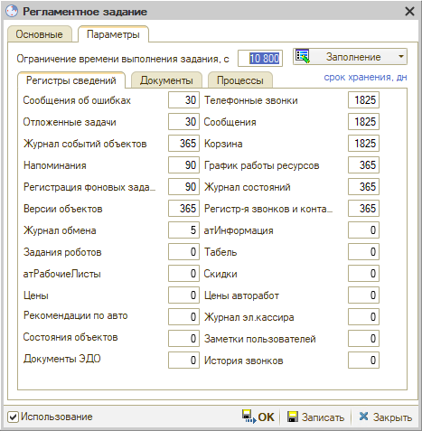
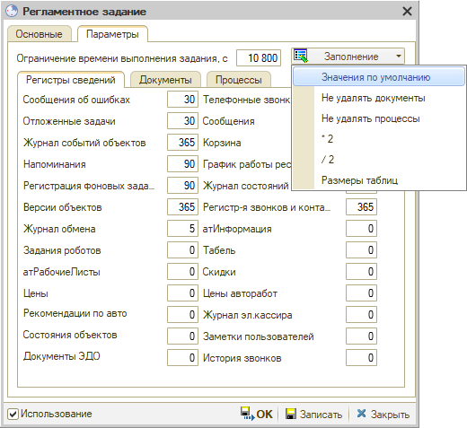
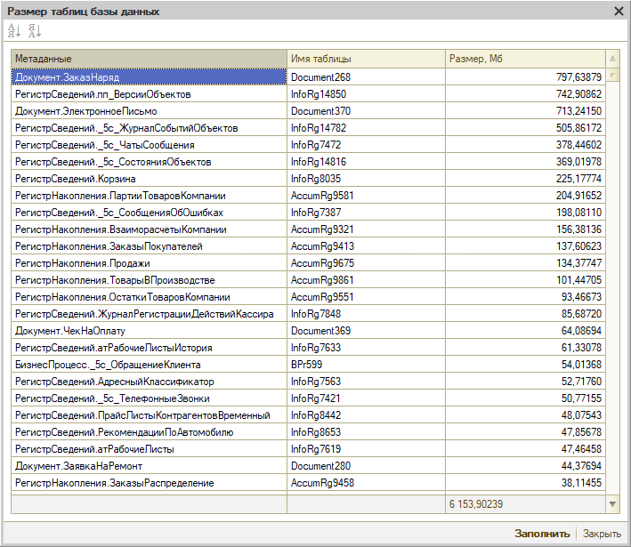
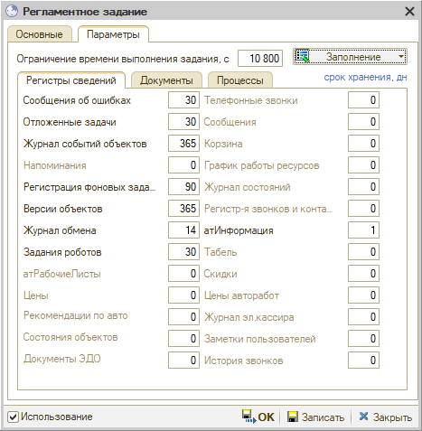
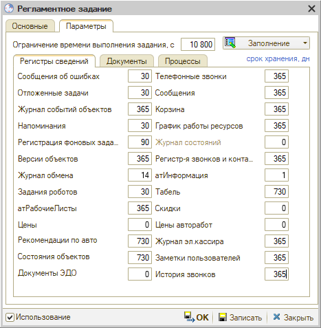
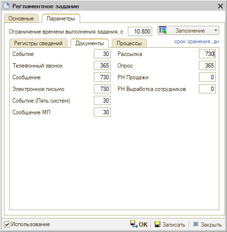
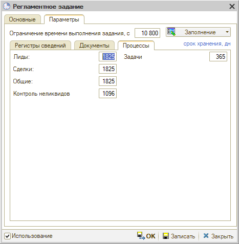
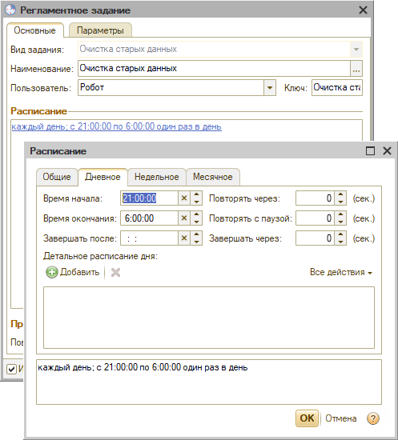

# Удаление старых данных программы

**Актуально начиная с версии релиза 2.8.4.23**

> **Статья для опытных пользователей!**

## Содержание

- [Введение](#введение)
- [Переход](#переход)
- [Параметры очистки](#параметры-очистки)
  - [Срок хранения данных](#срок-хранения-данных)
  - [Ограничение времени выполнения](#ограничение-времени-выполнения)
  - [Автозаполнение параметров](#автозаполнение-параметров)
  - [Оценка размера таблиц](#оценка-размера-таблиц)
- [Что и с какой осторожностью чистить](#что-и-с-какой-осторожностью-чистить)
  - [Регистры сведений](#регистры-сведений)
  - [Документы](#документы)
  - [Процессы](#процессы)
- [Настройка расписания](#настройка-расписания)
- [Порядок настройки](#порядок-настройки)

## Введение

Со временем в базе накапливаются неактуальные данные: они занимают место и замедляют работу программы. Чтобы очищать их автоматически, в программе предусмотрено регламентное задание **«Очистка старых данных»**.

Данное регламентное задание удаляет данные по сроку хранения: для каждого вида данных можно задать количество последних дней, за сколько их нужно оставить (например, за месяц, за год и т.д.).

> **Внимание.** Что чистить, вы решаете сами — и делать это нужно с осторожностью, понимая последствия. Некоторые регистры сведений можно чистить смело, а ряд регистров, документов и процессов лучше не трогать: удалять их стоит только при крайней необходимости освободить место.

## Переход

**1. Через меню.** 

Путь: *Администрирование → Обслуживание → Регламентные операции → Удаление старых данных*.

> *Комментарий: пока не выведен в меню.*

*Примечание:* если этого пункта нет на рабочем столе, его можно добавить вручную — см. статью «[Настройка рабочего стола](https://www.5systems.ru/help/nastroyka-rabochego-stola#nastrrazdelov)».

**2. Через фоновые задания.** 

Откройте регламентное задание **«Очистка старых данных»** в списке фоновых заданий.

По умолчанию окно открыто на вкладке **«Основные»** — здесь производится настройка расписания работы регламентного задания (см. [ниже](#настройка-расписания)). Чтобы выбрать данные для очистки и задать сроки хранения, перейдите на вкладку **«Параметры»**.

## Параметры очистки

Вкладка «Параметры» открывается с предзаполненными по умолчанию значениями:

Параметры разбиты на три вкладки — **«Регистры сведений»**, **«Документы»** и **«Процессы»**. Описание особенностей заполнения см. [ниже](#что-и-с-какой-осторожностью-чистить).

### Срок хранения данных

Напротив каждого параметра указан срок хранения в днях — за сколько последних дней данные останутся в базе. Например, 30 — оставить за месяц, 1825 — за 5 лет.

**Значение 0 означает, что эти данные не следует удалять вообще.**

### Ограничение времени выполнения

Параметр **«Ограничение времени выполнения задания»** на верхней панели задает в секундах, сколько будет работать процедура удаления. По умолчанию 10 800 сек. — 3 часа. Значение можно изменить.

### Автозаполнение параметров

Кнопка **«Заполнение»** заполняет параметры готовыми наборами значений. Есть рекомендуемые настройки, но значения можно задавать и на свое усмотрение.

| Вариант | Что делает |
|---|---|
| Значения по умолчанию | Заполняет все параметры значениями по умолчанию |
| Не удалять документы | Проставляет 0 всем параметрам на вкладке «Документы» |
| Не удалять процессы | Проставляет 0 всем параметрам на вкладке «Процессы» |
| \*2 | Умножает количество дней во всех параметрах на 2 |
| /2 | Делит значения во всех параметрах на 2 |
| Размеры таблиц | Открывает окно «Размер таблиц базы данных» — см. [ниже](#оценка-размера-таблиц) |

### Оценка размера таблиц

Прежде чем задавать сроки, полезно посмотреть, что именно занимает место. Выберите **«Заполнение» → «Размеры таблиц»** и нажмите **«Заполнить»**: программа выведет таблицы базы с размером в Мб, отсортированные от самых больших к самым маленьким.

По этому списку видно, какие регистры, документы и процессы стоит чистить в первую очередь, а какие можно не трогать.

*Примечание:* в данном примере больше всего места занимают заказ-наряды, но их мы не чистим — удаление заказ-нарядов не предусмотрено, их важно хранить в программе.

## Что и с какой осторожностью чистить

### Регистры сведений

Пример заполненных параметров (рекомендуемые значения):

**Журнал обмена** — как правило, самый большой регистр. Он содержит звонки, сообщения, микросервисы и т.д. Его требуется сохранять для себя в значении не менее 5 дней.

**Журнал событий объектов** — содержимое вкладки «[История](https://www.5systems.ru/help/rabota-so-sdelkoy#istoriya)» в Сделке.

**Версии объектов** — заполняется при использовании механизма [версионирования](https://www.5systems.ru/help/versionirovanie).

**Отложенные задачи** — обмен с [Calltouch](https://www.5systems.ru/help/nastroyka-integracii-s-calltouch) и [Контакт-Центром](https://www.5systems.ru/help/kontakt-centr-5s-chat).

**Напоминания** должны удаляться автоматически, но можно почистить.

Все остальные регистры занимают немного места.

Дополнительно можно установить следующие значения:

**атИнформация** — регистр с информацией об [аналогах](https://www.5systems.ru/help/poisk-cen#oblpoiska) из каталога Лаксимо. Можно оставлять 1 день.

**Цены** и **Скидки** — информация об установленных ценах и скидках. Эти регистры рекомендуется не трогать.

Удаление некоторых регистров (например, старых цен, скидок и т.д.) требуется делать с осторожностью и пониманием возможных последствий.

> *Комментарий: никто не проверял, лучше не удалять.*

### Документы

Рекомендуемые значения:

Больше всего места могут занимать **«Электронное письмо»** и **«Событие (Пять систем)»**.

**Событие** практически не используется — можно оставить за 1–3 месяца.

Если удалить **«РН Продажи»** и **«РН Выработка сотрудников»**, данные не будут отражаться в отчетах: лучше не удалять, но если занимают много места — можно почистить.

Остальное — на свое усмотрение и в зависимости от того, много ли занимают места.

### Процессы

Значения по умолчанию:

**Задачи** рекомендуется оставить за 365 дней.

**Сделки** и **Лиды** удалять не рекомендуется — по ним должна оставаться статистика.

Остальное (**Общие**, **Контроль неликвидов**) можно удалять.

При удалении сохраняется ссылочная целостность: если по сделке есть обновления в событиях, она не удалится.

## Настройка расписания

Запущенное задание потребляет ресурсы: в рабочее время программа продолжит работать, но будет тормозить. Поэтому расписание рекомендуется задавать на ночь — и так, чтобы оно не пересекалось с другими регламентными заданиями на сервере.

По умолчанию установлено время с 21:00 до 06:00, значения можно изменить:

Ограничение выполнения задачи в секундах задается в параметрах — см. [выше](#ограничение-времени-выполнения).

## Порядок настройки

1. [Откройте](#переход) регламентное задание «Очистка старых данных» — через меню или через список фоновых заданий.
2. На вкладке **«Параметры»** посмотрите [размеры таблиц](#оценка-размера-таблиц) и определите, что занимает больше всего места.
3. Задайте сроки хранения по нужным параметрам — вручную или кнопкой **«Заполнение»**. Значение 0 оставляет данные нетронутыми.
4. При необходимости измените **«Ограничение времени выполнения задания»**.
5. На вкладке **«Основные»** задайте [расписание](#настройка-расписания) — как правило, ночное время.
6. Установите признак **«Используется»** и сохраните настройки кнопкой **«ОК»** или **«Записать»**.

---

**Теги:** администрирование, обслуживание, удаление старых данных, очистка базы, регламентное задание, срок хранения, размер базы, размер таблиц, расписание, регистры сведений
