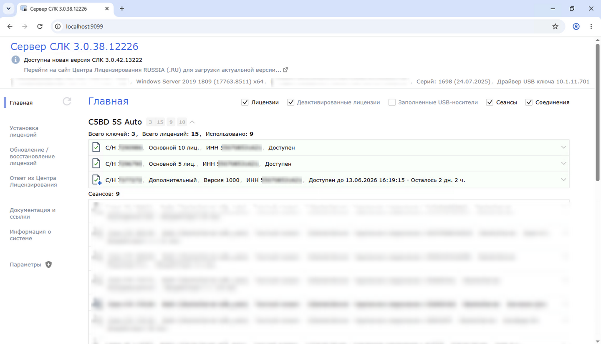
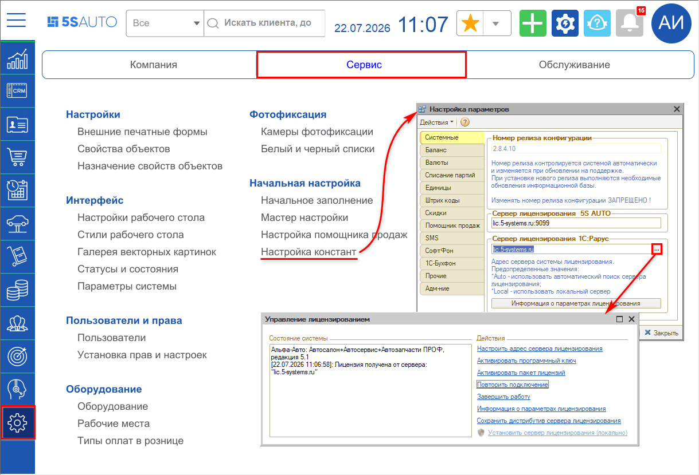
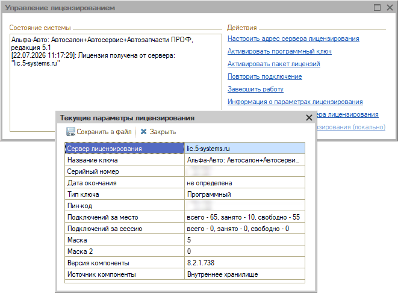

# Лицензирование 5S AUTO

**Источник:** https://www.5systems.ru/help/sistema-licenzirovaniya-5s-auto

## Оглавление

- [Введение](#введение)
- [Что такое лицензирование](#что-такое-лицензирование)
- [Используемые типы лицензий](#используемые-типы-лицензий)
  - [Лицензии 5S AUTO на базе 1С:СЛК](#1-лицензии-5s-auto-на-базе-1сслк)
  - [Лицензии 1С-Рарус](#2-лицензии-1с-рарус)
  - [Лицензии на платформу 1С:Предприятие](#3-лицензии-на-платформу-1спредприятие)
- [Количество доступных лицензий](#количество-доступных-лицензий)
  - [Как посмотреть лицензии 5S AUTO (СЛК)](#как-посмотреть-лицензии-5s-auto-слк)
  - [Как посмотреть лицензии 1С-Рарус](#как-посмотреть-лицензии-1с-рарус)
  - [Как посмотреть лицензии платформы 1С:Предприятие](#как-посмотреть-лицензии-платформы-1спредприятие)

## Введение

В статье описано, какие лицензии нужны для работы программы 5S AUTO и чем они отличаются друг от друга.

## Что такое лицензирование

Лицензирование — это механизм, который подтверждает право на использование программного продукта и ограничивает число одновременных пользователей (рабочих мест) в соответствии с приобретённой поставкой.

Для работы 5S AUTO недостаточно одной лицензии на саму программу. Поскольку решение построено на конфигурации «1С-Рарус: Альфа-Авто. Редакция 5» и работает на платформе «1С:Предприятие 8», нужны лицензии сразу нескольких уровней.

Без действующей лицензии соответствующего уровня программа может:

- не запускаться;
- работать с ограничениями;
- не допускать подключение новых пользователей.

## Используемые типы лицензий

Для коробочной версии 5S AUTO используются три типа лицензий:

1. Лицензии 5S AUTO на базе 1С:СЛК (система лицензирования конфигураций 1С).
2. Лицензии 1С-Рарус.
3. Лицензии на платформу 1С:Предприятие.

Каждый тип отвечает за свой слой системы. Ниже — кратко о каждом из них.

### 1. Лицензии 5S AUTO на базе 1С:СЛК

**1С:СЛК** (система лицензирования и защиты конфигураций) — программно-аппаратный комплекс фирмы «1С» для защиты отраслевых и специализированных решений на платформе «1С:Предприятие 8».

Лицензии 5S AUTO выдаются и контролируются через СЛК. Они определяют право на использование функциональности, разработанной компанией 5SYSTEMS поверх базовой конфигурации Альфа-Авто.

Особенности лицензий 5S AUTO:

- привязаны к продукту 5S AUTO (серия ключей СЛК уникальна для защищаемой конфигурации);
- ключи программные (активация по пин-коду);
- ограничивают число одновременно работающих пользователей в соответствии с купленной поставкой;
- проверяет наличие действующей подписки;
- для работы сервера СЛК обычно устанавливается отдельно и обслуживает лицензии на сервере или рабочей станции.

Лицензия на программу 5S AUTO приобретается единоразово. Дополнительные сервисы и онлайн-функции (интеграции, расшифровки VIN и др.) не требуют отдельных ключей, определяются действующими тарифами — актуальные условия смотрите в [каталоге услуг](https://www.5systems.ru/support-products) на сайте 5SYSTEMS.

### 2. Лицензии 1С-Рарус

5S AUTO построена на конфигурации **«1С-Рарус: Альфа-Авто. Редакция 5»**. Поэтому для работы нужны лицензии правообладателя базовой конфигурации — компании 1С-Рарус.

Лицензии 1С-Рарус:

- дают право использовать конфигурацию Альфа-Авто (автосалон, автосервис, автозапчасти и связанные подсистемы);
- приобретаются на нужное число пользователей (основная поставка и дополнительные клиентские лицензии);
- независимы от лицензий 5S AUTO: наличие ключа СЛК на 5S AUTO не заменяет лицензию Альфа-Авто, и наоборот.

Количество пользователей по лицензиям 1С-Рарус должно соответствовать (или быть не меньше) числу рабочих мест, на которых планируется работа в программе.

### 3. Лицензии на платформу 1С:Предприятие

Платформа **«1С:Предприятие 8»** — среда выполнения, в которой работают конфигурации Альфа-Авто и 5S AUTO. Без клиентских (и при необходимости серверных) лицензий платформы программа не сможет обслуживать пользователей.

Лицензии платформы:

- **клиентские** — на одно или несколько рабочих мест (одновременных сеансов);
- **серверные** — если используется клиент-серверный вариант работы (сервер «1С:Предприятие»).

Лицензии платформы приобретаются отдельно от лицензий конфигурации и лицензий 5S AUTO. Число клиентских лицензий 1С должно покрывать планируемое число одновременных пользователей.

## Количество доступных лицензий

Ниже — как посмотреть число доступных (и занятых) лицензий по каждому типу. Проверяйте все три уровня: свободные места на одном не компенсируют нехватку на другом.

### Как посмотреть лицензии 5S AUTO (СЛК)

Количество лицензий 5S AUTO смотрите в **консоли сервера СЛК** — это веб-интерфейс на компьютере, где установлен сервер лицензирования.

1. Откройте браузер на сервере СЛК (или на любом ПК с доступом к нему).
2. Перейдите по адресу `http://localhost:9099`  
   Если сервер СЛК установлен на другом компьютере, вместо `localhost` укажите его имя или IP-адрес, например: `http://192.168.1.10:9099`.
3. На главной странице консоли отобразится список установленных ключей.
4. По каждому ключу видно:
   - тип ключа;
   - **общее количество лицензий**;
   - занятые сеансы (кто сейчас использует лицензию).

В строке над списком выводится сводка: сколько всего ключей, сколько всего лицензий и сколько из них использовано.

При необходимости неактивные («зависшие») сеансы можно отключить прямо в консоли — это освободит лицензии для других пользователей.

> По умолчанию для входа в административные действия консоли используются учётные данные `admin` / `admin` (если пароль не меняли).

### Как посмотреть лицензии 1С-Рарус

Лицензии Альфа-Авто удобнее всего смотреть двумя способами.

**Из программы 5S AUTO / Альфа-Авто:**

1. Откройте меню **Администрирование → Сервис → Настройка констант**.
2. Откроется окно **«Настройка параметров»** — на вкладке **«Системные»** в поле **«Сервер лицензирования 1С:Рарус»** нажмите кнопку **«…»**.
3. Откроется окно **«Управление лицензированием»** — в нём отображается состояние программы и адрес сервера, от которого получена лицензия.

4. Нажмите ссылку **«Информация о параметрах лицензирования»** — откроется окно **«Текущие параметры лицензирования»**. В строке **«Подключений за место»** видно, сколько лицензий всего, сколько занято и сколько свободно.

**Через веб-отчёт сервера лицензирования 1С-Рарус** (если программа не запускается, но есть доступ к серверу лицензий):

1. Откройте в браузере адрес `http://localhost:15201`  
   Если сервер на другом ПК — укажите его IP, например: `http://192.168.1.10:15201`.
2. На вкладке со списком ключей отобразятся установленные лицензии и параметры ключа (включая сведения о количестве).

### Как посмотреть лицензии платформы 1С:Предприятие

**Из запущенной программы (файловый и клиент-серверный режим):**

1. Откройте **Справка → О программе**.
2. В нижней части окна указаны сведения о полученной лицензии платформы: регистрационный номер, тип (программная / аппаратная), файл лицензии или ключ, а также признаки клиентской и (при наличии) серверной лицензии.

Так можно быстро понять, какая именно лицензия выдана текущему сеансу.

**В клиент-серверном варианте — через консоль администрирования серверов 1С:**

1. Запустите **Администрирование серверов 1С:Предприятия**  
   (Пуск → 1С:Предприятие 8.3 → Администрирование серверов 1С:Предприятия).
2. Раскройте нужный кластер и рабочий сервер.
3. Откройте раздел **«Назначенные лицензии»** (или **«Лицензии»** — название зависит от версии консоли).
4. В таблице отобразятся:
   - **Количество** — сколько лицензий выдаёт ключ / файл;
   - **Используется** — сколько занято сейчас.

По разнице «Количество − Используется» видно, сколько свободных клиентских лицензий платформы осталось.

---

По вопросам подбора, активации и продления лицензий 5S AUTO обращайтесь в [техническую поддержку 5SYSTEMS](https://www.5systems.ru/help/kak-obratitsya-v-tekhnicheskuyu-podderzhku).
