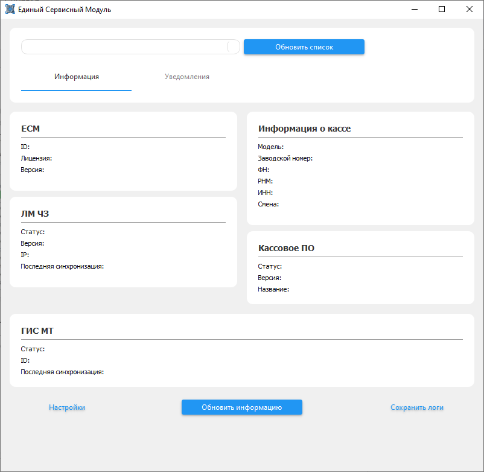
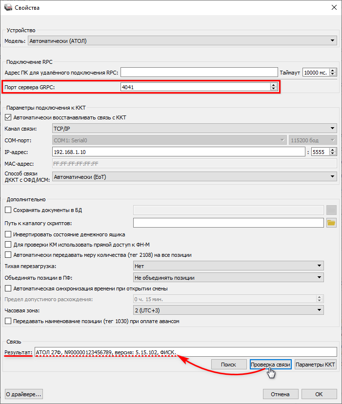
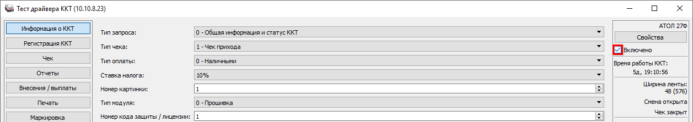
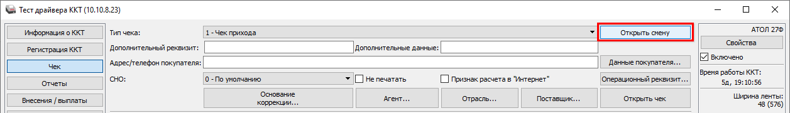
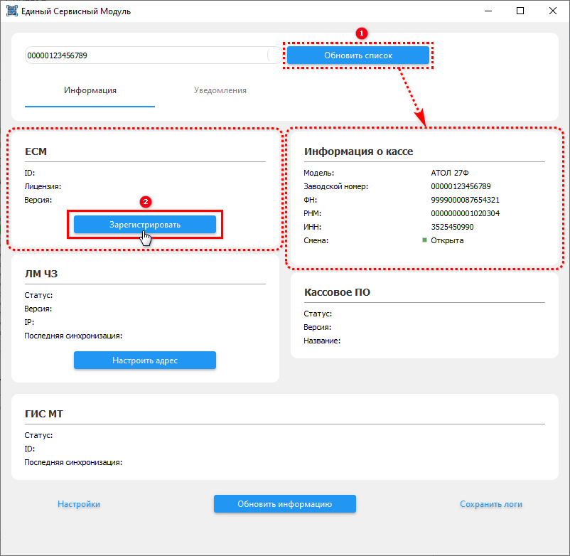
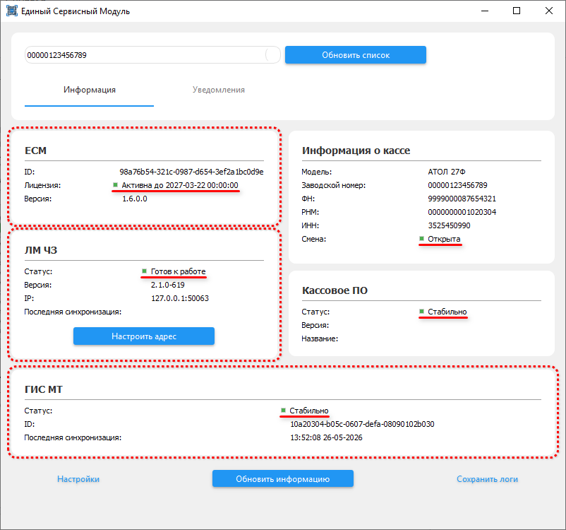
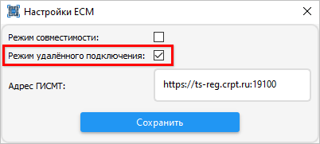
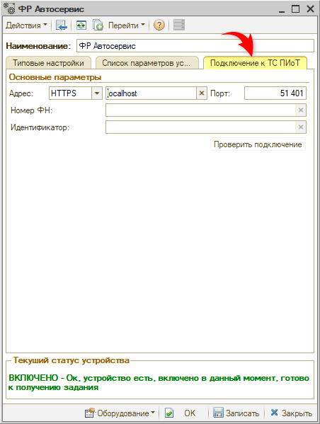
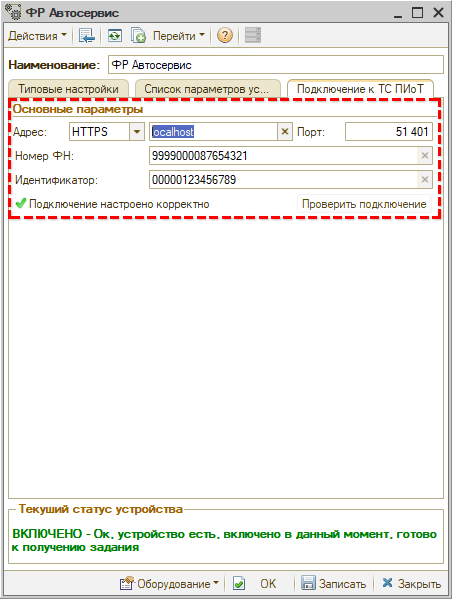

# Настройка интеграции с ТС ПИоТ

**Актуально начиная с релиза 2.8.3.58**  
**Источник:** https://www.5systems.ru/help/podklyuchenie-ts-piot

## Содержание

- [Введение](#введение)
- [Порядок настройки](#порядок-настройки)
- [Настройка взаимодействия драйвера ККТ с ЕСМ](#настройка-взаимодействия-драйвера-ккт-с-есм)
- [Настройка оборудования в программе](#настройка-оборудования-в-программе)

## Введение

ТС ПИоТ (Техническое средство получения информации о товаре) — это программно-аппаратное решение, работающее в связке с контрольно-кассовой техникой, предназначенное для проверки товаров, подлежащих обязательной маркировке, в ГИС МТ «Честный знак» перед пробитием чека.

Требование установки ТС ПИоТ формально действует с 28 декабря 2025 года (согласно ППР № 515 и 303), с 1 июля 2026 года требование стало обязательным — с этой даты продажа товаров, подпадающих под разрешительный режим маркировки, без ТС ПИоТ запрещена.

На момент публикации статьи предусмотрено 2 режима продажи товаров с маркировкой в розницу:

1. **Уведомительный режим** — это режим, при котором касса пробивает товар и отправляет запрос в систему, отображая результат в чеке (`[М+]` — успешно, `[М]` — проверка не была выполнена, `[М-]` — отрицательный результат). Касса разрешает продажу в любом случае, при обнаружении некорректных кодов или ошибок продажа не блокируется.
2. **Разрешительный режим** — в данном режиме кассовое программное обеспечение обращается к системе «Честный знак» по каждому коду маркировки перед пробитием чека. Если по данным из системы маркировки продажа товара разрешена, то пробивается чек, а если запрещена, то программное обеспечение уведомляет об этом продавца, и касса блокирует продажу.

Для автомобильной отрасли проверка кодов маркировки в разрешительном режиме обязательна при продаже шин с ноября 2024 г., с 1 октября 2026 г. станет обязательной при продаже моторных масел (автомобильных жидкостей и смазочных материалов).

> **Примечание.** Проверить сроки введения обязательной проверки в разрешительном режиме для товарных групп можно на сайте «Честного знака» (блок «Что необходимо маркировать» → перейти в нужную категорию товаров → вкладка «Разрешительный режим»), а также на официальном сайте сообщества «Честный знак» в разделе «Разрешительный режим на кассах».

ТС ПИоТ введен взамен предыдущей реализации разрешительного режима с использованием токена ККТ и решает следующие задачи:

1. Исключает передачу токена третьим лицам.
2. Обеспечивает криптозащиту передаваемой информации.
3. Упорядочивает обращения к серверам «Честного знака».
4. Выполняет проверку в офлайн-режиме через локальный модуль «Честного знака», когда онлайн-доступ к ГИС МТ временно недоступен.

Также рекомендуются для изучения другие статьи в разделе базы знаний «Маркированные товары»:

- Маркировка товаров;
- Операции с кодами маркировки;
- Настройка интеграции с Честным знаком и другие,

а также материалы на официальном сайте и в сообществе «Честного знака»:

- ТС ПИоТ: Что делать участнику оборота?;
- Разрешительный режим на кассах;
- Техническое Средство получения Информации о товаре (ТС ПИоТ);
- Самые популярные вопросы по разрешительному режиму.

## Порядок настройки

Настройка представляет собой установку связи между следующими ключевыми компонентами системы: учетной программой (5S AUTO), кассовым оборудованием, ТС ПИоТ (решение «ЕСМ») и ЛМ ЧЗ (Локальный модуль «Честного знака»). Взаимодействие этих элементов обеспечивает передачу кодов маркировки в систему ГИС МТ, проверку статусов товаров и формирование корректных кассовых чеков.

Настройка выполняется в следующем порядке:

1. [Установка Единого Сервисного Модуля (ЕСМ)](../%D0%A3%D1%81%D1%82%D0%B0%D0%BD%D0%BE%D0%B2%D0%BA%D0%B0%20%D0%95%D0%B4%D0%B8%D0%BD%D0%BE%D0%B3%D0%BE%20%D0%A1%D0%B5%D1%80%D0%B2%D0%B8%D1%81%D0%BD%D0%BE%D0%B3%D0%BE%20%D0%9C%D0%BE%D0%B4%D1%83%D0%BB%D1%8F%20%28%D0%95%D0%A1%D0%9C%29/ustanovka-edinogo-servisnogo-modulya-esm.md) — регистрация на площадке ЕСП, установка драйвера ККТ и самого модуля.
2. [Установка Локального модуля Честного знака](../%D0%A3%D1%81%D1%82%D0%B0%D0%BD%D0%BE%D0%B2%D0%BA%D0%B0%20%D0%9B%D0%BE%D0%BA%D0%B0%D0%BB%D1%8C%D0%BD%D0%BE%D0%B3%D0%BE%20%D0%BC%D0%BE%D0%B4%D1%83%D0%BB%D1%8F%20%D0%A7%D0%B5%D1%81%D1%82%D0%BD%D0%BE%D0%B3%D0%BE%20%D0%B7%D0%BD%D0%B0%D0%BA%D0%B0/ustanovka-lokalnogo-modulya-chestnogo-znaka.md) — модуль для офлайн-проверки кодов маркировки.
3. Настройка взаимодействия драйвера ККТ с ЕСМ — см. ниже.
4. Настройка оборудования в программе 5S AUTO — см. ниже.

## Настройка взаимодействия драйвера ККТ с ЕСМ

После установки ПО программа предложит запустить модуль ЕСМ. После запуска ЕСМ откроется окно «Единый сервисный модуль» на вкладке «Информация»:

Для настройки ЕСМ смена на ККТ должна быть открыта (если смена закрыта, ее необходимо открыть).

Необходимо открыть Тест драйвера ККТ, перейти на вкладку «Свойства», проверить, что в поле «Порт сервера GRPC» указано значение `4041`, указать нужные параметры подключения к ККТ. Далее установить подключение к кассе:

Затем необходимо закрыть окно «Свойства» и установить флаг «Включено» в правом верхнем углу Тест драйвера:

Далее следует перейти на вкладку «Чек» и нажать кнопку «Открыть смену». Для дальнейшей конфигурации ЕСМ должна быть установлена связь с ККТ, поэтому не следует снимать флаг «Включено» или закрывать «Тест драйвера»:

Далее необходимо перейти в интерфейс «ЕСМ» и нажать кнопку «Обновить список». В блоке «Информация о кассе» отобразятся данные выбранной ККТ: модель, заводской номер, номер ФН, РНМ, ИНН, смена.

Для дальнейшего подключения ЕСМ необходимо нажать кнопку «Зарегистрировать» в блоке «ЕСМ»:

При регистрации ТС ПИоТ запрашивается лицензия с серверов ЕСП и приходит id регистрации экземпляра с ГИС МТ, соответствующее поле «id» в блоке ГИС МТ заполняется символьной строкой.

Также после получения лицензии на устройство заполнятся поля в блоках «ЕСМ», «ЛМ ЧЗ» и «ГИС МТ». В каждом блоке должен отображаться статус с зеленым индикатором:

- в поле «Лицензия» блока «ЕСМ» — статус «Активна до [дата]»;
- в поле «Статус» блока «ЛМ ЧЗ» — статус «Готов к работе»;
- в поле «Статус» блока «ГИС МТ» — статус «Стабильно»;
- в поле «Смена» блока «Информация о кассе» — статус «Открыта»;
- в поле «Статус» блока «Кассовое ПО» — статус «Стабильно».

Проверить правильность адреса ГИС МТ, а также изменить настройки можно, нажав кнопку «Настройки» в левой нижней части окна приложения ЕСМ. В частности, если будут выполняться подключения ЕСМ с других компьютеров, например сервера, необходимо установить галочку «Режим удаленного подключения» и сохранить настройку:

## Настройка оборудования в программе

Настройка оборудования производится в карточке оборудования класса «Фискальный регистратор» на вкладке «Подключение к ТС ПИоТ»:

Требуется заполнить параметры:

**1. Адрес** — это имя компьютера, на котором установлен ЕСМ (по умолчанию `localhost`).

> **Внимание!** Подключение к ЕСМ выполняется по протоколу https (протокол http запрещен). Поэтому должно быть указано именно имя компьютера, доступное при обращении по протоколу https. Указание ip-адреса не допускается.

В случае если компьютер с установленным ЕСМ находится в удаленном филиале, к которому нет прямой видимости по локальной сети, то необходимо выполнить настройку маршрутизации трафика, а также DNS-записей (либо на роутере, либо в файле `C:\Windows\System32\drivers\etc\hosts`).

**2. Порт** — по умолчанию `51401`.

При нажатии кнопки «Проверить подключение» должен появиться индикатор — «зеленая галочка» и статус «Подключение настроено корректно». Также должны автоматически заполниться параметры:

- **Номер ФН** — номер фискального регистратора;
- **Идентификатор** — заводской номер кассы.

После этого следует протестировать настройку. Например: создать Чек на оплату, отсканировать в нем некорректный код маркировки и попробовать пробить чек. Если в результате проверки по «Честному знаку» выйдет ошибка, значит настройка произведена правильно.

Также результат проверки можно посмотреть в личном кабинете ЕСП.

После успешной проверки можно переходить к дальнейшей работе.

---

**Теги:** маркировка, ТС ПИоТ, ЕСМ, драйвер ККТ, настройка оборудования, интеграция
