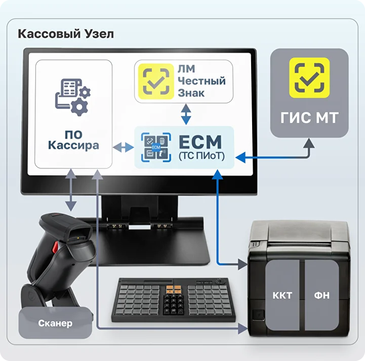
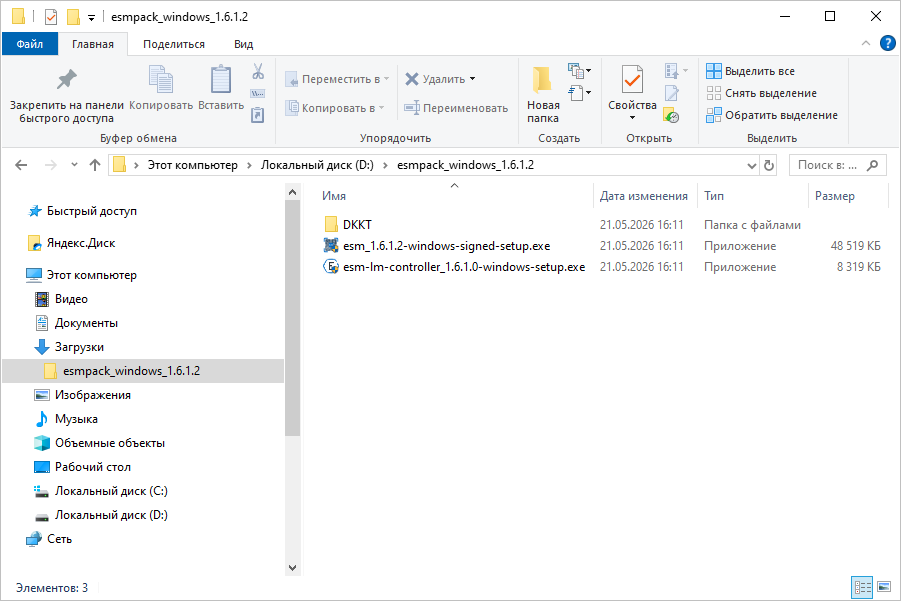
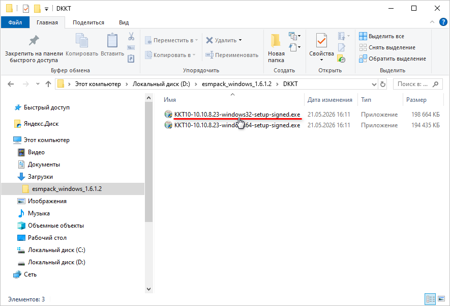
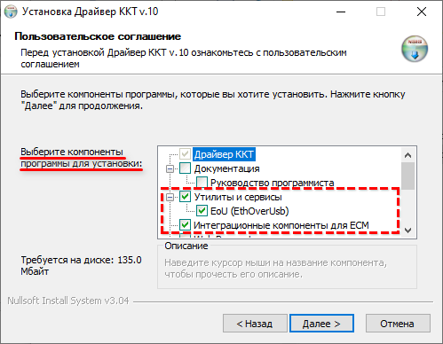
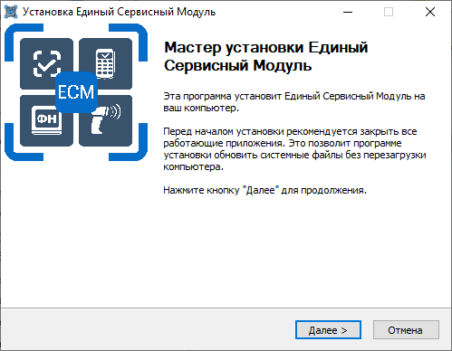
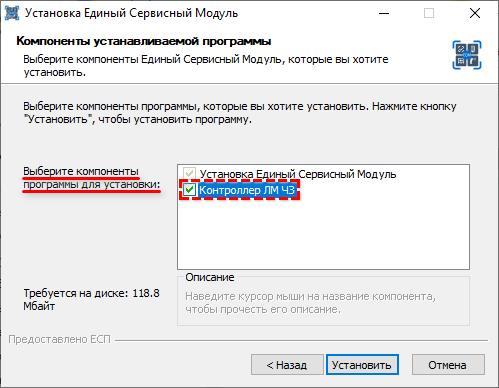
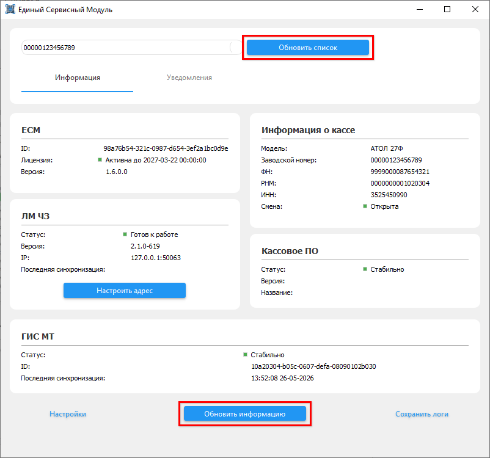

# Установка Единого Сервисного Модуля (ЕСМ)

**Актуально начиная с релиза 2.8.3.58**  
**Источник:** https://www.5systems.ru/help/podklyuchenie-ts-piot

## Содержание

- [Введение](#введение)
- [Шаг 1. Регистрация и оплата](#шаг-1-регистрация-и-оплата)
- [Шаг 2. Скачивание дистрибутива ЕСМ](#шаг-2-скачивание-дистрибутива-есм)
- [Шаг 3. Установка и обновление драйвера ККТ](#шаг-3-установка-и-обновление-драйвера-ккт)
- [Шаг 4. Установка ЕСМ](#шаг-4-установка-есм)
- [Шаг 5. Проверка подключения](#шаг-5-проверка-подключения)

## Введение

Основным поставщиком ТС ПИоТ является разработчик «Единая сервисная платформа», решение называется «Единый сервисный модуль» («ЕСМ»). Подробные инструкции о подключении ЕСМ см. на сайте АО «ЕСП»: База знаний АО «ЕСП».

Схема кассового узла с подключенным ЕСМ (источник изображения — сайт ЕСП):

Установка ЕСМ — первый шаг настройки ТС ПИоТ. Общий порядок настройки и назначение компонентов описаны в статье [«Настройка интеграции с ТС ПИоТ»](../%D0%9D%D0%B0%D1%81%D1%82%D1%80%D0%BE%D0%B9%D0%BA%D0%B0%20%D0%B8%D0%BD%D1%82%D0%B5%D0%B3%D1%80%D0%B0%D1%86%D0%B8%D0%B8%20%D1%81%20%D0%A2%D0%A1%20%D0%9F%D0%98%D0%BE%D0%A2/nastroyka-integracii-s-ts-piot.md).

## Шаг 1. Регистрация и оплата

Первым делом необходимо зарегистрироваться на площадке АО ЕСП — для этого следует перейти на сайт https://ao-esp.ru, нажать кнопку «Стать клиентом» и пройти регистрацию для своей организации.

Для регистрации потребуется номер телефона, на который придет код подтверждения, e-mail, который также потребуется подтвердить, ИНН организации, а также подпись согласия с помощью УКЭП директора.

Далее требуется выбрать и оплатить пакет обслуживания — по счету или СБП. После регистрации доступен тестовый период на 7 дней, который позволяет сразу скачивать и настраивать ПО.

## Шаг 2. Скачивание дистрибутива ЕСМ

Для скачивания дистрибутива требуется авторизоваться в Личном кабинете ЕСП, перейти в раздел «Скачать ПО», выбрать «Фискальный регистратор» — например, «Атол», «Кассовое ПО» — «Решение на базе 1С», ОС — «Windows» и нажать кнопку «Скачать».

Для установки ЕСМ следует сохранить на ПК и разархивировать скачанный файл:

В дистрибутиве находятся установочные файлы ЕСМ, а также драйверы для выбранной марки ККТ.

## Шаг 3. Установка и обновление драйвера ККТ

Необходимо установить специальный драйвер для кассы с поддержкой ТС ПИоТ на компьютер, к которому подключена касса. Если касса сетевая, то драйвер необходимо установить на любой из компьютеров в локальной сети.

Установщик драйвера находится в том же дистрибутиве, скачанном с сайта ЕСП. Для установки (или обновления) драйвера ККТ необходимо открыть папку «DKKT», выбрать драйвер для x86 (32 бита) и запустить инсталлятор:

На шаге выбора компонентов программы должны быть обязательно отмечены компоненты «Утилиты и сервисы» и «Интеграционные компоненты для ЕСМ»:

После завершения установки драйвера нажать кнопку «Готово».

## Шаг 4. Установка ЕСМ

Для установки ЕСМ следует запустить инсталлятор — файл вида `esm_<версия>-windows-signed-setup.exe`. В открывшемся окне «Мастера установки» нужно следовать его указаниям:

На этапе выбора компонентов программы для установки следует отметить «Контроллер ЛМ ЧЗ» — это нужно для настройки связи между модулями ЕСМ и ЛМ ЧЗ для поддержки офлайн-режима проверки кодов маркировки:

> **Примечание.** В случае если ЕСМ уже установлен, но не установлен контроллер ЛМ ЧЗ, и в любых других случаях, когда контроллер ЛМ ЧЗ необходимо установить отдельно, необходимо запустить файл вида `esm-lm-controller_<версия>-windows-setup.exe` из скачанного ранее дистрибутива.

Далее следует продолжить выполнять инструкции «Мастера установки». По завершении установки нажать кнопку «Готово» — если была установлена галочка «Запустить Единый Сервисный Модуль», то ЕСМ сразу запустится.

## Шаг 5. Проверка подключения

Для того чтобы проверить список подключаемых ККМ, необходимо нажать кнопку «Обновить список» или «Обновить информацию»:

При появлении каких-либо проблем или ошибок подключения к модулю система отобразит эту информацию в интерфейсе на вкладке «Уведомления». Также есть возможность выгрузить логи, нажав на кнопку «Сохранить логи».

После установки ЕСМ следует перейти к установке [Локального модуля Честного знака](../%D0%A3%D1%81%D1%82%D0%B0%D0%BD%D0%BE%D0%B2%D0%BA%D0%B0%20%D0%9B%D0%BE%D0%BA%D0%B0%D0%BB%D1%8C%D0%BD%D0%BE%D0%B3%D0%BE%20%D0%BC%D0%BE%D0%B4%D1%83%D0%BB%D1%8F%20%D0%A7%D0%B5%D1%81%D1%82%D0%BD%D0%BE%D0%B3%D0%BE%20%D0%B7%D0%BD%D0%B0%D0%BA%D0%B0/ustanovka-lokalnogo-modulya-chestnogo-znaka.md), а затем — к [настройке взаимодействия драйвера ККТ с ЕСМ](../%D0%9D%D0%B0%D1%81%D1%82%D1%80%D0%BE%D0%B9%D0%BA%D0%B0%20%D0%B8%D0%BD%D1%82%D0%B5%D0%B3%D1%80%D0%B0%D1%86%D0%B8%D0%B8%20%D1%81%20%D0%A2%D0%A1%20%D0%9F%D0%98%D0%BE%D0%A2/nastroyka-integracii-s-ts-piot.md#настройка-взаимодействия-драйвера-ккт-с-есм).
