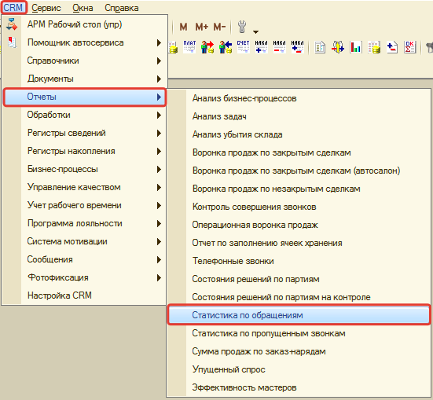
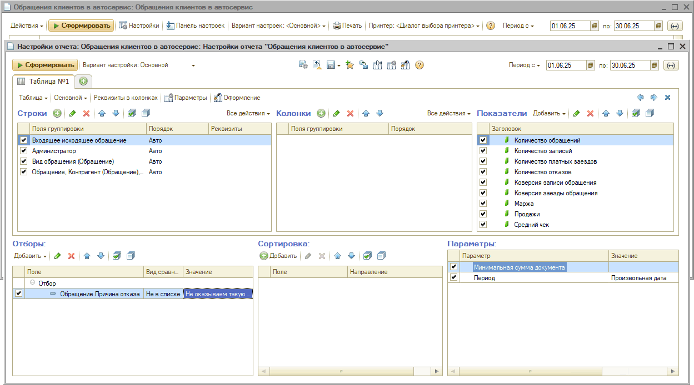
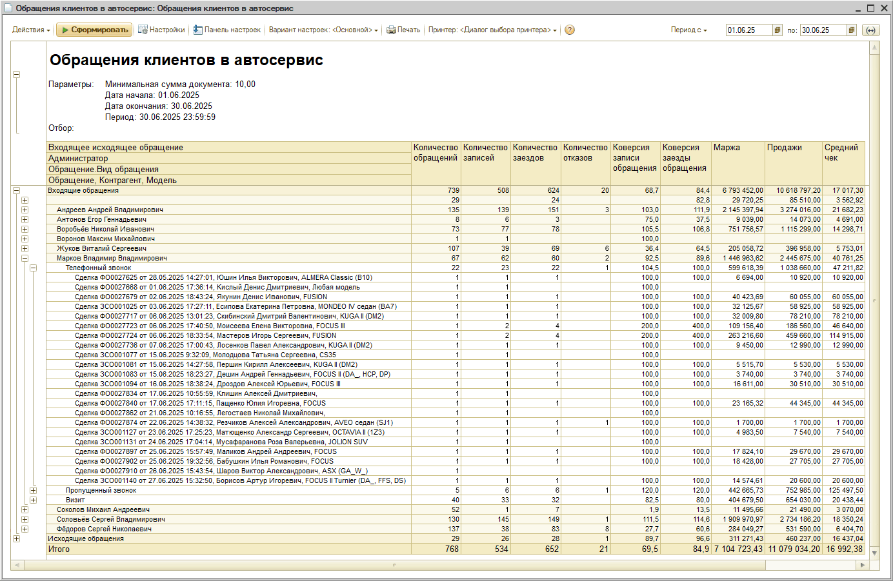
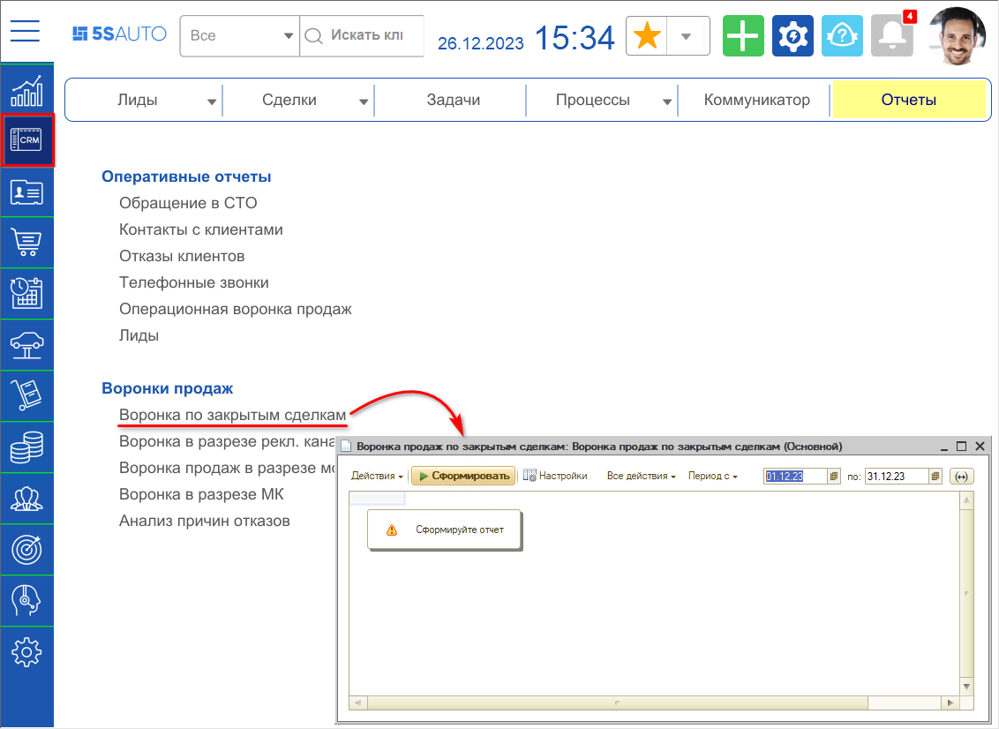
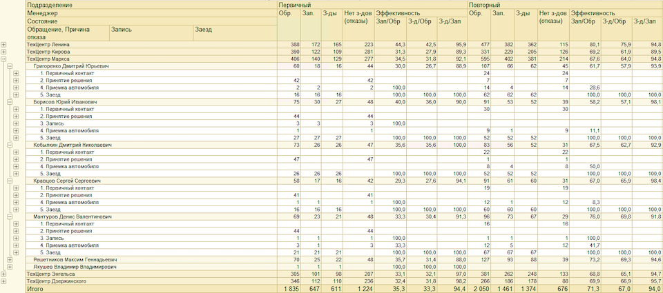
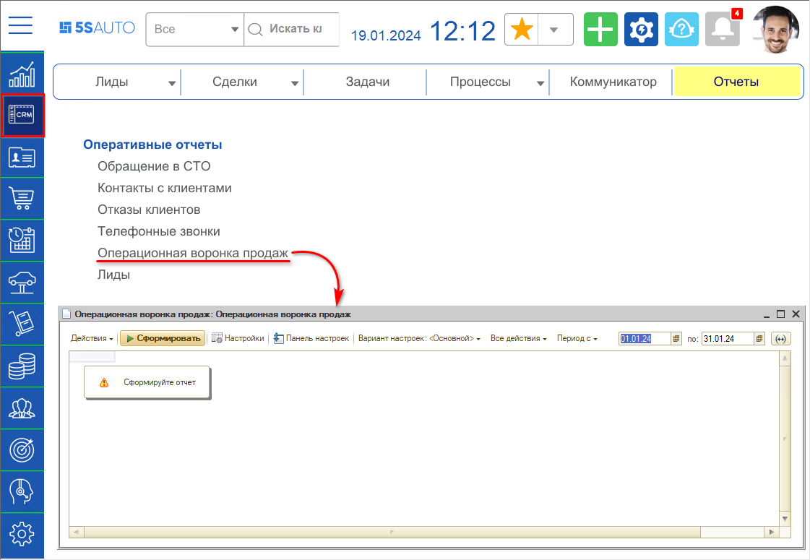
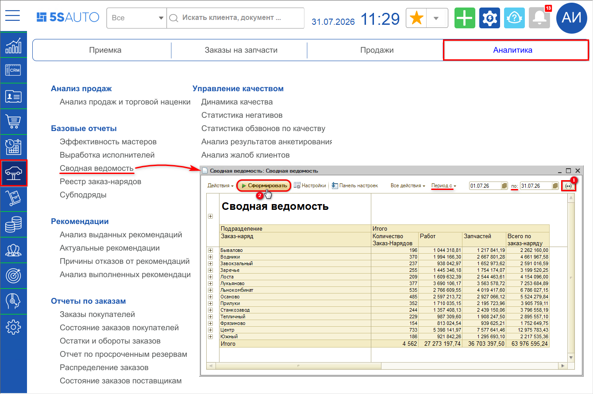

# Как посмотреть количество уникальных клиентов, обратившихся за период

Готового показателя «количество уникальных клиентов» в программе нет: отчёты считают обращения, записи и заезды. Один и тот же клиент за период может обратиться несколько раз, поэтому число обращений всегда больше числа клиентов.

Ближе всего к задаче отчёт «Статистика по обращениям», который делит клиентов на первичных, повторных и лояльных. Количество первичных за период — это и есть новые уникальные клиенты, обратившиеся впервые. Остальные отчёты дают более широкую картину по воронке продаж.

## Статистика по обращениям (анализ заездов)

Основной отчёт для этой задачи. Он разделяет клиентов на три категории:

- **Первичные** — за период приобрели запчасти или заехали первый раз,
- **Повторные** — заехали второй раз,
- **Лояльные** — заехали третий раз и более.

Перейти к отчёту: **CRM → Отчёты → Статистика по обращениям**.

По умолчанию отчёт группирует данные по категориям клиентов за квартал:

Период группировки можно изменить, например на месяц:

Обратите внимание: отчёт работает только по заказ-нарядам и реализациям товаров — данные формируются через регистр накопления «Обращения (Пять систем)», куда запись попадает после закрытия заказ-наряда или проведения документа «Реализация товаров». Обращения, не дошедшие до заезда, в этот отчёт не попадут.

## Обращения клиентов в автосервис

Самый простой отчёт по обращениям: показывает, сколько клиентов обратилось за период, сколько из них записалось и сколько реально заехало.

Отчёт не выведен на рабочий стол, открывать его нужно через верхнее меню: **Сервис → Все операции → Отчёты → Обращения клиентов в автосервис** (в типовом меню — **CRM → Все операции → Отчёты**).

Перед формированием задайте нужный период в настройках:

Отчёт покажет количество обращений, записей, заездов и отказов, а также конверсию на каждом этапе:

## Воронка продаж по закрытым сделкам

Считает клиентов по обращениям (лидам и сделкам) и показывает, на каком этапе клиент ушёл в отказ. В отчёт попадают только закрытые сделки — с результатом в виде успешной продажи или зафиксированного отказа.

Перейти к отчёту: **CRM → вкладка «Отчёты» → Воронки продаж**.

Итоговые значения группируются по признаку «Первичный/Повторный», поэтому по колонке «Обр.» видно количество первичных обращений за период:

## Операционная воронка продаж

В отличие от воронки по закрытым сделкам формируется по текущей деятельности — на основании документов записи и продажи за период. В отчёт попадают и закрытые, и открытые сделки, поэтому он подходит для контроля текущего количества обращений.

Перейти к отчёту: **CRM → Отчёты → Операционная воронка продаж**.

Отдельные колонки «Обращения (первичные)» и «Обращения (повторные)» позволяют оценить, сколько новых клиентов обратилось за период:

Учтите, что по одному обращению может быть несколько записей, а в отчёт попадают и «старые» обращения, документы по которым созданы в текущем периоде.

## Сводная ведомость

Универсальный отчёт с настраиваемым набором показателей. Перейти к нему можно через **Аналитика → Базовые отчёты → Сводная ведомость**. Задайте период в полях «Период с» и «по» и нажмите «Сформировать» — в колонке «Количество Заказ-Нарядов» будет видно число заездов за период по каждому подразделению и итогом по компании:

Отчёт удобен, когда нужно свести данные по клиентам вместе с другими показателями работы сервиса в одну таблицу.
