# Как зайти в программу

<table><tr><td><b>Время чтения:</b> 4 мин.</td><td><b>Обновлено:</b> 12.03.2024</td></tr></table>

Источник: https://www.5systems.ru/help/kak-zayti-v-programmu

## Содержание

- [1. Как запустить программу](#1-как-запустить-программу)
  - [1) Подключение к удаленному приложению (RemoteApp)](#1-подключение-к-удаленному-приложению-remoteapp)
  - [2) Подключение к удаленному рабочему столу (по RDP)](#2-подключение-к-удаленному-рабочему-столу-по-rdp)
- [2. Как завершить работу программы](#2-как-завершить-работу-программы)

## 1. Как запустить программу

Существует два способа входа в программу.

### 1) Подключение к удаленному приложению (RemoteApp)

1. Скачать на свой рабочий стол ярлык приложения RemoteApp, присланный сотрудником 5SYSTEMS и запустить приложение двойным кликом:  
   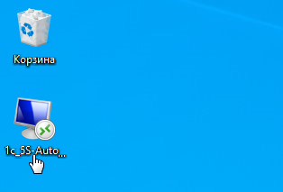
2. Ввести логин и пароль, предоставленные сотрудником 5SYSTEMS, установить галочку “Запомнить меня” при необходимости и нажать “ОК”:  
   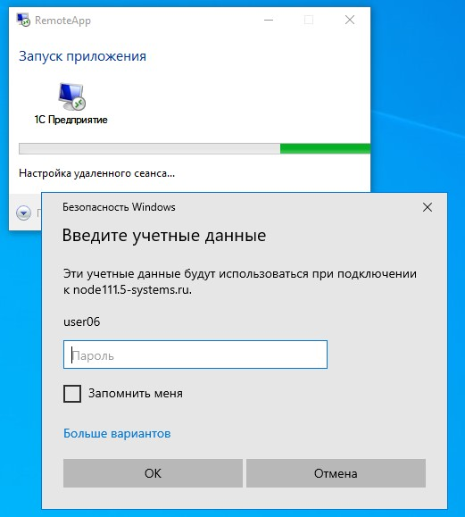
3. После этого откроется окно запуска 1С, где необходимо выбрать пользователя и ввести пароль, которые были заполнены в анкете внедрения, и нажать “ОК”:  
   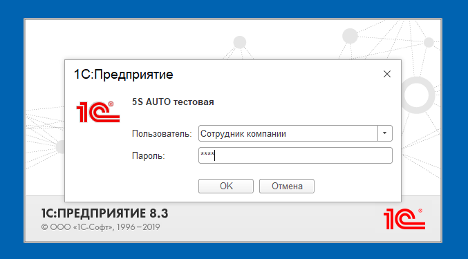

### 2) Подключение к удаленному рабочему столу (по RDP)

1. Открыть приложение “Подключение к удаленному рабочему столу” – его можно найти через поле поиска на нижней панели:  
   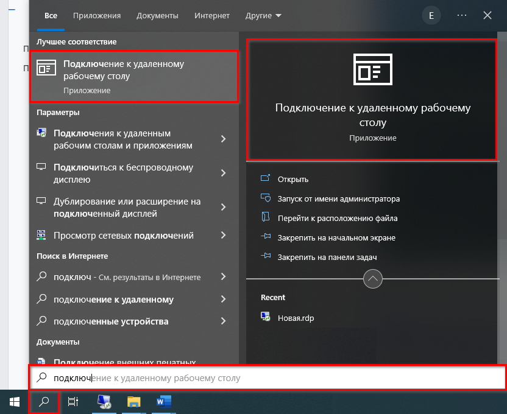
2. В открывшемся окне нажать кнопку “Показать параметры”:  
   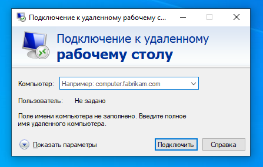
3. Ввести параметры доступа, выданные сотрудником 5SYSTEMS – адрес сервера (поле “Компьютер”) и имя пользователя:  
   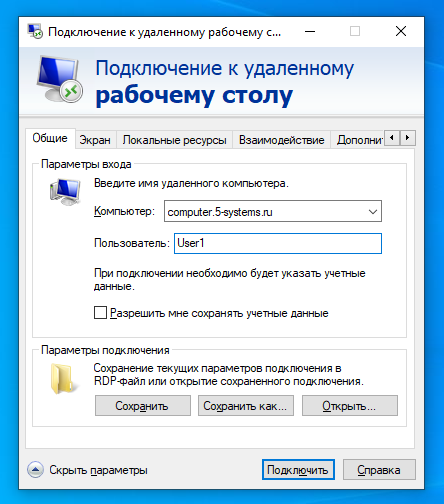  
   Если требуется сохранять данные для входа (включая пароль), следует поставить галочку “Разрешить мне сохранять учетные данные”. На общедоступном устройстве учетные данные лучше не сохранять: тогда пароль нужно будет вводить каждый раз. 
   Чтобы сохранить ярлык RDP на рабочем столе, следует нажать кнопку “Сохранить как…” в поле “Параметры подключения”, выбрать место, задать имя файла и сохранить.
4. Нажать кнопку “Подключить”, в открывшемся окне ввести пароль и нажать “ОК”:  
   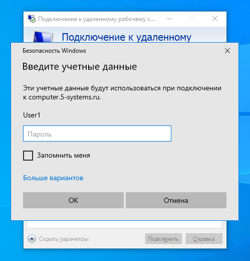
5. На открывшемся удаленном рабочем столе дважды кликнуть ярлык “1С Предприятие”:  
   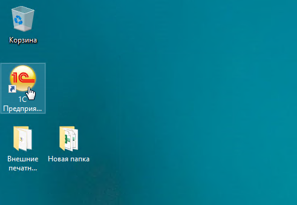
6. В открывшемся окне запуска 1С выбрать нужную базу и нажать кнопку “1С:Предприятие”:  
   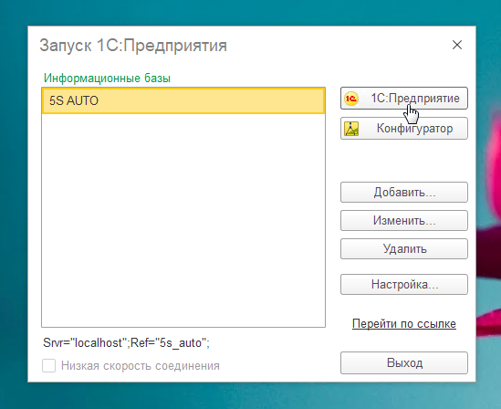
7. Ввести параметры входа, заданные в анкете внедрения – выбрать по кнопке-стрелке своего пользователя из выпадающего списка, ввести пароль и нажать “ОК”:  
   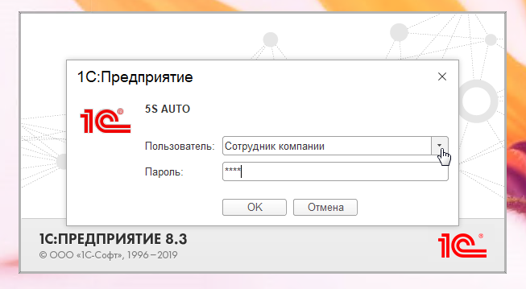

## 2. Как завершить работу программы

Для выхода из программы следует нажать на аватар пользователя на верхней панели интерфейса и на открывшейся панели управления выбрать пункт “Завершение работы”:

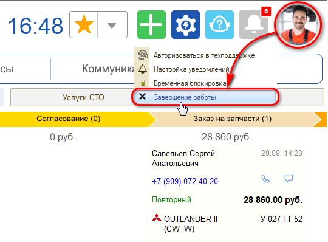

---

**Теги:** интерфейс программы, запуск программы, удаленное приложение, удаленный рабочий стол, завершение работы
