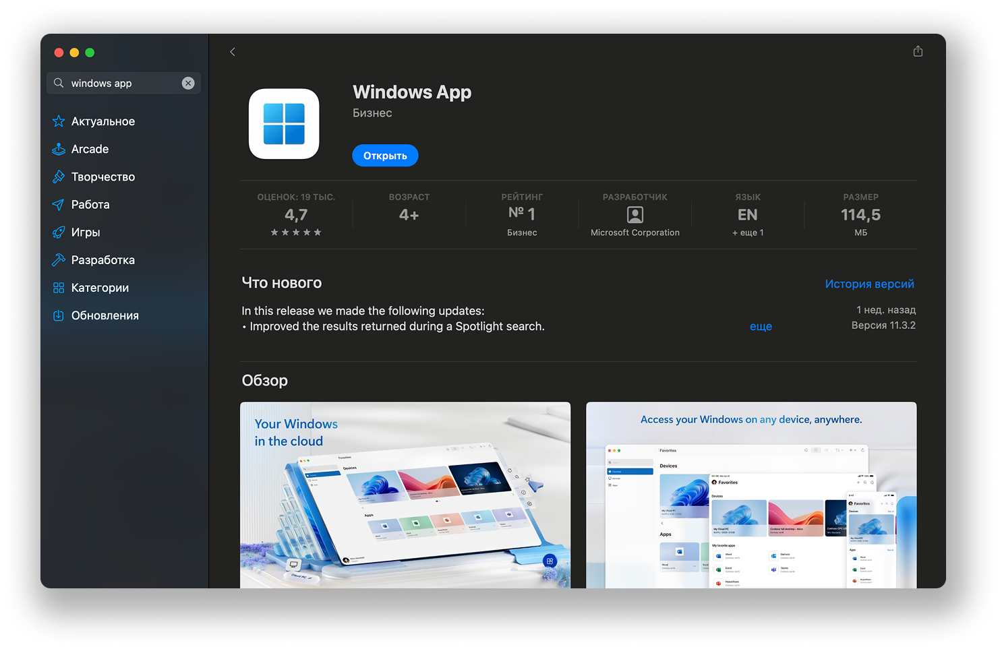
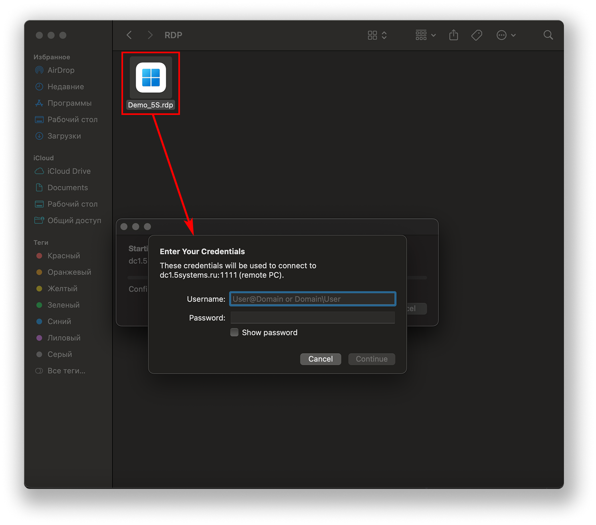
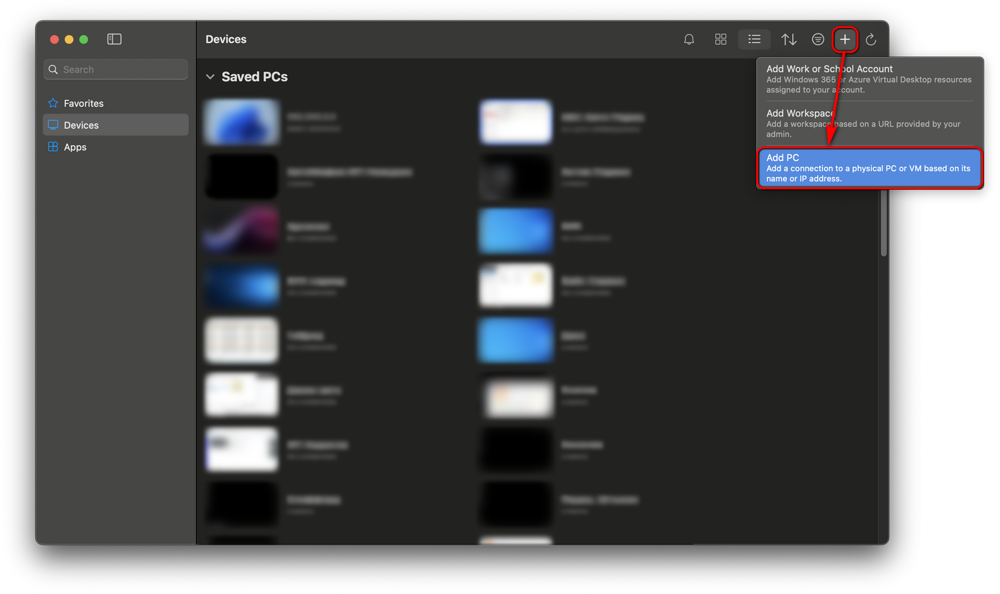
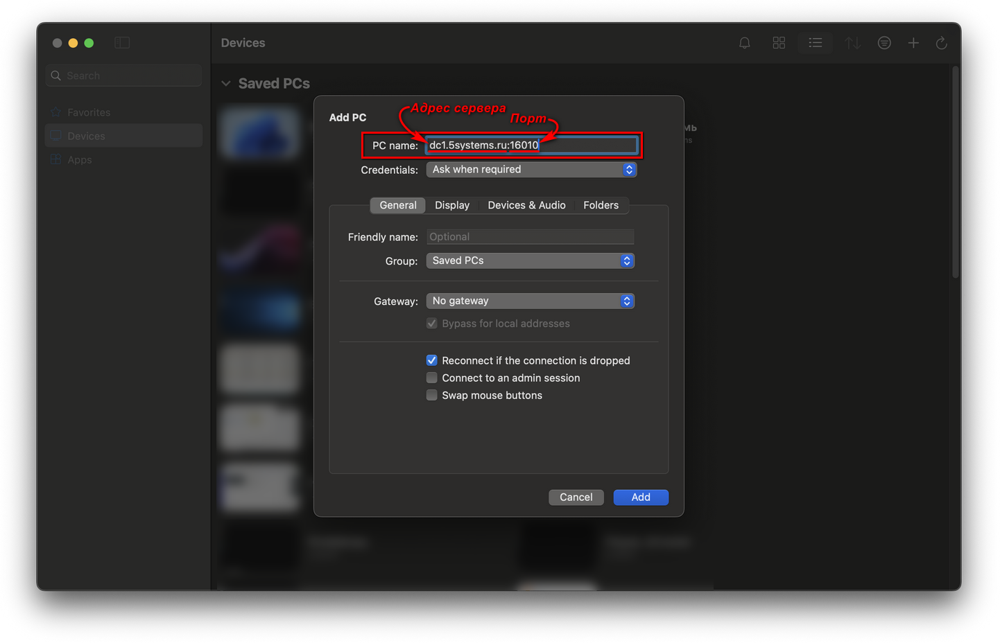
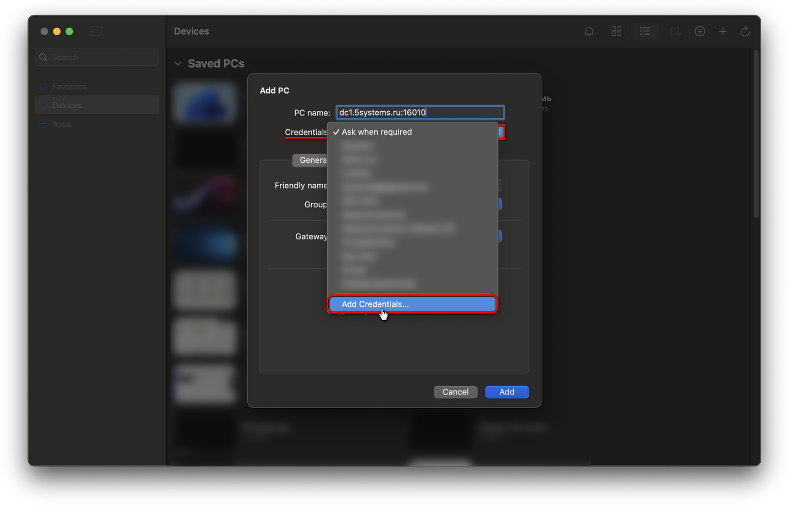
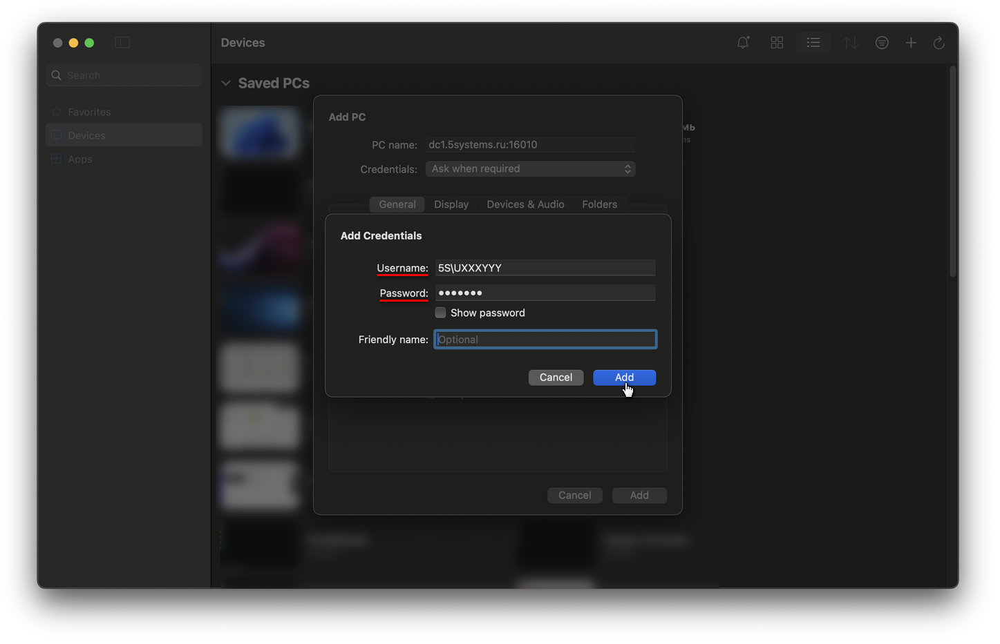
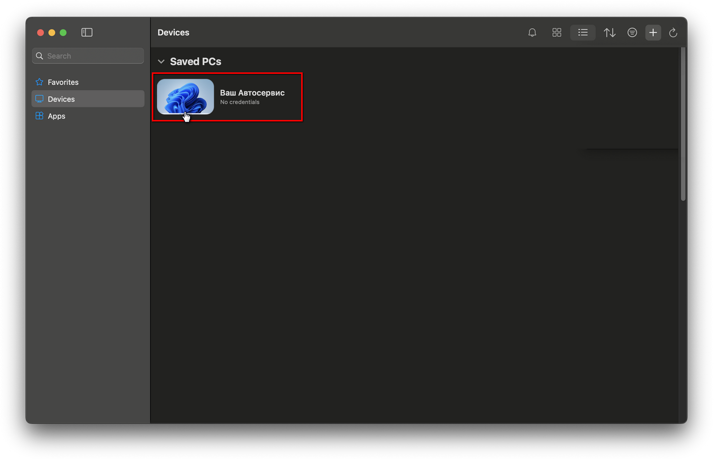

# Как подключиться к 5S AUTO с компьютера Mac

<table><tr><td><b>Время чтения:</b> 5 мин.</td><td><b>Обновлено:</b> 05.02.2026</td></tr></table>

Источник: https://www.5systems.ru/help/kak-podklyuchitsya-k-5s-auto-s-kompyutera-mac

## Содержание

- [Введение](#введение)
- [1. Установка приложения Windows App для Mac](#1-установка-приложения-windows-app-для-mac)
- [2. Подключение по ярлыку приложения](#2-подключение-по-ярлыку-приложения)
- [3. Создание подключения без ярлыка](#3-создание-подключения-без-ярлыка)
- [4. Подключение](#4-подключение)

## Введение

Для подключения к программе 5S AUTO с компьютеров на платформе MacOS через удаленный рабочий стол необходимо использовать официальный RDP-клиент Windows App. Требуется скачать его в App Store, установить на Mac и настроить подключение к серверу, где установлена 1С.

## 1. Установка приложения Windows App для Mac

Первым делом требуется скачать и установить на свое устройство приложение Windows App для Mac – скачать можно по ссылке: [https://apps.apple.com/ru/app/windows-app/id1295203466](https://apps.apple.com/ru/app/windows-app/id1295203466).

Приложение Windows App для Mac (ранее известное как “Microsoft Remote Desktop”) – это шлюз для безопасного подключения к удаленным рабочим столам Windows.

После успешной установки приложение необходимо запустить на своем компьютере Mac.

## 2. Подключение по ярлыку приложения

Есть возможность сохранить на компьютер RDP-файл для подключения и затем выполнять вход в приложение через этот ярлык. При входе потребуется ввести логин и пароль:

## 3. Создание подключения без ярлыка

В случае если нет ярлыка, для создания нового подключения перейдите в раздел “Devices” и нажмите кнопку *“+” → “Add PC”:*

В открывшемся окне добавления нового подключения заполните параметр *“PC name”* – введите  IP-адрес сервера 1С. Параметр состоит из двух реквизитов: *адрес сервера* и *порт.*

Адрес для подключения следует получить:

- для пользователей облачной версии 5S AUTO:
  - адрес: “[dc1.5systems.ru](http://dc1.5systems.ru)”,
  - порт для своей базы следует уточнить у специалистов техподдержки 5SYSTEMS;
- для пользователей коробочной версии – адрес и порт можно получить у штатного системного администратора своей компании.

В настройках подключения требуется указать учетные данные (логин и пароль) для доступа к серверу 1С.

Для этого нужно в параметре “Credentials” открыть меню и выбрать пункт “Add Credentials”:

В открывшемся окне требуется ввести реквизиты для входа:

- *Username* – логин для удаленного рабочего стола;
- *Password* – пароль.

Учетные записи (логины и пароли) для всех пользователей следует получить:

- *для пользователей облачной версии 5S AUTO* – у специалистов 5SYSTEMS (как правило, учетные записи от RDP для всех пользователей передаются руководителю);
- *для пользователей коробочной версии* – у штатного системного администратора своей компании.

После ввода данных следует нажать кнопку “Add”:

Затем на форме создания подключения также следует нажать кнопку "Add".

## 4. Подключение

Для подключения следует выбрать созданную запись и дважды щелкнуть по ярлыку:

Если появится запрос на ввод учетных данных, следует ввести их.

При первом подключении может появиться запрос на подтверждение подключения – следует нажать "Continue".

---

**Теги:** интерфейс программы, Mac, Windows App, удаленное подключение, подключение к программе
