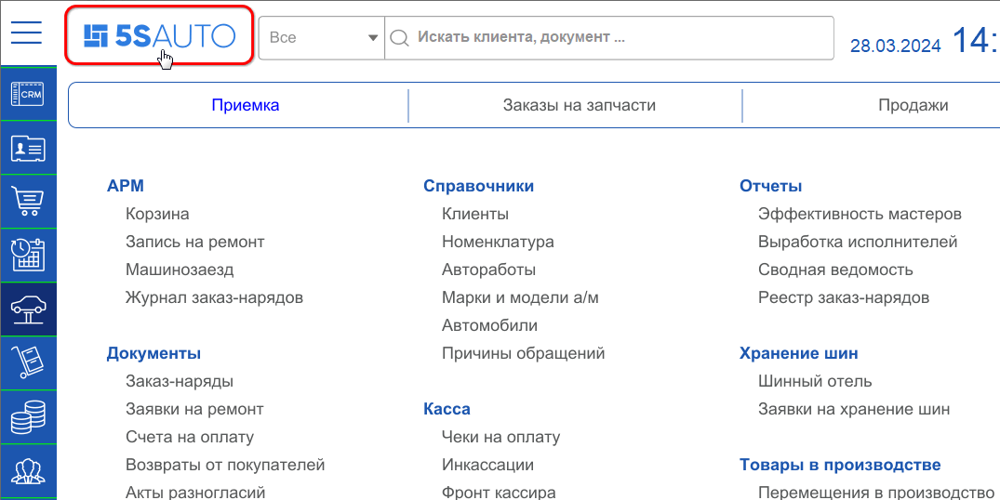
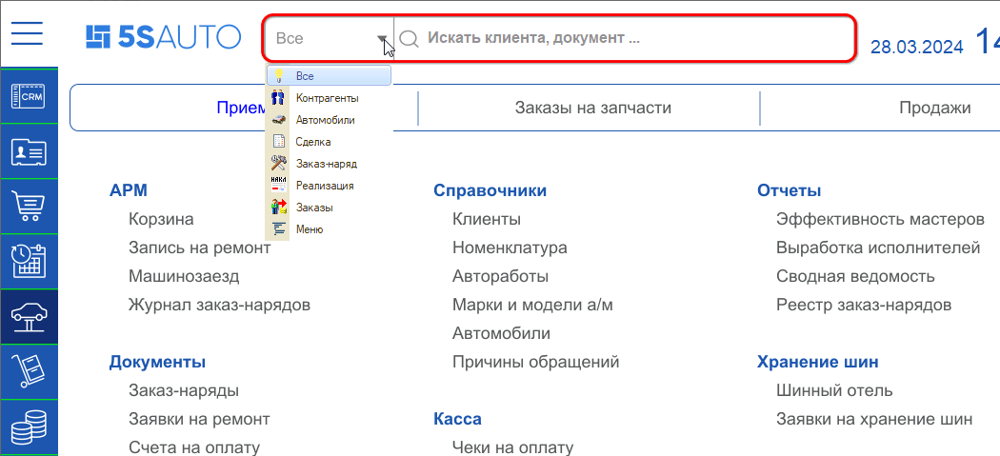
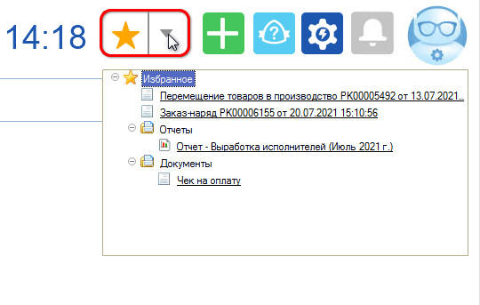
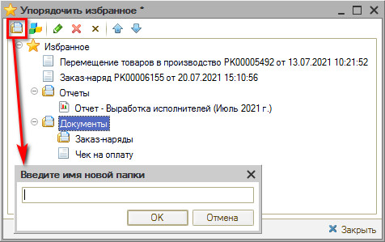
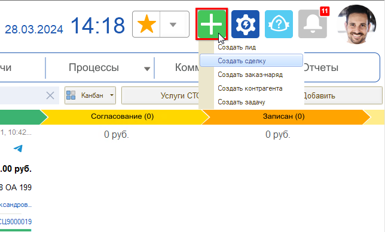
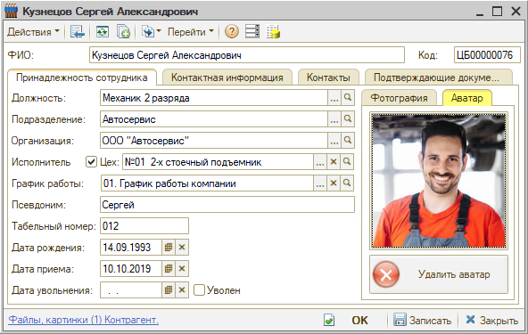
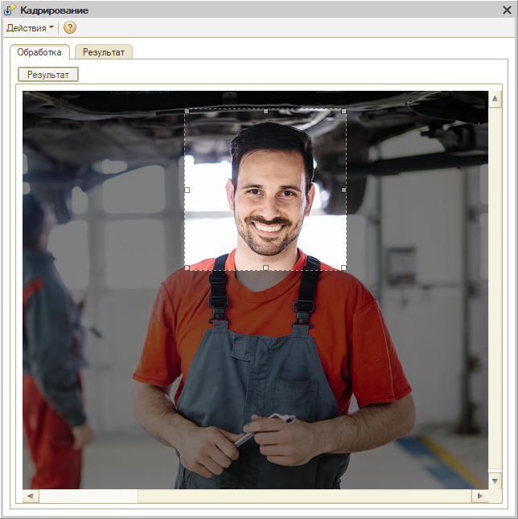
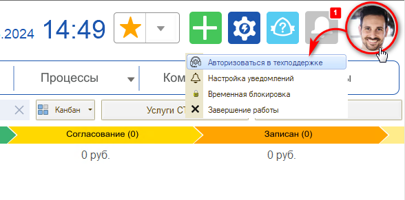

# Как работать с интерфейсом 5S AUTO

<table><tr><td><b>Время чтения:</b> 7 мин.</td><td><b>Обновлено:</b> 29.10.2025</td></tr></table>

Источник: https://www.5systems.ru/help/kak-rabotat-s-interfeysom-5s-auto

## Содержание

[Элементы верхней панели интерфейса](#элементы-верхней-панели-интерфейса)

- [1. Логотип организации](#1-логотип-организации)
- [2. Строка Поиска](#2-строка-поиска)
- [3. Панель Избранное](#3-панель-избранное)
- [4. Кнопка быстрого добавления](#4-кнопка-быстрого-добавления)
- [5. Техподдержка](#5-техподдержка)
- [6. Кнопка “Настройки”](#6-кнопка-настройки)
- [7. Кнопка “Напоминания”](#7-кнопка-напоминания)
- [8. Аватар](#8-аватар)
- [9. Панель управления пользователем](#9-панель-управления-пользователем)

## Элементы верхней панели интерфейса

### 1. Логотип организации

Первым элементом на верхней панели интерфейса является логотип компании. Логотип представляет собой кнопку, нажатием на которую производится *обновление рабочего стола*.

### 2. Строка Поиска

Реализован полнотекстовый поиск по частичному совпадению в разделах меню, справочниках, реестрах документов. Возможен поиск по разным реквизитам: по имени или фамилии клиента, по номеру телефона, по модели автомобиля, по VIN-номеру, гос. номеру и т.д.

Можно вести поиск в выбранном разделе: Контрагенты, Автомобили, Сделки, Заказ-наряды, Реализации, Заказы, Меню, – либо искать во всех разделах одновременно. Чтобы работал поиск, должно быть включено регламентное задание.

### 3. Панель Избранное

Панель “Избранное” предназначена для быстрого доступа к различным элементам базы. В Избранное можно добавить любые реестры, отчеты или документы.

При нажатии на “звездочку” открывается панель управления Избранного.

Можно добавлять элементы, группировать, изменять наименование и последовательность.

Чтобы упорядочить элементы, добавленные в "Избранное", можно создавать отдельные папки и группировать их в нужной иерархии.

### 4. Кнопка быстрого добавления

### 5. Техподдержка

### 6. Кнопка “Настройки”

### 7. Кнопка “Напоминания”

При появлении непрочитанных уведомлений на кнопке появляется индикатор, отображающий их количество.

При нажатии на кнопку открывается полный список уведомлений пользователя.

### 8. Аватар

Аватар пользователя настраивается в карточке сотрудника на соответствующей вкладке.

Для настройки аватара сначала необходимо загрузить фото сотрудника на вкладке “Фотография”, затем перейти на вкладку “Аватар”, кликнуть на фото и выделить квадратом ту часть фото, которая должна отображаться в качестве аватара. Нажать кнопку "Результат" и "Ок".

Выбранный аватар пользователя будет отображаться рядом с его именем в сделках, в ленте событий и т.д.

### 9. Панель управления пользователем

При нажатии на аватар пользователя открывается панель управления.

Панель управления позволяет:

1. Авторизоваться на портале техподдержки, что даст доступ к созданию и управлению тикетами в соответствующем разделе интерфейса;
2. Перейти к настройкам уведомлений;
3. Временно заблокировать сеанс пользователя;
4. Завершить работу программы.

---

**Теги:** интерфейс программы, верхняя панель, поиск, избранное, настройки, напоминания

