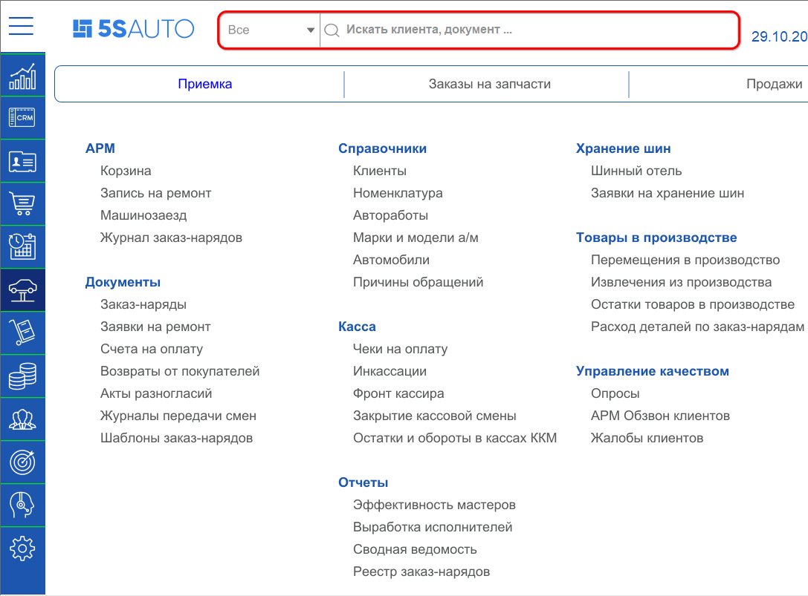
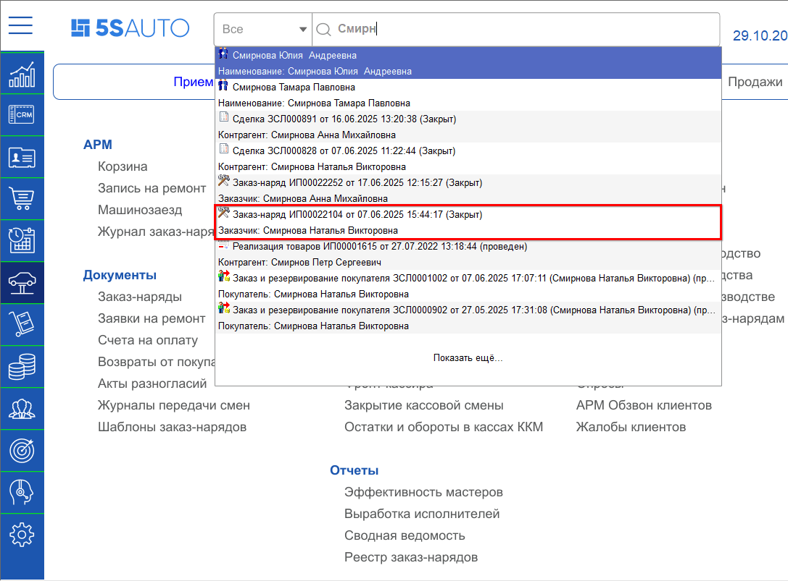
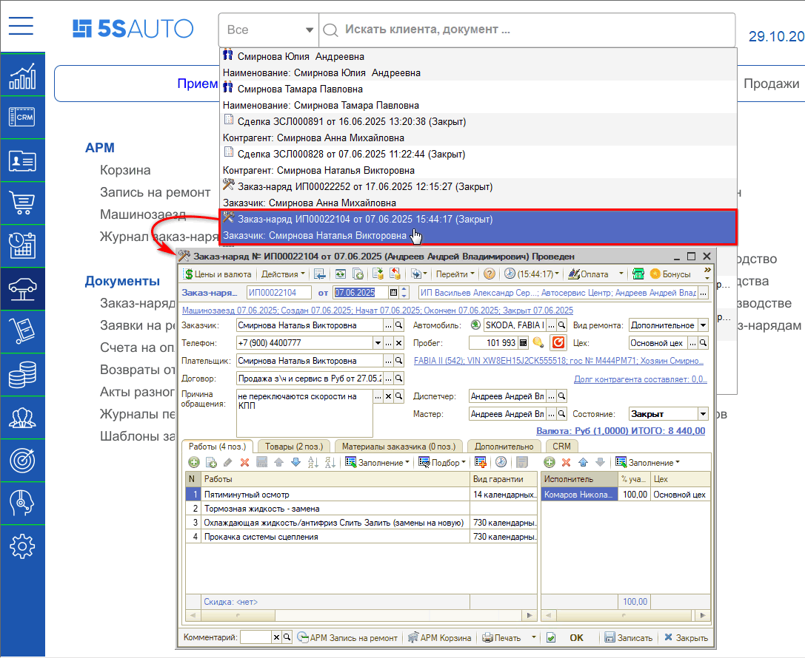
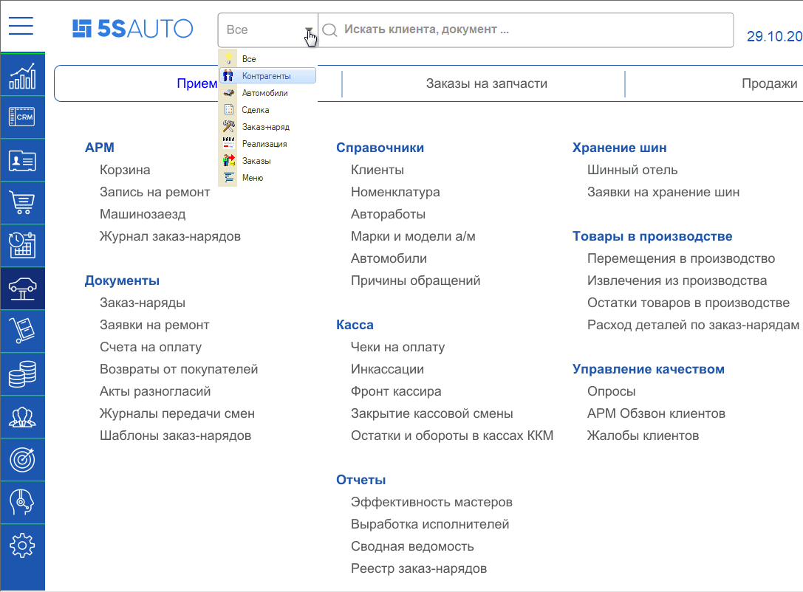
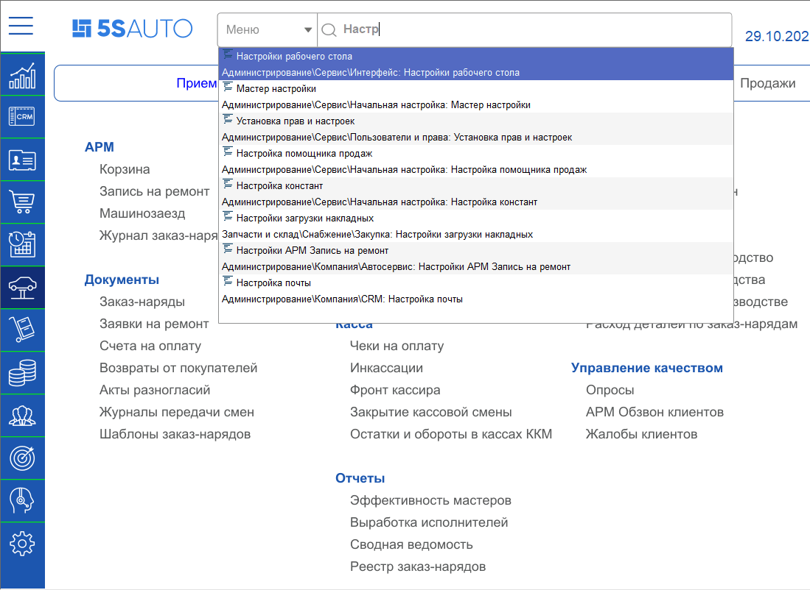

# Как работать с поиском

<table><tr><td><b>Время чтения:</b> 7 мин.</td><td><b>Обновлено:</b> 29.10.2025</td></tr></table>

Источник: https://www.5systems.ru/help/kak-rabotat-s-poiskom

В системе реализован полнотекстовый поиск по частичному совпадению в справочниках, реестрах документов, разделах меню.

Механизм *полнотекстового поиска* основан на использовании полнотекстового индекса, который создается в базе данных и затем периодически, по мере необходимости, обновляется.

Строка поиска находится на верхней панели интерфейса.

Поиск можно вести по разным реквизитам: по имени или фамилии клиента, по номеру телефона, по модели автомобиля, по VIN-номеру, гос. номеру и т.д.

*Например*, для поиска заказ-наряда по клиенту можно ввести в строку поиска его фамилию, – частично или полностью, – и нажать на клавиатуре [Enter].

В результате найден заказчик с введенной фамилией “Смирнова” в заказ-наряде № ___ от дд.мм.гг. Двойным кликом на строку с нужным результатом поиска открывается соответствующий документ, сделка или элемент справочника: в рассматриваемом примере – Заказ-наряд.

Кнопка *“Показать ещё”* посредством двойного клика позволяет просмотреть следующие результаты поиска.

Поиск производится по разделам: Контрагенты, Автомобили, Сделки, Заказ-наряды, Реализации, Заказы, Меню. По умолчанию поиск ведётся во *всех* разделах одновременно, но можно выбрать один из разделов и искать только в нем.

Например, через поле поиска можно быстро найти нужный пункт меню интерфейса, предварительно выбрав раздел “Меню”.

---

**Теги:** интерфейс программы, поиск, полнотекстовый поиск, навигация
