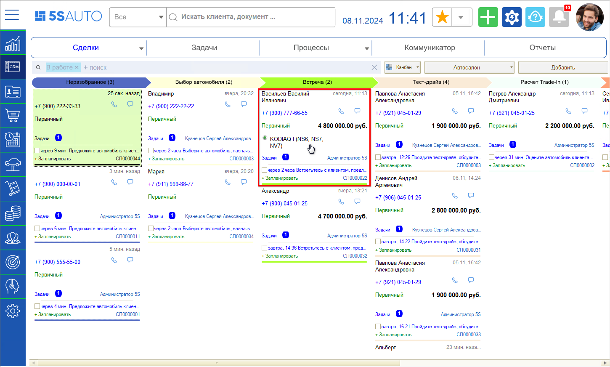
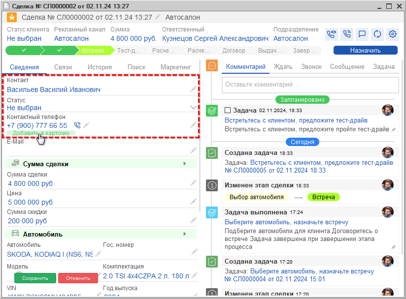
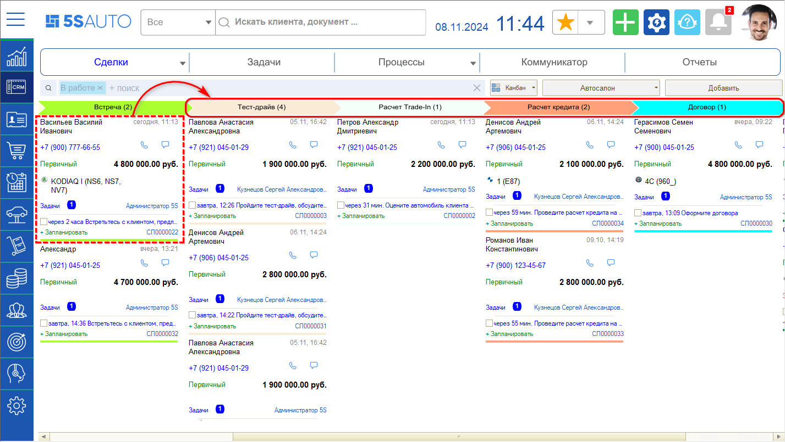
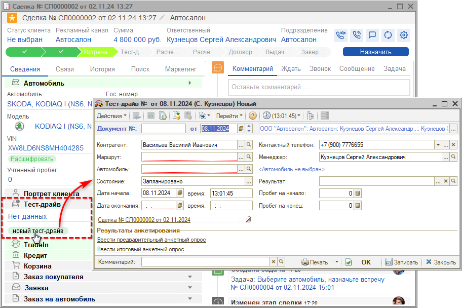
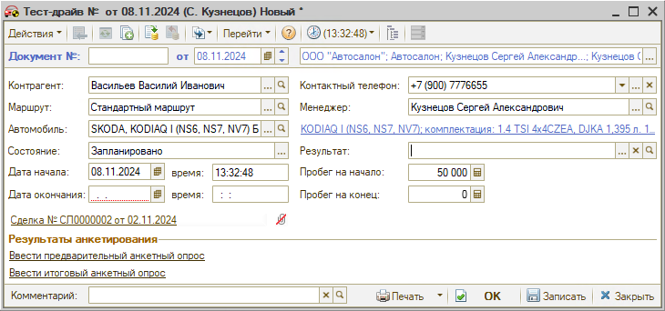
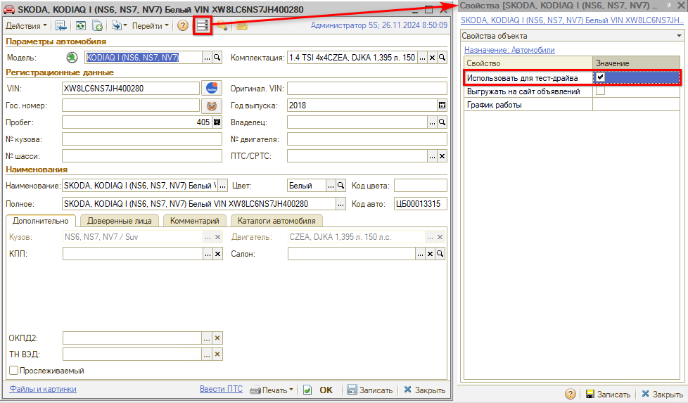

# Встреча

<table><tr><td><b>Время чтения:</b> 5 мин.</td><td><b>Обновлено:</b> 28.11.2024</td></tr></table>

Источник: https://www.5systems.ru/help/vstrecha

## Содержание

1. [Создание карточки клиента](#создание-карточки-клиента)
2. [Переход на следующие этапы](#переход-на-следующие-этапы)
3. [Планирование тест-драйва](#планирование-тест-драйва)

На этапе *“Встреча”* следует встретиться с клиентом и обсудить детали договора.

## Создание карточки клиента

При встрече можно создать *карточку клиента* в программе, либо нужно будет сделать это позже. Под карточкой клиента имеется в виду элемент справочника *"[Контрагенты](https://5systems.ru/help/kontragenty-i-kontakty)".*

Для этого следует:

1. Найти на канбане / в списке нужную сделку и открыть ее:

   

2. Ввести Ф. И. О. клиента;
3. Нажать кнопку *“Добавить в карточку”* под номером телефона:

   

4. *Сохранить* изменения.

При добавлении в справочник программа проверяет, есть ли уже такой клиент в системе или нет – уникальность определяется по номеру телефона. Если клиент уже есть в базе, то создавать новую карточку не нужно. Также см. *урок "[Обращение первичного клиента](../../Краткий%20курс%20для%20Автосервиса/Обращение%20первичного%20клиента/obraschenie-pervichnogo-klienta.md)"* в *[кратком курсе для автосервиса](../../Краткий%20курс%20для%20Автосервиса/).*

Дополнить карточку клиента сведениями – добавить еще один номер телефона, заполнить пол, прикрепить документы, и прочее – можно в любое время.

Создавать карточку клиента на данном этапе не обязательно – можно оставить *введенное строкой имя клиента,* но в таком случае карточку контрагента с полными Ф.И.О. обязательно нужно будет создать на этапе *“[Договор](../Договор/dogovor.md)”* для оформления документов.

## Переход на следующие этапы

Далее сделка может быть переведена на один из следующих этапов: “[Тест-драйв](../Тест-драйв/test-drayv.md)”, “[Расчет Trade-In](../Расчет%20Трейд-Ин/raschet-treyd.md)”, “[Расчет кредита](../Расчет%20кредита/raschet-kredita.md)” либо “[Договор](../Договор/dogovor.md)”.

*Обязательным* из них является этап *“Договор”.* Этапы “Тест-драйв”, “Расчет Trade-In”, “Расчет кредита” не являются обязательными, для перехода сделки на эти этапы требуется выполнить определенные условия.

Для перехода сделки на следующий этап сначала необходимо *выполнить задачу* *“Встретьтесь с клиентом, предложите тест-драйв”.*

## Планирование тест-драйва

В случае, если клиенту требуется тест-драйв, следует создать в соответствующем блоке сделки документ *“Тест-драйв”:*

В документ автоматически подтягиваются параметры:

1. *Контрагент* – клиент, для которого проводится тест-драйв.
2. *Контактный телефон* – подтягивается контактный телефон из карточки клиента.
3. *Дата и время начала* – дата и время начала тест-драйва, по умолчанию автоматически подставляется дата и время создания документа.

Также необходимо *заполнить* следующие параметры:

1. *Маршрут* – следует выбрать маршрут тест-драйва из специального справочника, который должен быть предварительно заполнен.
2. *Автомобиль* – следует выбрать из справочника автомобиль[\*](#snoska) для проведения тест-драйва.

   *\*Примечание:* У такого автомобиля должно быть установлено *свойство* объекта *“Использовать для тест-драйва”:*

   

3. *Пробег на начало* – пробег на момент начала тест-драйва, подтягивается автоматически после выбора автомобиля.
4. *Состояние* – текущее состояние выполнения тест-драйва, по умолчанию устанавливается “Запланировано”.
5. *Дата и время окончания* – дата и время окончания тест-драйва. Если не заполнить вручную, то при записи документа автоматически устанавливается время через 1 час после времени начала.

Заполненный документ “Тест-драйв” следует *записать.* После выполнения задачи этапа "Встреча" сделка перейдет на *этап "[Тест-драйв](../Тест-драйв/test-drayv.md)".*

*Дополнительно рекомендуются для изучения уроки:*

- *[Обращение первичного клиента](../../Краткий%20курс%20для%20Автосервиса/Обращение%20первичного%20клиента/obraschenie-pervichnogo-klienta.md)* *и*
- *[Создание карточки автомобиля](../../Краткий%20курс%20для%20Автосервиса/Создание%20карточки%20автомобиля/sozdanie-kartochki-avtomobilya.md)* в [кратком курсе для автосервиса](../../Краткий%20курс%20для%20Автосервиса/).

*и статьи на Базе знаний:*

- [Автомобили](../../../articles/5S%20AUTO/Автосервис/Автомобили/avtomobili.md)
- [Контрагенты и контакты](https://5systems.ru/help/kontragenty-i-kontakty) и [другие](../../../articles/).

 

*[← Предыдущий урок “Выбор автомобиля”](../Выбор%20автомобиля/vybor-avtomobilya.md) &nbsp;&nbsp;&nbsp;&nbsp;&nbsp;&nbsp; [Следующий урок "Тест-драйв" →](../Тест-драйв/test-drayv.md)*

---

**Теги:** автосалон, краткий курс, встреча, карточка клиента, тест-драйв, сделка

