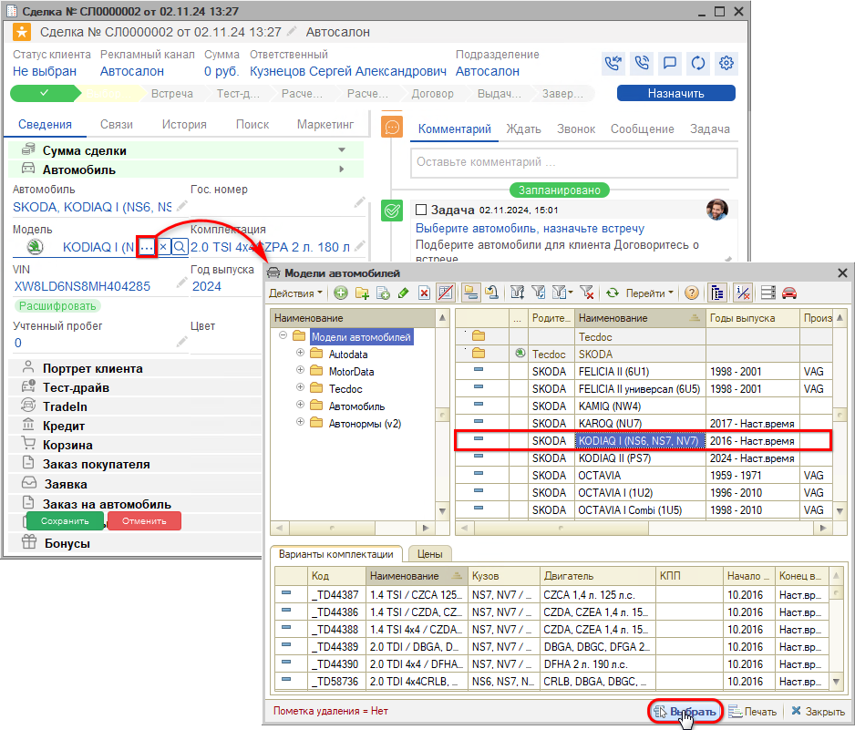
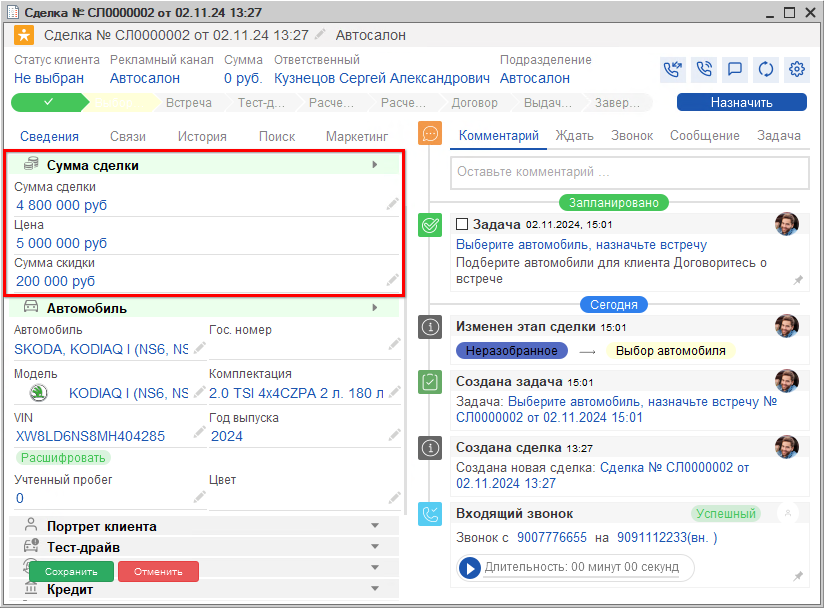
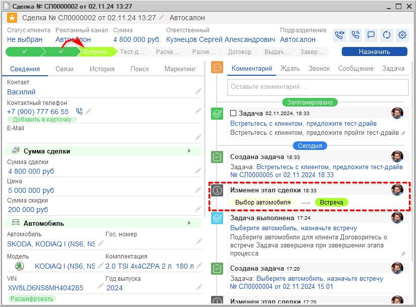

# Выбор автомобиля

<table><tr><td><b>Время чтения:</b> 4 мин.</td><td><b>Обновлено:</b> 28.11.2024</td></tr></table>

Источник: https://www.5systems.ru/help/vybor-avtomobilya

На этапе “Выбор автомобиля” следует предложить клиенту автомобиль и по итогу переговоров заполнить блок *“Сумма сделки”.*

В блоке *“Автомобиль”* необходимо указать *модель автомобиля* – выбрать ее из справочника моделей:

Если а/м в наличии на складе, можно выбрать его в поле “Автомобиль” из справочника автомобилей – при этом автоматически заполняются поля “Комплектация”, “Год выпуска” и “VIN”. Также можно *расшифровать а/м по VIN* – подробнее см. в уроке *"[Создание карточки автомобиля](../../Краткий%20курс%20для%20Автосервиса/Создание%20карточки%20автомобиля/sozdanie-kartochki-avtomobilya.md)"* в [*кратком курсе для автосервиса*](../../Краткий%20курс%20для%20Автосервиса/).

Далее следует заполнить *Сумму сделки.* Первоначально менеджер указывает *предварительную* сумму, озвученную клиенту. После оформления *Заказа на автомобиль* и *Реализации автомобиля* уточненная сумма будет подтягиваться из документов.

В блоке “Сумма сделки” следует заполнить следующие поля:

- *Цена* – цена автомобиля, озвученная менеджером клиенту, без учета скидки.
- *Сумма скидки* – сумма скидки, озвученная клиенту.
- *Сумма сделки* – итоговая сумма сделки за вычетом скидки, рассчитывается автоматически после заполнения Цены и Скидки.

При сохранении изменений сделка переходит на следующий этап *“[Встреча](../Встреча/vstrecha.md)”:*

Далее по данной сделке следует ожидать встречи с клиентом для уточнения вопросов и планирования работы по дальнейшим этапам.

*Дополнительно рекомендуются для изучения уроки:*

- *"[Создание карточки автомобиля](../../Краткий%20курс%20для%20Автосервиса/Создание%20карточки%20автомобиля/sozdanie-kartochki-avtomobilya.md)"* в [Кратком курсе для Автосервиса](../../Краткий%20курс%20для%20Автосервиса/).

*и статьи на Базе знаний:*

- *[Автомобили](../../../articles/5S%20AUTO/Автосервис/Автомобили/avtomobili.md)*
- *[Модели автомобилей и другие справочники](../../../articles/5S%20AUTO/Автосервис/Модели%20автомобилей%20и%20другие%20справочники/modeli-avtomobiley-i-drugie-spravochniki.md)* и [другие](../../../articles/).

 

*[← Предыдущий урок “Регистрация обращения”](../Регистрация%20обращения/registraciya-obrascheniya.md) &nbsp;&nbsp;&nbsp;&nbsp;&nbsp;&nbsp; [Следующий урок "Встреча" →](../Встреча/vstrecha.md)*

---

**Теги:** автосалон, выбор автомобиля, сделка, подбор, краткий курс
