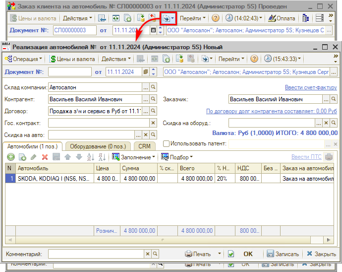
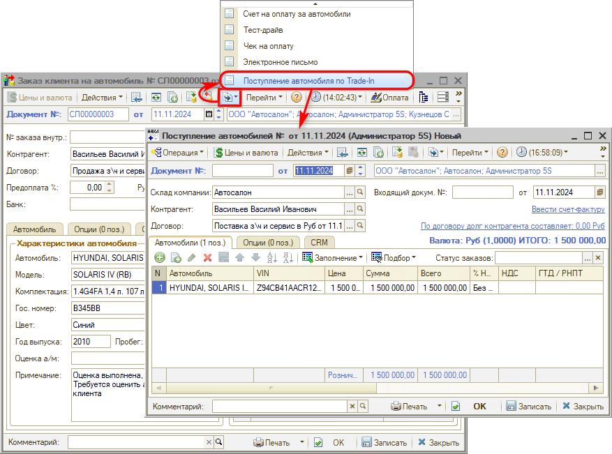
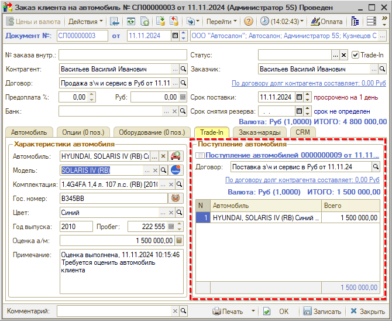
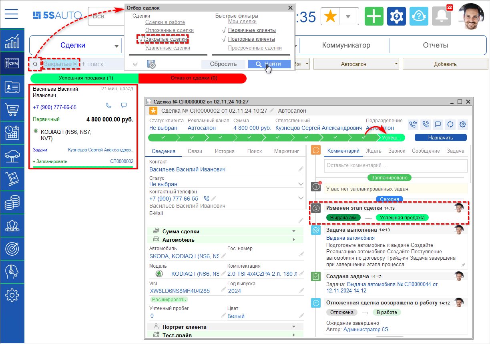

# Выдача автомобиля

<table><tr><td><b>Время чтения:</b> 4 мин.</td><td><b>Обновлено:</b> 28.11.2024</td></tr></table>

Источник: https://www.5systems.ru/help/vydacha-avtomobilya

## Содержание

1. [Реализация автомобиля](#реализация-автомобиля)
2. [Поступление автомобиля по Trade-In](#поступление-автомобиля-по-trade-in)

## Реализация автомобиля

На данном этапе необходимо оформить *Реализацию автомобиля* и все необходимые документы и выдать автомобиль клиенту. В случае если был оформлен Трейд-Ин, также следует принять автомобиль клиента и оформить поступление по договору Трейд-ин.

Для оформления реализации следует создать на основании документа “Заказ клиента на автомобиль” документ *“Реализация автомобилей”:*

Автомобиль и основные параметры автоматически подгружаются в документ. Следует заполнить недостающие данные при необходимости, провести документ и оформить прием оплаты по нему.

Факт оплаты оформляется документом “Приходный кассовый ордер”, который может быть введен на основании *Заказа на автомобиль.* Если оплата поступает безналичным платежом, то она заносится документом “Банковская выписка”.

## Поступление автомобиля по Trade-In

Для оформления поступления автомобиля от клиента следует ввести на основании *Заказа на автомобиль* документ *“Поступление автомобиля по Trade-In”:*

После проведения *Поступления* данные подтягиваются в *Заказ на автомобиль:*

После проведения *Реализации автомобиля* сделка переходит на этап *“Успешная продажа”* и уходит с основного канбана в *“Закрытые сделки”* – при необходимости можно к ней вернуться, установив [*отбор*](../../../articles/5S%20AUTO/CRM/Канбан%20сделок/kanban-sdelok.md#поиск-и-фильтрация-сделок-в-канбане) по закрытым сделкам:

***Сделка успешно завершена!***

*Дополнительно рекомендуются для изучения уроки:*

- *[Как найти нужную сделку на канбане](https://www.5systems.ru/help/kak-nayti-nuzhnuyu-sdelku-na-kanbane)* и другие уроки курса "[CRM](../../Урок%201.%20CRM/)";

*и статьи на Базе знаний:*

- [Канбан сделок](../../../articles/5S%20AUTO/CRM/Канбан%20сделок/kanban-sdelok.md) – раздел *"[Поиск и фильтрация сделок в канбане](../../../articles/5S%20AUTO/CRM/Канбан%20сделок/kanban-sdelok.md#поиск-и-фильтрация-сделок-в-канбане)";*
- *[Список сделок](../../../articles/5S%20AUTO/CRM/Список%20сделок/spisok-sdelok.md)* – раздел *"[Отборы и фильтры](../../../articles/5S%20AUTO/CRM/Список%20сделок/spisok-sdelok.md#отборы-и-фильтры)"* и *[другие](../../../articles/).*

 

*[← Предыдущий урок “Договор”](../Договор/dogovor.md)*

---

**Теги:** автосалон, краткий курс, выдача автомобиля, реализация, Trade-In, сделка

