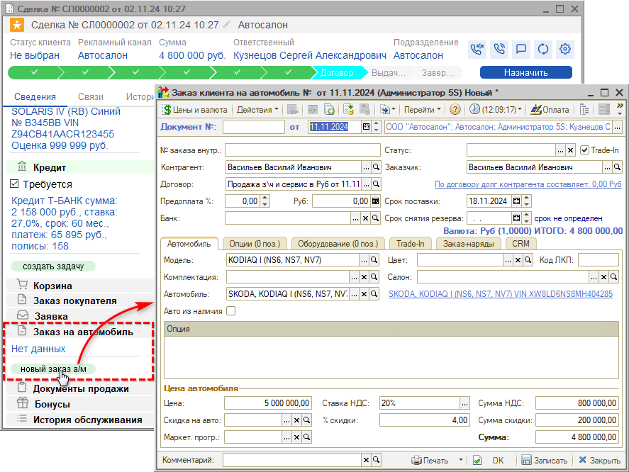
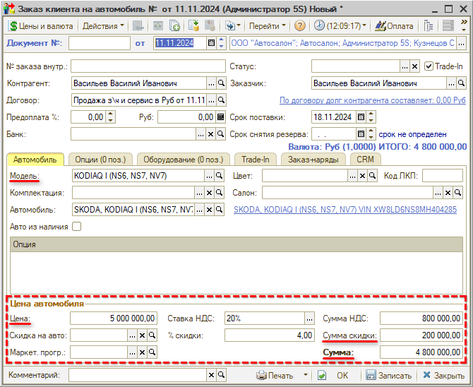
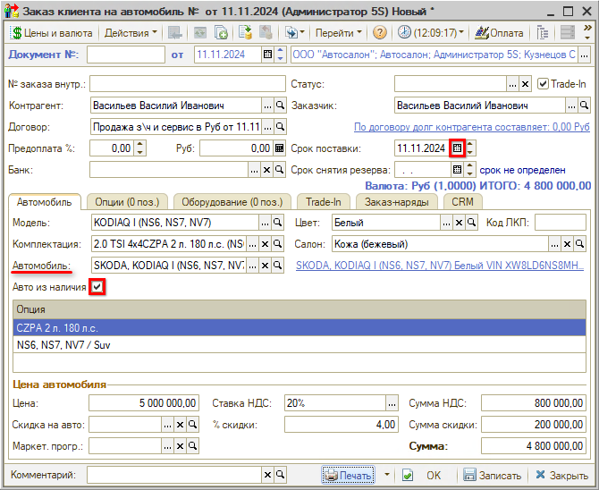
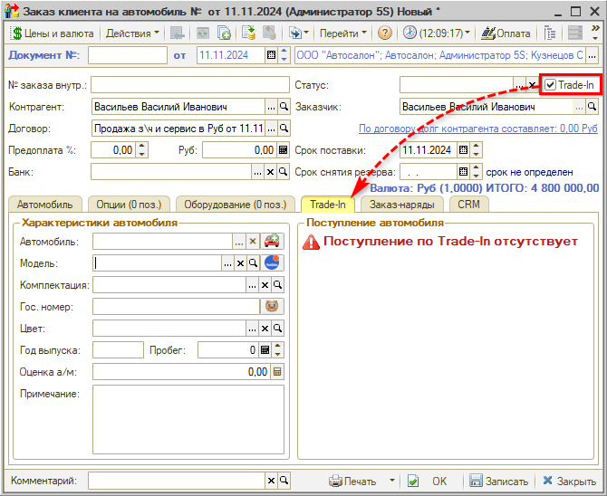
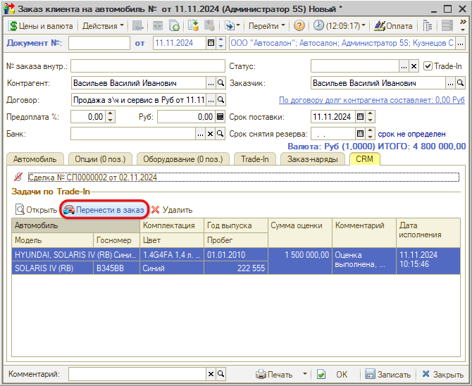
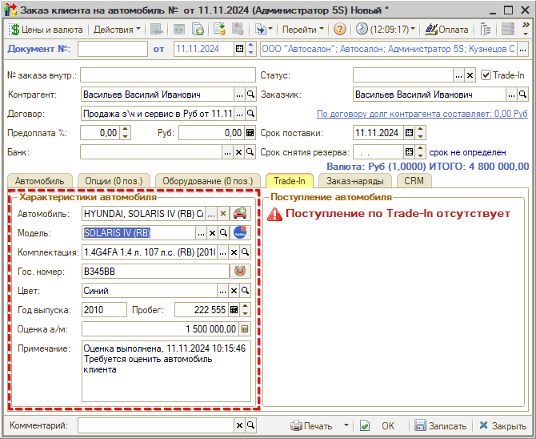
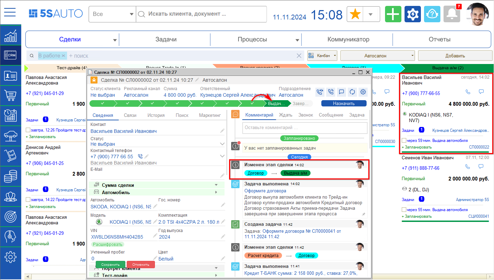
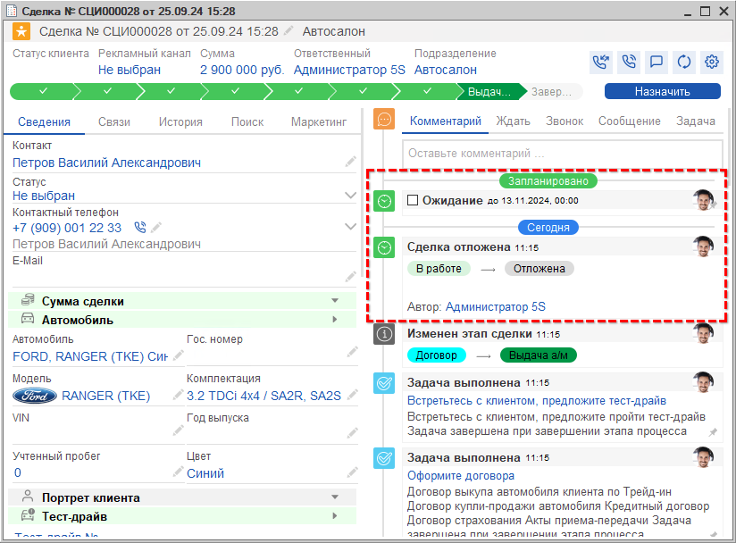

# Договор

<table><tr><td><b>Время чтения:</b> 7 мин.</td><td><b>Обновлено:</b> 28.11.2024</td></tr></table>

Источник: https://www.5systems.ru/help/dogovor

## Содержание

1. [Создание контрагента](#создание-контрагента)
2. [Заказ на автомобиль](#заказ-на-автомобиль)

## Создание контрагента

На *этапе "Договор"* производится оформление Заказа на автомобиль, а также всех необходимых договоров с клиентом.

Если клиент был *введен в сделку строкой,* и карточка контрагента *не была создана* на предыдущих этапах, то на этапе “Договор” *обязательно* следует заполнить в сделке полные *фамилию, имя, отчество* клиента и *создать карточку клиента* – *см. в уроке “[Встреча](../Встреча/vstrecha.md#создание-карточки-клиента)”.*

Только при условии, что данные клиента добавлены в карточку, в дальнейшем они автоматически подтянутся в “Заказ на автомобиль” и другие документы программы.

## Заказ на автомобиль

Далее на данном этапе в блоке сделки *“Заказ на автомобиль”* необходимо создать новый документ:

Документ *“Заказ клиента на автомобиль”* оформляется как в случае наличия автомобиля на складе, так и при необходимости заказа автомобиля у поставщика. Если автомобиль в наличии на складе, то он сразу будет зарезервирован под клиента.

На вкладку “Автомобиль” подтягивается информация об автомобиле и его стоимости из сделки:

*Примечание:* Для возможности редактирования суммы скидки должно быть включено *[право](../../../articles/5S%20AUTO/Пользователи%20и%20права/Установка%20прав%20и%20настроек%20пользователя/ustanovka-prav-i-nastroek-polzovatelya.md) “Редактирование цен и сумм в номенклатурных таблицах”,* а также установлено право *“Способ выбора скидки”* в значении “*Ручные скидки и редактирование”.*

В случае если автомобиль *есть на складе,* следует выбрать его из справочника, а также указать в качестве срока поставки текущую дату:

Если автомобиль требуется заказать, то следует указать ожидаемый *срок поставки,* либо автоматически установится значение по умолчанию – через 7 дней после текущей даты.

Если автомобиль не выбран, то при записи документа будет создан новый элемент справочника автомобилей с параметрами, указанными в Заказе. В данном случае автомобиль будет записан без VIN-номера: нужно будет ввести его позднее – при оформлении *Поступления а/м.*

*Вкладка “Опции”* предназначена для заполнения списка опций, дополнительно устанавливаемых на автомобиль поставщиком, и их стоимости. Основные заводские опции указаны в таблице “Опция” на вкладке “Автомобиль” – заполняются автоматически при выборе комплектации.

На *вкладку “Оборудование”* можно добавить оборудование, устанавливаемое на автомобиль вашей организацией, например, сигнализацию. Стоимость этого оборудования может увеличить цену продажи автомобиля, а может не увеличивать: например, быть оформленным в подарок клиенту.

***Учет Trade-In в Заказе на автомобиль***

В случае если ранее был рассчитан *Trade-In* для клиента, то *Заказ на автомобиль* автоматически формируется с признаком *“Trade-In”* – если галочка установлена, то появляется дополнительная *вкладка “Trade-In”.* В данном случае Заказ на автомобиль будет одновременно фиксировать прием автомобиля от покупателя в зачет нового автомобиля:

Для переноса информации по Trade-In в Заказ следует перейти на вкладку “CRM” и нажать кнопку *“Перенести в заказ”:*

Информация об оцененном автомобиле клиента подгружается на вкладку “Trade-In”:

***Автомобиль в наличии***

При проведении “Заказа клиента на автомобиль” сделка переходит на этап “Выдача а/м”:

Если автомобиль *в наличии,* т.е. имеется в свободном остатке на складе, то автоматически происходит его резервирование. Далее можно переходить к оформлению договоров.

***Автомобиля нет в наличии***

Если автомобиля нет ни в наличии, ни в ожидаемых поставках, требуется сначала его *заказать у поставщика* – для этого следует на основании *Заказа клиента на автомобиль* ввести документ *“Заказ поставщику на автомобиль”.* В этом случае при проведении “Заказа клиента на автомобиль” сделка переходит в *“[Отложенные](../../../articles/5S%20AUTO/CRM/Отложенные%20сделки/otlozhennye-sdelki.md)”* до даты, указанной в параметре “Срок поставки”:

Далее оформляется *Поступление автомобиля.* Для поступившего а/м также может быть выполнена предпродажная подготовка и установка дополнительного оборудования. Затем производится резервирование а/м под клиента, и оформление комплекта необходимых документов.

Если автомобиль поступит раньше времени ожидания, можно вернуть сделку из “Отложенных” – завершить ожидание либо создать на основании заказа реализацию. Как найти отложенную сделку и вернуть ее в работу, см. в *[статье](../../../articles/5S%20AUTO/CRM/Отложенные%20сделки/otlozhennye-sdelki.md#otbor_otlozh).*

*Дополнительно рекомендуются для изучения уроки:*

- *[Как отложить сделку](https://www.5systems.ru/help/kak-otlozhit-sdelku);*
- *[Как установить этап сделки](https://www.5systems.ru/help/kak-ustanovit-etap-sdelki);*
- *[Как найти нужную сделку на канбане](https://www.5systems.ru/help/kak-nayti-nuzhnuyu-sdelku-na-kanbane)* и другие уроки курса "[CRM](../../Урок%201.%20CRM/)";
- урок *"[Обращение первичного клиента](../../Краткий%20курс%20для%20Автосервиса/Обращение%20первичного%20клиента/obraschenie-pervichnogo-klienta.md)”* в [кратком курсе для автосервиса](../../Краткий%20курс%20для%20Автосервиса/)

*и статьи на Базе знаний:*

- *[Контрагенты и контакты](../../../articles/5S%20AUTO/Работа%20с%20клиентами/Контрагенты%20и%20контакты/kontragenty-i-kontakty.md);*
- *[Идентификация клиента на форме сделки;](../../../articles/5S%20AUTO/Работа%20с%20клиентами/Идентификация%20клиента%20на%20форме%20Сделки/identifikaciya-klienta-na-forme-sdelki.md)*
- *[Отложенные сделки](../../../articles/5S%20AUTO/CRM/Отложенные%20сделки/otlozhennye-sdelki.md);*
- [*Установка прав и настроек пользователя;*](../../../articles/5S%20AUTO/Пользователи%20и%20права/Установка%20прав%20и%20настроек%20пользователя/ustanovka-prav-i-nastroek-polzovatelya.md)
- *[Автоматическое создание договора с контрагентом](../../../articles/5S%20AUTO/Практики/Автоматическое%20создание%20договора%20с%20контрагентом/avtomaticheskoe-sozdanie-dogovora-s-kontragentom.md);*
- *[Взаиморасчеты с контрагентами](../../../articles/5S%20AUTO/Учет%20взаиморасчетов/Взаиморасчеты%20с%20контрагентами/vzaimoraschety-s-kontragentami.md)* и прочие статьи в разделе *"[Учет взаиморасчетов](../../../articles/5S%20AUTO/Учет%20взаиморасчетов/)";* 
  и *[другие](../../../articles/).*

 

*[← Предыдущий урок “Расчет кредита”](../Расчет%20кредита/raschet-kredita.md) &nbsp;&nbsp;&nbsp;&nbsp;&nbsp;&nbsp; [Следующий урок "Выдача автомобиля" →](../Выдача%20автомобиля/vydacha-avtomobilya.md)*

---

**Теги:** автосалон, краткий курс, договор, контрагент, заказ на автомобиль, взаиморасчеты

