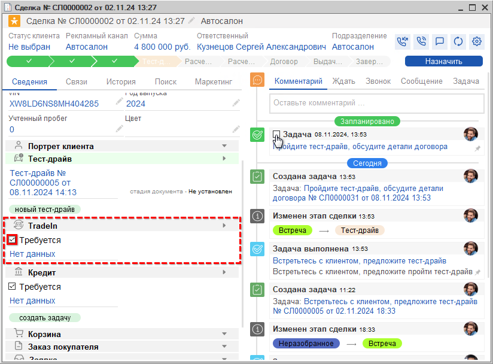
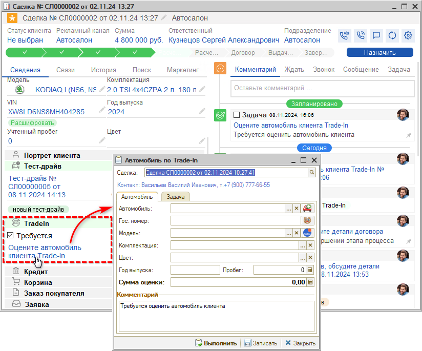
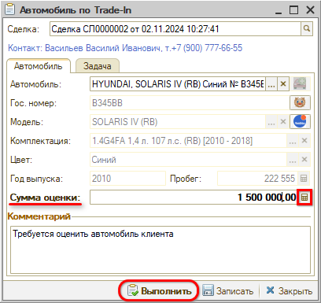

# Расчет Трейд-Ин

<table><tr><td><b>Время чтения:</b> 3 мин.</td><td><b>Обновлено:</b> 28.11.2024</td></tr></table>

Источник: https://www.5systems.ru/help/raschet-treyd

На *этапе "Расчет Трейд-Ин"* требуется оценить автомобиль клиента и *рассчитать Trade-In,* т.е. стоимость старого автомобиля, которая будет принята в зачет нового. Этап не является обязательным: если расчет Trade-In не требуется, можно переходить на этап “Расчет кредита” или “Договор” (см. в *уроке "[Встреча](../Встреча/vstrecha.md#переход-на-следующие-этапы)")*.

Для перехода сделки на этап *“Расчет Трейд-Ин”* нужно установить галочку “Требуется” в блоке “Trade-In”, сохранить изменения в сделке и выполнить задачу предыдущего этапа:

После этого в блоке “Trade-In” появляется ссылка *“Оцените автомобиль клиента Trade-In”* – при клике на нее открывается форма *“Автомобиль по Trade-In”:*

На вкладке “Автомобиль” следует заполнить данные об автомобиле клиента. Для *расшифровки автомобиля* используются *гос. номер* и *VIN-номер автомобиля* – следует ввести VIN-номер в поле “Автомобиль” и нажать кнопку создания карточки а/м либо кнопку расшифровки по TecDoc. Подробнее о расшифровке а/м см. в *[статье](../../../articles/5S%20AUTO/Автосервис/Расшифровка%20автомобиля%20по%20VIN/rasshifrovka-avtomobilya-po-vin.md#расшифровка-в-tecdoc).*

Затем следует ввести *сумму оценки* автомобиля и выполнить задачу:

После этого сделка переходит на следующий этап – *“[Расчет кредита](../Расчет%20кредита/raschet-kredita.md)”,* либо *“[Договор](../Договор/dogovor.md)”,* в зависимости от того, стоит ли галочка “Требуется” в блоке “Расчет кредита” (см. в *[предыдущем уроке](../Тест-драйв/test-drayv.md#переход-на-следующие-этапы)).*

 

*[← Предыдущий урок “Тест-драйв” ](../Тест-драйв/test-drayv.md) &nbsp;&nbsp;&nbsp;&nbsp;&nbsp;&nbsp; [Следующий урок "Расчет кредита" →](../Расчет%20кредита/raschet-kredita.md)*

---

**Теги:** автосалон, краткий курс, трейд-ин, оценка автомобиля, сделка

