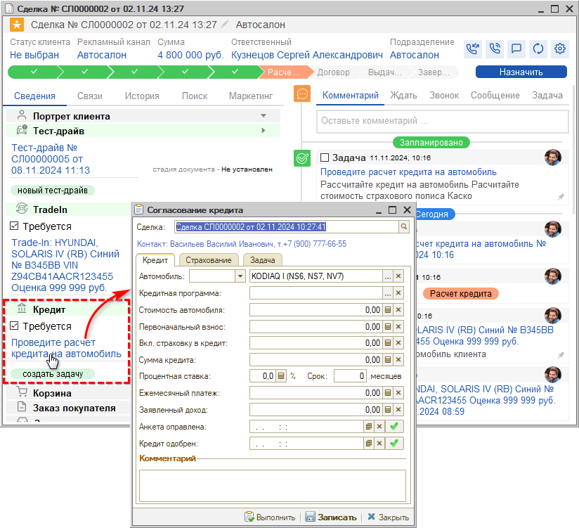
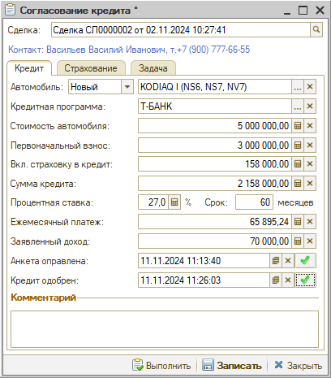
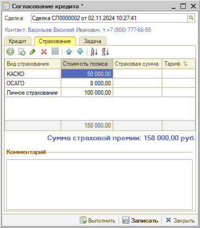
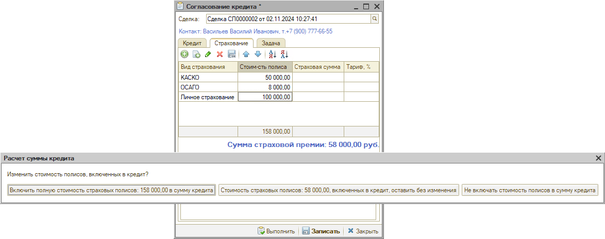

# Расчет кредита

<table><tr><td><b>Время чтения:</b> 5 мин.</td><td><b>Обновлено:</b> 28.11.2024</td></tr></table>

Источник: https://www.5systems.ru/help/raschet-kredita

На этапе "Расчет кредита" требуется *рассчитать кредит на автомобиль* и стоимость страхового полиса Каско для клиента.

Этап не является обязательным, на этап “Расчет кредита” сделка попадает, если была установлена галочка “Требуется” в блоке “Кредит” (см. в *уроке “[Тест-драйв](../Тест-драйв/test-drayv.md#переход-на-следующие-этапы)”).* Если нет – сразу на этап “Договор”.

После перехода на на данный этап в блоке “Кредит” появляется ссылка *“Проведите расчет кредита на автомобиль”* – при клике на нее открывается форма *“Согласование кредита”:*

Необходимо заполнить все параметры формы:

- *Автомобиль –* новый или с пробегом.
- *Марка автомобиля* – подтягивается из сделки.
- *Кредитная программа* – следует программу банка выбрать из заранее заполненного справочника.
- *Стоимость автомобиля* – без учета скидок и страховки.
- *Первоначальный взнос* – сумма первоначального взноса.
- *Стоимость зачета Trade-In* – сумма зачета Trade-In.
- *Вкл. страховку в кредит* – сумма страховки, включенная в сумму кредита. Для расчета страховки следует перейти на вкладку “Страхование”, после заполнения таблицы сумму страховки можно перенести в расчет кредита – см. [*ниже*](#dobavl_strah).
- *Сумма кредита* – общая сумма кредита.
- *Процентная ставка* – процентная ставка по кредиту.
- *Срок* – срок погашения кредита.
- *Ежемесячный платеж* – рассчитывается автоматически.
- *Заявленный доход* – информация для банка.
- *Анкета отправлена* – дата и время отправки анкеты в банк, при нажатии кнопки с галочкой прописываются автоматически, также можно ввести вручную.
- *Кредит одобрен* – дата одобрения кредита, также при нажатии кнопки с галочкой прописываются автоматически.

Далее необходимо перейти на *вкладку “Страхование”* и заполнить сумму по страховкам КАСКО, ОСАГО, а также личному страхованию при наличии:

При вводе сумм в строки таблицы выводится диалоговое окно программы с запросом необходимости добавления стоимости страховых полисов в сумму кредита:

В случае согласия сумма страховой премии автоматически добавится в параметр *“Вкл. страховку в кредит”* на вкладке “Кредит” *(см. [выше](#param))* и *суммируется в общую стоимость* кредита.

После заполнения всех параметров документ необходимо *записать.* В случае если клиент согласен с условиями кредита, следует нажать кнопку *“Выполнить”.* Сделка при этом переходит на следующий *этап “[Договор](../Договор/dogovor.md)”* для оформления заказа на автомобиль и документов купли-продажи.

 

*[← Предыдущий урок “Расчет Трейд-Ин”](../Расчет%20Трейд-Ин/raschet-treyd.md) &nbsp;&nbsp;&nbsp;&nbsp;&nbsp;&nbsp; [Следующий урок "Договор" →](../Договор/dogovor.md)*

---

**Теги:** автосалон, краткий курс, кредит, расчет, сделка
