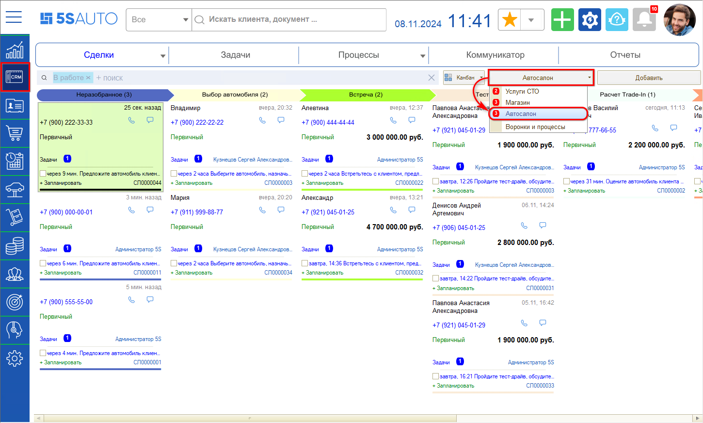
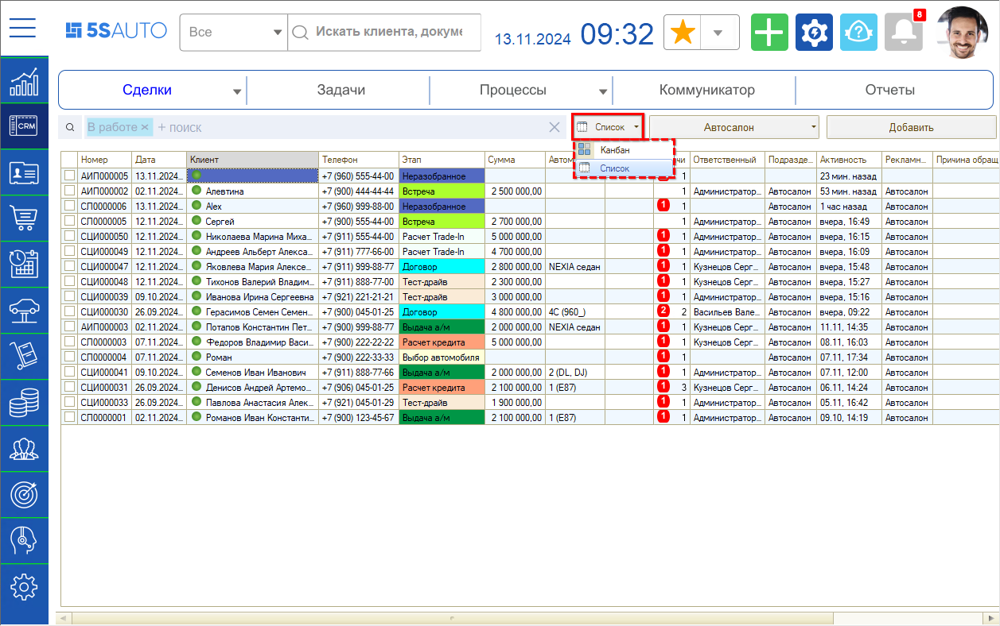
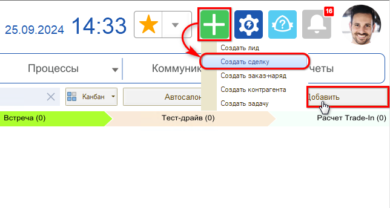
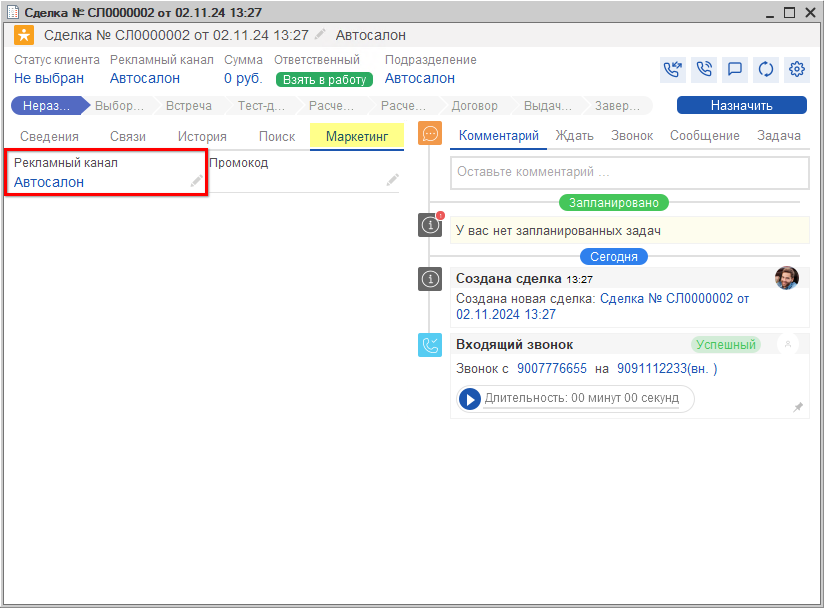
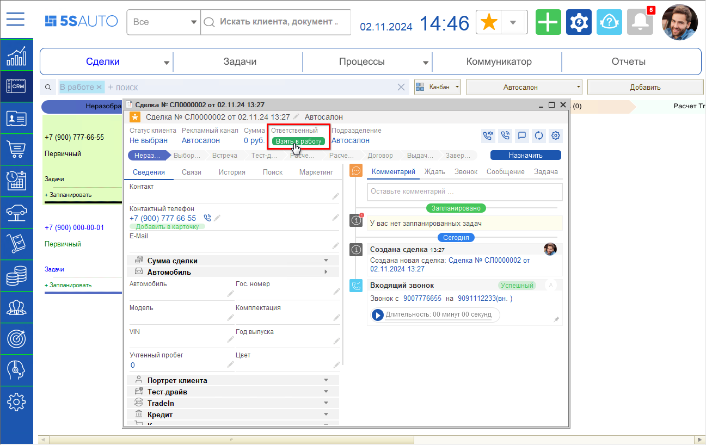
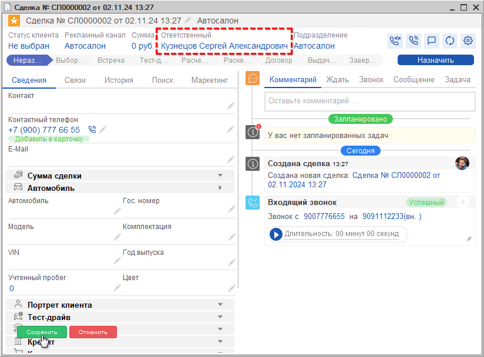
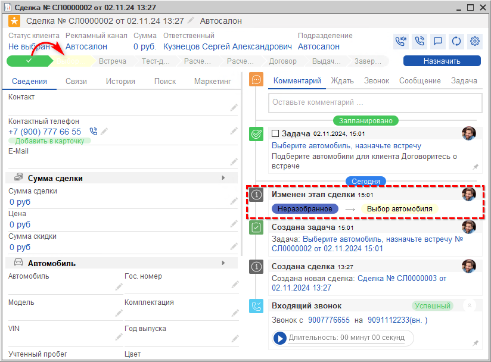
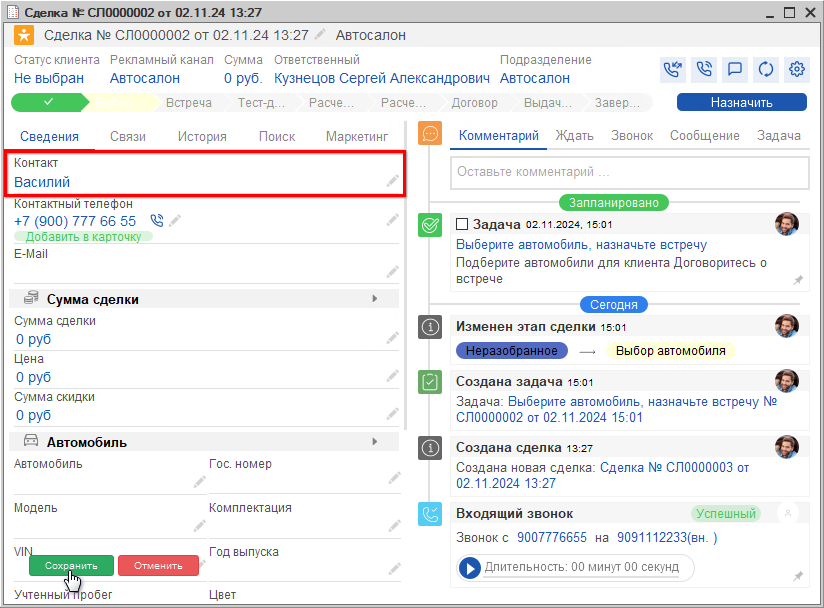

# Регистрация обращения

<table><tr><td><b>Время чтения:</b> 7 мин.</td><td><b>Обновлено:</b> 27.11.2024</td></tr></table>

Источник: https://www.5systems.ru/help/registraciya-obrascheniya

## Содержание

1. [Создание сделки](#создание-сделки)
2. [Неразобранное](#неразобранное)
3. [Заполнение контактных данных клиента](#заполнение-контактных-данных-клиента)

*Примечание: См. описание предварительных настроек воронки в статье “<u>Обновление настроек воронок продаж</u>” (в разработке).*

## Создание сделки

Центральным элементом интерфейса 5S Auto является ***сделка*** – зафиксированное в программе обращение клиента.

Каждое обращение в компанию через любой канал – телефон, мессенджеры, формы на сайте, мобильное приложение – автоматически фиксируется и сохраняется в программе в виде сделки. Это позволяет не потерять ни одной заявки, не забыть ни одного клиента.

Все заявки аккумулируются в CRM-системе. Выстроена логика процесса обработки заявок – последовательность этапов, по которым проходят сделки. Каждая сделка находится в определенном статусе и состоянии – это позволяет менеджеру понять:

1. какое действие нужно совершить по сделке на каждом этапе, например: подобрать автомобиль для клиента, провести тест-драйв, оформить трейд-ин, оформить заказ на автомобиль и т.д.;
2. какой должен быть следующий шаг.

Руководителю при этом удобно отслеживать, сколько заявок поступило, какие сделки еще не разобраны, какие уже обработаны и кем, и т.д.

Сначала сделка попадает в “неразобранные”: на данном этапе могут быть нецелевые обращения – например, если ошиблись номером, – а также те, которые уйдут “в отказ” после созвона с клиентом. При переходе на следующий этап такие обращения отсеиваются, и остаются только качественные сделки, по которым ведется дальнейшая работа.

Для работы с *воронкой Автосалона* необходимо перейти в раздел *CRM → колонка "Сделки",* в случае использования нескольких воронок следует выбрать *“Автосалон”:*

Раздел содержит *[канбан](../../../articles/5S%20AUTO/CRM/Канбан%20сделок/kanban-sdelok.md) сделок* в разбивке на этапы – по умолчанию отображаются все 8 этапов, но есть возможность оставить на рабочем столе только те этапы, на которых находятся открытые сделки.

Также есть возможность работать со сделками в режиме *[списка](../../../articles/5S%20AUTO/CRM/Список%20сделок/spisok-sdelok.md)* – переключаться между канбаном и списком можно по кнопке на верхней панели:

Определение воронки при автоматическом создании сделки производится на основе настроек *[рекламных каналов](../../../articles/5S%20AUTO/Аналитика/Настройка%20рекламных%20каналов/nastroyka-reklamnykh-kanalov.md).*

Есть возможность создать сделку вручную, например, при визите клиента – для этого нужно нажать кнопку *“Добавить”* либо *“Добавить процесс → Создать сделку”:*

Создавать сделку вручную не потребуется, если в программу интегрирована IP-телефония и мессенджеры. В таком случае во время обращения клиента сделка создается автоматически, и в нее сразу подтягивается номер телефона звонящего и рекламный канал:

## Неразобранное

Если сотрудник принял звонок клиента, то новая сделка сразу попадает на этап *“[Выбор автомобиля](../Выбор%20автомобиля/vybor-avtomobilya.md)”,* т.к. в сделку автоматически подставляется “Ответственный”. В случае если звонок был [пропущен](../../../articles/5S%20AUTO/Телефония/Работа%20с%20пропущенными%20звонками/rabota-s-propuschennymi-zvonkami.md), либо при заявке с сайта новая сделка попадает на этап *“Неразобранное”,* и требуется сначала *взять ее в работу* – для этого следует нажать кнопку *“Взять в работу”:*

В поле “Ответственный” подтянется текущий пользователь, изменения нужно будет сохранить:

После сохранения изменений сделка переходит на этап *“Выбор автомобиля”:*

Далее, в случае обращения первичного клиента, т.е. того, который позвонил или приехал первый раз, требуется заполнить его контактные данные. Обязательно нужно занести клиента в CRM, не оставлять целевое обращение незаполненным – иначе будет пустая карточка, с которой непонятно, как работать.

## Заполнение контактных данных клиента

***При обращении повторного клиента***

Для записи клиента на форме сделки в программе есть специальные удобные поля, некоторые из них заполняются автоматически, например, телефон, с которого поступил звонок.

Если клиент уже обращался ранее, то при его повторном обращении в сделке уже есть его Ф. И. О., информация об автомобилях, а также история всех его предыдущих обращений в компанию, включая документы, задачи, переписку и т.д.

Если повторный клиент не был идентифицирован программой автоматически, можно найти его в базе вручную с помощью механизма быстрого поиска на вкладке "Поиск". Поиск поможет избежать создания дублирующих данных. Подробнее см. в уроке *“[Создание сделки](https://www.5systems.ru/help/sozdanie-sdelki#zapoln_sdelki)”* в *[кратком курсе для автосервиса](https://www.5systems.ru/taxonomy/term/122).*

***При обращении первичного клиента***

На этапе регистрации обращения достаточно заполнить только *имя клиента.* При заявке с сайта имя, введенное клиентом, подтянется автоматически из формы обращения.

В случае звонка следует спросить у клиента, как к нему обращаться, и *ввести имя* вручную в поле *“Контакт”:*

Далее можно переходить к *[подбору автомобиля](../Выбор%20автомобиля/vybor-avtomobilya.md).*

*Дополнительно рекомендуются для изучения уроки:*

- курс [CRM](https://5systems.ru/taxonomy/term/140);
- уроки *“[Создание сделки](https://www.5systems.ru/help/sozdanie-sdelki)”* и *"[Обращение первичного клиента](https://www.5systems.ru/help/obraschenie-pervichnogo-klienta)"* в [Кратком курсе для Автосервиса](https://www.5systems.ru/taxonomy/term/122)

*и статьи на Базе знаний:*

- *[Канбан сделок](../../../articles/5S%20AUTO/CRM/Канбан%20сделок/kanban-sdelok.md), [Список сделок](../../../articles/5S%20AUTO/CRM/Список%20сделок/spisok-sdelok.md), [Работа со сделкой](../../../articles/5S%20AUTO/CRM/Работа%20со%20сделкой/rabota-so-sdelkoy.md), [События сделки](../../../articles/5S%20AUTO/CRM/События%20сделки/sobytiya-sdelki.md)* и другие статьи в разделе [CRM](https://5systems.ru/taxonomy/term/149);
- *[Контрагенты и контакты](../../../articles/5S%20AUTO/Работа%20с%20клиентами/Контрагенты%20и%20контакты/kontragenty-i-kontakty.md), [Идентификация клиента на форме сделки](../../../articles/5S%20AUTO/Работа%20с%20клиентами/Идентификация%20клиента%20на%20форме%20Сделки/identifikaciya-klienta-na-forme-sdelki.md)* и другие статьи в разделе [Работа с клиентами](https://5systems.ru/taxonomy/term/151);
- *[Настройка рекламных каналов](../../../articles/5S%20AUTO/Аналитика/Настройка%20рекламных%20каналов/nastroyka-reklamnykh-kanalov.md);* 
  и *[другие](https://5systems.ru/articles).*

[*Следующий урок "Выбор автомобиля" →*](../Выбор%20автомобиля/vybor-avtomobilya.md)

---

**Теги:** автосалон, сделка, обращение, воронка продаж, краткий курс

