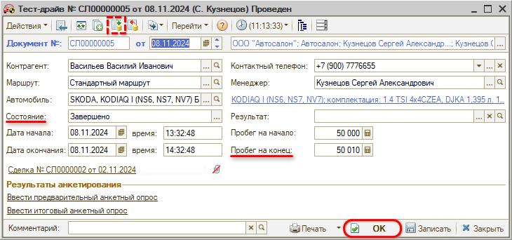
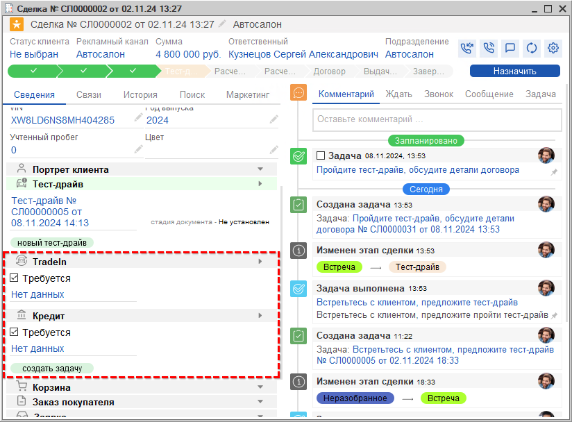

# Тест-драйв

<table><tr><td><b>Время чтения:</b> 3 мин.</td><td><b>Обновлено:</b> 28.11.2024</td></tr></table>

Источник: https://www.5systems.ru/help/test-drayv

## Содержание

1. [Оформление Тест-драйва](#оформление-тест-драйва)
2. [Переход на следующие этапы](#переход-на-следующие-этапы)

## Оформление Тест-драйва

На данном этапе следует пройти тест-драйв и обсудить с клиентом детали договора. Этап не является обязательным: если тест-драйв не требуется, можно сразу перейти на этап “Расчет Trade-In”, “Расчет кредита” или “Договор” (см. в *[предыдущем уроке](../Встреча/vstrecha.md#переход-на-следующие-этапы)).*

После *прохождения тест-драйва* следует заполнить в документе “Тест-драйв” следующие параметры:

- *Пробег на конец* – пробег на одометре автомобиля на момент окончания тест-драйва;
- Установить *состояние “Завершено”* и провести документ нажатием *“ОК”.*

Тест-драйв *пройден.* Далее сделка может быть переведена на один из следующих этапов: “Расчет Трейд-Ин”, “Расчет кредита” либо “Договор” в зависимости от того, требуется ли клиенту расчет Трейд-Ин и кредита.

## Переход на следующие этапы

Сделка перейдет на следующий этап после выполнения задачи *“Пройдите тест-драйв, обсудите детали договора”.* Перед завершением задачи предварительно нужно выполнить следующие действия:

1. если *требуется расчет Трейд-Ин:* следует в блоке “Trade-In” установить галочку “Требуется” и сохранить изменения. После выполнения задачи текущего этапа сделка перейдет на этап “Расчет Трейд-Ин”– см. *следующий урок “[Расчет Трейд-Ин](../Расчет%20Трейд-Ин/raschet-treyd.md)”.*
2. если расчет Трейд-Ин *не требуется,* но *требуется расчет кредита:* следует в блоке “Кредит” установить галочку “Требуется” и сохранить изменения. После выполнения задачи текущего этапа сделка перейдет на этап “Расчет кредита” – см. *урок “[Расчет кредита](../Расчет%20кредита/raschet-kredita.md)”.*

   

3. если *не требуется расчет Trade-In и кредита,* галочки устанавливать *не следует* – после проведения документа “Тест-драйв” нужно выполнить задачу *“Пройдите тест-драйв, обсудите детали договора”.* Сделка перейдет на *этап “Договор”* – см. *урок “[Договор](../Договор/dogovor.md)”.*

 

*[← Предыдущий урок “Встреча”](../Встреча/vstrecha.md) &nbsp;&nbsp;&nbsp;&nbsp;&nbsp;&nbsp; [Следующий урок "Расчет Трейд-Ин" →](../Расчет%20Трейд-Ин/raschet-treyd.md)*

---

**Теги:** автосалон, краткий курс, тест-драйв, сделка
