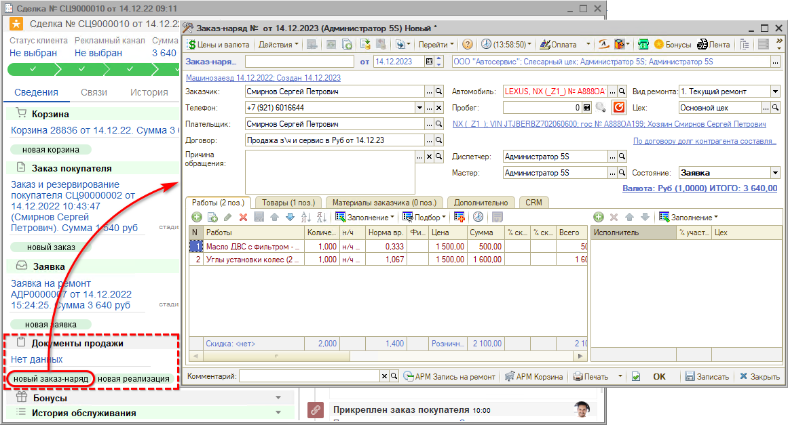
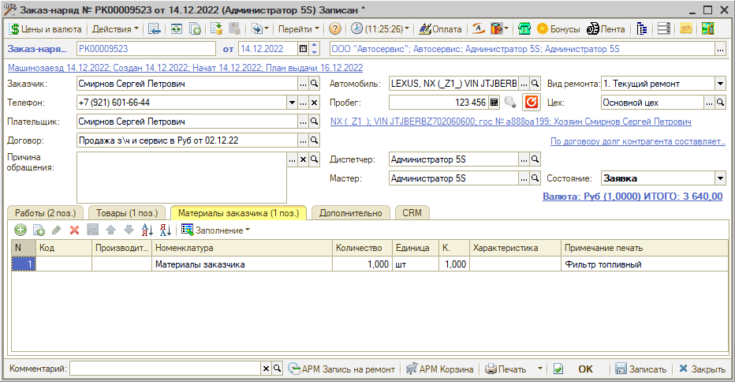
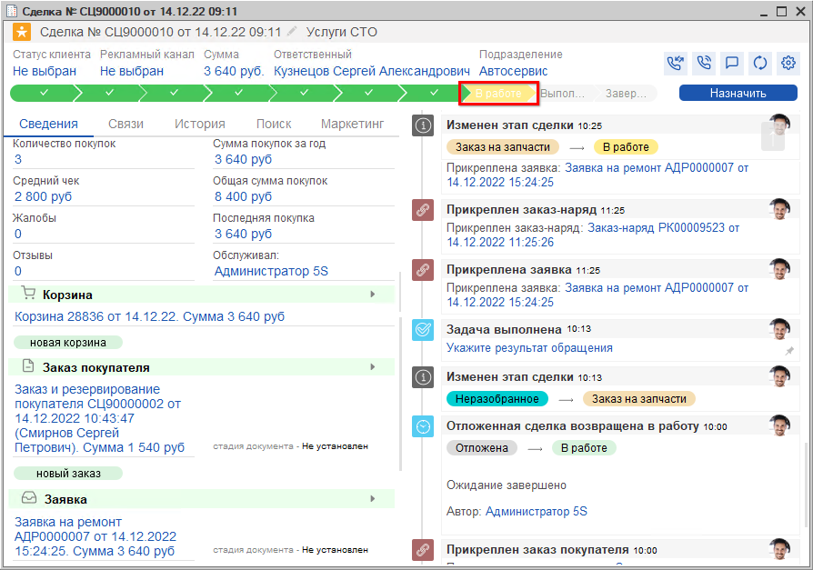
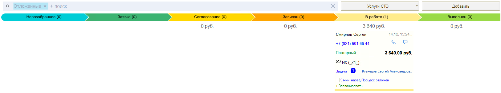

# В работе

<table><tr><td><b>Время чтения:</b> 8 мин.</td><td><b>Обновлено:</b> 12.12.2023</td></tr></table>

Источник: https://www.5systems.ru/help/v-rabote

Пока сделка находится на этапе *Подготовки к заезду*, есть время создать Заказ-наряд.

## Создание Заказ-наряда

Заказ-наряд является одним из основных документов 5S AUTO.

***Заказ-наряд*** – это чистовой вариант заполнения информации по выполнению работ и использованию в производстве запчастей. С помощью данного документа ведется учет выполнения ремонта.

Создать Заказ-наряд можно на основании Заявки на ремонт:

или из формы сделки путем нажатия на кнопку “Новый заказ-наряд”:

При этом из Заявки подгружаются все необходимые значения. Далее следует уточнить пробег, установить фактических исполнителей работ и распределить процент их участия:

В случае, если клиент привозит свои запчасти, можем использовать вкладку **“Материалы заказчика”**:

Возможны два способа работы с данным функционалом:

1) создать в номенклатуре папку «Материалы заказчика» и заполнить наименованиями основных деталей (без артикула), затем выбирать из списка нужные детали; 
2) добавить в номенклатуру элемент «Материалы заказчика»; конкретные детали, привезенные клиентом, записывать в примечании одной строкой, через запятую.

Информация о материалах заказчика из данной вкладки выводится в печатной форме Заказ-наряда (таблица «Перечень деталей клиента»).

В поле **“Состояние”** отображается текущее состояние заказ-наряда:

**Состояния Заказ-наряда:**

- *“Заявка”* – состояние приёма а/м; из Заказ-наряда в этом состоянии можно проверить все данные, создать и дополнить разделы карточки контрагента и карточки автомобиля, а также распечатать акт приема, сопроводительный лист и другие печатные формы для подготовки к заезду.
- *“В работе”* – исполнители приступают к работам в рамках заказ-наряда. При переходе в это состояние рекомендуется делать перемещение в производство товаров Заказ-наряда. При переводе в это состояние Заказ-наряд проводится.
- *“Ожидание запчастей”* – состояние устанавливается, когда требуется оформить или когда уже оформлен заказ поставщику по деталям Заказ-наряда и ожидается их поступление.
- *“Выполнен”* – состояние устанавливается, когда работы выполнены, все работы и товары занесены в Заказ-наряд, при этом все товары перемещены в производство. Перед выбором состояния требуется проверить правильность заполнения всех табличных частей, т.к. формируются рассылки сообщений, что работа выполнена на определенную сумму. При этом клиенту печатаются все необходимые печатные формы.
- *“Закрыт”* – заказ-наряд полностью выполнен и закрыт. Состояние недоступно, если Заказ-наряд не был переведен в состояние "Выполнен". Закрывать Заказ-наряд необходимо после полной оплаты по сделке. Означает окончание ремонтных работ и оформление всех необходимых документов с клиентом.
- *“Отказ”* – перевод Заказ-наряда в это состояние осуществляется, если выполнить ремонт не удалось по каким-то причинам (клиент отказался или невозможно выполнить ремонт со стороны СТО).

Переход из одного в состояния в другое не выполняется автоматически – его нужно менять вручную. Это необходимо для определения и фиксации стадии выполнения ремонта.

При открытии заказ-наряда сделка автоматически переходит на этап “В работе”:

и перемещается на канбане:

После передачи автомобиля в цех для выполнения работ меняем статус документа Заказ-наряд на “В работе” и перемещаем товары в производство.

После завершения работ актуализируем в заказ-наряде исполнителя работ и меняем состояние документа на “Выполнен”. При этом сделка тоже автоматически переместится на этап “Выполнен”.

*Подробнее см. курс уроков "[Работа с Заказ-нарядами](../../Урок%2010.%20Работа%20с%20Заказ-нарядами/)" и статью "[Заказ-наряды](../../../articles/5S%20AUTO/Автосервис/Работа%20с%20Заказ-нарядами/Заказ-наряды/zakaz-naryady.md)".*

 

*[← Предыдущий урок "Записан"](../Записан/zapisan.md)* &nbsp;&nbsp;&nbsp;&nbsp;&nbsp;&nbsp; [*Следующий урок "Выполнен" →*](../Выполнен/vypolnen.md)

---

**Теги:** автосервис, краткий курс, заказ-наряд, ремонт, сделка

