# Видеоурок "Калькуляция и запись на ремонт"

<table><tr><td><b>Время чтения:</b> 14 мин.</td><td><b>Обновлено:</b> 12.09.2024</td></tr></table>

Источник: https://www.5systems.ru/help/videourok-kalkulyaciya-i-zapis-na-remont

## Содержание

1. [Калькуляция](#калькуляция)
   - [Создание автомобиля в Корзине](#создание-автомобиля-в-корзине)
   - [Подбор запасных частей и авторабот](#подбор-запасных-частей-и-авторабот)
   - [Составление калькуляции](#составление-калькуляции)
   - [Заказ запчастей](#заказ-запчастей)
2. [Планирование работ](#планирование-работ)
   - [Переход к Записи на ремонт](#переход-к-записи-на-ремонт)
   - [Интерфейс](#интерфейс)
   - [Документ План ремонта (заявка на ремонт)](#документ-план-ремонта-заявка-на-ремонт)

*Видеоурок. Время просмотра – 3:15 мин.*

## Калькуляция

***АРМ*** ***Корзина*** предназначена для оперативного подбора запчастей и авторабот и проценки в одном рабочем месте с помощью различных механизмов.

Данные клиента при переходе из Сделки подгружаются автоматически. Далее требуется указать автомобиль.

### Создание автомобиля в Корзине

Создать новый автомобиль можно нажатием кнопки "Зарегистрировать новый автомобиль или обновить данные в карточке существующего":

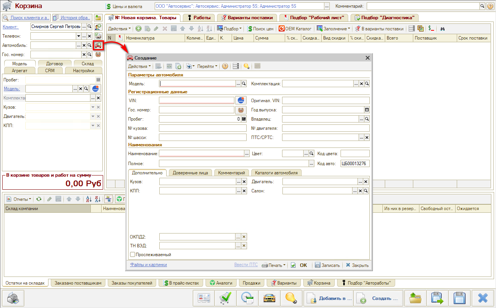

Открывается форма создания автомобиля. Следует ввести VIN и нажать кнопку “Расшифровать а/м”:

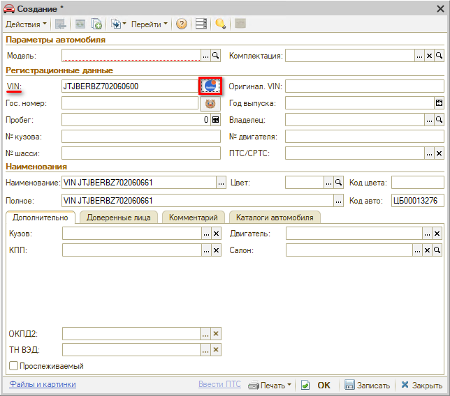

Если программа расшифровала автомобиль по VIN-коду, то сразу откроется окно “Идентификация автомобиля” с заполненными параметрами:

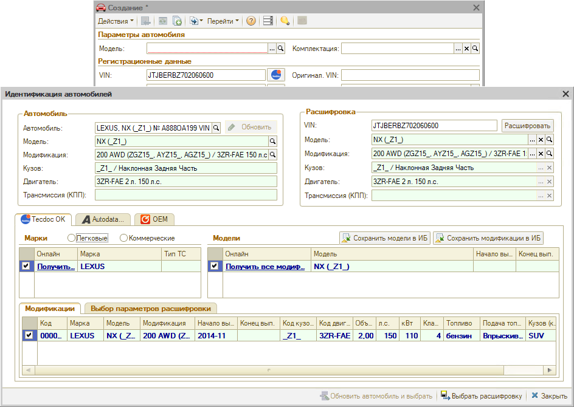

Если модель автомобиля не определилась по VIN, выйдет следующее сообщение:

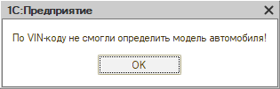

В данном случае нужно создать новый автомобиль клиента вручную, выбирая нужную марку, модель и модификацию из имеющегося в программе каталога Tecdoc:

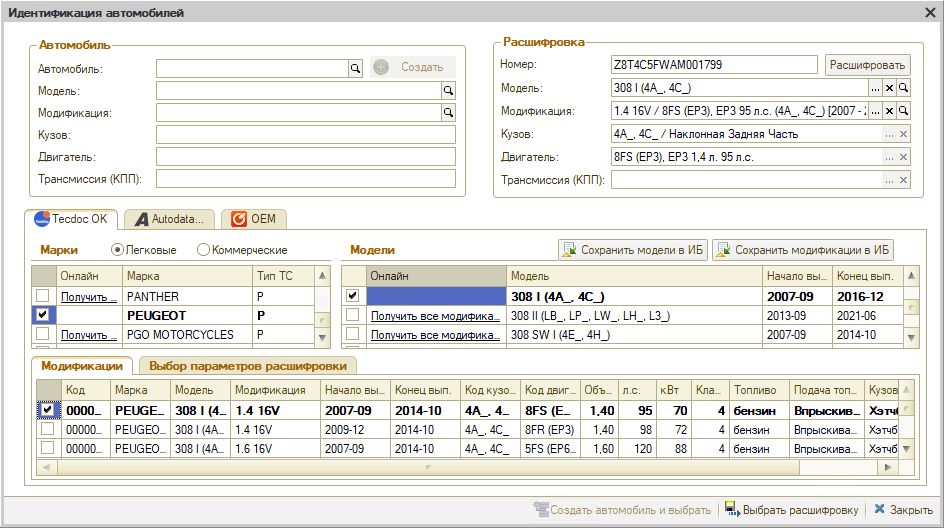

После автоматической или ручной расшифровки автомобиля следует нажать кнопку “Выбрать расшифровку”. Создается нужное наименование автомобиля с уникальным вин номером:

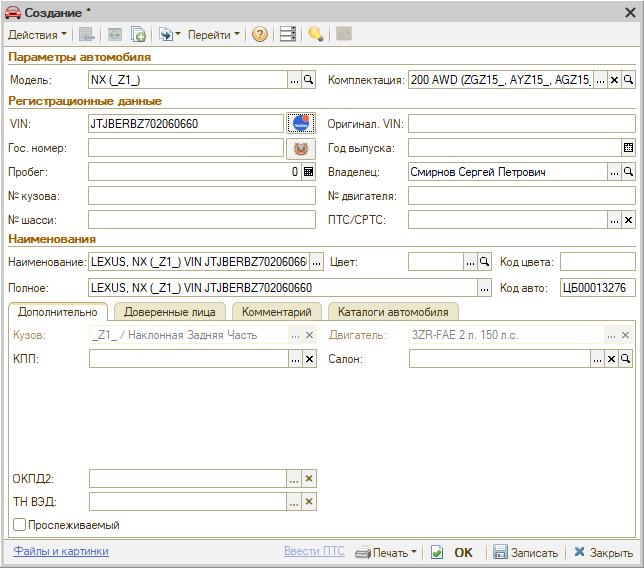

Нажимаем “Записать”. Все данные из расшифровки подтягиваются в Корзину.

*Иногда при создании автомобиля программа сообщает что данный VIN не уникален. Это означает, что авто с таким VIN-номером уже существует. Например, у автомобиля сменился владелец. Найдите наименование, содержащее указанный VIN, через поиск и смените владельца на нужного.*

**Вкладки Корзины:**

- *"Товары"* для подбора товаров,
- *"Работы"* для подбора работ,
- *"Варианты поставки"* – можно добавлять товары из Поиска цен, не сохраняя лишние варианты в номенклатуру,
- *«Подбор “Рабочий лист”»* для работы с Применяемостью,
- *«Подбор “Диагностика”»* для обработки Диагностического листа.

Наполнение корзины осуществляется во вкладках "Товары" и "Работы".

### Подбор запасных частей и авторабот

Есть несколько вариантов подбора запчастей:

1. Добавить товар из номенклатуры,
2. Подобрать товар для конкретного автомобиля из оригинального каталога Laximo,
3. Подобрать аналог или замену через обработку “Поиск цен”,
4. Заполнить товары из сформированного ранее документа: Запись на ремонт, Заказ-наряд,
5. Перенести из ранее сформированных подборов “Рабочий лист” или “Диагностика”.
6. Перенести подобранные ранее и согласованные с клиентом товары из вариантов поставки.

**Подбор Рабочий лист** используется для работы с Применяемостью, сохранения ее для модели/комплектации автомобиля, чтобы в будущем для автомобиля такой же модели или комплектации не подбирать запчасти заново в Laximo, а работать сразу из Рабочего листа.

Из созданного набора в Рабочем листе можно добавить товары в Корзину.

**Подбор авторабот** осуществляется путем:

1. Поиска по частичному совпадению среди значений справочника "Автоработы" через функцию подбора "Автоработы".
2. С использованием функционала применяемости для модели автомобиля через связанные с деталями работы.

**Поиск оригинальных номеров (применяемость, каталог Laximo)**

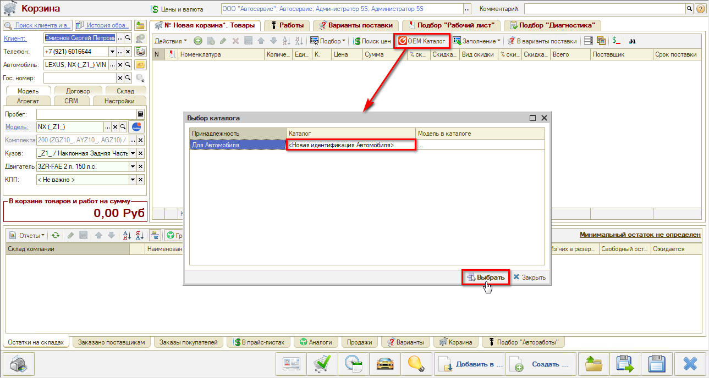

Нажать кнопку "OEM Каталог" → Новая идентификация автомобиля.

Открывается каталог на данную модель, где можно выбрать нужную деталь.

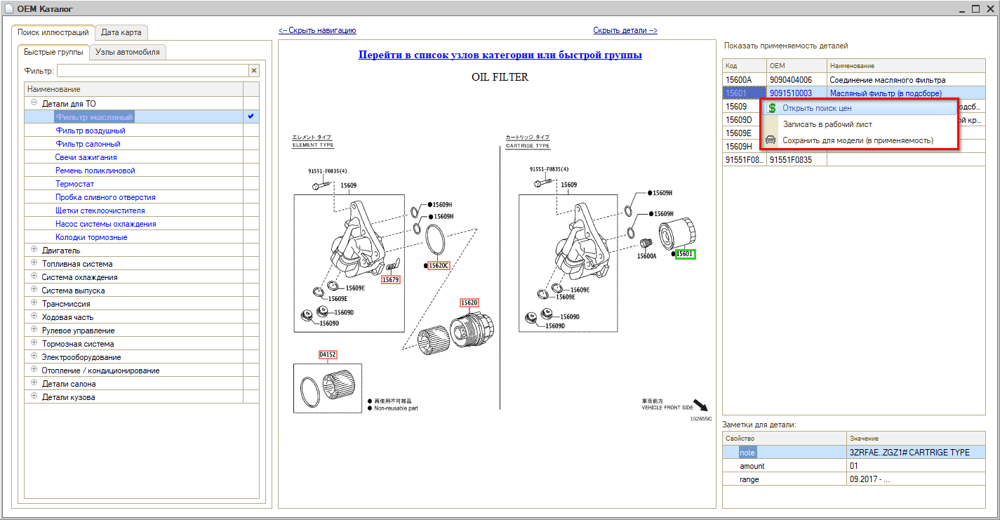

Найденную в каталоге запчасть можно **проценить** – открыть "Поиск цен", либо "Сохранить для модели (в Применяемость)". Использование **Применяемости** позволит впоследствии упростить многие процессы.

В открывшемся окне "Добавление применяемости" указан кузов, двигатель, КПП – это условия, при которых деталь будет предлагаться. Если какие-то из условий не важны – их нужно снять.

При заполнении параметра “Деталь” открывается каталог "Детали применяемости". Требуется найти нужное наименование и нажать "Выбрать":

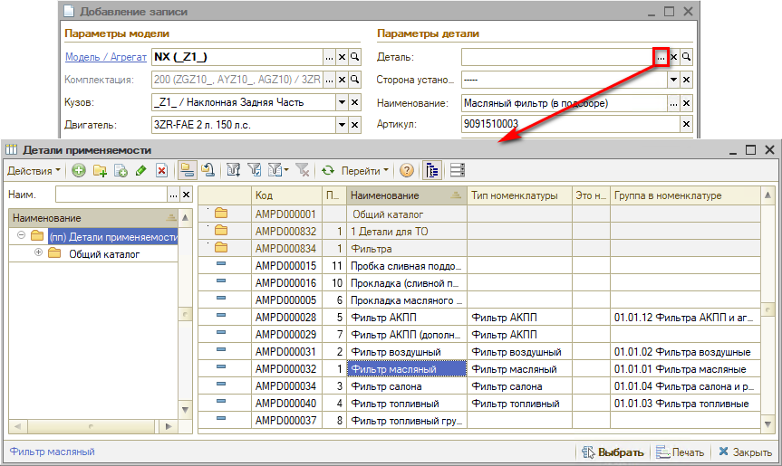

Затем программа предлагает выбрать сторону установки:

После заполнения всех необходимых параметров следует нажать “ОК” – деталь записана в Применяемость:

Подобранные в каталоге детали добавляются во вкладку «Подбор “Рабочий лист”», в применяемость для этой модели. Если "встать" на деталь, внизу во вкладке "Подбор авторабот" отобразятся связанные с ней работы – можно их выбрать в Корзину:

**Поиск цен (поиск з/ч на складе)**:

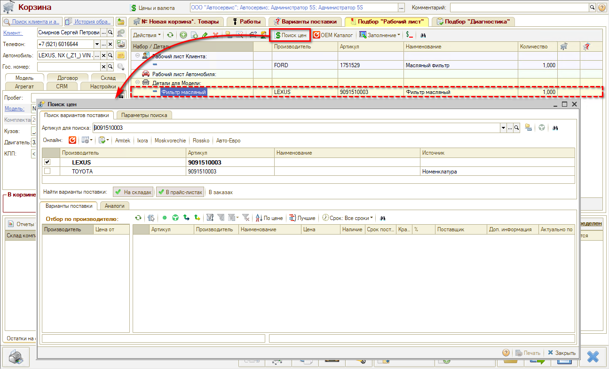

Если на складе детали нет (вкладка "Остатки на складах"), требуется ее найти в каталогах у поставщиков. Используется поиск онлайн в каталогах поставщиков: отображаются Варианты поставки – оригиналы и аналоги.

 – Оригинальный артикул;  – Группа аналогов;  – Аналог из онлайн-каталога;  – Аналог от Веб-поставщиков

Можно использовать сортировку по цене или по сроку поставки.

Собственная база аналогов будет наполняться по мере работы с механизмом применяемости.

### Составление калькуляции

Найденные варианты деталей можно добавлять в Варианты поставки (чтобы они не влияли на итоговую сумму), после согласования с клиентом нужный вариант перенести в Корзину. Добавлены товары и работы (контролирует мастер), выходит общая сумма. Если клиент с ней согласен, можно записывать его на ремонт.

P.S. Изменения в Корзине можно сохранить и вернуться к работе позднее или создать на основании Корзины документы: заказ-наряд, заказ покупателя, заказ поставщику и т.д. Документы создаются на основе параметров Корзины и подобранных товаров, и работ.

*Данные из корзины можно распечатать:*

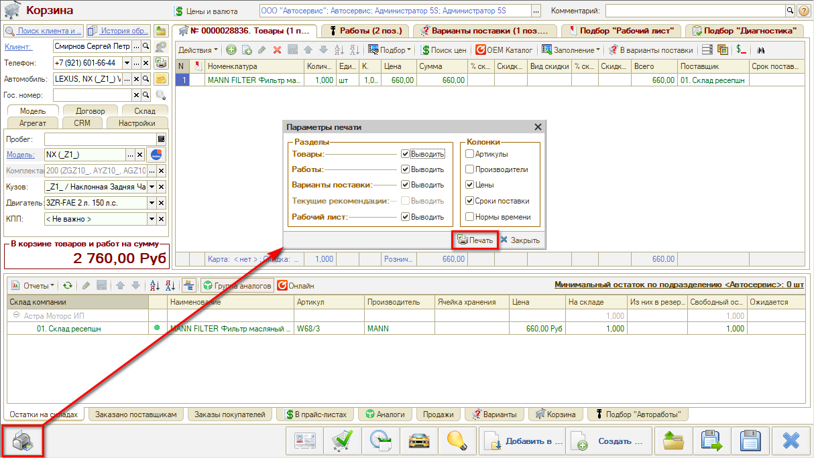

*или отправить клиенту на электронную почту или в мессенджер:*

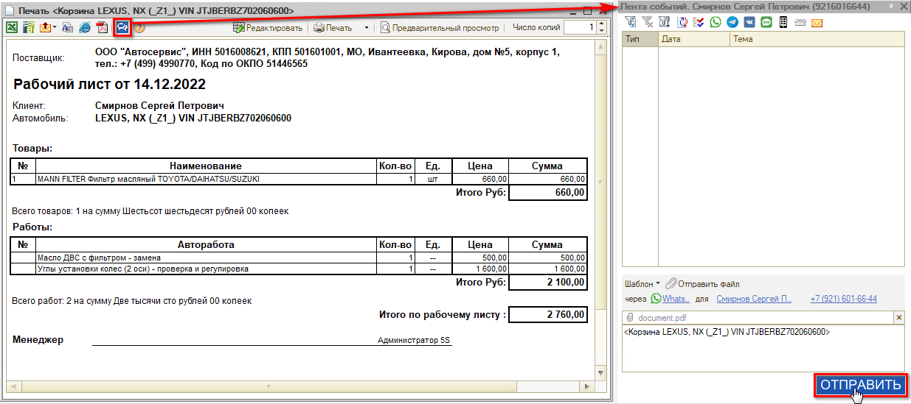

### Заказ запчастей

**Создание "Заказа покупателя"** производится из Корзины нажатием на кнопку "Создать".

Если товар есть в наличии, произойдет резервирование товаров под данного клиента. Если товара в наличии нет, то он зарезервируется, когда поступит – через документ "Заказ покупателя".

Использование кнопки "Состояние" позволяет увидеть, что происходит с каждой деталью. Если товаров в наличии нет, требуется сделать "Заказ поставщику".

**Создание "Заказа поставщику"** производится из документа "Заказ покупателя" кнопкой "Ввести на основании" → Заказ поставщику". Подгружаются необходимые значения. Следует контролировать срок поставки.

После проведения Заказа поставщику заказ автоматически отправляется на сайт (у большинства поставщиков).

**Помощник оформления "Заказа покупателя"**

Помощник оформления Заказа покупателя используется, если во вкладке Корзины "Товары" добавлены товары от разных поставщиков. Кнопка «Перейти в Помощник оформления “Заказа покупателя”» → режим Заказ и отгрузка товара.

В поле “Создаваемые документы” поставить галочку “Заказы поставщикам”:

Будут созданы Заказ покупателя на эту Корзину и Заказы поставщикам.

**Создание "Поступления товара":**

Документ "Поступление товара" создается на основании Заказа поставщику кнопкой "Ввести на основании".

Если на основании нескольких заказов – создать отдельно новый документ в реестре документов "Поступление товаров". Выбрать поставщика. Нажать "Заполнить заказами контрагенту". Заполнятся все товары, заказанные данному поставщику. Удалить лишние позиции (которые еще не поступили) и нажать "Ок".

**Создание "Реализации товара"**

Для реализации поступившего товара покупателю, на основании Заказа покупателя создается документ “Реализация товаров”, затем вводится оплата по нему.

*Подробнее см. курсы "[Подбор запчастей и работ](../../Урок%206.%20Подбор%20запчастей%20и%20работ/)", "[Онлайн-каталог запчастей](../../Урок%207.%20Онлайн-каталог%20запчастей/)", "[Работа с Поиском цен](../../Урок%209.%20Работа%20с%20Поиском%20цен/)" и статьи "[Работа с АРМ Корзина](../../../articles/5S%20AUTO/Проценка%20запчастей%20и%20работ/Работа%20в%20АРМ%20Корзина/rabota-v-arm-korzina.md)", "[Поиск цен](../../../articles/5S%20AUTO/Проценка%20запчастей%20и%20работ/Поиск%20цен/poisk-cen.md)", "[Работа с применяемостью](../../../articles/5S%20AUTO/Склад%20и%20запчасти/Применяемость%20запчастей/Работа%20с%20применяемостью/rabota-s-primenyaemostyu.md)" и [другие](../../../articles/).*

## Планирование работ

### Переход к Записи на ремонт

Если в Корзине добавлены автоработы, из нее можно перейти в АРМ "Запись на ремонт" – откроется клиент в контексте Корзины.

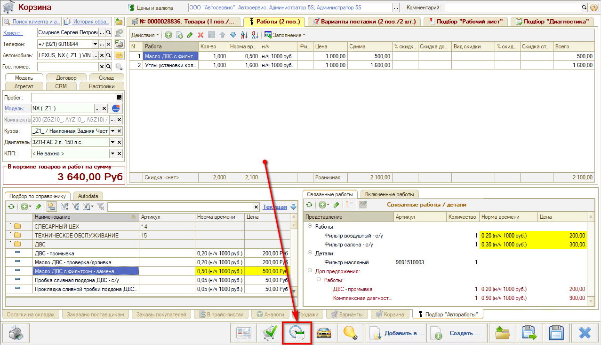

Также можно перейти в Запись на ремонт из Сделки.

Чтобы записать клиента, отдельно нажимать кнопку "Запись на ремонт" на боковом меню интерфейса не требуется. Отдельно в "Запись на ремонт" заходить нужно будет только в одном случае – чтобы посмотреть запись.

### Интерфейс

АРМ "Запись на ремонт" представляет собой календарь для планирования работ на текущий месяц. Запись на ремонт может быть представлена по месяцам или по дням, по цехам или по исполнителям.

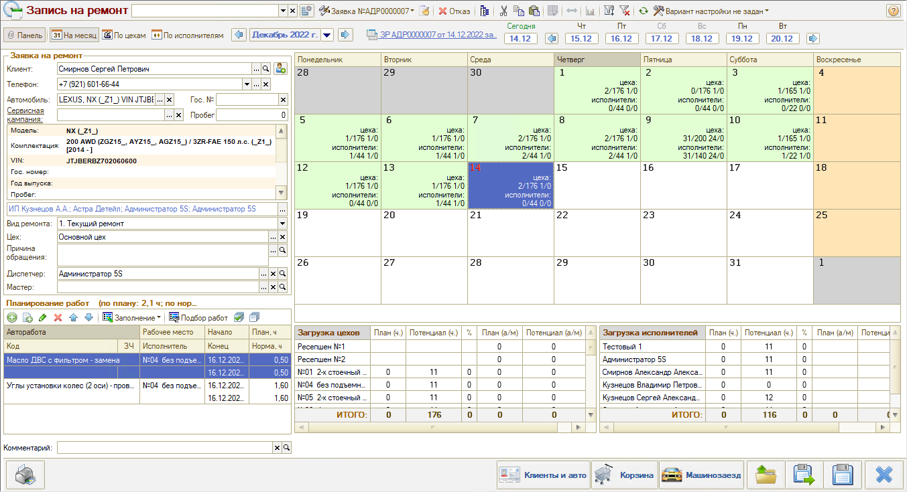

Дни в планировщике на месяц выделены различным цветом:

- Серый цвет – дни, относящиеся к другому месяцу, недоступны для планирования.
- Оранжевый цвет – выходные дни.
- Белый цвет – рабочие дни, где нет еще ни одной записи на ремонт.
- Зеленый цвет – дни, где есть минимум одна запись на ремонт.

Заявку на ремонт требуется сохранить. Создастся задача "Примите автомобиль клиента" на запланированную дату.

### Документ План ремонта (заявка на ремонт)

При сохранении записи на ремонт создается документ "Заявка на ремонт" с видом операции "План ремонта".

У Заявки на ремонт есть несколько операций:

- собственно Заявка на ремонт,
- План ремонта,
- Калькуляция (не используется, вместо нее работа в Корзине).

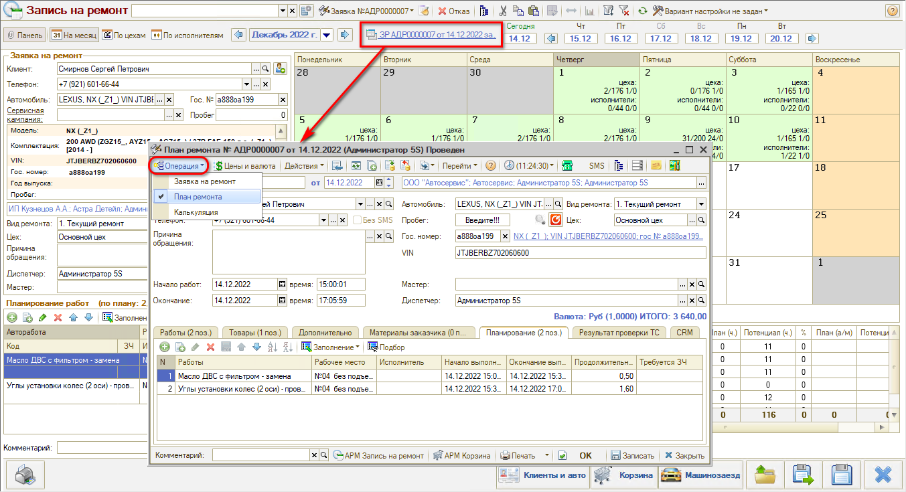

В Заявке на ремонт указано: работы, время начала ремонта.

В Плане ремонта указано: начало работ, окончание работ, и во вкладке "Планирование" (которая есть только в Плане ремонта) – конкретные работы, начало выполнения, окончание выполнения, пост, продолжительность и т.д. План ремонта – это подготовительный документ между фактом записи на ремонт и перед заездом клиента.

Сюда можно добавлять подборы запчастей, работы, изменения (перенесение сроков и т.д.).

Поле "Мастер" может заполняться автоматически или вручную. "Диспетчер" – тот, кто произвел запись.

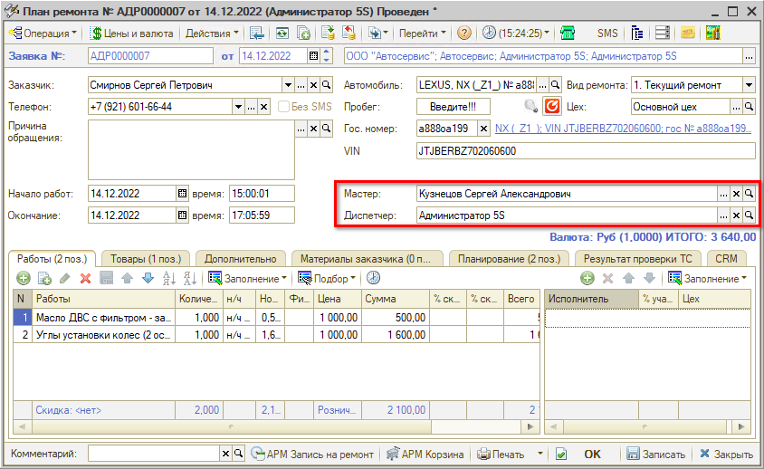

Если клиент отказался до заезда от ремонта, эта отмена делается в Плане ремонта на вкладке Дополнительно (состояние "Отклонено"):

или непосредственно в планировщике, через кнопку “Отказ”.

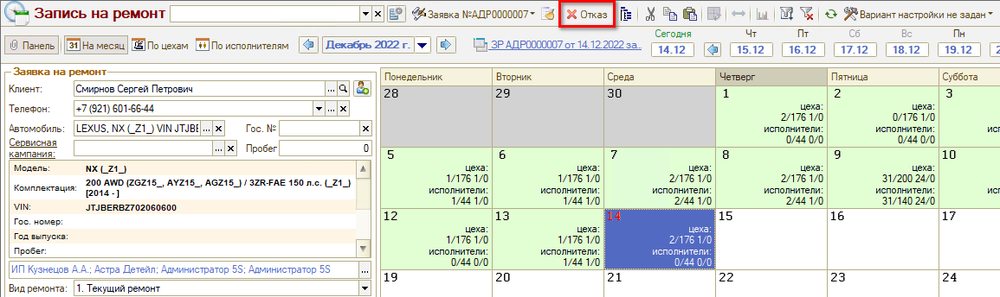

*Подробнее см. курс "[Запись на ремонт](../../Урок%208.%20Запись%20на%20ремонт/)" и статьи в разделе "[Запись на ремонт](../../../articles/5S%20AUTO/Запись%20на%20ремонт/)" в Базе знаний.*

---

**Теги:** автосервис, краткий курс, видеоурок, калькуляция, запись на ремонт, планирование работ
