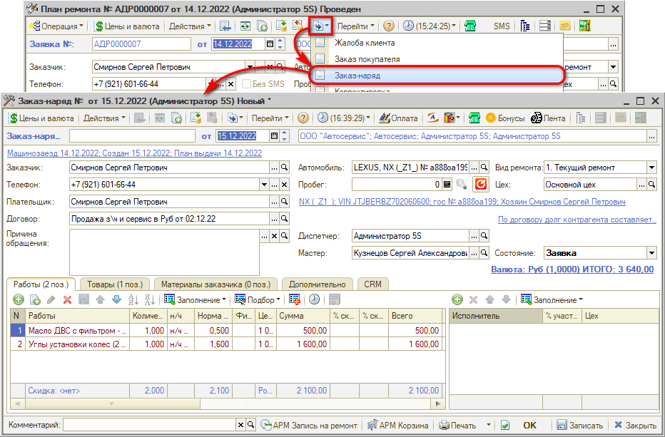
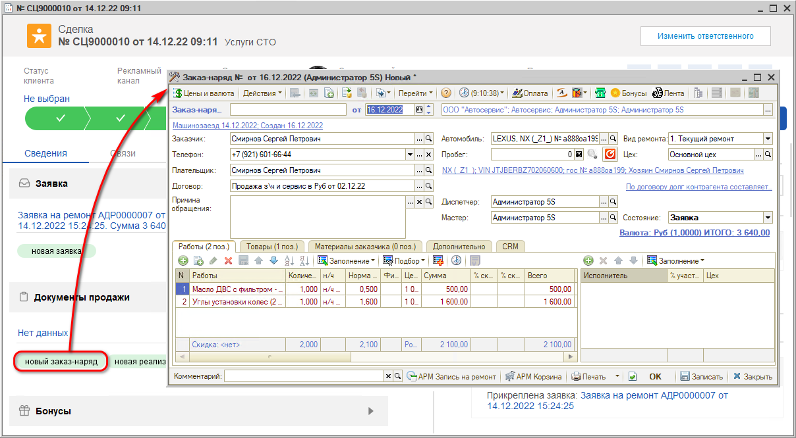
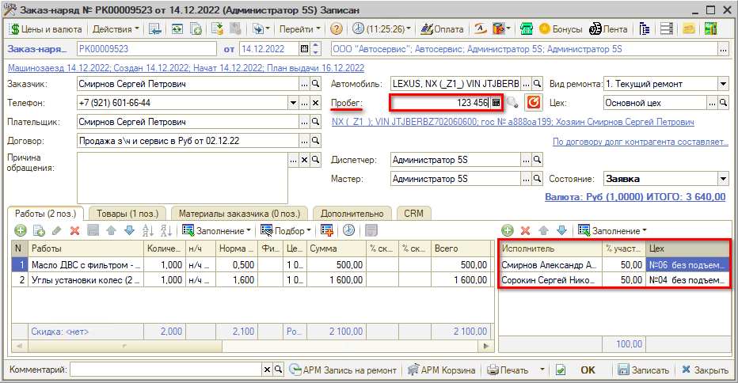
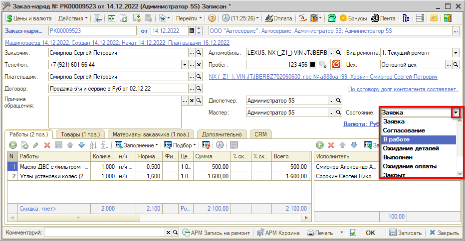
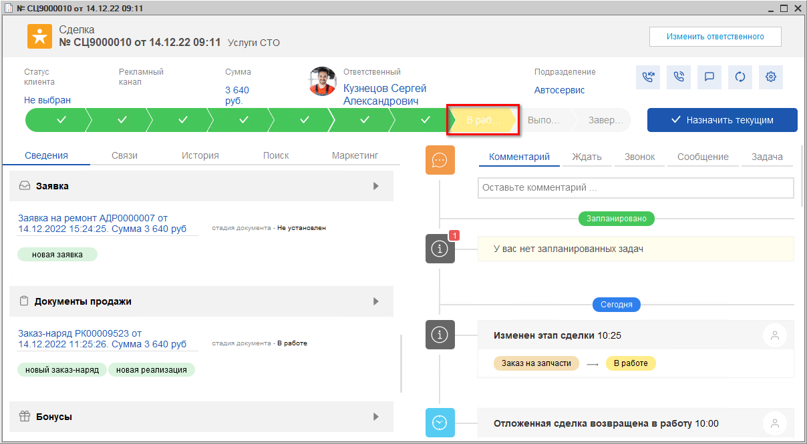
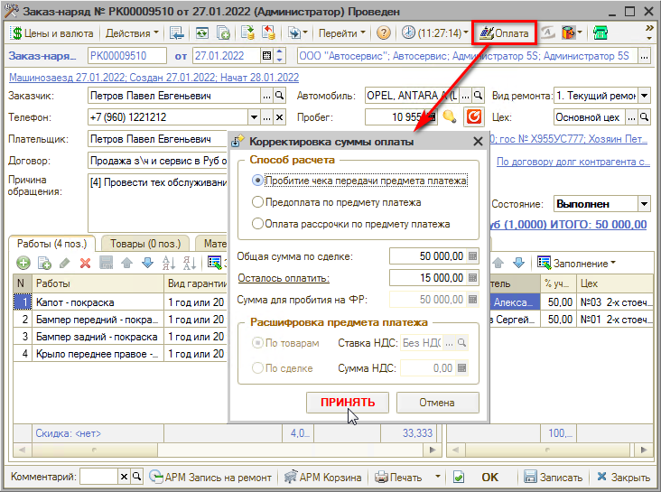
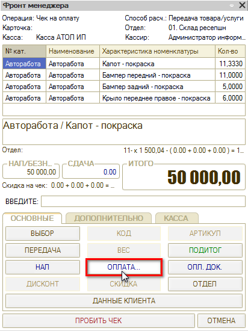

# Видеоурок "Оформление заказ-наряда и прием оплаты"

<table><tr><td><b>Время чтения:</b> 9 мин.</td><td><b>Обновлено:</b> 12.09.2024</td></tr></table>

Источник: https://www.5systems.ru/help/videourok-oformlenie-zakaz-naryada-i-priem-oplaty

## Содержание

1. [Работа с Заказ-нарядом](#работа-с-заказ-нарядом)
2. [Прием оплаты](#прием-оплаты)

*Видеоурок. Время просмотра – 3:30 мин.*

## Работа с Заказ-нарядом

Одним из основных документов 5S AUTO является заказ-наряд.

***Заказ-наряд*** – это чистовой вариант заполнения информации по выполнению работ и использованию в производстве запчастей. С помощью данного документа ведется учет выполнения ремонта.

Заказ-наряд формируется на основании Заявки на ремонт:

или из формы сделки путем нажатия на кнопку “Новый заказ-наряд”:

При этом из нее подгружаются все необходимые значения. Далее следует уточнить пробег, установить фактических исполнителей работ и распределить процент их участия:

В случае, если клиент привозит свои запчасти, можем использовать вкладку **“Материалы заказчика”**:

Возможны два способа работы с данным функционалом:

1) создать в номенклатуре папку «Материалы заказчика» и заполнить наименованиями основных деталей (без артикула), затем выбирать из списка нужные детали; 
2) добавить в номенклатуру элемент «Материалы заказчика»; конкретные детали, привезенные клиентом, записывать в примечании одной строкой, через запятую.

Информация о материалах заказчика из данной вкладки выводится в печатной форме Заказ-наряда (таблица «Перечень деталей клиента»).

В поле **“Состояние”** отображается текущее состояние заказ-наряда:

**Состояния Заказ-наряда:**

- “Заявка” – состояние приёма а/м; из Заказ-наряда в этом состоянии можно проверить все данные, создать и дополнить разделы карточки контрагента и карточки автомобиля, а также распечатать акт приема, сопроводительный лист и другие печатные формы для подготовки к заезду.
- “В работе” – исполнители приступают к работам в рамках заказ-наряда. При переходе в это состояние рекомендуется делать перемещение в производство товаров Заказ-наряда. При переводе в это состояние Заказ-наряд проводится.
- “Ожидание запчастей” – состояние устанавливается, когда требуется оформить или когда уже оформлен заказ поставщику по деталям Заказ-наряда и ожидается их поступление.
- “Выполнен” – состояние устанавливается, когда работы выполнены, все работы и товары занесены в Заказ-наряд, при этом все товары перемещены в производство. Перед выбором состояния требуется проверить правильность заполнения всех табличных частей, т.к. формируются рассылки сообщений, что работа выполнена на определенную сумму. При этом клиенту печатаются все необходимые печатные формы.
- “Закрыт” – заказ-наряд полностью выполнен и закрыт. Состояние недоступно, если Заказ-наряд не был переведен в состояние "Выполнен". Закрывать Заказ-наряд необходимо после полной оплаты по сделке. Означает окончание ремонтных работ и оформление всех необходимых документов с клиентом.
- “Отказ” – перевод Заказ-наряда в это состояние осуществляется, если выполнить ремонт не удалось по каким-то причинам (клиент отказался или невозможно выполнить ремонт со стороны СТО).

Переход из одного в состояния в другое не выполняется автоматически – его нужно менять вручную. Это необходимо для определения и фиксации стадии выполнения ремонта.

При открытии заказ-наряда сделка автоматически переходит на этап “В работе”:

и перемещается на канбане:

После передачи автомобиля в цех для выполнения работ меняем статус документа Заказ-наряд на “В работе” и перемещаем товары в производство.

После завершения работ актуализируем в заказ-наряде исполнителя работ и меняем состояние документа на “Выполнен”. При этом сделка тоже автоматически переместится на этап “Выполнен”.

Сообщаем клиенту что работы по заказ-наряду завершены, распечатываем закрывающие документы и принимаем оплату (проверить, что *вид ремонта* платный).

После этого передаем автомобиль владельцу, проверяем все данные и меняем статус документа на “Закрыт”. Сделка успешно завершена.

*Подробнее см. курс уроков "[Работа с Заказ-нарядами](../../Урок%2010.%20Работа%20с%20Заказ-нарядами/)" и статью "[Заказ-наряды](../../../articles/5S%20AUTO/Автосервис/Работа%20с%20Заказ-нарядами/Заказ-наряды/zakaz-naryady.md)".*

## Прием оплаты

Чтобы принять оплату по документу, следует нажать кнопку “Оплата” на верхней панели формы документа:

Открывается форма *"Корректировка суммы оплаты"*. Выберите *Способ расчета*:

- При полной оплате выбираем пункт *"Пробитие чека передачи предмета платежа"* (ставится автоматически по умолчанию).
- Если нужно принять предоплату, то выбираем *"Предоплата по предмету платежа"* и корректируем *"Сумму для пробития на ФР"* – сколько укажете, на такую сумму и выйдет чек.
- *! Способ расчета “Оплата рассрочки по предмету платежа” никогда не используем (используется автоматически только при оплате через ПКО).*

Если ранее была внесена предоплата по сделке, то появится форма для зачета аванса:

Нажимаем кнопку *"Да"*, если была предоплата и клиенту нужно доплатить оставшуюся сумму.

Нажимаем кнопку *“Принять”* на форме "Корректировка суммы оплаты".

Открывается форма *"Фронт менеджера"*, данные которой заполнены в соответствии с документом, откуда инициирована оплата (в данном случае – Заказ-наряд):

Если требуется принять оплату только наличными, то следует нажать кнопку *"НАЛ"* и *“ПРОБИТЬ ЧЕК”* – вся оплата производится наличным способом. *Если сразу нажать кнопку «ПРОБИТЬ ЧЕК» программа пробьет всю сумму как наличные.*

Если предстоит  безналичная или смешанная оплата, нажимаем клавишу *"ОПЛАТА…"* – открывается форма "Оплаты" с доступными типами оплат по данному фискальному регистратору, где указывается каким способом производится оплата (например, часть наличным, часть картой):

Вводим сумму, которую нужно принять наличными, нажимаем “Заполнить ост.” – программа сама заполнит оставшуюся часть.

После настройки способа оплаты нажмите кнопку *"Принять"*.

Затем на форме "Фронт менеджера" нажимаем кнопку *"ПРОБИТЬ ЧЕК"*. В результате происходит печать чека на ФР и формирование документа "Чек на оплату":

**Учет предоплаты**

По “Заказу покупателя” можно принять только предоплату – частичную или полную. По “Реализации товаров” можно принять предоплату или окончательный расчет. Окончательный расчет принимается только по “Реализации товаров” и по Заказ-наряду.

Если клиент вносил предоплату, то при окончательном расчете эта сумма должна быть пробита с указанием типа оплаты "Зачет аванса".

Если была внесена полная предоплата, то правильно будет ещё раз провести оплату, указав способ “Пробитие чека передачи предмета” платежа.

Если была внесена частичная предоплата, то следует ввести зачет аванса, а оставшуюся сумму нужно заполнить в соответствии с типом оплаты (наличными или картой). Сумма для пробития на ФР должна стоять общая по документу.

Затем нужно нажать “Принять” и на форме "Фронт менеджера" – "ПРОБИТЬ ЧЕК". Пробивается второй (окончательный) чек, в нем должна быть итоговая сумма – полная по документу. Формируется документ "Чек на оплату".

*Подробнее см. курс уроков “*[*Как принять оплату*](https://5systems.ru/help/kak-prinyat-oplatu)*” и статью “*[*Порядок работы с кассами ККМ*](../../../articles/5S%20AUTO/Касса/Порядок%20работы%20с%20кассами%20ККМ/poryadok-raboty-s-kassami-kkm.md)”.

---

**Теги:** автосервис, краткий курс, видеоурок, заказ-наряд, прием оплаты

