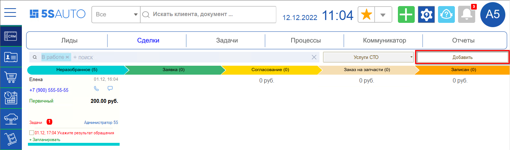
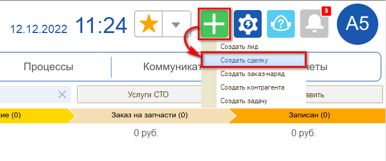
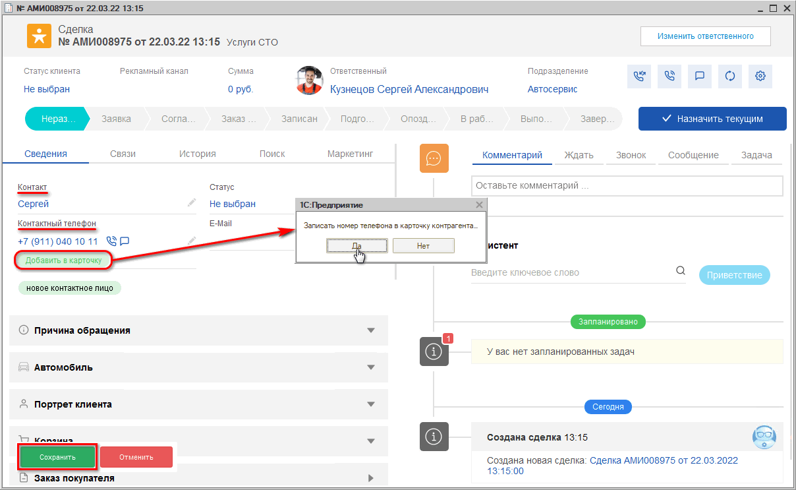
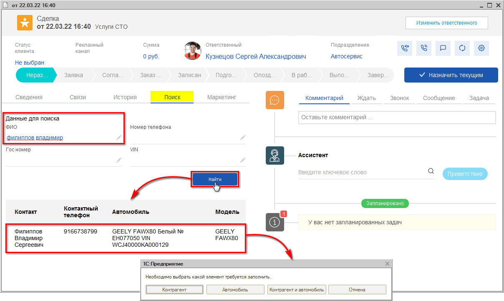
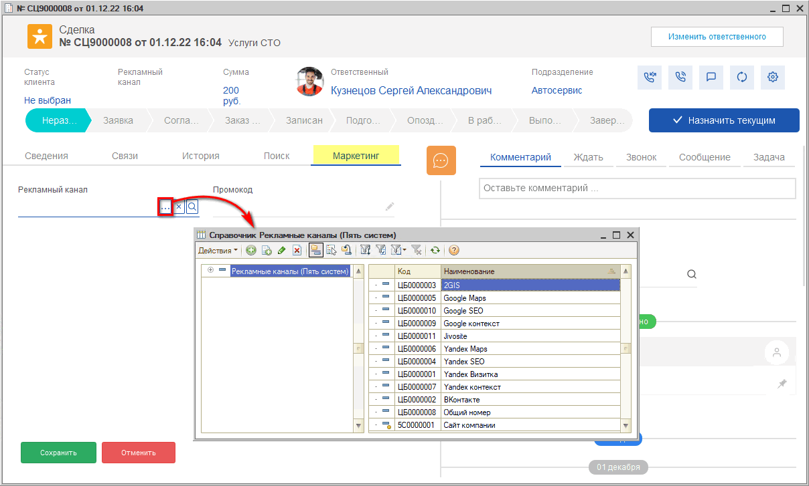
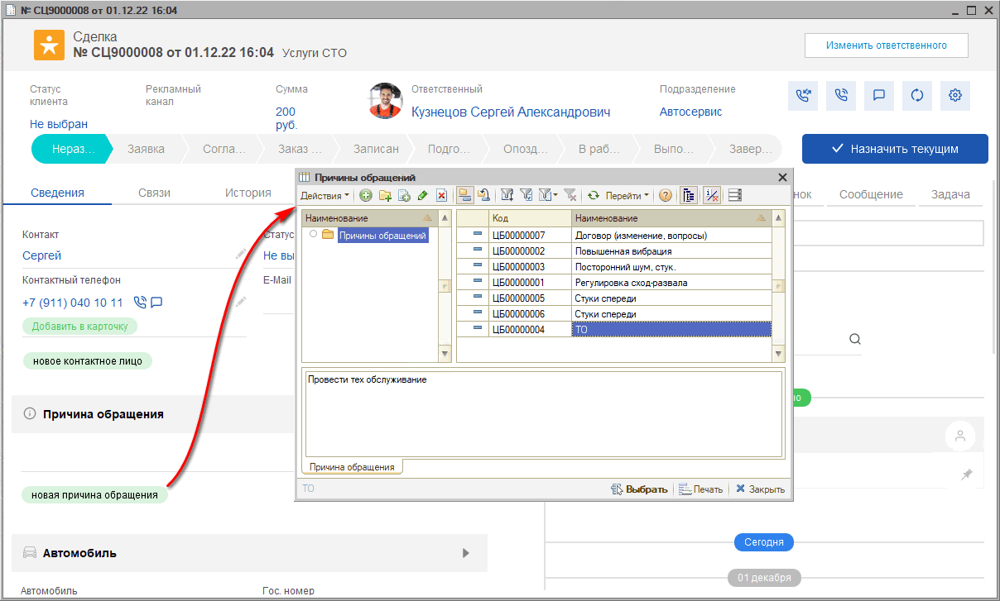
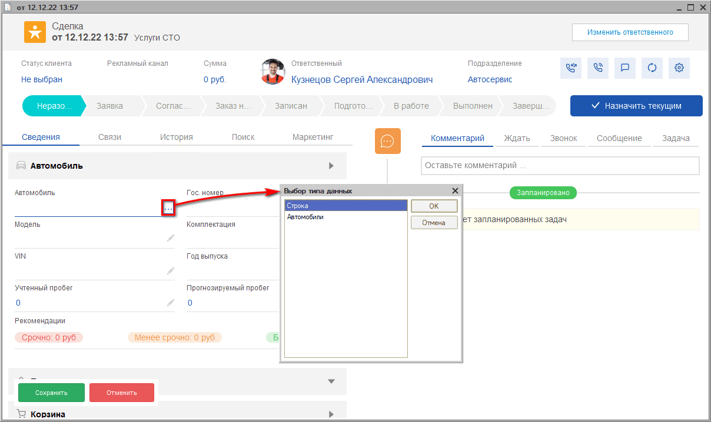
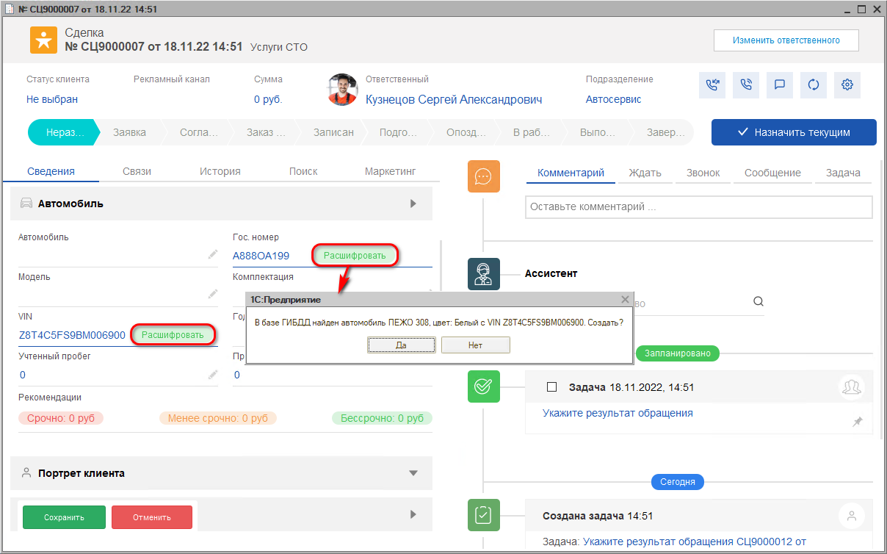
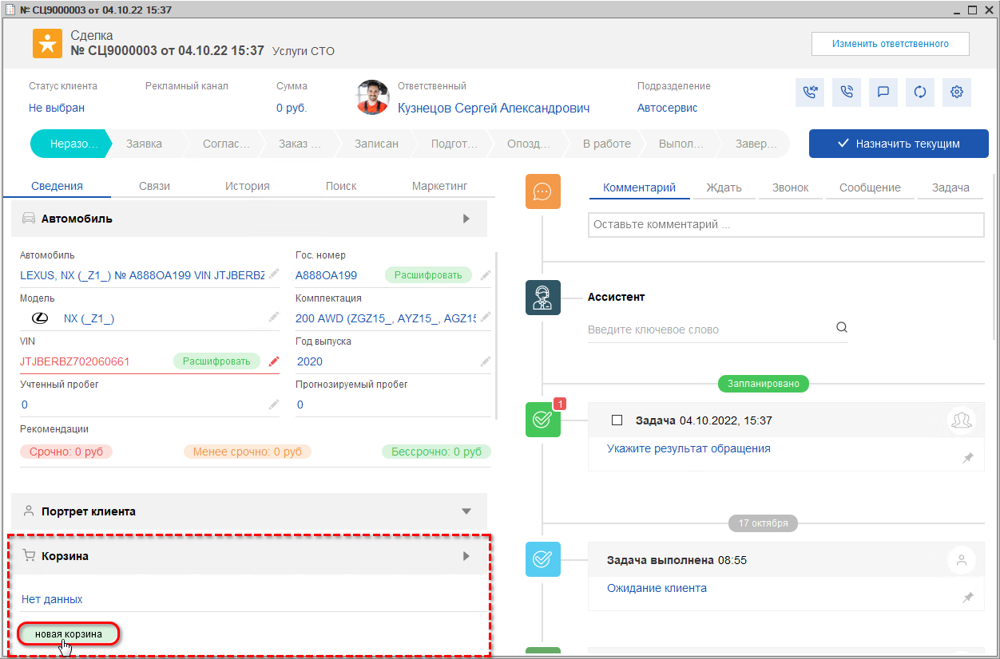

# Видеоурок "Регистрация обращения"

<table><tr><td><b>Время чтения:</b> 7 мин.</td><td><b>Обновлено:</b> 12.09.2024</td></tr></table>

Источник: https://www.5systems.ru/help/videourok-registraciya-obrascheniya

## Содержание

1. [Как фиксируется в программе обращение клиента?](#как-фиксируется-в-программе-обращение-клиента)
2. [Как зарегистрировать обращение клиента через форму Сделки?](#как-зарегистрировать-обращение-клиента-через-форму-сделки)
   - [Порядок заполнения сделки](#порядок-заполнения-сделки)

*Видеоурок. Время просмотра – 3:50 мин.*

## Как фиксируется в программе обращение клиента?

Центральным элементом интерфейса 5S Auto является сделка. **Сделка** представляет собой зафиксированное в программе обращение клиента.

При каждом новом обращении, – входящее письмо, звонок, сообщение в чате, – автоматически создается сделка.  При необходимости сделку можно добавить вручную.

Отображение текущих сделок на одном экране позволяет оперативно оценить обстановку и не пропустить важные события.

Сделки имеют статусы, которые обозначают этап работы с клиентом, и автоматически перемещаются. У каждой сделки есть начало и конец, т.е. сделка проходит несколько этапов – от первого контакта с клиентом до успешной продажи.

## Как зарегистрировать обращение клиента через форму Сделки?

Создать сделку можно несколькими способами:

- через кнопку «Добавить»:  
  
- или через кнопку быстрого добавления:  
  

Создавать сделку вручную не потребуется, если в программу интегрирована IP-телефония и мессенджеры. В таком случае во время обращения клиента сделка создастся автоматически и сразу отобразится номер телефона звонящего.

При обращении ***первичного*** клиента, т.е. того, который позвонил или приехал первый раз, требуется заполнить данные клиента.

Данные по автомобилю клиента потребуется ввести либо сразу, либо после записи на ремонт, при непосредственном заезде клиента.

При звонке ***повторного*** клиента в сделке уже есть его ФИО и информация об автомобилях клиента, а также история всех его предыдущих обращений, включая документы, задачи, рекомендации и т.д.

### Порядок заполнения сделки

***1. Заполните данные клиента***

Если клиент новый, нужно спросить имя или Ф.И.О. и ввести в соответствующую строку. Это уже уникальный клиент (по номеру телефона). Соответственно можно создать карточку клиента.

После того как записали в строку ФИО или имя клиента, ***добавьте их в карточку клиента!***

Только при условии, что данные добавлены в карточку, в дальнейшем они автоматически подтянутся в Корзину, Заявку на ремонт, Заказ покупателя или Заказ-наряд.

Если клиент уже есть в базе, но звонит с нового номера телефона, воспользуйтесь быстрым механизмом поиска клиента во вкладке "Поиск".

Поиск поможет избежать создания дублирующих данных.

Можно искать по любому из указанных параметров: ФИО, номер телефона, гос. номер, VIN.

Далее следует выбрать, какие данные нужно подтянуть в сделку: только клиента, только автомобиль, или и данные клиента, и данные автомобиля.

*Например: в случаях, когда клиент является заказчиком, но не является владельцем автомобиля, вы подтягиваете только данные контрагента.*

Дополнить карточку клиента дополнительными сведениями – полные ФИО, пол, прикрепить документы, добавить доп. номер и прочее – можно в любое время.

*В случае, если ваша компания собирает аналитику по источникам рекламы, в разделе "Маркетинг" можно указать информацию, откуда клиент о вас узнал.*

Если рекламные каналы уже настроены, то в сделке автоматически распознается, с какого канала рекламы к нам пришло данное обращение.

***2. Укажите причину обращения клиента***

Её можно ввести строкой в ручном режиме, либо выбрать из списка, который можете создать самостоятельно:

Например, можно добавить следующие причины обращения:

- “Услуги по ремонту” – например: ремонт, шиномонтаж, мойка. Далее последуют проценка и запись на ремонт.
- “Запасные части” – если клиент хочет купить запчасть. Далее последует поиск, проценка запчасти, резервирование на складе либо заказ у поставщика.
- “Повторное обращение”.
- “Возврат товара”.
- “Гарантийный ремонт” и т.д.

***3. Введите данные по автомобилю клиента***

Если клиент повторный, то автомобиль и прочие сведения о клиенте заполнятся автоматически. Для новых клиентов потребуется создать автомобиль.

На первоначальном этапе в сделку достаточно ввести только название автомобиля. Можно сделать это строкой, не создавая карточку авто. Когда клиент приедет к нам, мы сможем заполнить карточку полностью.

Если клиент заказывает запчасти дистанционно или хочет подобрать работы и записаться прямо сейчас, то создать автомобиль и сделать его расшифровку можно сразу.

Получить данные по комплектации автомобиля можно двумя способами:

- С помощью расшифровки VIN номера;
- С помощью расшифровки Гос. номера (при наличии оплаченных пакетов расшифровок).

Если расшифровка автомобиля указанными способами не представляется возможной, то создайте новый автомобиль клиента, выбирая нужную марку и модель из имеющегося в программе каталога Tecdoc.

Но проще и правильнее всего перейти из обращения в Корзину для проценки и подбора товаров и авторабот: нажать на зеленый значок с надписью «Новая корзина» и уже там расшифровать автомобиль.

*Подробнее см. курс "[CRM](../../Урок%201.%20CRM/)" и статьи в разделах "[CRM](../../../articles/5S%20AUTO/CRM/)" и "[Работа с клиентами](../../../articles/5S%20AUTO/Работа%20с%20клиентами/)" на Базе знаний.*

---

**Теги:** автосервис, краткий курс, видеоурок, обращение клиента, сделка, CRM

