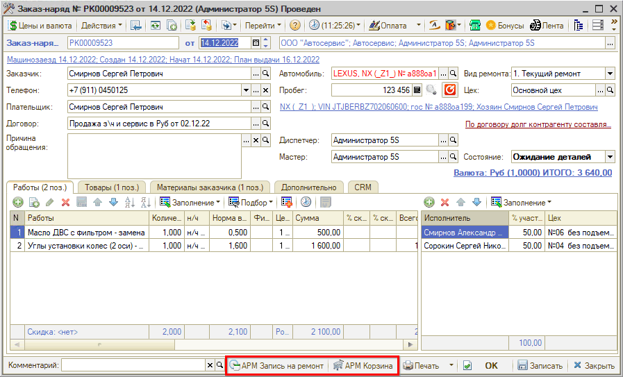
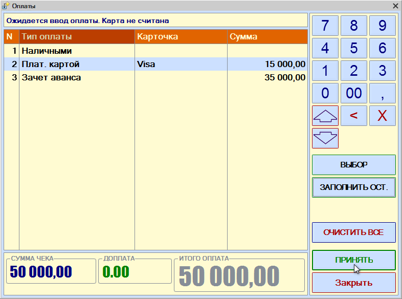
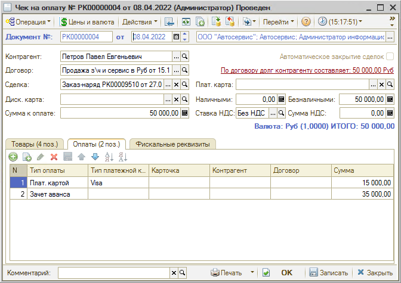

# Выполнен

<table><tr><td><b>Время чтения:</b> 5 мин.</td><td><b>Обновлено:</b> 12.12.2023</td></tr></table>

Источник: https://www.5systems.ru/help/vypolnen

До перевода Заказ-наряда на этап "Выполнен" в него могут быть внесены изменения:

- чтобы добавить товары и услуги, нужно перейти из Заказ-наряда в Корзину;
- чтобы сдвинуть время записи, нужно перейти в Запись на ремонт.

Для этого используются кнопки на нижней панели документа:

Сообщаем клиенту что работы по заказ-наряду завершены, распечатываем закрывающие документы и принимаем оплату (проверить, что *вид ремонта* платный).

## Прием оплаты

Чтобы принять оплату по документу, следует нажать кнопку “Оплата” на верхней панели формы документа:

Открывается форма *"Корректировка суммы оплаты"*. Выберите *Способ расчета*:

- При полной оплате выбираем пункт *"Пробитие чека передачи предмета платежа"* (ставится автоматически по умолчанию).
- Если нужно принять предоплату, то выбираем *"Предоплата по предмету платежа"* и корректируем *"Сумму для пробития на ФР"* – сколько укажете, на такую сумму и выйдет чек.
- *! Способ расчета “Оплата рассрочки по предмету платежа” никогда не используем (используется автоматически только при оплате через ПКО).*

Если ранее была внесена предоплата по сделке, то появится форма для зачета аванса:

Нажимаем кнопку *"Да"*, если была предоплата и клиенту нужно доплатить оставшуюся сумму.

Нажимаем кнопку *“Принять”* на форме "Корректировка суммы оплаты".

Открывается форма *"Фронт менеджера"*, данные которой заполнены в соответствии с документом, откуда инициирована оплата (в данном случае – Заказ-наряд):

Если требуется принять оплату только наличными, то следует нажать кнопку *"НАЛ"* и *“ПРОБИТЬ ЧЕК”* – вся оплата производится наличным способом. *Если сразу нажать кнопку «ПРОБИТЬ ЧЕК» программа пробьет всю сумму как наличные.*

Если предстоит  безналичная или смешанная оплата, нажимаем клавишу *"ОПЛАТА…"* – открывается форма "Оплаты" с доступными типами оплат по данному фискальному регистратору, где указывается каким способом производится оплата (например, часть наличным, часть картой):

Вводим сумму, которую нужно принять наличными, нажимаем “Заполнить ост.” – программа сама заполнит оставшуюся часть.

После настройки способа оплаты нажмите кнопку *"Принять"*.

Затем на форме "Фронт менеджера" нажимаем кнопку *"ПРОБИТЬ ЧЕК"*. В результате происходит печать чека на ФР и формирование документа "Чек на оплату":

**Учет предоплаты**

По “Заказу покупателя” можно принять только предоплату – частичную или полную. По “Реализации товаров” можно принять предоплату или окончательный расчет. Окончательный расчет принимается только по “Реализации товаров” и по Заказ-наряду.

Если клиент вносил предоплату, то при окончательном расчете эта сумма должна быть пробита с указанием типа оплаты "Зачет аванса".

Если была внесена полная предоплата, то правильно будет ещё раз провести оплату, указав способ “Пробитие чека передачи предмета” платежа.

Если была внесена частичная предоплата, то следует ввести зачет аванса, а оставшуюся сумму нужно заполнить в соответствии с типом оплаты (наличными или картой). Сумма для пробития на ФР должна стоять общая по документу.

Затем нужно нажать “Принять” и на форме "Фронт менеджера" – "ПРОБИТЬ ЧЕК". Пробивается второй (окончательный) чек, в нем должна быть итоговая сумма – полная по документу. Формируется документ "Чек на оплату".

*Подробнее см. курс уроков “*[*Как принять оплату*](https://5systems.ru/help/kak-prinyat-oplatu)*” и статью “*[*Порядок работы с кассами ККМ*](../../../articles/5S%20AUTO/Касса/Порядок%20работы%20с%20кассами%20ККМ/poryadok-raboty-s-kassami-kkm.md)”.

После успешной работы переводим документ в состояние "Выполнен" и проводим. Окна Заказа и Сделки можно закрыть.

После этого передаем автомобиль владельцу, проверяем все данные и меняем статус документа на “Закрыт”. Сделка успешно завершена.

 

*[← Предыдущий урок "В работе"](../В%20работе/v-rabote.md)* &nbsp;&nbsp;&nbsp;&nbsp;&nbsp;&nbsp; [*Следующий урок "Обращение первичного клиента" →*](../Обращение%20первичного%20клиента/obraschenie-pervichnogo-klienta.md)

---

**Теги:** автосервис, краткий курс, прием оплаты, заказ-наряд, закрытие сделки
