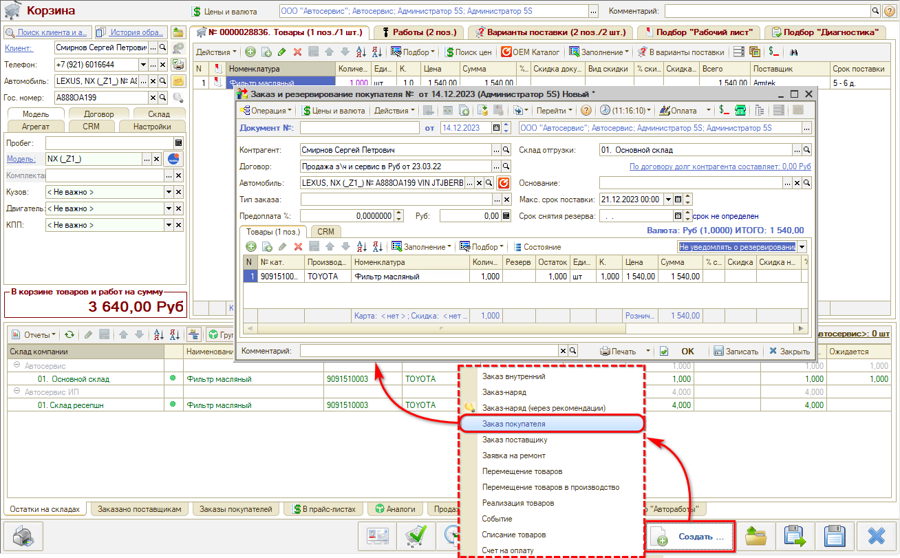
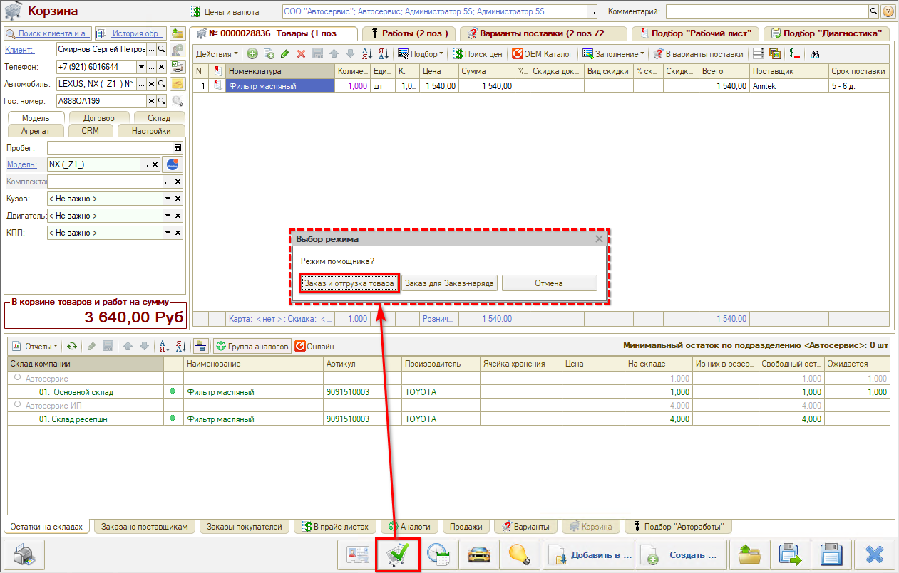
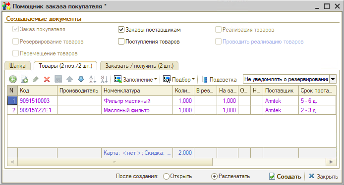

# Заказ запчастей

<table><tr><td><b>Время чтения:</b> 7 мин.</td><td><b>Обновлено:</b> 12.12.2023</td></tr></table>

Источник: https://www.5systems.ru/help/zakaz-zapchastey

**Создание "Заказа покупателя"** производится из Корзины нажатием на кнопку "Создать":

Если товар есть в наличии, произойдет резервирование товаров под данного клиента. Если товара в наличии нет, то он зарезервируется, когда поступит – через документ "Заказ покупателя".

Использование кнопки "Состояние" позволяет увидеть, что происходит с каждой деталью. Если товаров в наличии нет, требуется сделать "Заказ поставщику".

**Создание "Заказа поставщику"** производится из документа "Заказ покупателя" кнопкой "Ввести на основании" → "Заказ поставщику". Подгружаются необходимые значения. Следует контролировать срок поставки.

После проведения Заказа поставщику заказ автоматически отправляется на сайт (у большинства поставщиков).

**Помощник оформления "Заказа покупателя"** используется, если во вкладке Корзины "Товары" добавлены товары от разных поставщиков. Перейти можно из Корзины по кнопке *«Перейти в Помощник оформления “Заказа покупателя”» →* режим *Заказ и отгрузка товара:*

В разделе “Создаваемые документы” поставить галочку “Заказы поставщикам”:

Будут созданы Заказы покупателя на эту Корзину и Заказы поставщикам.

**Создание "Поступления товара":**

Документ "Поступление товара" создается на основании Заказа поставщику кнопкой "Ввести на основании".

Если на основании нескольких заказов – создать отдельно новый документ в реестре документов "Поступление товаров". Выбрать поставщика. Нажать "Заполнить заказами контрагенту". Заполнятся все товары, заказанные данному поставщику. Удалить лишние позиции (которые еще не поступили) и нажать "Ок".

**Создание "Реализации товара"**

Для реализации поступившего товара покупателю, на основании Заказа покупателя создается документ “Реализация товаров”, затем вводится оплата по нему.

*Подробнее см. курсы:*

- *[Подбор запчастей и работ](../../Урок%206.%20Подбор%20запчастей%20и%20работ/)*
- *[Онлайн-каталог запчастей](../../Урок%207.%20Онлайн-каталог%20запчастей/)*
- *[Работа с Поиском цен](../../Урок%209.%20Работа%20с%20Поиском%20цен/)*

*и статьи:*

- *[Работа с АРМ Корзина](../../../articles/5S%20AUTO/Проценка%20запчастей%20и%20работ/Работа%20в%20АРМ%20Корзина/rabota-v-arm-korzina.md)*
- *[Поиск цен](../../../articles/5S%20AUTO/Проценка%20запчастей%20и%20работ/Поиск%20цен/poisk-cen.md)*
- *[Работа с применяемостью](../../../articles/5S%20AUTO/Склад%20и%20запчасти/Применяемость%20запчастей/Работа%20с%20применяемостью/rabota-s-primenyaemostyu.md)*
- *[Работа с Заказами покупателя](../../../articles/5S%20AUTO/Работа%20с%20заказами/Работа%20с%20заказами%20покупателя/rabota-s-zakazami-pokupatelya.md) и [другие](../../../articles/).*

*[← Предыдущий урок "Согласование"](../Согласование/soglasovanie.md)* &nbsp;&nbsp;&nbsp;&nbsp;&nbsp;&nbsp; [*Следующий урок "Записан" →*](../Записан/zapisan.md)

---

**Теги:** автосервис, краткий курс, заказ запчастей, поиск цен, онлайн-каталог, заказ поставщику

