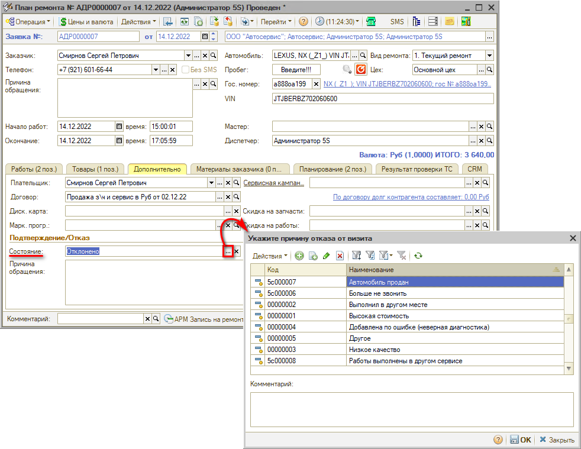

# Записан

<table><tr><td><b>Время чтения:</b> 7 мин.</td><td><b>Обновлено:</b> 12.12.2023</td></tr></table>

Источник: https://www.5systems.ru/help/zapisan

## Содержание

[Переход к Записи на ремонт](#переход-к-записи-на-ремонт)

1. [Интерфейс](#интерфейс)
2. [Документ План ремонта (Заявка на ремонт)](#документ-план-ремонта-заявка-на-ремонт)

## Переход к Записи на ремонт

Если в Корзине добавлены автоработы, из нее можно перейти в АРМ "Запись на ремонт" –запись откроется в контексте этой Корзины, подтянется клиент и все данные по ремонту:

Также можно перейти в Запись на ремонт из Сделки.

Чтобы записать клиента, отдельно нажимать кнопку "Запись на ремонт" на боковом меню интерфейса не требуется. Отдельно в "Запись на ремонт" заходить нужно будет только в одном случае – чтобы посмотреть запись.

### Интерфейс

АРМ "Запись на ремонт" представляет собой календарь для планирования работ на текущий месяц. Запись на ремонт может быть представлена по месяцам или по дням, по цехам или по исполнителям.

Дни в планировщике на месяц выделены различным цветом:

- Серый цвет – дни, относящиеся к другому месяцу, недоступны для планирования.
- Оранжевый цвет – выходные дни.
- Белый цвет – рабочие дни, где нет еще ни одной записи на ремонт.
- Зеленый цвет – дни, где есть минимум одна запись на ремонт.

Заявку на ремонт требуется сохранить. Создастся задача "Примите автомобиль клиента" на запланированную дату.

### Документ План ремонта (Заявка на ремонт)

При сохранении записи на ремонт создается документ "Заявка на ремонт" с видом операции "План ремонта".

У Заявки на ремонт есть несколько операций:

- собственно Заявка на ремонт,
- План ремонта,
- Калькуляция (не используется, вместо нее работа в Корзине).

В Заявке на ремонт указано: работы, время начала ремонта.

В Плане ремонта указано: начало работ, окончание работ, и во вкладке "Планирование" (которая есть только в Плане ремонта) – конкретные работы, начало выполнения, окончание выполнения, пост, продолжительность и т.д. План ремонта – это подготовительный документ между фактом записи на ремонт и перед заездом клиента.

Сюда можно добавлять подборы запчастей, работы, изменения (перенесение сроков и т.д.).

Поле "Мастер" может заполняться автоматически или вручную. "Диспетчер" – тот, кто произвел запись.

Если клиент отказался до заезда от ремонта, эта отмена делается в Плане ремонта на вкладке Дополнительно (состояние "Отклонено"):

или непосредственно в планировщике, через кнопку “Отказ”.

*Подробнее см. курс "[Запись на ремонт](../../Урок%208.%20Запись%20на%20ремонт/)" и статьи в разделе "[Запись на ремонт](../../../articles/5S%20AUTO/Запись%20на%20ремонт/)" в Базе знаний.*

 

*[← Предыдущий урок "Заказ запчастей"](../Заказ%20запчастей/zakaz-zapchastey.md)* &nbsp;&nbsp;&nbsp;&nbsp;&nbsp;&nbsp; [*Следующий урок "В работе" →*](../В%20работе/v-rabote.md)

---

**Теги:** автосервис, краткий курс, запись на ремонт, планировщик, сделка
