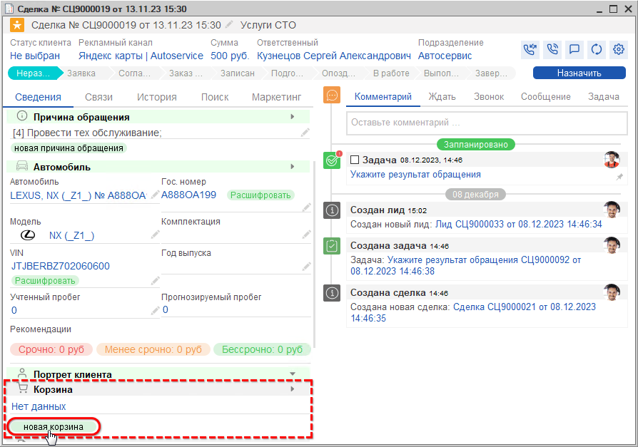
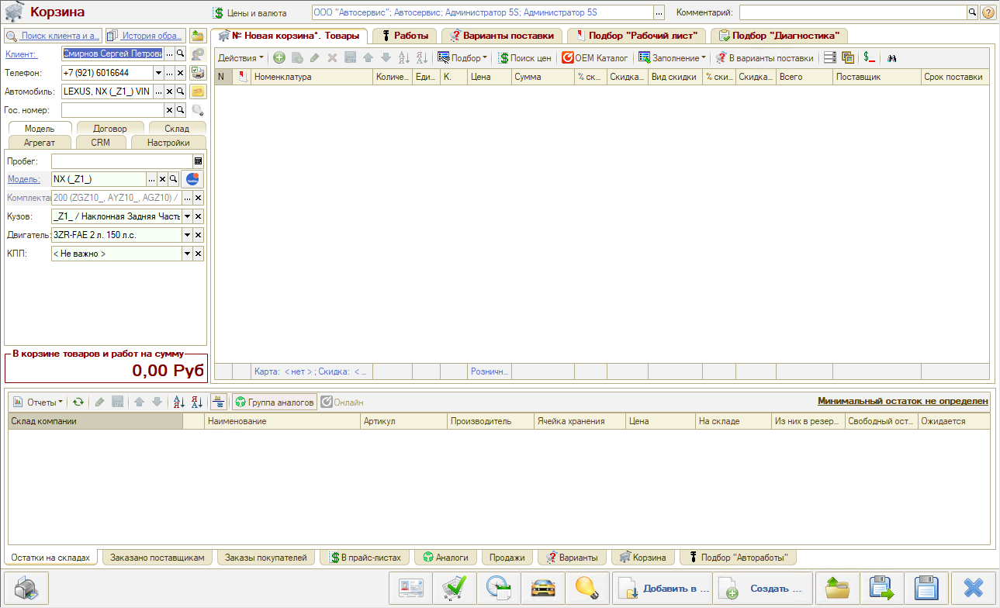
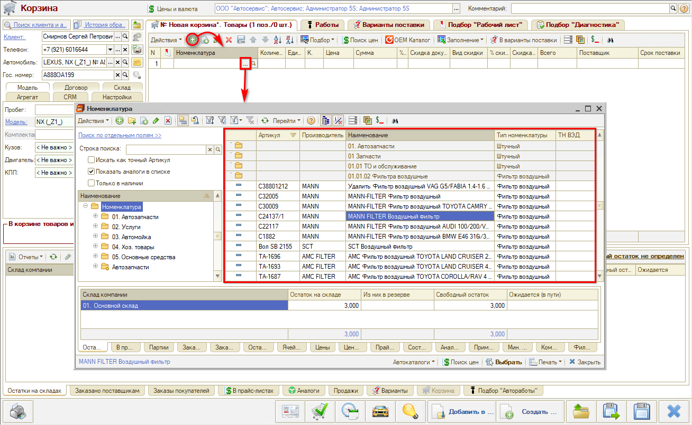
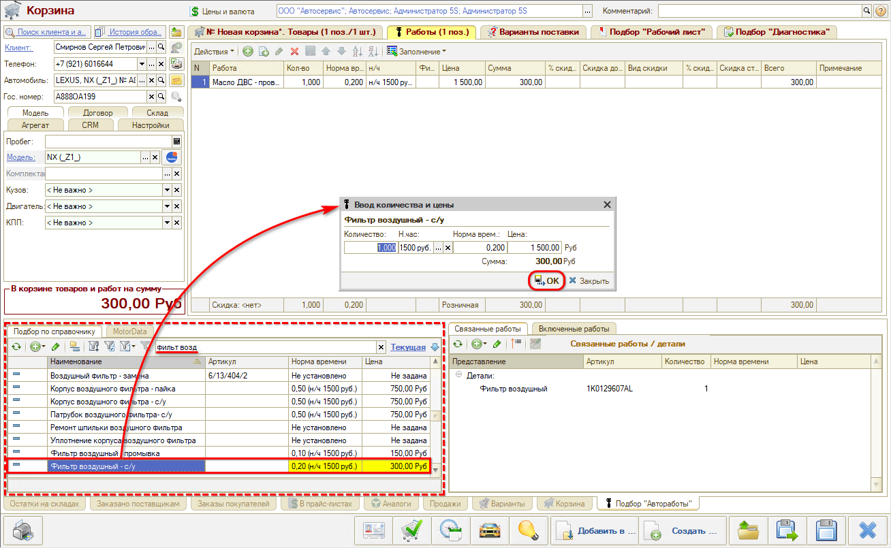
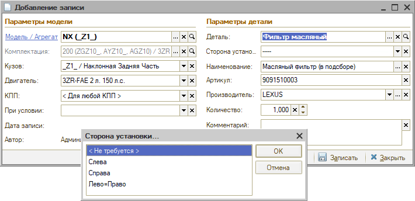
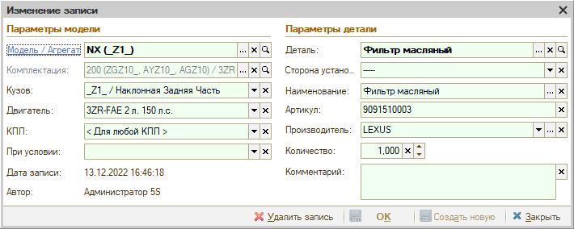
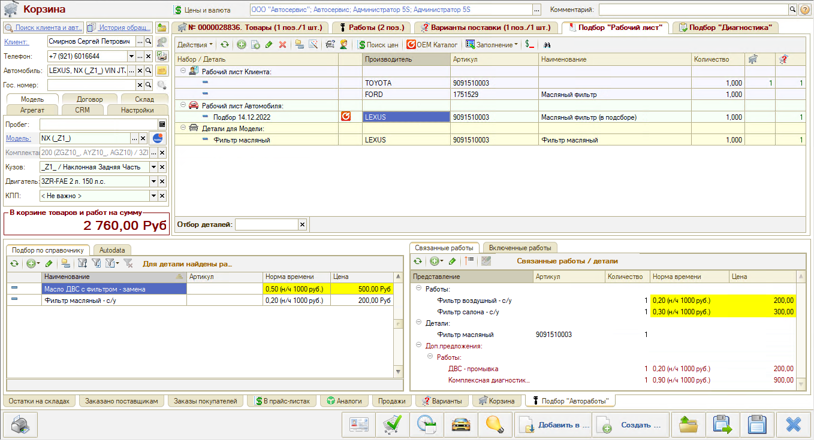
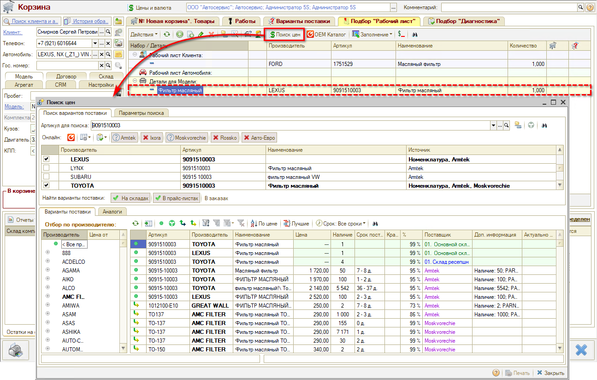
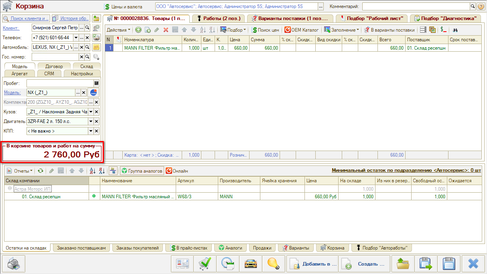

# Заявка

<table><tr><td><b>Время чтения:</b> 9 мин.</td><td><b>Обновлено:</b> 12.12.2023</td></tr></table>

Источник: https://www.5systems.ru/help/zayavka

## Содержание

1. [Создание Корзины](#создание-корзины)
2. [Подбор запасных частей и авторабот](#подбор-запасных-частей-и-авторабот)
   - [Составление калькуляции](#составление-калькуляции)

## Создание Корзины

***АРМ*** ***Корзина*** предназначена для оперативного подбора и проценки запчастей и авторабот в одном рабочем месте.

Для создания заявки необходимо сначала наполнить Корзину товарами или работами.

Для перехода в Корзину нужно в Сделке нажать кнопку "Новая корзина":

В Корзине обязательно должны быть указаны Организация и Подразделение, иначе она не запишется – реквизиты должны быть заполнены автоматически.

Для работы в Корзине автомобиль обязательно должен быть расшифрован по VIN.

Наполнение корзины осуществляется на основных вкладках "Товары" и "Работы".

**Вкладки Корзины:**

- *"Товары"* для подбора товаров – физических со склада,
- *"Работы"* для подбора работ, услуг и расходников,
- *"Варианты поставки"* – можно добавлять товары из Поиска цен, не сохраняя лишние варианты в номенклатуру,
- *«Подбор “Рабочий лист”»* для работы с Применяемостью,
- *«Подбор “Диагностика”»* для обработки Диагностического листа.

## Подбор запасных частей и авторабот

Есть несколько вариантов подбора запчастей:

1. Добавить товар из номенклатуры,
2. Подобрать товар для конкретного автомобиля из оригинального каталога Laximo,
3. Подобрать аналог или замену через обработку “Поиск цен”,
4. Заполнить товары из сформированного ранее документа: Запись на ремонт, Заказ-наряд,
5. Перенести из ранее сформированных подборов “Рабочий лист” или “Диагностика”.
6. Перенести подобранные ранее и согласованные с клиентом товары из вариантов поставки.

Для ручного добавления следует нажать на кнопку "Добавить":

**Подбор Рабочий лист** используется для работы с Применяемостью, сохранения ее для модели/комплектации автомобиля, чтобы в будущем для автомобиля такой же модели или комплектации не подбирать запчасти заново в Laximo, а работать сразу из Рабочего листа.

Из созданного набора в Рабочем листе можно добавить товары в Корзину.

**Подбор авторабот** осуществляется путем:

1. Поиска в справочнике "Автоработы" через функцию подбора "Автоработы" – в папках по иерархии либо по частичному совпадению значений в "умном поиске":  
   
2. С использованием функционала применяемости для модели автомобиля через связанные с деталями работы.

**Поиск оригинальных номеров (применяемость, каталог Laximo)**

Нажать кнопку "OEM Каталог" → Новая идентификация автомобиля.

Открывается каталог на данную модель, где можно выбрать нужную деталь.

Найденную в каталоге запчасть можно **проценить** – открыть "Поиск цен", либо "Сохранить для модели (в Применяемость)". Использование **Применяемости** позволит впоследствии упростить многие процессы.

В открывшемся окне "Добавление применяемости" указан кузов, двигатель, КПП – это условия, при которых деталь будет предлагаться. Если какие-то из условий не важны – их нужно снять.

При заполнении параметра “Деталь” открывается каталог "Детали применяемости". Требуется найти нужное наименование и нажать "Выбрать":

Затем программа предлагает выбрать сторону установки:

После заполнения всех необходимых параметров следует нажать “ОК” – деталь записана в Применяемость:

Подобранные в каталоге детали добавляются во вкладку «Подбор “Рабочий лист”», в применяемость для этой модели. Если выделить в списке деталь, внизу во вкладке "Подбор авторабот" отобразятся связанные с ней работы – можно их выбрать в Корзину:

**Поиск цен (поиск з/ч на складе)**:

Если на складе детали нет (вкладка "Остатки на складах"), требуется ее найти в каталогах у поставщиков. Используется поиск онлайн в каталогах поставщиков: отображаются Варианты поставки – оригиналы и аналоги.

 – Оригинальный артикул;  – Группа аналогов;  – Аналог из онлайн-каталога;  – Аналог от Веб-поставщиков

Можно использовать сортировку по цене или по сроку поставки.

Собственная база аналогов будет наполняться по мере работы с механизмом применяемости.

### Составление калькуляции

Найденные детали можно добавлять не сразу в Корзину, а в Варианты поставки – так они не будут влиять на итоговую сумму. После *[согласования](../Согласование/soglasovanie.md)* с клиентом нужный вариант следует перенести в Корзину.

После того как товары и работы добавлены на основные вкладки Корзины, выходит общая сумма:

Изменения в Корзине можно сохранить и вернуться к работе позднее или создать на основании Корзины документы: заказ-наряд, заказ покупателя, заказ поставщику и т.д. Документы создаются на основе параметров Корзины и подобранных товаров, и работ.

 

*[← Предыдущий урок "Создание сделки"](../Создание%20сделки/sozdanie-sdelki.md)* &nbsp;&nbsp;&nbsp;&nbsp;&nbsp;&nbsp; [*Следующий урок "Согласование" →*](../Согласование/soglasovanie.md)

---

**Теги:** автосервис, краткий курс, заявка, корзина, подбор запчастей, автоработы

