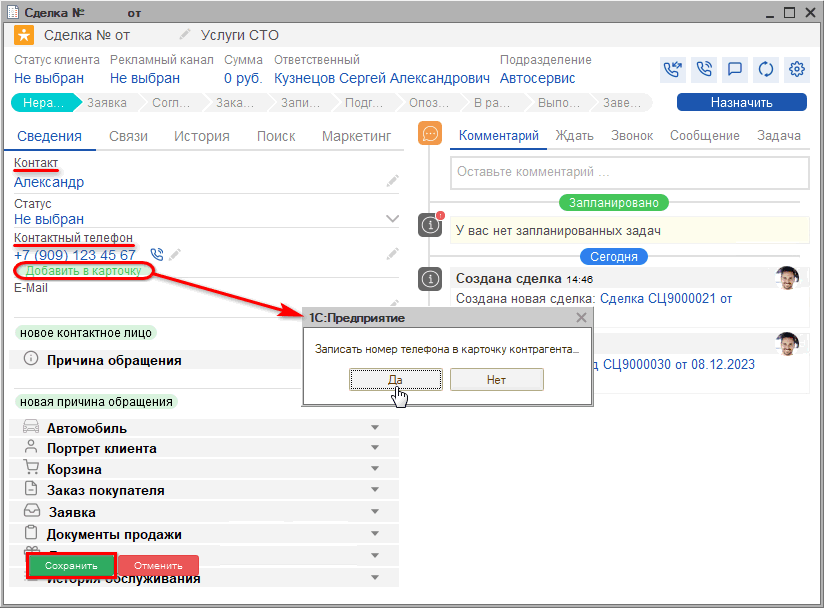
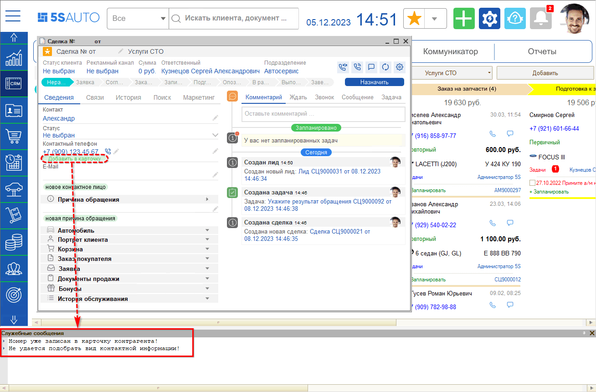

# Обращение первичного клиента

<table><tr><td><b>Время чтения:</b> 7 мин.</td><td><b>Обновлено:</b> 13.12.2023</td></tr></table>

Источник: https://www.5systems.ru/help/obraschenie-pervichnogo-klienta

При каждом новом обращении, – входящее письмо, звонок, сообщение в чате, – автоматически создается сделка. При необходимости сделку можно добавить вручную. Подробнее см. урок [Создание сделки](../Создание%20сделки/sozdanie-sdelki.md).

При обращении ***первичного*** клиента, т.е. того, который позвонил или приехал первый раз, требуется заполнить данные клиента. В сделке отобразится только номер его телефона: остальные данные потребуется ввести – либо сразу, либо после записи на ремонт, при непосредственном заезде клиента.

В новой сделке необходимо заполнить поля "Контакт" и "Телефон" — спросить имя или Ф. И. О. клиента. Уникальность клиента определяется по номеру телефона. Если клиент новый, можно создать карточку клиента.

Для этого после того как записали в строку Ф. И. О. или имя клиента, <u>добавьте их в карточку клиента</u>. Только при условии, что данные добавлены в карточку, в дальнейшем они автоматически подтянутся в Корзину, Заявку на ремонт, Заказ покупателя или Заказ-наряд.

Программа предложит *сохранить процесс* – выбрать "Да".

Затем программа предложит *записать номер телефона в карточку контрагента* – также выбрать "Да":

Под карточкой клиента имеется в виду элемент справочника "[Контрагенты](https://5systems.ru/help/kontragenty-i-kontakty)". При добавлении в справочник программа проверяет, есть ли уже такой номер телефона в системе или нет:

Если клиент уже есть в базе, но звонит с нового номера телефона, воспользуйтесь механизмом быстрого поиска клиента на вкладке "Поиск" – см. урок "[Создание сделки](../Создание%20сделки/sozdanie-sdelki.md)".

Дополнить карточку клиента дополнительными сведениями – полные Ф. И. О., пол, прикрепить документы, добавить доп. номер и прочее – можно в любое время.

*[← Предыдущий урок "Выполнен"](../Выполнен/vypolnen.md)* &nbsp;&nbsp;&nbsp;&nbsp;&nbsp;&nbsp; [*Следующий урок "Создание карточки автомобиля" →*](../Создание%20карточки%20автомобиля/sozdanie-kartochki-avtomobilya.md)

---

**Теги:** автосервис, краткий курс, первичный клиент, контрагент, сделка

