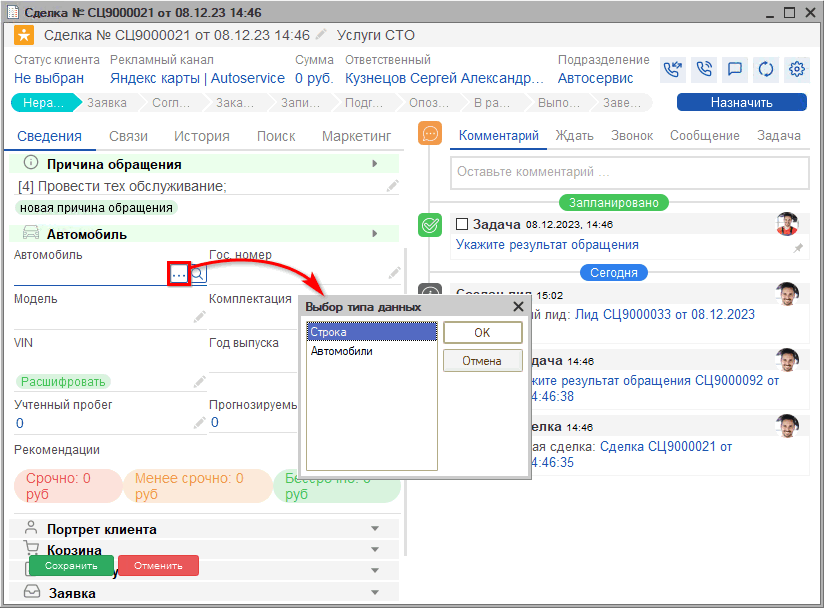
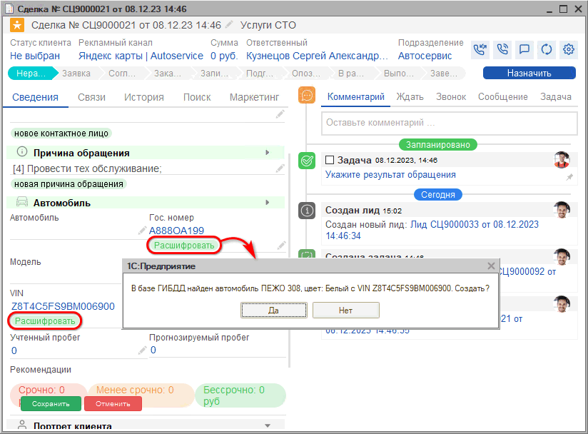
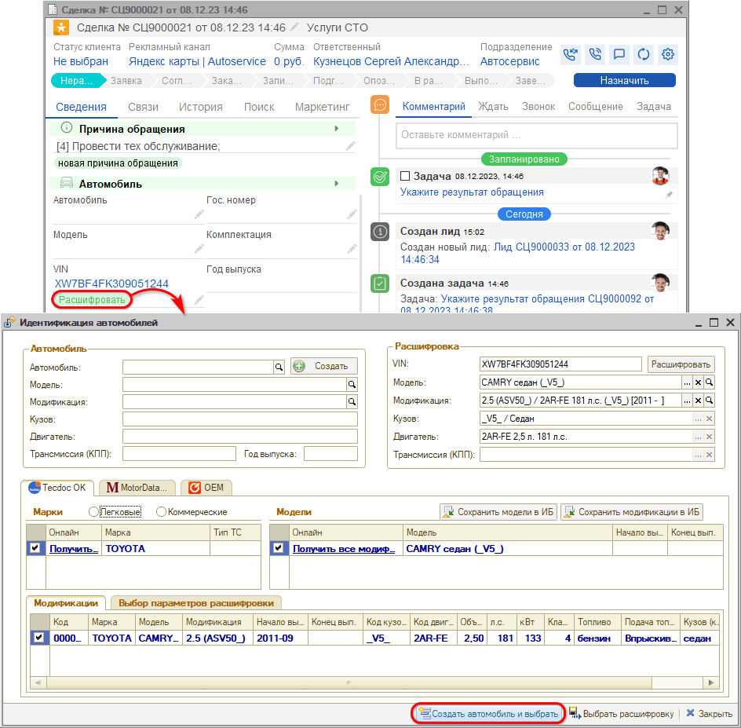

# Создание карточки автомобиля

<table><tr><td><b>Время чтения:</b> 7 мин.</td><td><b>Обновлено:</b> 13.12.2023</td></tr></table>

Источник: https://www.5systems.ru/help/sozdanie-kartochki-avtomobilya

При обращении повторного клиента данные по его автомобилю автоматически подтянутся из справочника в сделку – см. урок "[Создание сделки](../Создание%20сделки/sozdanie-sdelki.md)".

При регистрации обращения нового клиента требуется ***создать*** автомобиль.

На первоначальном этапе в сделку достаточно ввести только название автомобиля. Можно сделать это строкой, не создавая карточку авто. Когда клиент приедет к нам, мы сможем заполнить карточку полностью на основе СТС автомобиля. Для ввода автомобиля строкой нужно нажать кнопку "Выбрать"  , выбрать тип данных "Строка" и ввести в поле "Автомобиль" наименование автомобиля, например, марку и модель:

Если клиент заказывает запчасти дистанционно или хочет подобрать работы и записаться прямо сейчас, то *создать автомобиль и сделать его расшифровку* можно *сразу.*

Получить данные по комплектации автомобиля можно двумя способами:

- С помощью [расшифровки VIN номера](https://5systems.ru/help/kak-rasshifrovat-avtomobil-po-vin);
- С помощью [расшифровки Гос. номера](https://5systems.ru/help/kak-rasshifrovat-avtomobil-po-gos-nomeru) – при наличии оплаченных пакетов расшифровок.

Таким образом, следует попросить клиента предоставить VIN или гос. номер автомобиля, ввести номер и нажать "Расшифровать":

В случае успешной расшифровки по VIN-номеру следует нажать кнопку "Создать автомобиль и выбрать":

Если расшифровать автомобиль указанными способами не получилось, создайте новый автомобиль клиента вручную, выбирая нужные марку, модель и модификацию из имеющегося в программе каталога Tecdoc – подробнее см. в [статье](../../../articles/5S%20AUTO/Автосервис/Расшифровка%20автомобиля%20по%20VIN/rasshifrovka-avtomobilya-po-vin.md#ruchn_rashifr).

*[← Предыдущий урок "Обращение первичного клиента"](../Обращение%20первичного%20клиента/obraschenie-pervichnogo-klienta.md)*

---

**Теги:** автосервис, краткий курс, карточка автомобиля, VIN, расшифровка автомобиля

