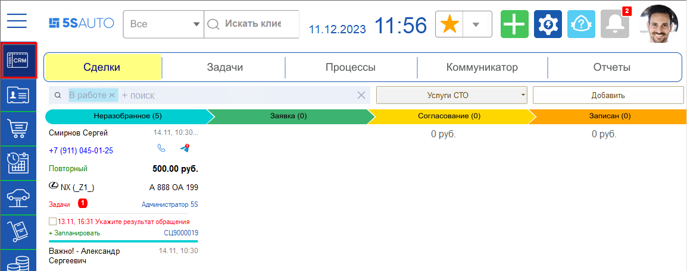
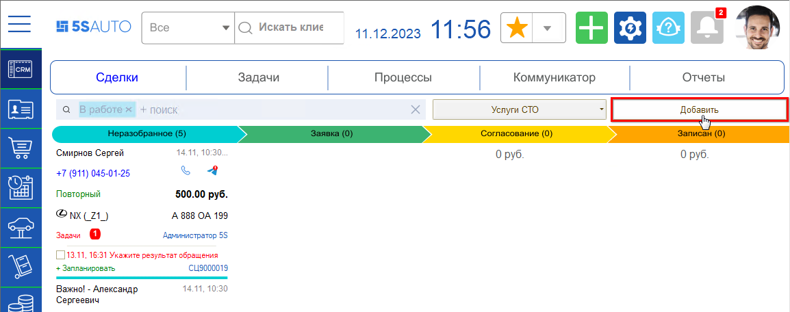
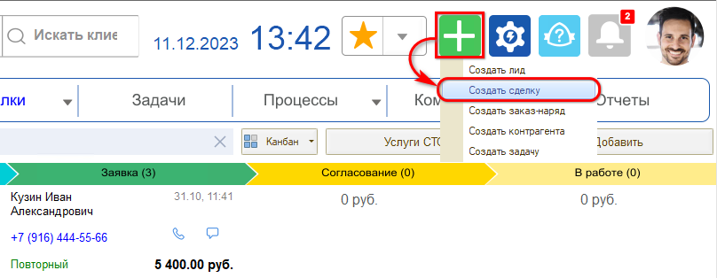
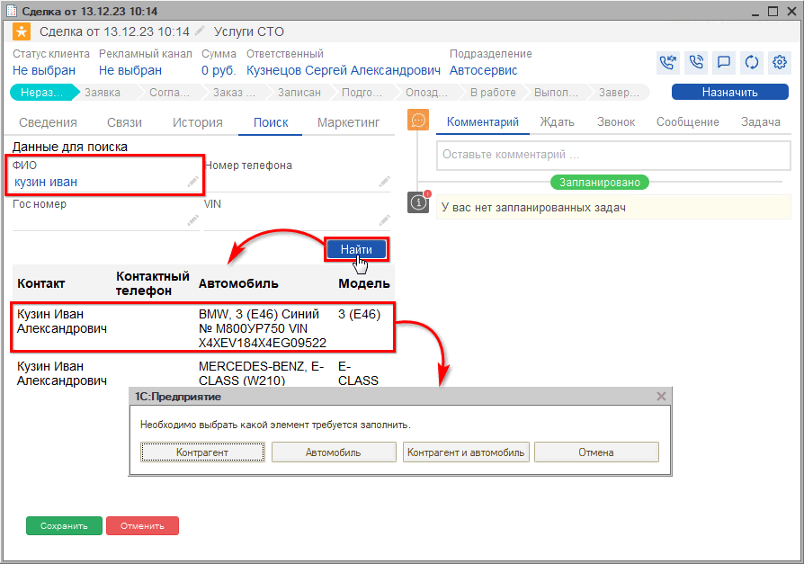
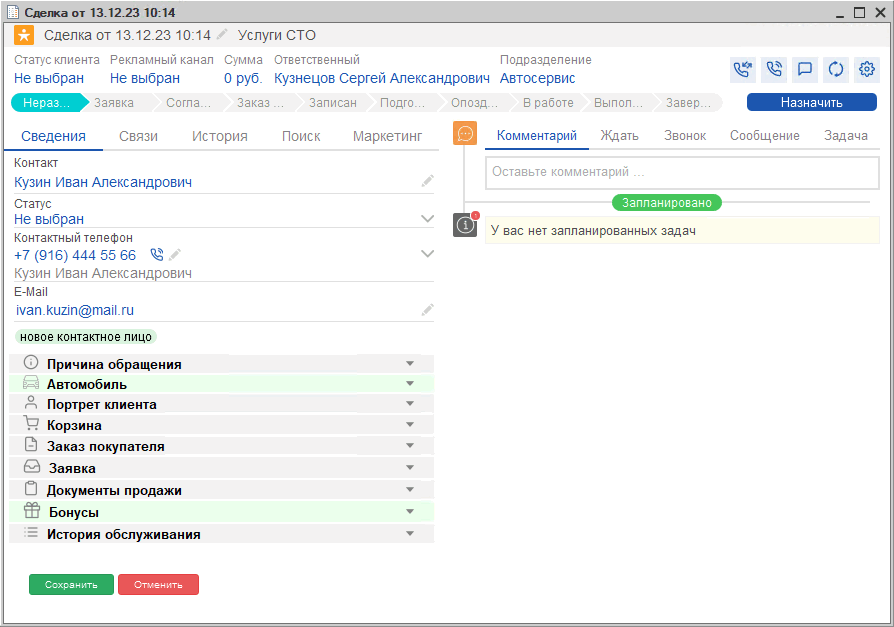
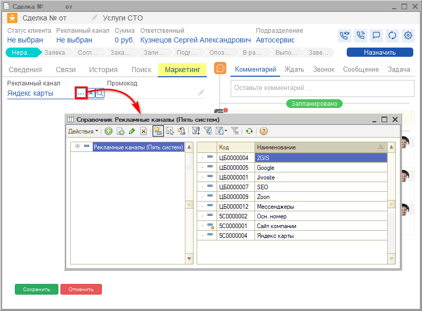
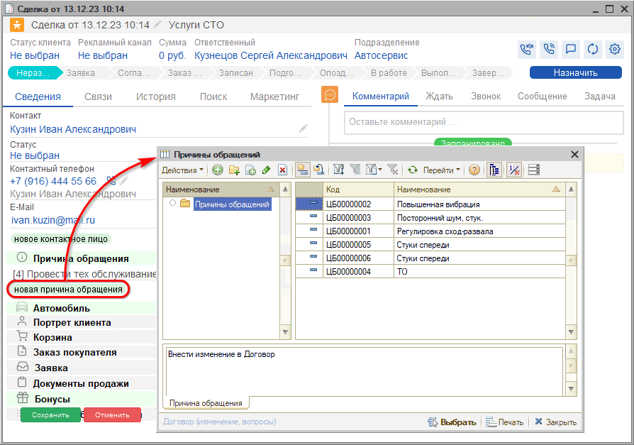
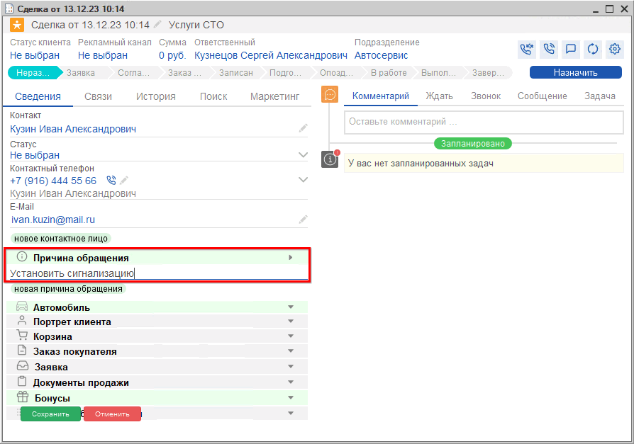
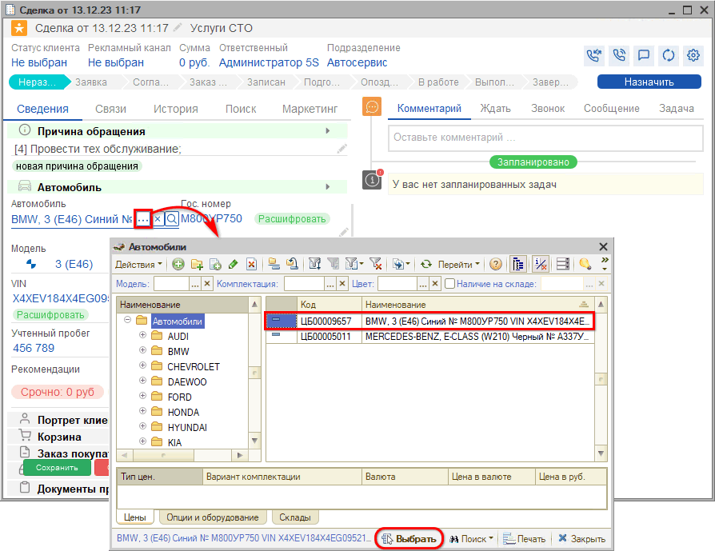
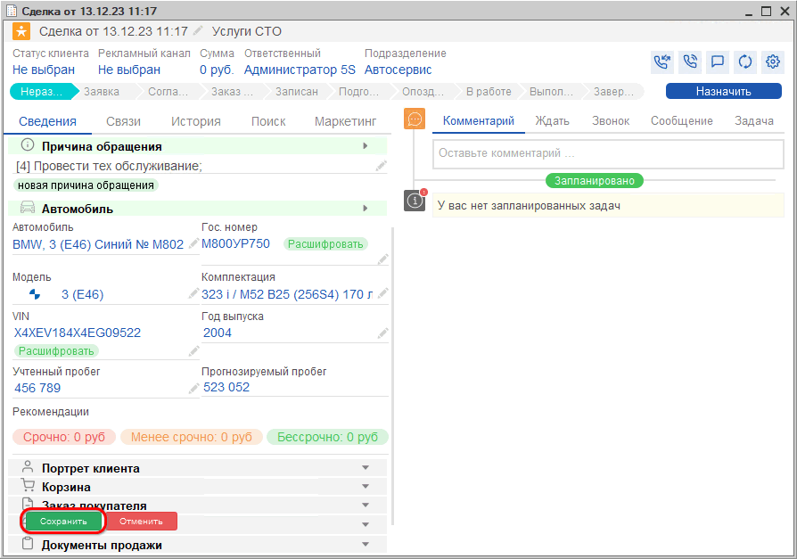

# Создание сделки

<table><tr><td><b>Время чтения:</b> 8 мин.</td><td><b>Обновлено:</b> 11.12.2023</td></tr></table>

Источник: https://www.5systems.ru/help/sozdanie-sdelki

## Содержание

1. [Создание сделки](#создание-сделки)
2. [Порядок заполнения сделки](#порядок-заполнения-сделки)

## Создание сделки

Центральным элементом интерфейса 5S Auto является сделка. **Сделка** представляет собой зафиксированное в программе обращение клиента.

При каждом новом обращении, – входящее письмо, звонок, сообщение в чате, – автоматически создается сделка. При необходимости сделку можно добавить вручную.

Для создания новой сделки следует перейти в раздел CRM и выбрать колонку "Сделки". Раздел содержит список сделок в разбивке на этапы:

Создать новую сделку можно нажатием на кнопку "Добавить":

либо через кнопку быстрого добавления:

Создавать сделку вручную не потребуется, если в программу интегрирована IP-телефония и мессенджеры. В таком случае во время обращения клиента сделка создастся автоматически и сразу отобразится номер телефона звонящего.

При обращении ***первичного*** клиента, т.е. того, который позвонил или приехал первый раз, требуется заполнить данные клиента – подробнее см. урок *"[Обращение первичного клиента](../Обращение%20первичного%20клиента/obraschenie-pervichnogo-klienta.md)".* Данные по автомобилю клиента потребуется ввести либо сразу, либо после записи на ремонт, при непосредственном заезде клиента.

При звонке ***повторного*** клиента в сделке уже есть его Ф. И. О. и информация об автомобилях клиента, а также история всех его предыдущих обращений, включая документы, задачи, рекомендации и т.д.

## Порядок заполнения сделки

**1. Идентифицируйте клиента**

Если повторный клиент не был идентифицирован программой автоматически, можно найти его в базе вручную с помощью механизма быстрого поиска на вкладке "Поиск". Поиск поможет избежать создания дублирующих данных.

Можно искать по любому из указанных параметров: номер телефона – именно по нему определяется уникальность клиента, Ф. И. О., гос. номер, VIN:

Следует выбрать, какие данные нужно подтянуть в сделку: только клиента, только автомобиль, или и данные клиента, и данные автомобиля.

*Например: в случаях, когда клиент является заказчиком, но не является владельцем автомобиля, вы подтягиваете только данные контрагента.*

Выбранные данные подтягиваются в сделку:

**2. Рекламный канал**

В случае, если ваша компания собирает аналитику по источникам рекламы, в разделе "Маркетинг" можно указать информацию, откуда клиент о вас узнал.

Если рекламные каналы уже настроены, то в сделке автоматически распознается, с какого канала рекламы к нам пришло данное обращение:

**3. Заполните причину обращения**

Нажатием на кнопку "Новая причина обращения" открывается список, в котором можно выбрать нужную причину – список можно создать самостоятельно:

Например, можно добавить следующие причины обращения:

- “Услуги по ремонту” – например: ремонт, шиномонтаж, мойка. Далее последуют проценка и запись на ремонт.
- “Запасные части” – если клиент хочет купить запчасть. Далее последует поиск, проценка запчасти, резервирование на складе либо заказ у поставщика.
- “Повторное обращение”.
- “Возврат товара”.
- “Гарантийный ремонт” и т.д.

Либо можно нажать на "карандаш" и ввести строкой свою причину обращения в ручном режиме:

**4. Заполнение автомобиля**

Если клиент повторный, то данные об автомобиле *заполнятся автоматически.*

Если у клиента несколько автомобилей, можно выбрать нужный автомобиль из справочника – для этого следует нажать кнопку "Выбрать" . Открывается справочник "Автомобили с отбором по владельцу – текущему клиенту. Следует выделить нужный автомобиль и нажать кнопку "Выбрать" на нижней панели:

Для новых клиентов потребуется *создать* автомобиль – см. урок *"[Создание карточки автомобиля](../Создание%20карточки%20автомобиля/sozdanie-kartochki-avtomobilya.md)"*.

**5. Сохранение сделки**

После заполнения новой Сделки необходимо *Сохранить* ее. При этом Сделка переходит из состояния "Неразобранное" в "Заявку".

*[Далее](../Заявка/zayavka.md)* можно перейти к подбору работ и товаров в Корзине.

*Подробнее см. курс "[CRM](../../Урок%201.%20CRM/)" и статьи в разделах "[CRM](../../../articles/5S%20AUTO/CRM/)" и "[Работа с клиентами](../../../articles/5S%20AUTO/Работа%20с%20клиентами/)" на Базе знаний.*

 

[*Следующий урок "Заявка" →*](../Заявка/zayavka.md)

---

**Теги:** автосервис, краткий курс, сделка, обращение клиента, воронка продаж, CRM

