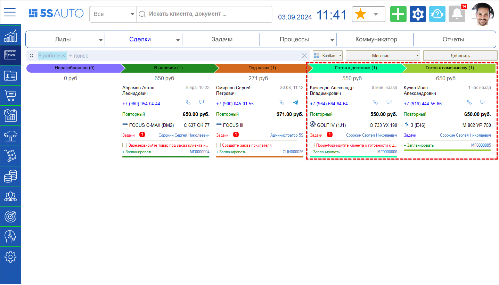
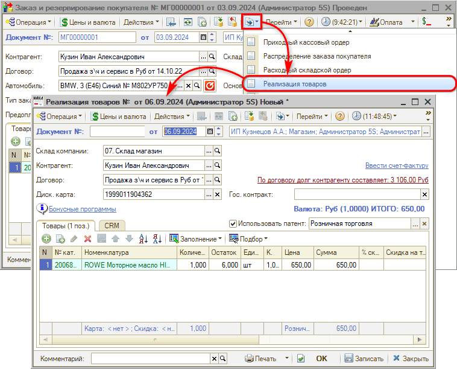
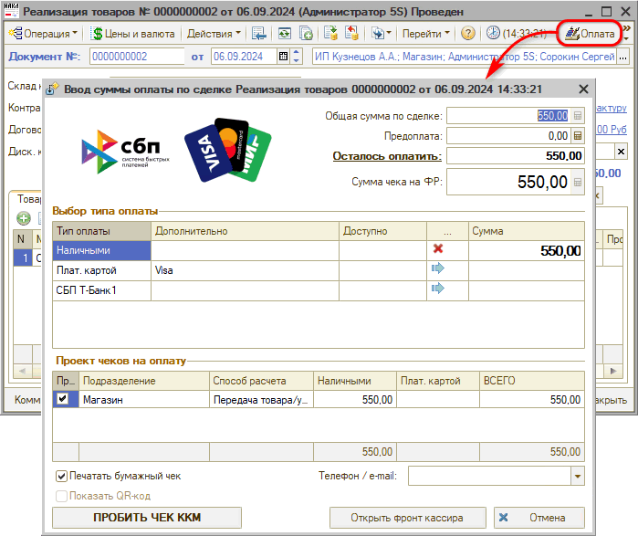
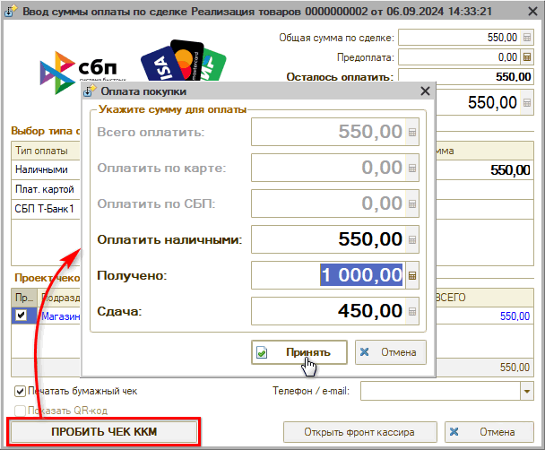
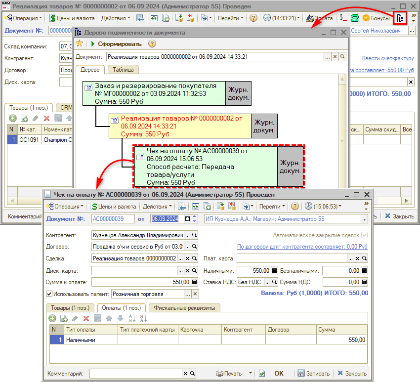
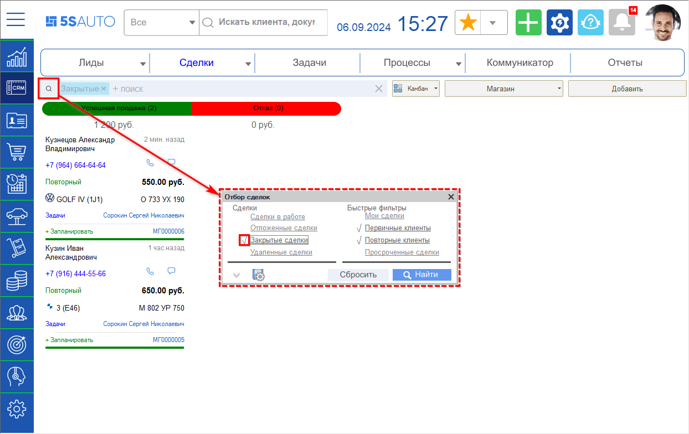

# Выдача заказа

<table><tr><td><b>Время чтения:</b> 6 мин.</td><td><b>Обновлено:</b> 30.09.2024</td></tr></table>

Источник: https://www.5systems.ru/help/vydacha-zakaza

## Содержание

1. [Отгрузка товара](#отгрузка-товара)
2. [Прием оплаты](#прием-оплаты)

В случае готовности заказа сделка автоматически переходит на один из двух этапов – *“Готов к доставке” либо “Готов к самовывозу”.* Это зависит от настроек способа получения заказа в документе “Заказ покупателя” – см. в уроке “[Товар в наличии](../Товар%20в%20наличии/tovar-v-nalichii.md#выбор-способа-доставки)”.

На этих этапах необходимо проинформировать клиента о готовности заказа к самовывозу либо к доставке – путем звонка или через мессенджеры.

Есть возможность настроить автоматическую отправку уведомлений клиенту о поступлении заказа – см. [пример настройки](../../../articles/5S%20AUTO/Практики/Уведомление%20покупателю%20о%20поступлении%20заказа/uvedomlenie-pokupatelyu-o-postuplenii-zakaza.md).

## Отгрузка товара

При отгрузке заказа необходимо оформить документ “Реализация товаров” – его следует создать на основании “Заказа покупателя”:

Отгружаемый товар будет автоматически перенесен в таблицу документа.

Если отгрузку требуется сделать сразу после подбора запчастей, то создать Реализацию можно из АРМ "Корзина".

Документ “Реализация товаров” следует провести и принять по нему оплату. При необходимости можно также распечатать закрывающие документы.

## Прием оплаты

Чтобы принять оплату по Реализации, следует нажать кнопку “Оплата” на верхней панели формы документа:

На форме приема оплаты следует выбрать тип оплаты и нажать кнопку "ПРОБИТЬ ЧЕК ККМ". Открывается форма “Оплата покупки”:

В случае оплаты наличными при вводе полученной от клиента суммы будет автоматически рассчитана сдача.

После проверки суммы следует нажать кнопку “Принять” – при этом:

- чек ККМ выводится на печать либо отправляется клиенту в электронном виде;
- форма Фронта кассира закрывается;
- в программе формируется документ “Чек на оплату”:

Подробнее см. статьи “[Упрощенный Фронт кассира](../../../articles/5S%20AUTO/Касса/Упрощенный%20Фронт%20кассира/uproschennyy-front-kassira.md)”, “[Порядок работы с кассами ККМ](../../../articles/5S%20AUTO/Касса/Порядок%20работы%20с%20кассами%20ККМ/poryadok-raboty-s-kassami-kkm.md)” и урок “[Как принять оплату](https://5systems.ru/help/kak-prinyat-oplatu)” в курсе "[Работа с кассой ККМ](../../Урок%2015.%20Работа%20с%20кассой%20ККМ/)".

**Учет предоплаты**

По “Заказу покупателя” можно принять только предоплату – частичную или полную. По “Реализации товаров” можно принять предоплату или окончательный расчет.

Если клиент вносил предоплату, то при окончательном расчете эта сумма должна быть пробита с указанием типа оплаты "Зачет аванса".

Если была внесена полная предоплата, то правильно будет еще раз провести оплату, указав способ “Пробитие чека передачи предмета” платежа.

Если была внесена частичная предоплата, то следует ввести зачет аванса, а оставшуюся сумму нужно заполнить в соответствии с типом оплаты (наличными, картой и др.). Сумма для пробития на ФР должна стоять общая по документу.

Затем нужно нажать “Принять” и на форме приема оплаты – "ПРОБИТЬ ЧЕК ККМ". Пробивается второй (окончательный) чек, в нем должна быть итоговая сумма – полная по документу. Формируется документ "Чек на оплату".

Подробнее см. урок “[Как принять оплату](https://5systems.ru/help/kak-prinyat-oplatu)” в курсе "[Работа с кассой ККМ](../../Урок%2015.%20Работа%20с%20кассой%20ККМ/)" и статью “[Порядок работы с кассами ККМ](../../../articles/5S%20AUTO/Касса/Порядок%20работы%20с%20кассами%20ККМ/poryadok-raboty-s-kassami-kkm.md)”.

После проведения “Реализации” сделка попадает на этап “Успешная продажа” и уходит с канбана – при необходимости можно к ней вернуться, установив отбор по закрытым сделкам:

После успешного принятия оплаты окна документов “Реализация товаров”, “Заказ покупателя” и Сделки можно закрыть.

***Сделка успешно завершена!***

Подробнее см. курсы:

- урок "[Как оформить продажу товаров клиенту](https://www.5systems.ru/help/kak-oformit-prodazhu-tovarov-klientu)" в блоке "[Складской учет](../../Урок%205.%20Складской%20учет/)"
- урок “[Как принять оплату](https://5systems.ru/help/kak-prinyat-oplatu)” в курсе "[Работа с кассой ККМ](../../Урок%2015.%20Работа%20с%20кассой%20ККМ/)"

статьи:

- [Порядок работы с кассами ККМ](../../../articles/5S%20AUTO/Касса/Порядок%20работы%20с%20кассами%20ККМ/poryadok-raboty-s-kassami-kkm.md) и [другие](../../../articles/).

[*← Предыдущий урок "Снят резерв"* ](../Снят%20резерв/snyat-rezerv.md)

---

**Теги:** магазин автозапчастей, краткий курс, отгрузка, реализация товаров, прием оплаты, касса

