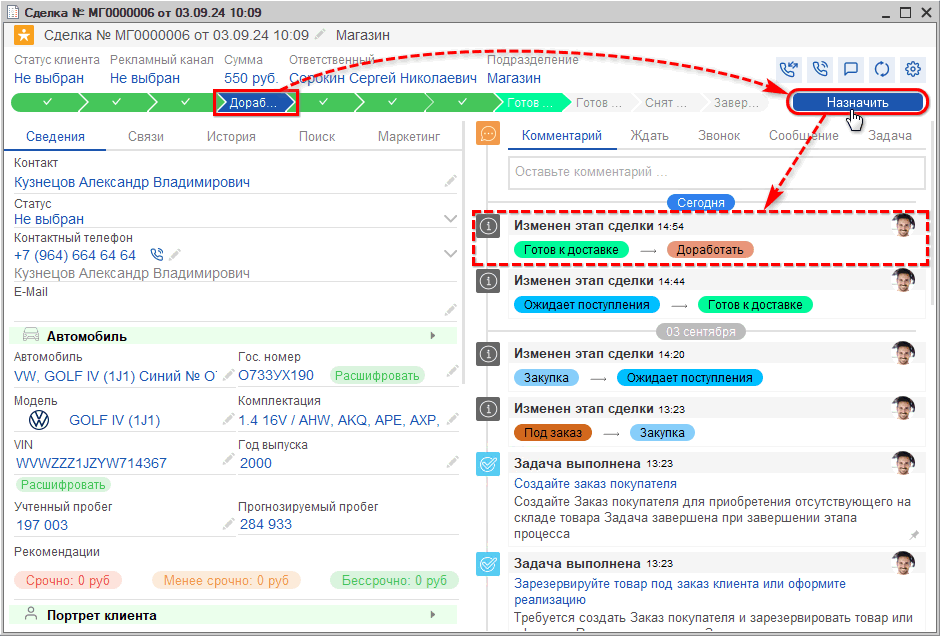
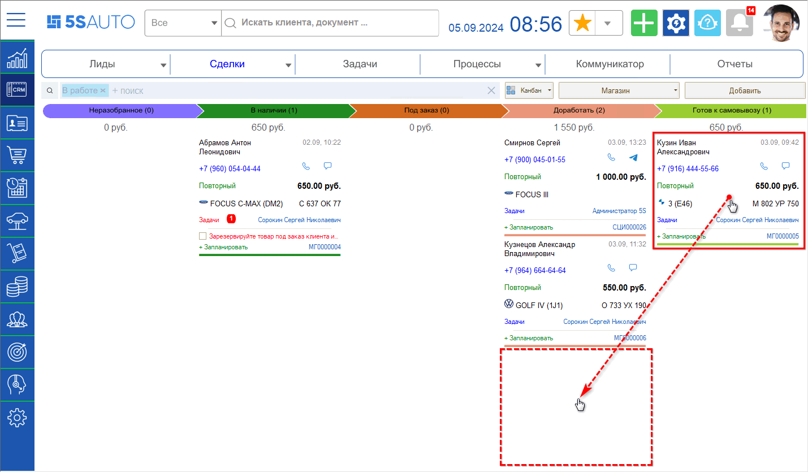

# Доработать

<table><tr><td><b>Время чтения:</b> 4 мин.</td><td><b>Обновлено:</b> 30.09.2024</td></tr></table>

Источник: https://www.5systems.ru/help/dorabotat

Сделка автоматически перейдет на этап *“Доработать”* с этапов “В наличии” или “Под заказ” в случае отсутствия активности по ней в течение 3 часов (согласно настройкам по умолчанию).

Также на данный этап сделка может быть переведена пользователем вручную в разных случаях, например:

- с этапа “Ожидает поступления” – если поступили не все детали;
- с этапа “Отказ поставщика” – для пересогласования с клиентом и перезаказа детали;
- с этапов “Готов к доставке / самовывозу” – например, если изменилась стоимость заказа.

Для ручного перевода сделки на данный этап нужно на форме сделки выделить на шкале этапов этап “Доработать”, нажать кнопку “Назначить” и сохранить изменения:

Либо можно перетащить карточку сделки на канбане на данный этап (примечание: в зависимости от настроек воронки этап может не отображаться на канбане, если на нем нет сделок – в таком случае изменить этап можно только через форму сделки):

В сделке рекомендуется написать пояснительный *[комментарий](../../../articles/5S%20AUTO/CRM/События%20сделки/sobytiya-sdelki.md#1-комментарии-и-планирование-дел),* например “Заказать деталь у другого поставщика” или “Согласовать с клиентом изменившуюся стоимость”.

После доработки сделка в зависимости от ситуации возвращается на один из предыдущих этапов, например, “Под заказ” – при создании новой Корзины, “Закупка” – при оформлении нового заказа поставщику, либо переводится на один из следующих этапов, например, “Готов к доставке”.

 

*[← Предыдущий урок "Отказ поставщика"](../Отказ%20поставщика/otkaz-postavschika.md) &nbsp;&nbsp;&nbsp;&nbsp;&nbsp;&nbsp; [Следующий урок "Снят резерв" →](../Снят%20резерв/snyat-rezerv.md)*

---

**Теги:** магазин автозапчастей, краткий курс, этап сделки, доработать, события сделки

