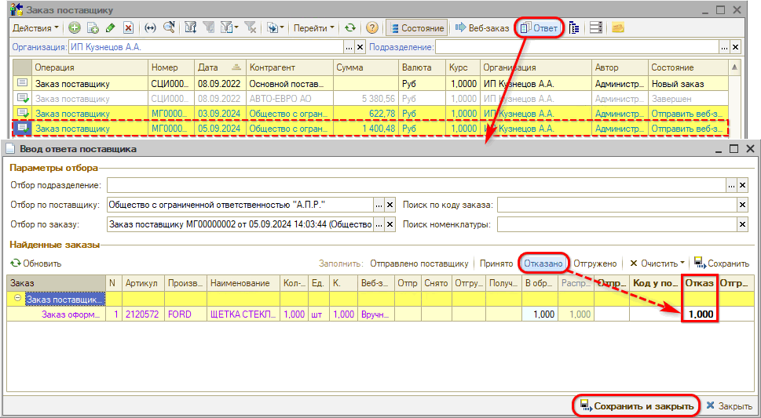
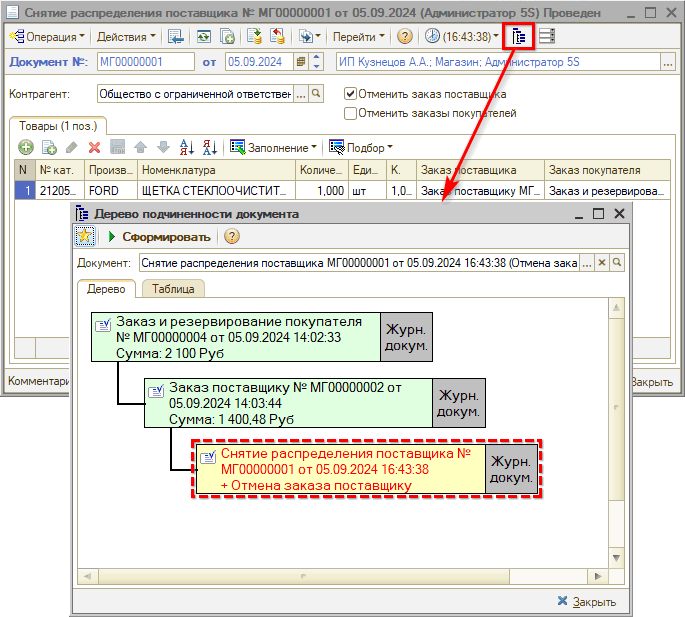
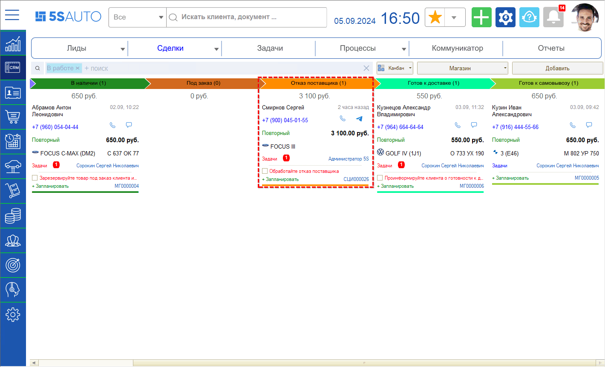

# Отказ поставщика

<table><tr><td><b>Время чтения:</b> 4 мин.</td><td><b>Обновлено:</b> 30.09.2024</td></tr></table>

Источник: https://www.5systems.ru/help/otkaz-postavschika

В случае отмены поставщиком заказа необходимо оформить *снятие распределения* заказанных товаров. Для этого используется документ "Снятие распределения поставщика".

В случае Веб-заказа отмена распределения заказа производится автоматически.

Также можно использовать обработку "Ввод ответа поставщика" – для ее вызова следует в реестре документов “Заказ поставщику” выделить нужный заказ и нажать кнопку “Ответ” на командной панели. На форме обработки следует нажать кнопку заполнения “Отказано” – при этом заполняется колонка “Отказ” – затем кнопку “Сохранить и закрыть”:

В результате формируется и проводится “Снятие распределения поставщика”:

При этом сделка попадает на этап *“Отказ поставщика”:*

На данном этапе требуется связаться с клиентом и пересогласовать новый заказ и новые сроки поставки. В случае готовности клиента ждать еще – согласовать с поставщиком другую поставку либо перезаказать деталь у другого поставщика. При этом сделка вернется на этап “Ожидает поступления”. В случае несогласия клиента следует отменить заказ покупателя и перевести сделку в “Отказ” – см. в уроке “[Снят резерв](../Снят%20резерв/snyat-rezerv.md#otkaz)”.

Подробнее см. статью: [Работа с заказами поставщикам](../../../articles/5S%20AUTO/Работа%20с%20заказами/Работа%20с%20заказами%20поставщикам/rabota-s-zakazami-postavschikam.md).

 

*[← Предыдущий урок "Оформление заказа"](../Оформление%20заказа/oformlenie-zakaza.md) &nbsp;&nbsp;&nbsp;&nbsp;&nbsp;&nbsp; [Следующий урок "Доработать" →](../Доработать/dorabotat.md)*

---

**Теги:** магазин автозапчастей, краткий курс, отказ поставщика, заказ поставщику, сделка

