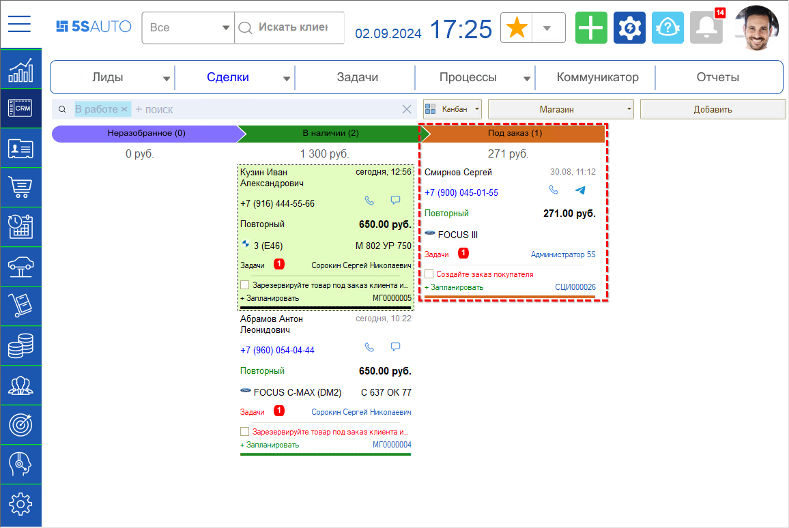
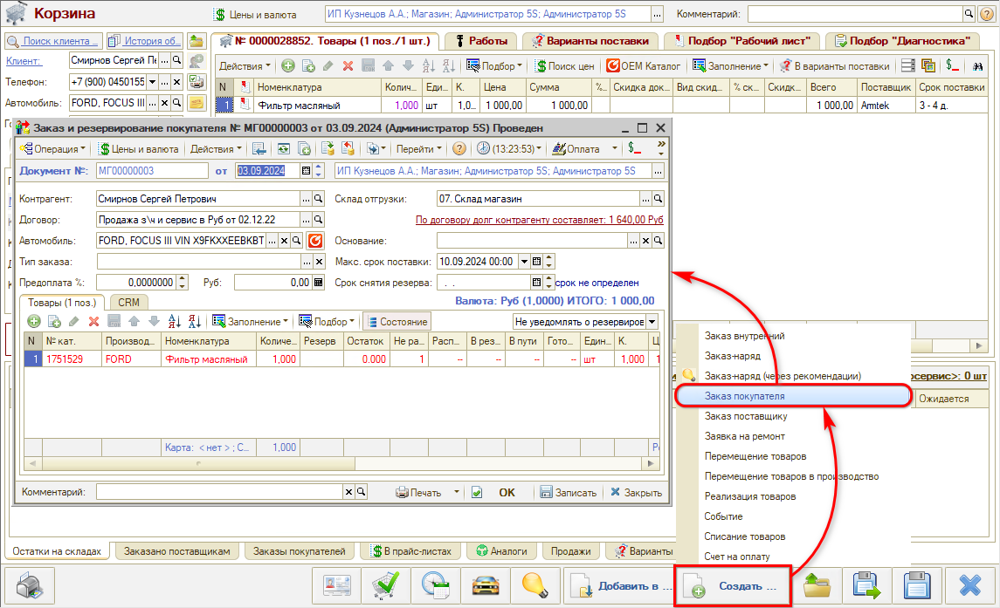
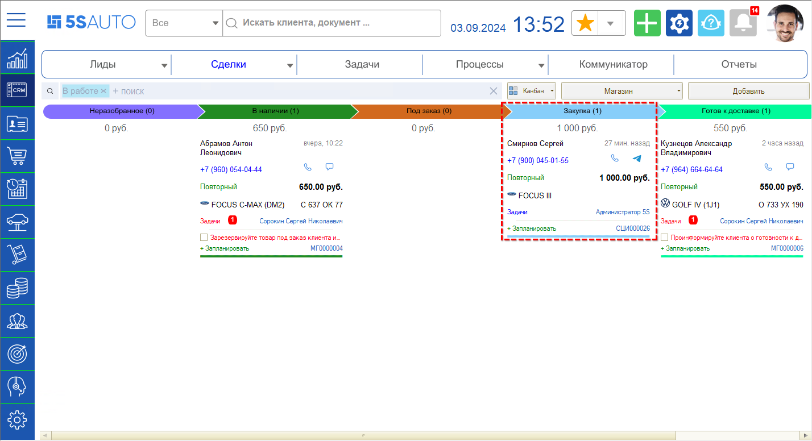
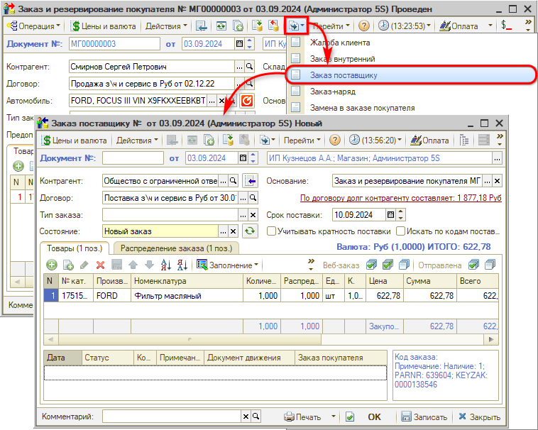
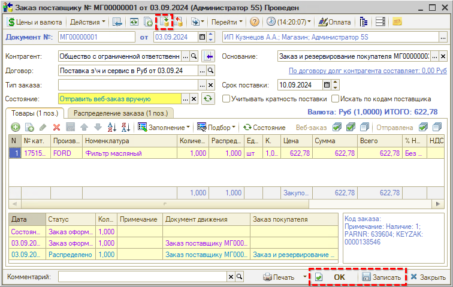
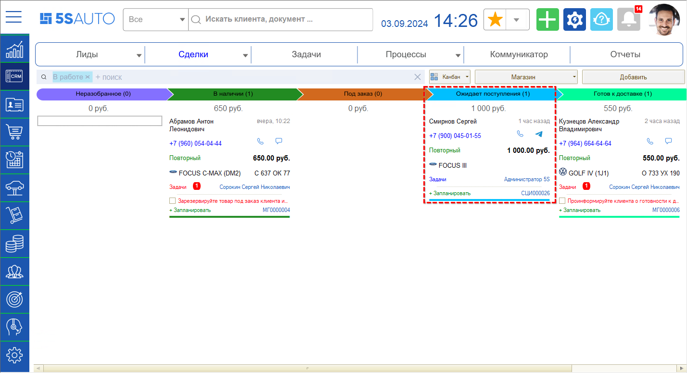
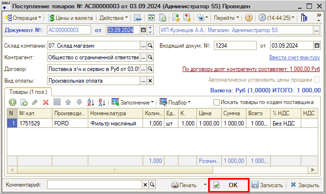

# Оформление заказа

<table><tr><td><b>Время чтения:</b> 7 мин.</td><td><b>Обновлено:</b> 30.09.2024</td></tr></table>

Источник: https://www.5systems.ru/help/oformlenie-zakaza

## Содержание

1. [Заказ запчастей](#заказ-запчастей)
2. [Закупка у поставщика](#закупка-у-поставщика)
3. [Поступление товаров](#поступление-товаров)

Если заказанной клиентом детали в наличии нет, и нужно сначала заказать ее у поставщика, то сделка попадает на этап *“Под заказ”:*

## Заказ запчастей

На этапе “Под заказ” необходимо на основе согласованной с клиентом Корзины с подобранной и процененной запчастью (см. урок “[Подбор товаров](../Подбор%20товаров/podbor-tovarov.md)”) создать документ *“Заказ покупателя”:*

На вкладке “CRM” необходимо указать *способ доставк*и – см. в уроке “[Товар в наличии](../Товар%20в%20наличии/tovar-v-nalichii.md#выбор-способа-доставки)”.

После сохранения документа “Заказ покупателя” с товаром, которого нет в наличии, сделка переходит на этап *“Закупка”:*

## Закупка у поставщика

На этом этапе необходимо оформить *“Заказ поставщику”* – его нужно создать на основании оформленного на предыдущем шаге “Заказа покупателя”:

Следует контролировать срок поставки.

Заказ необходимо записать и провести:

После проведения “Заказа поставщику” заказ автоматически отправляется на API поставщика либо иным способом, сделка при этом переходит на этап *“Ожидает поступления”:*

## Поступление товаров

Документ "Поступление товара" создается на основании Заказа поставщику с помощью кнопки "Ввести на основании".

Если требуется создать поступление на основании нескольких заказов – следует создать отдельно новый документ в реестре документов "Поступление товаров", выбрать поставщика, нажать "Заполнить заказами контрагенту". Заполнятся все товары, заказанные данному поставщику. Удалить лишние позиции (которые еще не поступили) и нажать "Ок".

После проведения *“Поступления товаров”* от поставщика  с заказанной запчастью сделка переходит с этапа “Ожидание поступления” на этап *“Готов к доставке” или “Готов к самовывозу” (см. урок "[Выдача заказа](../Выдача%20заказа/vydacha-zakaza.md)")* – в зависимости от ранее указанного в Заказе покупателя [способа получения](../Товар%20в%20наличии/tovar-v-nalichii.md#выбор-способа-доставки) заказа.

Подробнее см. курсы:

- урок “[Заказ запчастей](../../Краткий%20курс%20для%20Автосервиса/Заказ%20запчастей/zakaz-zapchastey.md)” в блоке “[Краткий курс для автосервиса](../../Краткий%20курс%20для%20Автосервиса/)”
- урок "[Как оформить поступление товаров от поставщика](../../Урок%205.%20Складской%20учет/Как%20оформить%20поступление%20товаров%20от%20поставщика/kak-oformit-postuplenie-tovarov-ot-postavschika.md)" в блоке "[Складской учет](../../Урок%205.%20Складской%20учет/)"

и статьи:

- [Работа с Заказами покупателя](../../../articles/5S%20AUTO/Работа%20с%20заказами/Работа%20с%20заказами%20покупателя/rabota-s-zakazami-pokupatelya.md)
- [Работа с заказами поставщикам](../../../articles/5S%20AUTO/Работа%20с%20заказами/Работа%20с%20заказами%20поставщикам/rabota-s-zakazami-postavschikam.md) и [другие](../../../articles/).

 

*[← Предыдущий урок "Товар в наличии"](../Товар%20в%20наличии/tovar-v-nalichii.md) &nbsp;&nbsp;&nbsp;&nbsp;&nbsp;&nbsp; [Следующий урок "Отказ поставщика" →](../Отказ%20поставщика/otkaz-postavschika.md)*

---

**Теги:** магазин автозапчастей, краткий курс, заказ покупателя, заказ поставщику, поступление товаров
