

# Подбор товаров

<table><tr><td><b>Время чтения:</b> 12 мин.</td><td><b>Обновлено:</b> 26.09.2024</td></tr></table>

Источник: https://www.5systems.ru/help/podbor-tovarov

## Содержание

1. [Создание Корзины](#создание-корзины)
2. [Подбор запасных частей](#подбор-запасных-частей)
3. [Составление калькуляции](#составление-калькуляции)
4. [Согласование с клиентом](#согласование-с-клиентом)

## Создание Корзины

***АРМ Корзина*** предназначена для оперативного подбора и проценки запчастей и авторабот в одном рабочем месте.

Для перехода на следующий этап воронки необходимо наполнить Корзину товарами.

Для создания Корзины следует в Сделке нажать кнопку "Новая корзина":

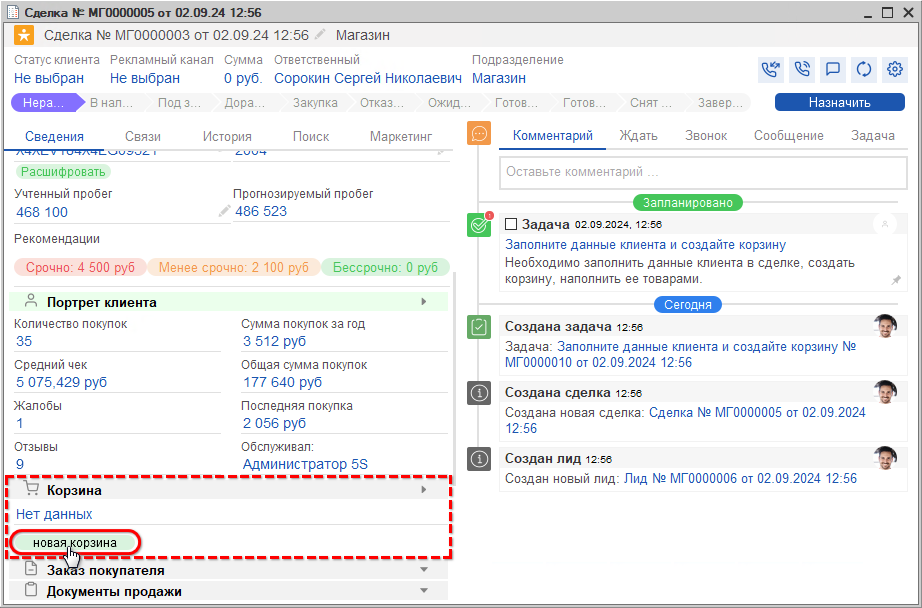

В Корзине обязательно должны быть указаны Организация и Подразделение, иначе она не запишется – реквизиты должны быть заполнены автоматически.

Для работы в Корзине автомобиль обязательно должен быть расшифрован по VIN.

Наполнение Корзины деталями осуществляется на вкладке "Товары":

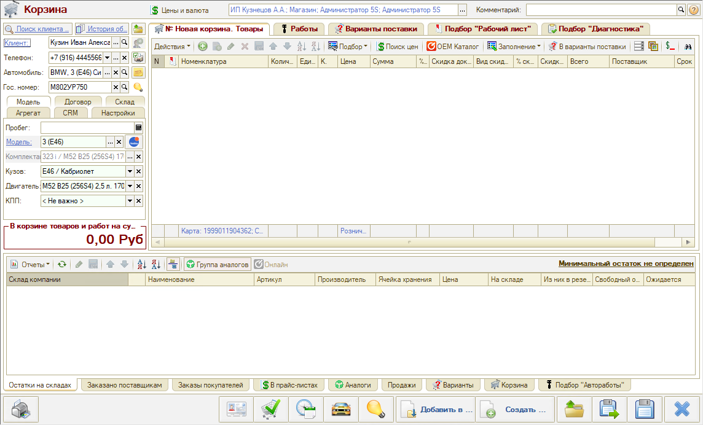

Вкладки Корзины:

- *"Товары"* – для подбора товаров со склада;
- *"Работы"* – для подбора работ, услуг и расходников, используется в воронке “Услуги СТО”;
- *"Варианты поставки"* – можно добавлять товары из Поиска цен, не сохраняя лишние варианты в номенклатуру;
- *«Подбор “Рабочий лист”»* – для работы с Применяемостью;
- *«Подбор “Диагностика”»* – для обработки Диагностического листа.

## Подбор запасных частей

Есть несколько вариантов подбора запчастей:

1. Добавить товар из справочника номенклатуры;
2. Подобрать товар для конкретного автомобиля из оригинального каталога Laximo;
3. Подобрать аналог или замену через обработку “Поиск цен”;
4. Заполнить товары из сформированного ранее документа – Заказ-наряда, Заказа покупателя, Реализации товаров и др.;
5. Перенести из ранее сформированных подборов “Рабочий лист” или “Диагностика”;
6. Перенести подобранные ранее и согласованные с клиентом товары из Вариантов поставки;

Для ручного добавления следует нажать на кнопку "Добавить":

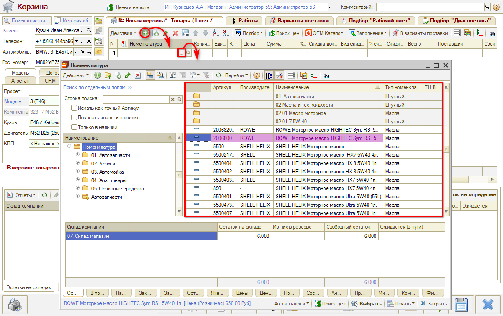

*Подбор Рабочий лист* используется для работы с Применяемостью, сохранения ее для модели/комплектации автомобиля, чтобы в будущем для автомобиля такой же модели или комплектации не подбирать запчасти заново в Laximo, а работать сразу из Рабочего листа.

Из созданного набора в Рабочем листе можно добавить товары в Корзину.

**Поиск оригинальных номеров (применяемость, каталог Laximo)**

Для подбора деталей в онлайн-каталоге запчастей следует нажать кнопку *"OEM Каталог"* и выбрать вариант *“Новая идентификация Автомобиля”:*

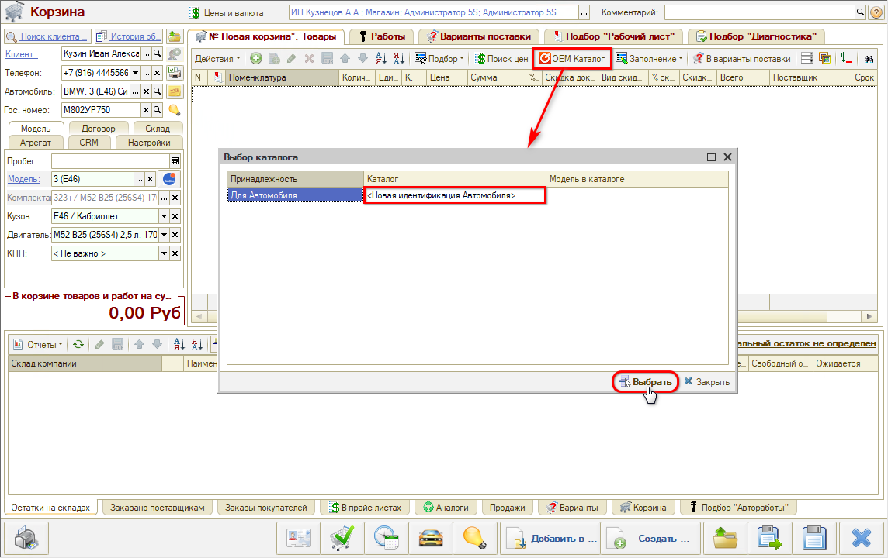

Открывается каталог на указанную в Корзине модель автомобиля, где можно выбрать подходящую деталь:

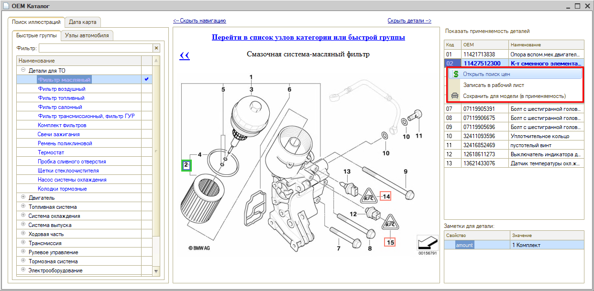

Найденную в каталоге запчасть можно ***проценить*** – открыть "Поиск цен", либо "Сохранить для модели (в Применяемость)". Использование ***Применяемости*** позволит впоследствии упростить многие процессы.

В открывшемся окне "Добавление применяемости" указан кузов, двигатель, КПП – это условия, при которых деталь будет предлагаться. Если какие-то из условий не важны – их нужно снять.

При заполнении параметра “Деталь” открывается каталог "Детали применяемости". Требуется найти нужное наименование и нажать "Выбрать":

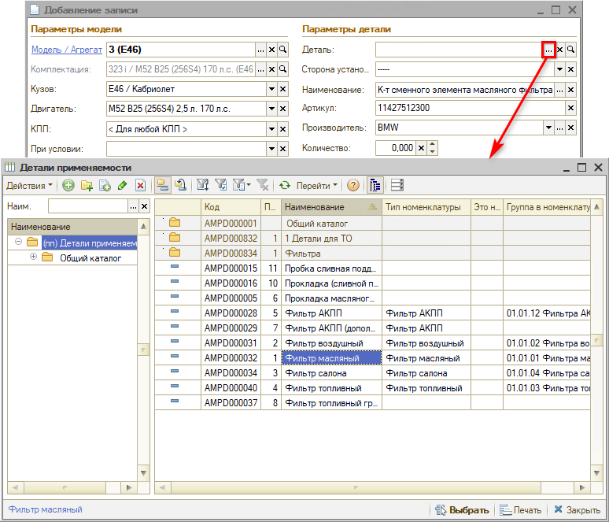

При необходимости следует выбрать сторону установки детали.

После заполнения всех необходимых параметров следует нажать “ОК” – деталь записана в Применяемость:

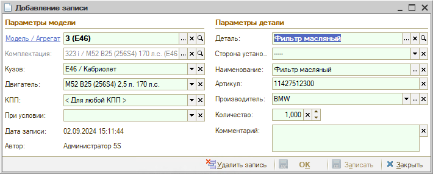

Подобранные в каталоге детали добавляются на вкладку «Подбор “Рабочий лист”», в применяемость для этой модели. Если выделить в списке деталь, то внизу на вкладке "Остатки на складах" отобразится данный товар в наличии на складах компании:

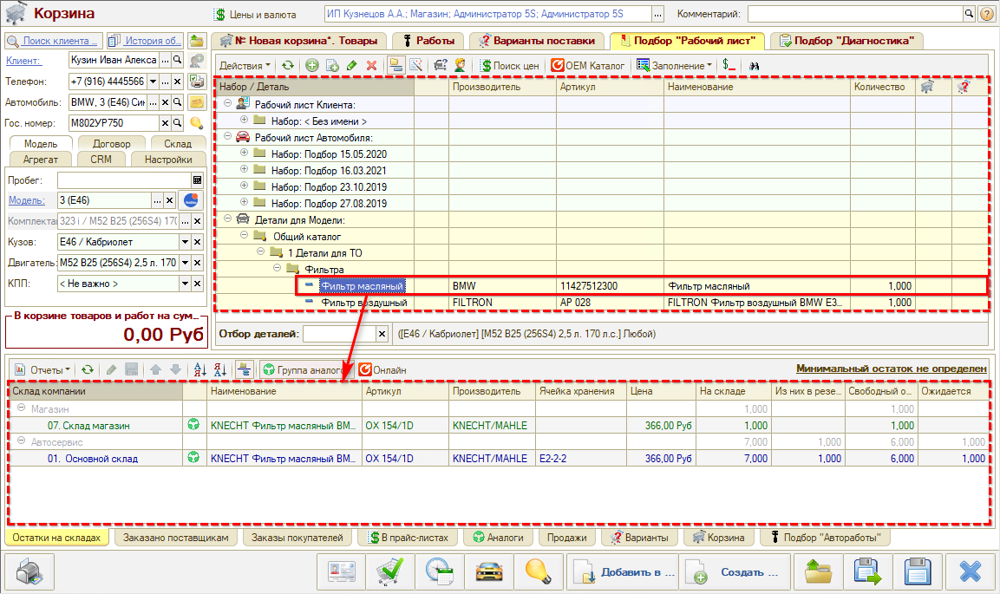

**Поиск цен (поиск з/ч на складе):**

Если на складе детали нет, требуется ее найти в каталогах у поставщиков. Для этого используется поиск онлайн в каталогах поставщиков: отображаются *варианты поставки* – оригиналы и аналоги:

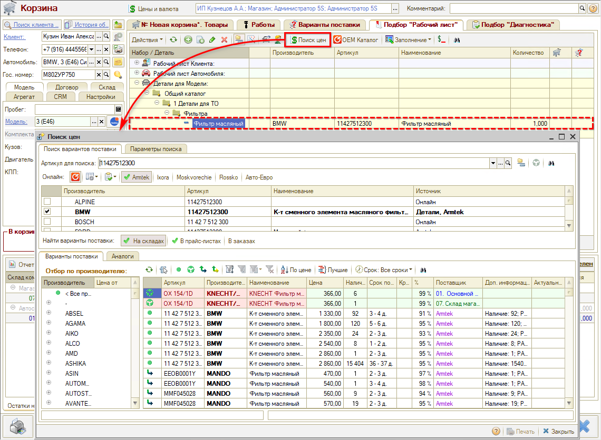

*Обозначения:*

 – Оригинальный артикул;  – Группа аналогов;  – Аналог из онлайн-каталога;  – Аналог от Веб-поставщиков

Можно использовать сортировку по цене или по сроку поставки.

Собственная база аналогов будет наполняться по мере работы с механизмом применяемости.

## Составление калькуляции

Найденные детали можно добавлять не сразу в Корзину, а в *Варианты поставки* – так они не будут влиять на итоговую сумму. После *согласования* *с клиентом (см. [ниже](#согласование-с-клиентом))* нужный вариант следует перенести в Корзину.

После того как товары добавлены на основную вкладку Корзины, выходит общая сумма:

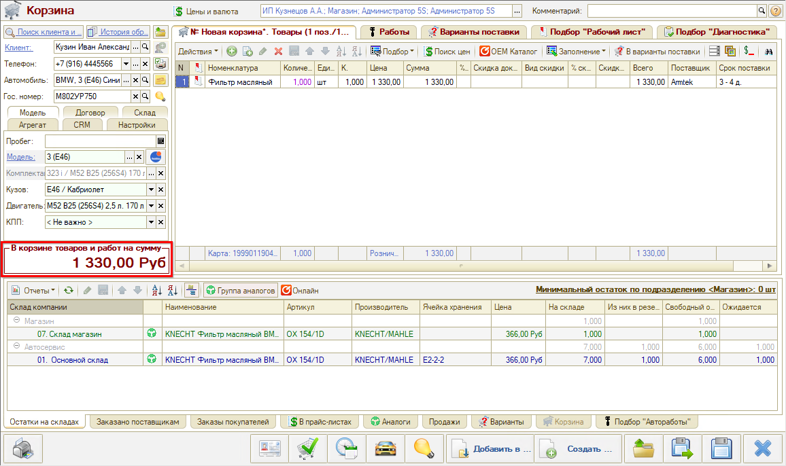

Изменения в Корзине необходимо *сохранить* – при этом Сделка переходит из состояния "Неразобранное" на этап *"[В наличии](../Товар%20в%20наличии/tovar-v-nalichii.md)"* либо *“[Под заказ](../Оформление%20заказа/oformlenie-zakaza.md)”* – в зависимости от того, есть ли заказанная деталь в наличии на складе[\*](#snoska) или требуется заказать ее у поставщика.

Можно закрыть Корзину и вернуться к работе позднее либо создать на основании Корзины документы: Заказ покупателя, Заказ поставщику, Реализация товаров и т.д. Документы создаются на основе параметров Корзины и подобранных товаров.

*\*Примечание: Программа проверяет наличие детали на том складе, который указан на вкладке “Склад” в Корзине – в случае работы с несколькими воронками может потребоваться выбор склада вручную.*

## Согласование с клиентом

После записи Корзины требуется согласовать с клиентом стоимость и сроки заказа запчастей.

Если детали добавлялись в Варианты поставки, клиенту на выбор можно предложить несколько деталей – например, различных по стоимости и срокам поставки, – и выбранный им вариант перенести в Товары. Либо, если товары добавлялись сразу в Корзину, можно открыть ее снова и при необходимости удалить лишние или добавить новые товарные позиции.

Для согласования с клиентом данные из корзины можно распечатать:

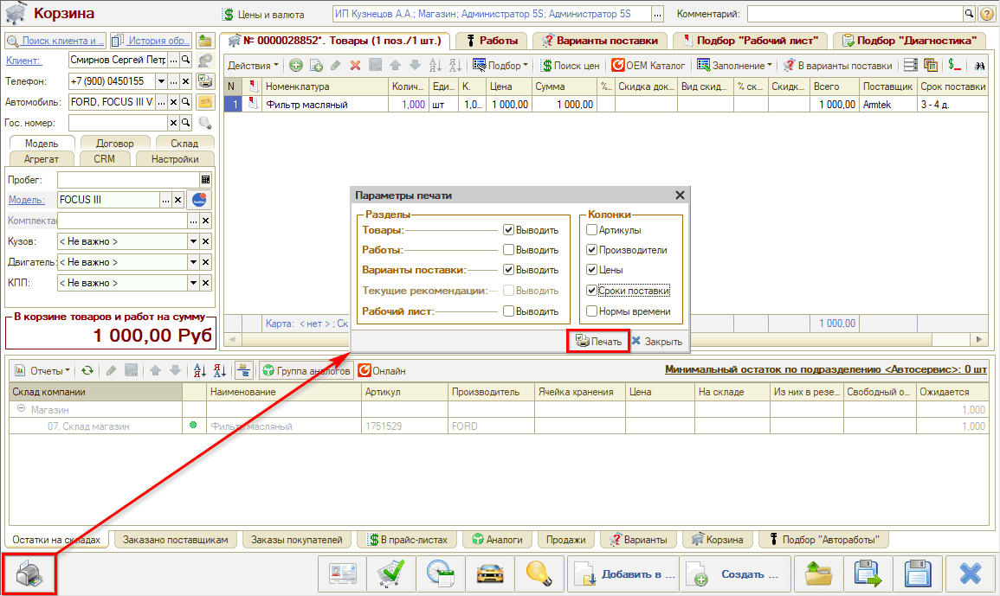

или отправить клиенту на электронную почту или в мессенджер:

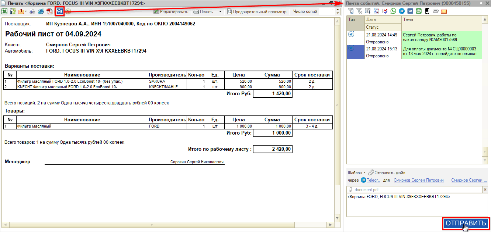

Если клиент согласен со стоимостью, можно оформлять Заказ покупателя.

Если до клиента не удается дозвониться, или если ему нужно "подумать", можно *отложить* сделку до тех пор, пока не будет получено согласие клиента – подробнее см. в статье “[Отложенные сделки](../../../articles/5S%20AUTO/CRM/Отложенные%20сделки/otlozhennye-sdelki.md#как-перевести-сделку-в-отложенные)”. Либо можно перевести сделку на этап “Доработать” – см. [*урок*](../Доработать/dorabotat.md). Также сделка автоматически перейдет на этап “Доработать” с этапов “В наличии” или “Под заказ” в случае отсутствия активности по ней в течение 3 часов (согласно настройкам по умолчанию).

Подробнее см. курсы:

- [Подбор запчастей и работ](../../Урок%206.%20Подбор%20запчастей%20и%20работ/)
- [Онлайн-каталог запчастей](../../Урок%207.%20Онлайн-каталог%20запчастей/)
- [Работа с Поиском цен](../../Урок%209.%20Работа%20с%20Поиском%20цен/)

и статьи:

- [Работа с АРМ Корзина](../../../articles/5S%20AUTO/Проценка%20запчастей%20и%20работ/Работа%20в%20АРМ%20Корзина/rabota-v-arm-korzina.md)
- [Поиск цен](../../../articles/5S%20AUTO/Проценка%20запчастей%20и%20работ/Поиск%20цен/poisk-cen.md)
- [Работа с применяемостью](../../../articles/5S%20AUTO/Склад%20и%20запчасти/Применяемость%20запчастей/Работа%20с%20применяемостью/rabota-s-primenyaemostyu.md) и [другие](../../../articles/).

 

*[← Предыдущий урок "Создание сделки"](../Создание%20сделки/sozdanie-sdelki-0.md) &nbsp;&nbsp;&nbsp;&nbsp;&nbsp;&nbsp; [Следующий урок "Товар в наличии" →](../Товар%20в%20наличии/tovar-v-nalichii.md)*

---

**Теги:** магазин автозапчастей, краткий курс, корзина, подбор запчастей, поиск цен, калькуляция, согласование

