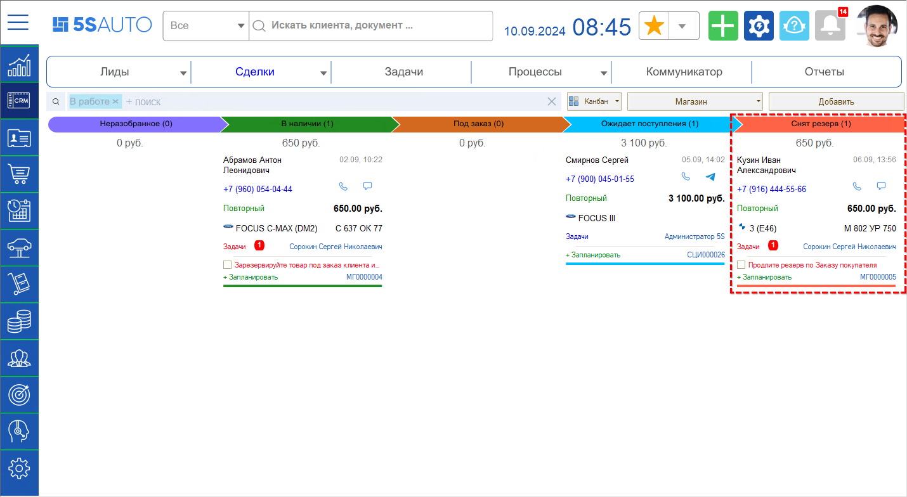
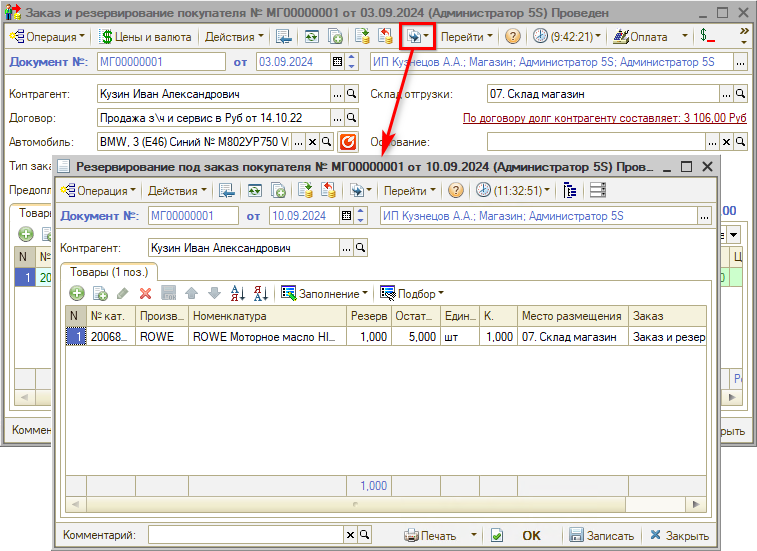

# Снят резерв

<table><tr><td><b>Время чтения:</b> 3 мин.</td><td><b>Обновлено:</b> 30.09.2024</td></tr></table>

Источник: https://www.5systems.ru/help/snyat-rezerv

На этап *“Снят резерв”* сделка попадает с этапов “Готов к самовывозу” или “Готов к доставке” в случае снятия просроченного резерва заказа покупателя – если клиент не приезжает за заказом либо не удается доставить ему заказ:

Резерв снимается автоматически при выполнении специального *регламентного задания,* также документ “Снятие резерва покупателя” может быть создан вручную.

Срок, по истечении которого заказ считается просроченным и может быть снят с резерва задается в настройках регламентного задания – подробнее см. в статье “[Автоматическое снятие резервов](../../../articles/5S%20AUTO/Работа%20с%20заказами/Автоматическое%20снятие%20резервов/avtomaticheskoe-snyatie-rezervov.md#регламентное-задание-автоматическое-снятие-резервов)”. Для предоплаченных заказов можно установить другой, более продолжительный срок, а также установить процент предоплаты, при котором этот срок будет действовать.

По сделке на этапе “Снят резерв” необходимо связаться с клиентом и дождаться его решения – после этого следует *продлить резерв* либо перевести сделку в отказ. Для продления резерва следует на основании “Заказа покупателя” создать документ “Резервирование под заказ покупателя”:

При проведении данного документа товар снова резервируется под клиента, сделка возвращается на предыдущий этап – “Готов к самовывозу” либо “Готов к доставке”.

В случае *отказа клиента* сделку необходимо закрыть – установить на форме сделки этап “Завершить”, в открывшемся окне выбрать вариант завершения “Неудача”, указать причину отказа и нажать “Ок”.

*[← Предыдущий урок "Доработать"](../Доработать/dorabotat.md) &nbsp;&nbsp;&nbsp;&nbsp;&nbsp;&nbsp; [Следующий урок "Выдача заказа" →](../Выдача%20заказа/vydacha-zakaza.md)*

---

**Теги:** магазин автозапчастей, краткий курс, снятие резерва, заказ покупателя, сделка

