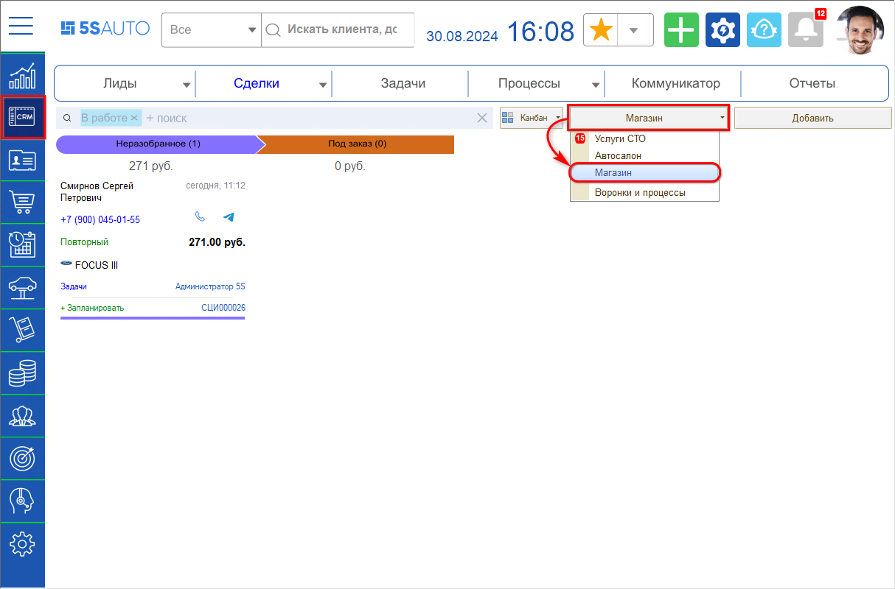
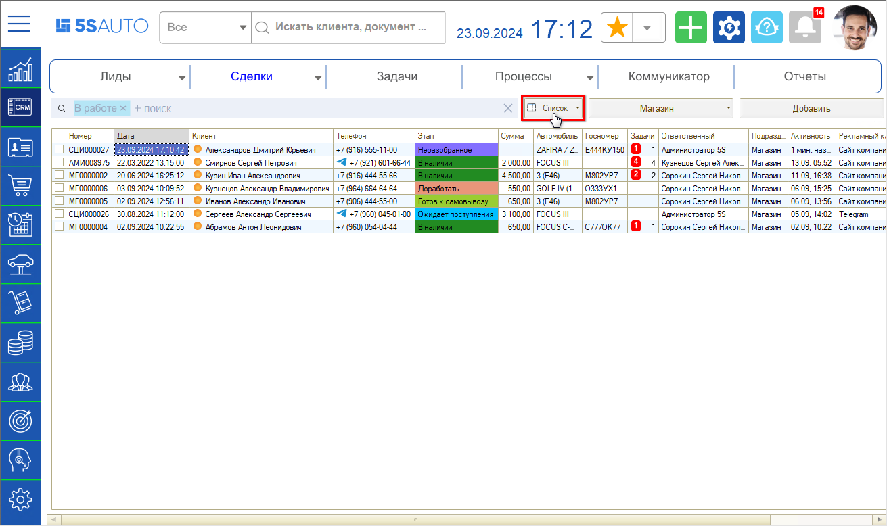
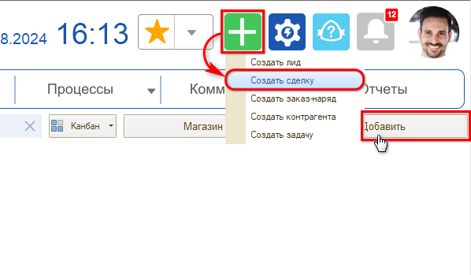
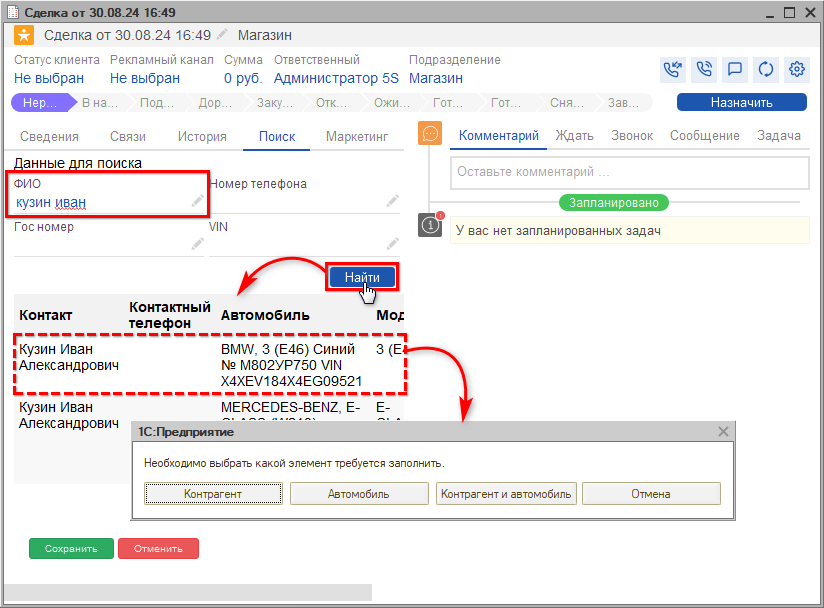
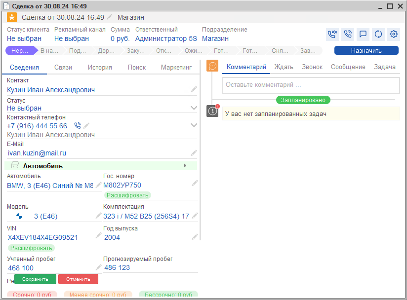
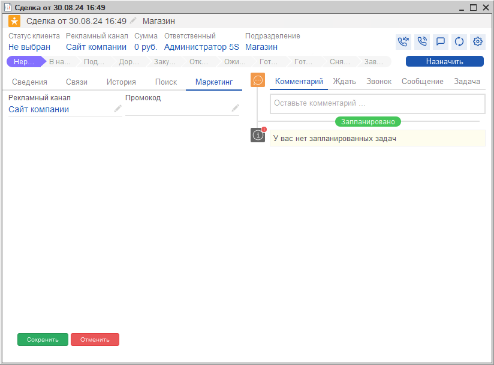
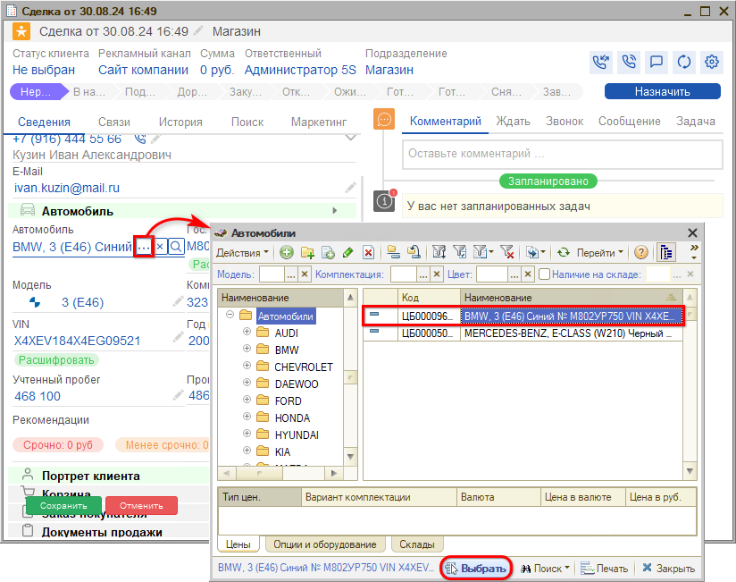
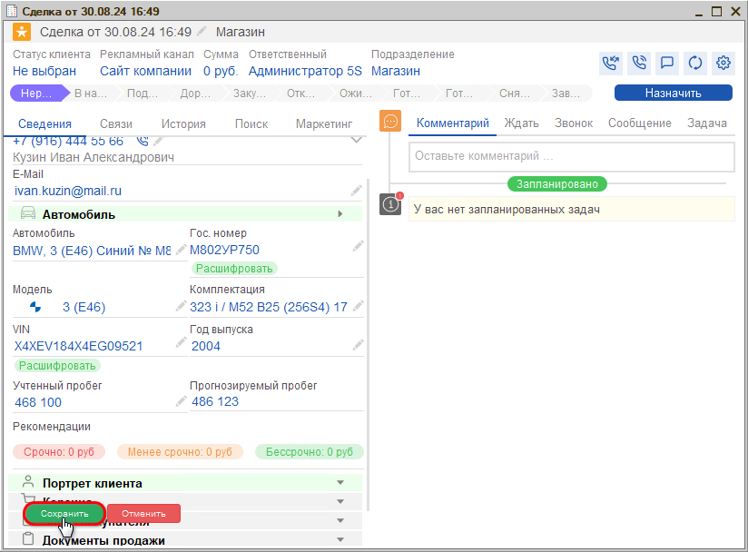

# Создание сделки

<table><tr><td><b>Время чтения:</b> 8 мин.</td><td><b>Обновлено:</b> 26.09.2024</td></tr></table>

Источник: https://www.5systems.ru/help/sozdanie-sdelki-0

## Содержание

1. [Регистрация обращения](#регистрация-обращения)
2. [Порядок заполнения сделки](#порядок-заполнения-сделки)

*Примечание: См. описание предварительных настроек воронки в статье “<u>Обновление настроек воронок продаж</u>” (в разработке).*

## Регистрация обращения

Центральным элементом интерфейса 5S Auto является ***сделка*** – зафиксированное в программе обращение клиента.

Каждое обращение в компанию через любой канал – телефон, мессенджеры, формы на сайте, мобильное приложение – автоматически фиксируется и сохраняется в программе в виде сделки. Это позволяет не потерять ни одной заявки, не забыть ни одного клиента.

Все заявки аккумулируются в CRM-системе. Выстроена логика процесса обработки заявок – последовательность этапов, по которым проходят сделки. Каждая сделка находится в определенном статусе и состоянии – это позволяет менеджеру понять:

1. какое действие нужно совершить по сделке на каждом этапе, например: подобрать запчасть, оформить заказ и т.д.;
2. какой должен быть следующий шаг.

Руководителю при этом удобно отслеживать, сколько заявок поступило, какие сделки еще не разобраны, какие уже обработаны и кем, и т.д.

Сначала сделка попадает в “неразобранные”: на данном этапе могут быть нецелевые обращения – например, если ошиблись номером, – а также те, которые уйдут “в отказ” после созвона с клиентом. При переходе на следующий этап такие обращения отсеиваются, и остаются только качественные сделки, по которым ведется дальнейшая работа.

Для работы с *воронкой магазина запчастей* необходимо перейти в раздел CRM и выбрать колонку "Сделки", в случае использования нескольких воронок следует через кнопку переключения воронок выбрать *“Магазин”.* Канбан сделок разбит на этапы, по умолчанию отображаются не все этапы, а только те, на которых находятся открытые сделки:

Также есть возможность работать со сделками *в режиме **списка*** – переключаться между канбаном и списком можно по кнопке на верхней панели, колонки списка можно настроить (подробнее см. в [статье](../../../articles/5S%20AUTO/CRM/Список%20сделок/spisok-sdelok.md)):

Сделку можно создать вручную (например, при визите клиента) – для этого нужно нажать кнопку “Добавить” либо *“Добавить процесс → Создать сделку”:*

Создавать сделку вручную не потребуется, если в программу интегрирована IP-телефония и мессенджеры. В таком случае во время обращения клиента сделка создастся ***автоматически*** и сразу отобразится номер телефона звонящего. Определение воронки при автоматическом создании сделки производится на основе настроек *рекламных каналов.*

Новая сделка попадает на этап *“Неразобранное”.* При необходимости следует связаться с клиентом для уточнения заказа. Либо – например, при заказе с сайта или через мобильное приложение – информация о нужной запчасти будет подгружена в сделку автоматически и отразится в переписке с клиентом.

При обращении *первичного клиента,* т.е. того, который позвонил или приехал первый раз, требуется заполнить данные о нем – подробнее см. урок "[Обращение первичного клиента](../../Краткий%20курс%20для%20Автосервиса/Обращение%20первичного%20клиента/obraschenie-pervichnogo-klienta.md)" в [кратком курсе для автосервиса](../../Краткий%20курс%20для%20Автосервиса/). Для подбора детали специалистом по запчастям может потребоваться расшифровка автомобиля – для этого в сделку потребуется внести VIN или гос. номер автомобиля.

При звонке *повторного клиента* в сделке уже есть его Ф. И. О. и информация об автомобилях клиента, а также история всех его предыдущих обращений, включая документы, задачи, рекомендации и т.д.

## Порядок заполнения сделки

**1. Идентифицируйте клиента**

Если повторный клиент не был идентифицирован программой автоматически, можно найти его в базе вручную с помощью механизма быстрого поиска на вкладке *"Поиск".* Поиск поможет избежать создания дублирующих данных.

Можно искать по любому из указанных параметров: номеру телефона – именно по нему определяется уникальность клиента, Ф. И. О., гос. номеру, VIN:

Следует выбрать, какие данные нужно подтянуть в сделку: только клиента, только автомобиль, или и данные клиента, и данные автомобиля.

*Например: в случаях, когда клиент является заказчиком, но не является владельцем автомобиля, нужно подтянуть только данные контрагента.*

Выбранные данные подтягиваются в сделку:

**2. Рекламный канал**

В раздел “Маркетинг” подтягивается рекламный канал, через который обратился клиент. При необходимости эту информацию также можно выбрать вручную для сбора аналитики по эффективности источников рекламы:

**3. Заполнение автомобиля**

Если клиент повторный, то данные об автомобиле заполнятся автоматически.

Если у клиента несколько автомобилей, можно выбрать нужный автомобиль из справочника – для этого следует нажать кнопку "Выбрать" . Открывается справочник "Автомобили” с отбором по владельцу – текущему клиенту. Следует выделить нужный автомобиль и нажать кнопку "Выбрать" на нижней панели:

Для новых клиентов потребуется создать автомобиль – см. урок "[Создание карточки автомобиля](../../Краткий%20курс%20для%20Автосервиса/Создание%20карточки%20автомобиля/sozdanie-kartochki-avtomobilya.md)" в [кратком курсе для автосервиса](../../Краткий%20курс%20для%20Автосервиса/).

**5. Сохранение сделки**

После заполнения новой Сделки необходимо Сохранить ее:

Далее можно переходить к подбору и проценке товаров в Корзине.

*Подробнее см. курс "[CRM](../../Урок%201.%20CRM/)" и статьи в разделах "[CRM](../../../articles/5S%20AUTO/CRM/)" и "[Работа с клиентами](../../../articles/5S%20AUTO/Работа%20с%20клиентами/)" на Базе знаний.*

 

[*Следующий урок "Подбор товаров" →*](../Подбор%20товаров/podbor-tovarov.md)

---

**Теги:** магазин автозапчастей, краткий курс, сделка, обращение клиента, CRM

