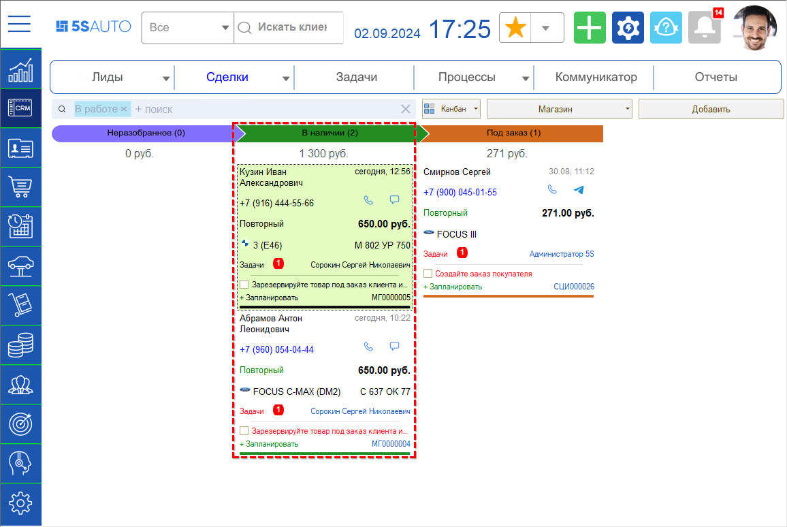
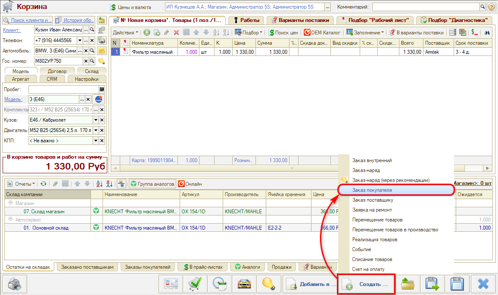
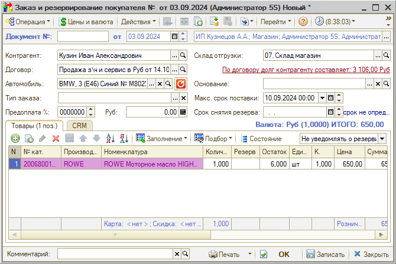
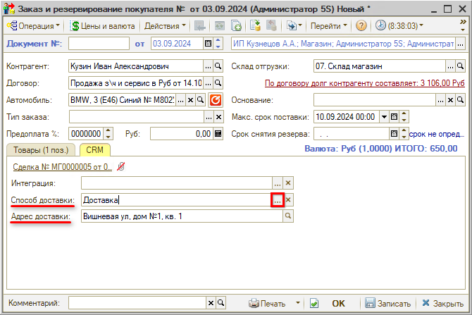
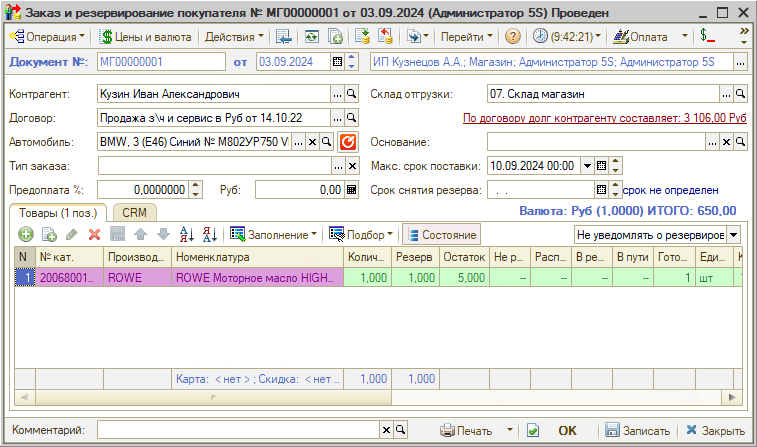

# Товар в наличии

<table><tr><td><b>Время чтения:</b> 4 мин.</td><td><b>Обновлено:</b> 26.09.2024</td></tr></table>

Источник: https://www.5systems.ru/help/tovar-v-nalichii

## Содержание

1. [Резервирование товара под покупателя](#резервирование-товара-под-покупателя)
2. [Выбор способа доставки](#выбор-способа-доставки)
3. [Состояние заказа](#состояние-заказа)

На этап *“В наличии”* сделка попадает после *записи Корзины,* если все товары есть в наличии на складе магазина (см. [урок “Подбор товаров”](../Подбор%20товаров/podbor-tovarov.md)):

После согласования Корзины с клиентом требуется *зарезервировать деталь* под данного клиента либо сразу оформить *Реализацию товара* покупателю (см. *урок “[Выдача заказа](../Выдача%20заказа/vydacha-zakaza.md)”).*

## Резервирование товара под покупателя

Для резервирования детали под покупателя нужно создать документ “Заказ и резервирование покупателя” – для этого необходимо в Корзине нажать кнопку “Создать” и выбрать в меню “Заказ покупателя”:

В создаваемый документ подтягиваются все необходимые данные из Корзины:

## Выбор способа доставки

Следует проверить параметры и перейти на вкладку “CRM” для указания способа доставки. Необходимо выбрать *способ доставки заказа* – “Самовывоз” либо “Доставка”.

В случае выбора второго варианта необходимо также указать адрес доставки. Адрес заполняется автоматически из карточки контрагента, либо можно ввести новый адрес[\*](#snoska):

*\*Примечание: Последний введенный адрес записывается в карточку клиента в качестве основного.*

## Состояние заказа

Документ необходимо записать и провести. После этого, в случае использовании функции подсветки состояний (кнопка “Состояние”), строки с номенклатурой подсвечиваются зеленым цветом, что означает “Полностью зарезервирована на складе”:

После резервирования товара сделка переходит на этап *“Готов к доставке” либо “Готов к самовывозу” (см. урок "[Выдача заказа](../Выдача%20заказа/vydacha-zakaza.md)")* – в зависимости от того, какой способ доставки указан в документе.

 

*[← Предыдущий урок "Подбор товаров"](../Подбор%20товаров/podbor-tovarov.md) &nbsp;&nbsp;&nbsp;&nbsp;&nbsp;&nbsp; [Следующий урок "Оформление заказа" →](../Оформление%20заказа/oformlenie-zakaza.md)*

---

**Теги:** магазин автозапчастей, краткий курс, резервирование, доставка, заказ покупателя
