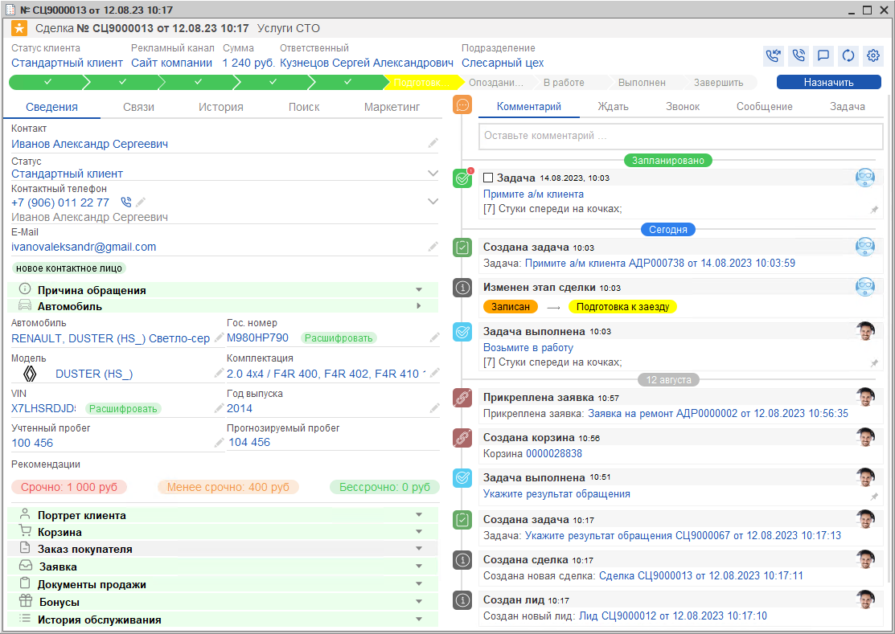

# В чем разница между Лидами и Сделками

<table><tr><td><b>Время чтения:</b> 2 мин.</td><td><b>Обновлено:</b> 08.11.2024</td></tr></table>

Источник: https://www.5systems.ru/help/v-chem-raznica-mezhdu-lidami-i-sdelkami

## Содержание

1. [Лиды и сделки](#лиды-и-сделки)
2. [Работа со сделкой в режиме по умолчанию](#работа-со-сделкой-в-режиме-по-умолчанию)

## Лиды и сделки

***Сделка*** является центральным элементом интерфейса 5S AUTO и представляет собой зафиксированное в программе обращение клиента.

Само понятие “сделка” подразумевает, что уже есть договоренность с клиентом. Каждая сделка имеет начало – первый контакт с клиентом, и конец – успешную продажу. Самое первое касание, зацепка с клиентом – это и есть ***лид***.

То есть, лид – это потенциальная продажа, потенциальный клиент: он может преобразоваться в сделку, перейти в “Обращение в СТО”, а может уйти в отказ. Лид может быть нецелевым, а сделка – нет.

По умолчанию, CRM работает в режиме, где лиды не используются – т.е. работа ведется только со сделками, – но можно [*настроить режим работы CRM*](../../../articles/5S%20AUTO/CRM/Режимы%20работы%20CRM/rezhimy-raboty-crm.md), при котором будут выделяться лиды.

## Работа со сделкой в режиме по умолчанию

При каждом новом обращении, – входящий звонок, сообщение в чате или заявка с сайта, – автоматически создается сделка. Также, при необходимости, сделку можно добавить вручную с помощью кнопки “Добавить сделку”.

Сделка всегда находится на какой-либо стадии, которая обозначает этап работы с клиентом: от первого контакта до успешной продажи.

Форма сделки открывается двойным кликом по карточке сделки на [*канбане*](../Как%20установить%20этап%20Сделки/kak-ustanovit-etap-sdelki.md#канбан-доска) и содержит всю возможную информацию, необходимую для работы с клиентом:

---

**Теги:** CRM, сделка, лид, режимы работы CRM
