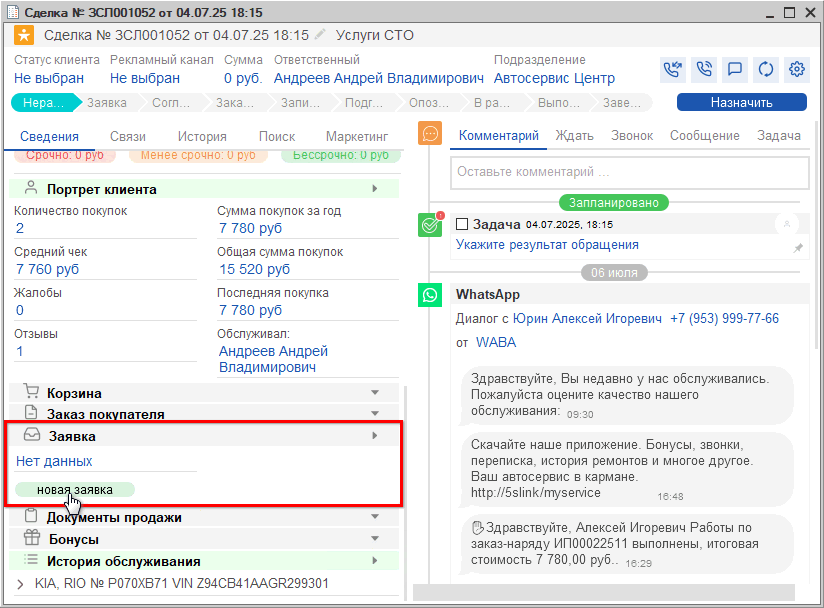

# Как записать клиента из Сделки

<table><tr><td><b>Время чтения:</b> 1 мин.</td><td><b>Обновлено:</b> 29.10.2025</td></tr></table>

Источник: https://www.5systems.ru/help/kak-zapisat-klienta-iz-sdelki

В левой половине формы Сделки на вкладке "Сведения" расположены блоки со всей необходимой информацией по сделке.

В блоке *"Заявка"* представлены все созданные по сделке *Заявки на ремонт* с отображением их текущих стадий, т.е. состояний документа. Чтобы создать новую Заявку, нужно нажать кнопку *"Новая заявка"*.

При создании новой Заявки на ремонт программа предложит выбрать основание – Корзину (при наличии Корзины в Сделке).

Подробно о том, как записать клиента на ремонт, см. курс видео-уроков [*Запись на ремонт*](../../Урок%208.%20Запись%20на%20ремонт/).

---

**Теги:** CRM, сделка, запись на ремонт, планировщик
