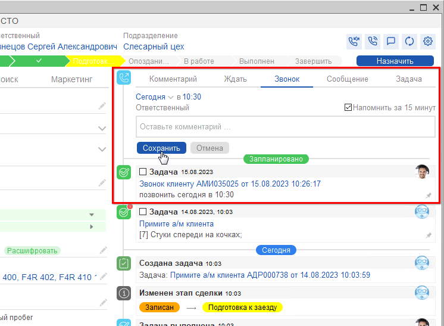

# Как запланировать звонок клиенту

<table><tr><td><b>Время чтения:</b> 1 мин.</td><td><b>Обновлено:</b> 17.09.2025</td></tr></table>

Источник: https://www.5systems.ru/help/kak-zaplanirovat-zvonok-klientu

В правой половине сделки расположены вкладки, предназначенные для планирования дел и коммуникации с клиентом. Для того, чтобы *запланировать звонок клиенту*, требуется перейти на вкладку *"Звонок"*.

В форме планирования звонка следует:

1. Выбрать дату и время предполагаемого звонка;
2. Написать комментарий (при необходимости);
3. Добавить напоминание;
4. Сохранить.  
   

---

**Теги:** CRM, сделка, звонок, планирование, задача
