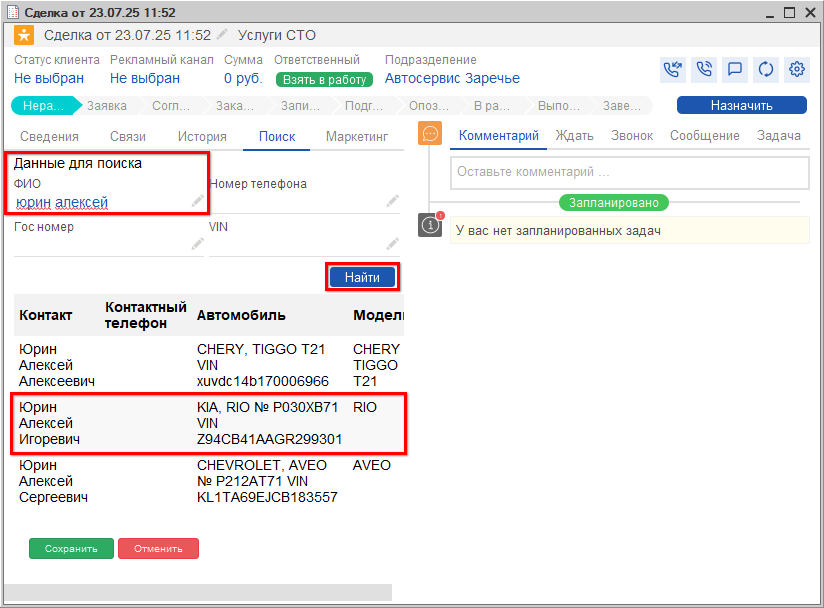

# Как идентифицировать клиента в Сделке

<table><tr><td><b>Время чтения:</b> 2 мин.</td><td><b>Обновлено:</b> 17.09.2025</td></tr></table>

Источник: https://www.5systems.ru/help/kak-identificirovat-klienta-v-sdelke

При звонке клиента в первую очередь требуется его ***идентифицировать***.

При обращении ***первичного*** клиента, т.е. того, который позвонил или приехал первый раз, требуется заполнить [карточку клиента](https://5systems.ru/help/kontragenty-i-kontakty). В сделке отобразится только номер его телефона: остальные данные потребуется ввести – либо сразу, либо после записи на ремонт, при непосредственном заезде клиента.

При звонке ***повторного*** клиента в сделку будут подтягиваться все его данные из созданной ранее карточки клиента, информация об автомобилях клиента, а также история всех его предыдущих обращений, включая документы, задачи, рекомендации и т.д.

Может потребоваться отредактировать или добавить какие-либо данные.

Если клиент уже есть в базе, но *звонит с нового номера телефона*, карточку клиента создавать не нужно. Необходимо найти клиента через вкладку “Поиск”, перейти в карточку клиента и записать его новый номер телефона.

---

**Теги:** CRM, сделка, идентификация клиента, контрагент, поиск клиента

